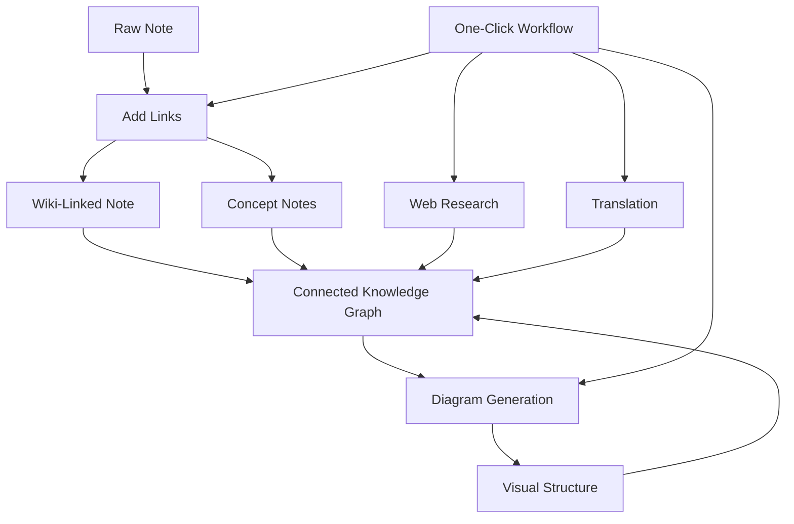

import TLDR from '@site/src/components/TLDR';

# Obsidian Gids voor AI-kennisbeheer

<TLDR>
**Notemd zet LLM-gebaseerd lezen om in blijvende kennis: wiki-links verbinden concepten, conceptnotities creëren een terugvindbare grafiek, onderzoek brengt het web naar uw opslag, vertaling breekt taalbarrières, diagrammen maken de structuur zichtbaar, en workflows verbinden alles in één klik.** Deze gids behandelt de volledige pipeline — van ruwe notities tot een verbonden, visueel, meertalige kennisbasis.
</TLDR>

## Waarom AI-kennisbeheer?

Traditionele notitieboekhouding levert platte bestanden op. Zelfs met handmatige wiki-links blijven de meeste notities los van elkaar. Notemd maakt gebruik van LLM om de verbindingslaag te automatiseren:

- **LLMs lezen uw inhoud** en identificeren wat belangrijk is — termen, methoden, personen, theorieën
- **Links worden automatisch ingevoegd** bij elke voorkomst van een concept, niet verstopt in "zie ook"
- **Conceptnotities worden gegenereerd** als zelfstandige, terugvindbare bestanden
- **Onderzoek verrijkt notities** met context uit het web
- **Diagrammen maken de structuur zichtbaar** — mindmaps, stroomdiagrammen, gegevensgrafieken van dezelfde inhoud

Het resultaat: een kennisgrafiek die groeit met elke notitie die u verwerkt, niet alleen wanneer u eraan denkt links toe te voegen.

## De volledige pipeline



Elk stap is onafhankelijk. Gebruik er één of allemaal. De meest effectieve volgorde: **Links toevoegen → Conceptnotities → Diagrammen**.

---

## 1. Wiki-links: Verbindingen expliciet maken

Wiki-links vormen de ruggengraat van een kennisgrafiek. Notemd maakt gebruik van een LLM om:

1. Lees de inhoud van je notitie (splits in delen voor lange documenten)
2. Identificeer de kernconcepten — geef voorkeur aan specifieke, technische termen boven algemene zelfstandige naamwoorden
3. Voeg `[[wiki-links]]` toe bij elke voorkomst
4. Supprime synoniemen zodat "ML" en "Machine Learning" geen aparte nodes creëren

### Wanneer te gebruiken

- **Elke notitie >100 woorden** — kortere notities leveren weinig concepten op
- **Onderzoekspapieren, technische documentatie, vergaderingsnotities** — rijk aan domeinspecifieke termen
- **Nadat de inhoud stabiel is** — verwerk concepten niet herhaaldelijk van conceptversies

### Belangrijke instellingen

| Instelling | Aanbevolen | Waarom |
|---------|-----------|-----|
| `addLinksProvider` | DeepSeek of GPT-4o-mini | Goede nauwkeurigheid tegen lage kosten |
| Synonymensuppressie | Aan | Voorkomt dubbele nodes |
| Contextvenster | Paragraaf | Evenwicht tussen nauwkeurigheid en kosten |

→ [Diepe duik in Wiki-links](/docs/features/wiki-links)

---

## 2. Conceptnotities: Opgewekte kennisknopen

Wiki-links verbinden ideeën inline, maar conceptnotities maken elke gedachte onafhankelijk ophaalbaar. Elk concept krijgt zijn eigen `.md` bestand:

```markdown
# Machine Learning

## Linked From
- [[My Research Notes]]
- [[Neural Networks Explained]]
```

### Het extrageproces

De LLM prompt is zeer gestructureerd:
- Normaliseer naar enkelvoudige vorm
- Geef de voorkeur aan meervoudige concepten boven enkelvoudige woorden (“Dielectric Relaxation” in plaats van “Relaxation”)
- Sla referentie- of bibliografieën over
- Geef het resultaat weer als `CONCEPT:` regels voor deterministische parsing

Concepten worden via `Set<string>` gededupliceerd over verschillende delen. LLM fouten in afzonderlijke delen stoppen de operatie niet.

### Backlinks

Wanneer geactiveerd houdt elke conceptnotitie bij welke bronnotities er naar verwijzen. Het ingebouwde backlinkpaneel van Obsidian toont ook omgekeerde verbindingen.

### Deduplicatie

De 4-stappen dedupliceringsmotor van Notemd vangt het volgende op:
1. **Exacte overeenkomsten** — vergelijking van bestandsnamen zonder rekening te houden met hoofdletters
2. **Meervoudsvormen** — "Models.md" versus "Model.md"
3. **Normalisatie van symbolen** — "A-B.md" versus "A B.md"
4. **Enkelvoudswoordcontrole** — "ML.md" wordt gemarkeerd wanneer "Machine Learning.md" bestaat

### Sleutelinstellingen

| Instelling | Aanbevolen | Waarom |
|---------|-----------|-----|
| `conceptNoteFolder` | `concepts/` of `🧠 concepts/` | Houdt de kluis georganiseerd |
| `extractConceptsAddBacklink` | Aan | Stelt omgekeerde zoekopdracht mogelijk |
| `extractConceptsMinimalTemplate` | Uit | Volledig sjabloon met Linked From |
| Model per taak | DeepSeek | Conceptuitwinning heeft geen dure modellen nodig |
| Synoniemsuppressie | Aan | Dezelfde instelling beïnvloedt zowel linken als uitwinning |

→ [Concept Notities dieper onderzocht](/docs/features/concept-notes)

---

## 3. Onderzoek: Het web integreren

Notemd integreert webzoeken in je notitieproces.

1. **Vraagopstelling** — de titel of selectie van je notitie wordt een zoekopdracht.
2. **Webzoeken** — Tavily (aanbevolen, API sleutel vereist) of DuckDuckGo (gratis, geen sleutel nodig).
3. **LLM samenvatting** — de zoekresultaten worden samengevat tot een relevante samenvatting.
4. **Toevoegen aan notitie** — de samenvatting wordt toegevoegd op de cursorpositie of als een nieuwe sectie.

### Wanneer te gebruiken

- Voorafgaand aan het verwerken van een nieuw onderwerp — eerst webcontext verkrijgen.
- Wanneer een conceptnotitie verrijkt moet worden — eerst onderzoek doen en dan links toevoegen.
- Voor literatuurstudies — in batches onderzoek doen naar een map met notities.

### Belangrijkste instellingen

| Instelling | Aanbevolen | Waarom |
|---------|-----------|-----|
| `researchProvider` | GPT-4o of Claude. | Onderzoek vereist een hogere kwaliteit van samenvattingen. |
| Zoekservice | Tavily | Beter relevante resultaten, instelbare diepte |
| `maxResearchContentTokens` | 4000 | Evenwicht tussen diepte en kosten |

→ [Onderzoek naar diepe analyse](/docs/features/research)

---

## 4. Vertaling: Taalbarrières doorbreken

Notemd vertaalt notities met behulp van uw ingestelde LLM — geen gespecialiseerde vertaalapparaat API. Dit betekent:

- **Contextbewuste vertalingen** — de LLM begrijpt het hele document, niet zin voor zin
- **Omgaan met technische termen** — "gradient descent" blijft "梯度下降" in plaats van "坡度向下"
- **Batch‑ondersteuning** — vertaal een hele map met notities in één keer
- **Model per taak** — gebruik Gemini Flash voor vertaling (snel, goedkoop, meertalig)

### Taalsupport

Notemd ondersteunt zelf 21 UI talen. De doeltaal kan per taak worden ingesteld. Veel voorkomende paren: EN↔ZH, EN↔JA, EN↔KO, EN↔DE, EN↔FR, EN↔ES.

→ [Diepe analyse van vertaling](/docs/features/translation)

---

## 5. Diagrammen: Structuur zichtbaar maken

Het diagrampipeline van Notemd is spec‑first: de LLM genereert een gestructureerd `DiagramSpec` JSON, waarna adapters dit omzetten naar het doelformaat. Dit levert betrouwbaardere resultaten op dan wanneer men de LLM vraagt om ruwe Mermaid‑syntax.

### Intent Detectie

Notemd bepaalt automatisch het beste diagramtype op basis van de inhoud:

- **Tabellen met cijfers** → gegevensdiagram (Vega-Lite)
- **Woordenschat client/server** → sequentiediagram (Mermaid)
- **Entiteit/primaire sleutel** → ER-diagram (Mermaid)
- **Stap/processtroom** → stroomdiagram (Mermaid)
- **Trefwoorden conceptkaart** → JSON Canvas (Obsidian native)
- **Standard** → denkkaart (Mermaid)

### Rendering Chain

Primair doelwit → fallback → fallback → HTML. Als de Mermaid-syntaxis faalt, probeert het nog een keer met foutcontext naar de LLM, en valt daarna terug op een minimaal diagram.

### Belangrijkste instellingen

| Instelling | Aanbevolen | Waarom |
|---------|-----------|-----|
| `enableExperimentalDiagramPipeline` | Aan | Betere kwaliteit via spec-first |
| `experimentalDiagramCompatibilityMode` | `best-fit` | Native doelwit per intentie |
| `summarizeToMermaidProvider` | GPT-4o of Claude | Diagramspecificaties vereisen ruimtelijk redeneren |
| `autoMermaidFixAfterGenerate` | Aan | Vangt LLM-syntaxisfouten automatisch op |
| Lokale kennisverrijking | Aan voor domeinspecifiek gebruik | Verbetert de nauwkeurigheid met vault-context |

→ [Diagrams deep dive](/docs/features/diagrams)

---

## 6. Workflows: Eén-klik automatisering

Workflows combineren meerdere taken in één knop in de zijbalk. Het DSL-formaat is:

```
task1 | task2 | task3
```

Voorbeeld: `addLinks | extractConcepts | generateDiagram` — verwerk een notitie van ruwe tekst naar een volledig verbonden, visueel kennisnode in één klik.

### Aanbevolen Workflows

| Workflow | Chain | Gebruiksgeval |
|----------|-------|----------|
| Volledig proces | `addLinks \| extractConcepts \| generateDiagram` | Nieuwe notities |
| Eerst onderzoek doen | `research \| addLinks` | Onbekende onderwerpen |
| Polyglot | `translate \| addLinks` | Meertalige notities |
| Alleen diagram | `generateDiagram` | Snelle visualisatie |

→ [Diepte-inzicht Workflows](/docs/features/workflows)

---

## 7. LLM Providers: 36 opties van cloud tot lokaal

Notemd ondersteunt 36 providers over 4 transporttypen. Belangrijke groepen:

- **Internationale cloud**: OpenAI, Anthropic, Google, Mistral, xAI
- **Chinese cloud**: DeepSeek, Qwen, Doubao, Moonshot, GLM, Baidu, SiliconFlow
- **Gateways**: OpenRouter, GitHub Models, Hugging Face, Vercel
- **Lokaal**: Ollama, LMStudio, OVMS — geen API sleutel, geen gegevens verlaten uw apparaat

### Strategie per taakmodel

De meest kostenefficiënte opstelling gebruikt goedkope modellen voor eenvoudige taken en krachtige modellen voor complexe taken:

```
extractConcepts  → DeepSeek (fast, cheap, accurate enough)
addLinks          → DeepSeek or GPT-4o-mini
research          → GPT-4o or Claude (needs quality)
generateDiagram   → GPT-4o or Claude (needs spatial reasoning)
translate         → Gemini Flash (fast, multilingual)
```

→ [Overzicht LLM Providers](/docs/providers/overview)

---

## Controlelijst voor het beginnen

1. **Installeer Notemd** — [Community Plugins](/docs/getting-started/installation) (aanbevolen) of handmatig
2. **Configureer een provider** — DeepSeek (eenvoudigst), OpenAI, of Ollama (gratis)
3. **Verwerk uw eerste notitie** — rechtermuisknop → "Bestand verwerken (links toevoegen)"
4. **Conceptmapmappen instellen** — Instellingen → Notemd → Output → Conceptmapmappen
5. **Concepten extraheren** — voer "Concepten extraheren" uit op dezelfde notitie
6. **Een diagram genereren** — voer "Een diagram genereren" uit om de verbindingen visueel weer te geven
7. **Een workflow maken** — combineer het bovenstaande tot een één-klikknop

## Aanbevolen configuraties

### Student (Budget)

```
Provider: DeepSeek (free tier available)
Concept extraction: DeepSeek
Research: DuckDuckGo (free) + DeepSeek
Diagrams: Off (or legacy Mermaid)
Workflows: addLinks | extractConcepts
```

### Onderzoeker (Kwaliteit)

```
Provider: GPT-4o (primary)
Concept extraction: DeepSeek (cost savings)
Research: GPT-4o + Tavily
Diagrams: best-fit mode, GPT-4o
Workflows: research | addLinks | extractConcepts | generateDiagram
```

### Privacy-First (Alleen lokaal)

```
Provider: Ollama (llama3 or qwen2.5:7b)
All tasks: Ollama
Research: DuckDuckGo (free, no API key)
Diagrams: legacy Mermaid mode
```

### Tweetalig (ZH + EN)

```
Primary: DeepSeek (Chinese queries)
Translation: Google Gemini Flash
Research: Tavily + DeepSeek (Chinese search context)
Language output: per-task (extractConceptsLanguage: zh-CN)
```

---

## Gewone patronen

### Patroon: Een onderzoeksartikel verwerken

1. PDF-inhoud importeren (of kopiëren en plakken)
2. **Onderzoek doen** — verkrijg webcontext over het onderwerp
3. **Links toevoegen** — identificeer en link belangrijke concepten
4. **Concepten extraheren** — maak zelfstandige notities
5. **Diagram genereren** — visualiseer de structuur van het artikel

### Patroon: Verrijking van dagelijkse notities

1. Dagelijkse notitie schrijven
2. **Links toevoegen** — verbindt de ideeën van vandaag met bestaande concepten
3. Conceptnotities worden automatisch bijgewerkt met backlinks

### Patroon: Literatuurstudie

1. Map maken met artikelen/notities
2. **Batch Links toevoegen** — hele map verwerken
3. **Concepten dedupliceren** — bijna identieke notities opruimen
4. **Diagram genereren** — mindmap van de hele literatuur

---

*Notemd is open source (MIT) en werkt met Obsidian 0.15.0+ op alle platforms. [Nu installeren](/docs/getting-started/installation) of [op GitHub bekijken](https://github.com/Jacobinwwey/obsidian-NotEMD).*
