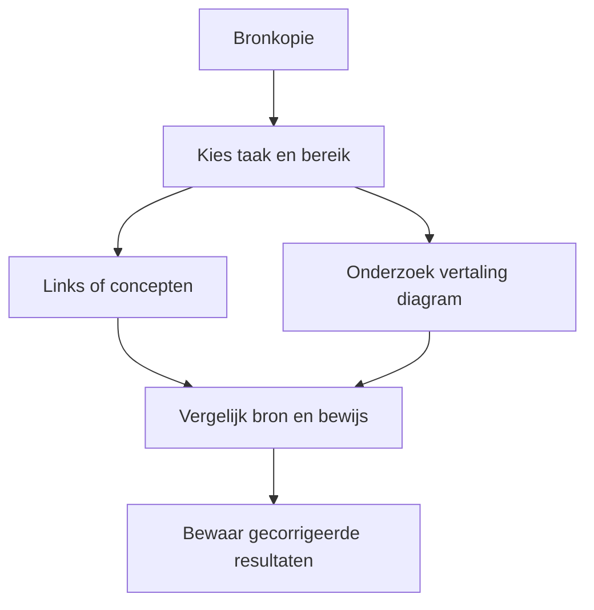

import TLDR from '@site/src/components/TLDR';

# Kennisbeheer met AI in Obsidian

<TLDR>Een bruikbare werkwijze onderscheidt bronnen, modelantwoorden en eigen correcties. Notemd levert links, extractie, onderzoek, vertaling en diagrammen als inspecteerbare documenten. Begin met één bron, beoordeel en automatiseer daarna een afgebakende map.</TLDR>

## Kies het resultaat

Wil je een gekoppelde notitie, concepten, brononderbouwde samenvatting, vertaling of diagram? Meer bestanden of links garanderen geen begrip of betere vindbaarheid. Leg vast hoe je inhoud controleert en terugvindt.

## Volledige route


```mermaid
flowchart TD
    A[Bronkopie] --> B[Kies taak en bereik]
    B --> C[Links of concepten]
    B --> D[Onderzoek vertaling diagram]
    C --> E[Vergelijk bron en bewijs]
    D --> E
    E --> F[Bewaar gecorrigeerde resultaten]
```

Dit zijn beschikbare taken, niet alle stappen van een standaardknop. Behoud de bron en controleer uitvoer voordat je een keten maakt.

## 1. Links: relaties zichtbaar maken

Gebruik **Bestand verwerken (links toevoegen)** en vergelijk `_processed.md` op termen, citaten, code en formules. Domein- en synonieminstructies dwingen geen identiteit of numerieke grens af. Voor herhaalbaar koppelen aan bestaande titels kan deterministische matching beter passen. [Links](./features/wiki-links).

## 2. Concepten: term en uitleg scheiden

Kies een map. Zelfstandige extractie behoudt de bron en maakt titels. Voor `Linked From` in nieuwe bestanden zet je teruglinks aan en minimale vorm uit. **Batch genereren vanuit titels** is apart en kan eerdere geschikte notities verwerken. Controleer complete-verplaatsing en betekenisverschillen achter gelijke namen. [Concepten](./features/concept-notes).

## 3. Onderzoek: bewijs bewaren

Kies onderwerp/titel, Tavily of DuckDuckGo en **Onderzoeken en samenvatten**. Lege Tavily-sleutel schakelt niet om. Open bronnen en verifieer claims. Optioneel lexicaal lokaal ophalen stuurt fragmenten naar de gekozen LLM; lokale indexering maakt de route niet offline. [Onderzoek](./features/research).

## 4. Vertaling: betekenis en structuur

Kies doeltaal en vertaal het document. Standaard `_<language>.md` kan bestaande uitvoer vervangen. Gebruik een tijdelijke notitie voor een passage. Controleer termen, getallen, code, links en wiskunde; fragmenten kunnen context missen. Aantallen UI-/sitetalen bewijzen geen vertaalpaar. [Vertaling](./features/translation).

## 5. Diagrammen: bron voor verdere bewerking

Kies een compatibele combinatie en bewaar bron plus benodigde SVG/PNG/PDF. Een beeld bewijst niet dat alle relaties in een andere editor behouden blijven. CircuitikZ heeft begrensde ondersteuning en aparte compilatie, Drawnix-takpijlen zijn statisch en Mermaid/SVG in PPTX kunnen beelden zijn. [Diagrammen](./features/diagrams).

## 6. Workflows: beproefde stappen automatiseren

Naam, `::` en acties met `>` bepalen de keten:

```text
One-Click Extract::process-current-add-links>batch-generate-from-titles>batch-mermaid-fix
```

Deze bevat links, titelgeneratie en Mermaid-herstel, geen algemene onderzoeks- of diagramstap. Voorwaarden en uitvoer blijven per actie gelden. Standaard stopt een gemelde fout; doorgaan is alleen geschikt als latere stappen resterende invoer aankunnen. Annulering wist geen voltooide output. [Workflows](./features/workflows).

## 7. Providers: taak en protocol

36 profielen beslaan vijf families. Kies op adres, rechten, gegevensbeleid en gemeten resultaat. Vergelijk tijd/kosten met dezelfde bron en prompt. Taakroutering staat eerst uit; controleer alle routes voordat je lokaal gebruik aanneemt. [Providers](./providers/overview).

## Eerste controles

1. Installeer en bewaar bronkopieën.
2. Configureer en test het exacte model.
3. Kies conceptmap en verschillende bestemmingen.
4. Test een kopie.
5. Vergelijk en bewaar correcties.
6. Vergroot naar een kleine map en controleer deelresultaten vóór lange ketens.

## Praktijksituaties

### Een paper verwerken

Converteer extern naar Markdown en beoordeel tabellen, formules en figuren. Extraheer concepten/passages, onderzoek precieze vragen en teken alleen controleerbare relaties. Bewaar origineel en verbeteringen.

### Concepten onderhouden

Gebruik een aparte map, beoordeel termen en genereer uitleg voor een gekozen deel. Maak een back-up vóór opruimen. Aantallen vervangen geen scherpe definities en bruikbare navigatie.

### Privémateriaal

Bereid lokale server, modellen en afhankelijkheden voor. Controleer routes en vermijd netwerkonderzoek waar nodig. Bekijk rapporten voordat je deelt. Een loopbackstandaard verhindert geen externe configuratie.

### Batch hervatten

Wacht op afronding van fout of annulering, bekijk verslag, uitvoer en herstel, vergelijk conflicten en herhaal gericht. Geannuleerd is niet leeg; controleer verwijzingen voordat je bijbestanden verwijdert.

## Verder

- [Snel starten](./getting-started/quick-start).
- [Batchverwerking](./advanced/batch-processing).
- [Ontwikkelaars](./developers/overview).
- [Agents](./agents/overview).
