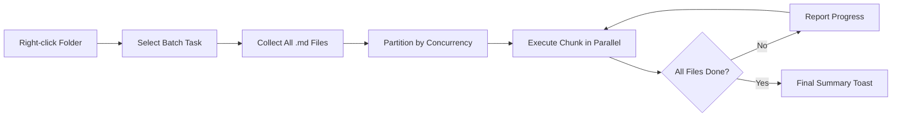

import TLDR from '@site/src/components/TLDR';

# Batchbehandling

<TLDR>
**Notemd behandler hele mappeler i én handling med konfigurerbar samtidighet og kontroll over overskrivning.** Klikk høyre på en mappe for å batch-legge til wiki-linker, extrahere konsepter, gjennomføre forskning eller oversette alle notater inni. Samtidighetsbegrensninger forhindrer API-rate-limit-feil. Fortgangen rapporteres per fil. Overskrivingsverdien er konfigurerbar: skippe eksisterende, legge til eller ersatte. Fjellet filer registreres uten å avbryte batchen.

Dette er en del av [Obsidian AI Knowledge Management Guide](/docs/pillar-ai-knowledge).
</TLDR>

## Oversikt

Batchbehandling omvandler en mappe med notater til en enkelt handling. Istedenfor å åpne hver notat og kjøre kommandoen individuelt, klikker du høyre på mappen og velger oppgaven. Notemd ganger gjennom alle `.md`-filer, aplicerer den valgte handlingen og rapporterer fortgang i realtid.

Dette funksjonen er essensiell for kunnskapsextraksjon i hele vaultet. Efter å importere desater av PDF-filer, for eksempel batch-legge til-linker etterpå batch-extrahere-konsepter, bygges din kunnskapsgraph på minutter fremfor timer.

## Hvordan det fungerer

### Batchutviklingsmodellen

1. **Filsamling** -- Notemd skanner målmappen rekursivt (eller bare på toppnivå, avhengig av innstillingene) og samler inn alle `.md`-filer.
2. **Samtidighetsindeling** -- Filene delges inn i chunker basert på `batchConcurrency`-innstillingen. Hver chunk kjøres parallelt; chunkene kjøres sekventielt.
3. **Utvikling** -- Hver fil behandles med samme logikk som kommandoen for enkelt fil. Innstillinger for per-oppgave-provist og modell respekteres.
4. **Fortgangsrapportering** -- En toast-notifikasjon oppdateres etter hver fil er ferdig, og viser `N / Total`-fortgangen.
5. **Feilhantering** -- Dersom en fil feiler (API-feil, nettverkstidout osv.), registreres feilen og batchen fortssetter. Den endelige oppsummeringen listar alle fjellet filer.
6. **Ferdigstilling** -- En oppsummeringstoast rapporterer totalt behandlet antall, suksesser og feil.

### Overskriveverdien

Når en fil som allerede har wiki-linker, konseptnotater eller oversettelser behandles, avhenger Notemd's verdi av overskrivingsinnstillingen:

| Modus | Verdien |
|------|----------|
| **Slett** | Den eksisterende innholdet blir ikke endret. Bare uendret filer behandles. |
| **Legg til** (standard) | Nytt innhold legges til. De eksisterende wiki-linkene, konseptene eller oversettelserne behandles. |
| **Endre** | Filen behandles fullstendig på nytt. Alle tidligere Notemd-endringer blir overskrive. |

Spesifikt for wiki-linking: Hvis en notat allerede inneholder `[[wiki-links]]`, lar **Slett**-modusen den være som den er, mens **Endre** sender hele notaten til LLM for ny link-innsatt. Bruk **Slett** for inkrementell behandling og **Endre** for å behandle på nytt etter en modelloppgradering.

### Konkurrenskontroll

`batchConcurrency`-innstillingen begrenser parallele API-kaller. Dette forhindrer rate-limit-feil (HTTP 429) når store mappeler behandles mot leverandører med strakte kvoter.

| Konkurrens | Anbefalt for | Typisk rate-limit-innflytelse |
|-------------|----------------|---------------------------|
| `1` | Kostnadsfrie planer, strikte leverandører | Ingen (seriell) |
| `3` (standard) | De fleste molnekostnadsleverandører | Lav |
| `5` | Ollama (lokalt), generøse planer | Ingen / Lav |
| `10` | Lokale modeller med snabb inferens | Ingen |

Hvis du møter 429-feil under batchbehandling, redusér samtidighet til 1 eller 2.

## Konfigurasjon

| Innstilling | Standard | Effekt |
|---------|---------|--------|
| `batchConcurrency` | `3` | Maksimal parallell API-kall under mappoperasjoner |
| `batchOverwriteExisting` | `false` | Skriv over den eksisterende Notemd-innehållet. `false` = tilleggsmodus. |
| `batchSkipProcessed` | `false` | Hoppa över filer som redan inneholder Notemd-markører (f.eks. wiki-linker) |
| `batchRecursive` | `true` | Inkludere undermappar när man skanner mappen |
| `enableStableApiCall` | `false` | Aktivera gjenprøvlogik (opptil 4 forsök) per fil under batch-prosessen |

### Per-Task-modeller i batch

Hver batch-operasjon bruker den tilsvarende per-task-modellen. Batch-add-links bruker `addLinksProvider`, batch-research bruker `researchProvider`, osv. Dette betyr at du kan bruke billige modeller for operasjoner med stor volum og reservere dyre modeller for oppgaver som kræver høy kvalitet.

## Eksempel

Du har en mapp `papers/` som inneholder 40 importerte forskningsnotater. Du vil legge til wiki-linker og extrahere konsepper fra dem alle:

1. Klikk høyre på mappen `papers/`
2. Välj **"Notemd: Process mapp (legg til lenker)"**
3. Notemd skanner mappen, finner 40 `.md`-filer og bearbeider 3 på gang (standardkonkurrens)
4. En fremstegsnotis viser: `12/40 files processed...`
5. Efter ca 3 minutter rapporterer en sammanfattingsnotis: `39 succeeded, 1 failed (API timeout on paper-37.md)`
6. Gjentak med **"Notemd: Process mapp (utvinne konsep)"** for å skape konseptnotater for alle 40

Den ene feilfulle filen registreres. Du kan kjøre påkalt bare på den filen senere.

## Tips

- **Start med lav konkurrens** -- Hvis du er usikker på din leverandørs hastighetsbegrensninger, start med `1` og øk gradvis.
- **Bruk skippmodus for inkrementelle oppdateringer** -- Efter den første fulla batchen, skift til `batchSkipProcessed: true` så bare nye notater bearbeides i fremtidige kjør.
- **Aktiver stabile API-kaller** -- `enableStableApiCall: true` legger til gjenkørslogik som återhæmtes fra tidsvisse nettverksfeil under lange batcher.
- **Kjør på nytt etter modelloppgraderinger** -- Hvis du skifter til en bedre modell, still på `batchOverwriteExisting: true` og kjør på nytt for å få bedre lenker og konsep.

---

## Neste trinn

- [Workflows](/docs/features/workflows) -- Koble batchoppgaver til én-klikk-sidemenuknapper
- [Custom Prompts](/docs/advanced/custom-prompts) -- Anpass prompter for batchutvinning
- [Troubleshooting](/docs/advanced/troubleshooting) -- Fikse hastighetsbegrensingsfeil og koblingsfeil under batchkjøringer
- [LLM Tjänsteleverantörer](/docs/providers/overview) -- Referens för modellkonfiguration per uppgift
