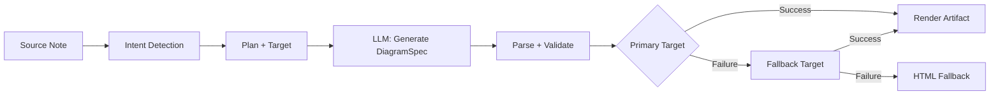
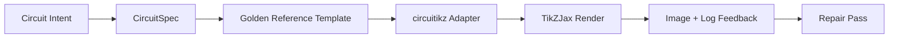

import TLDR from '@site/src/components/TLDR';

# Diagrammer

<TLDR>
**Notemd genererer diagrammer fra dine notater gjennom en pipeline som starter med specifikasjoner.** LLM skaper en `DiagramSpec` JSON som er uavhengig av renderingsverktøy, og spesialiserte adapterer oversetter den til Mermaid, JSON Canvas, Vega-Lite, HTML, eller editerbare HTML/SVG-utdata. Støtter 8 typers intenter, automatiske fallback-kedjer, live-forhandsvisning med eksport til SVG/PNG, semantisk verifisering, og generering forstärkt med lokal kunnskap.
</TLDR>

Dette er en del av [Obsidian AI Knowledge Management Guide](/docs/pillar-ai-knowledge).

## Arkitektur: Spec-First Pipeline

Notemd ber aldrig LLM om å produsere Mermaid/Vega/Canvas-syntaks direkte. Istedenfor:



**Hvorfor specifikasjon først?** LLM-filer skaper ofte ugyldig renderer-syntaks (spesielt Mermaid). En strukturert `DiagramSpec` kan valideres før rendering, og samme specifikasjon kan leveres til flere renderere som fallback.

## Støttede diagramtyper

| Intent | Hovedrenderer | Fallback-mekanismer | Bruksfall |
|--------|-----------------|-----------|----------|
| `mindmap` | Mermaid | HTML | Hierarkisk oppdeling av emner |
| `flowchart` | Mermaid | HTML | Processfløyer, beslutningstrær |
| `sequence` | Mermaid | HTML | Klient-server-interaksjoner, protokoller |
| `classDiagram` | Mermaid | HTML | OOP-klasserelasjoner |
| `erDiagram` | Mermaid | HTML | Databassskemaer, entitetsrelasjoner |
| `stateDiagram` | Mermaid | HTML | Stasemaskiner, livscyklemodeller |
| `canvasMap` | JSON Canvas | Mermaid → HTML | Konseptkarteler, kunnskapsgrapher |
| `dataChart` | Vega-Lite | Mermaid → HTML | Stavar, linjer, arealer, sprøkeligninger, pie-diagrammer, tabeller |

## Intent Detection

Notemd inferer den beste diagramtypen fra innholdet i din notat ved bruk av nøkkelordscoring:

| Intent | Triggers | Confidence |
|--------|----------|------------|
| `dataChart` | Tabeller, numeriske celler, metrikk/trend-nøkkelord, prosenttilstander | 0.88 |
| `sequence` | Request/response-ordlista (4+ matcher) eller `->`/`=>`-marker | 0.82 |
| `erDiagram` | Primær nøkkel, utlandsk nøkkel, entitet, skema (2+ matcher) | 0.80 |
| `stateDiagram` | Stasjon, overgang, i venting, i gang, feil (3+ matcher) | 0.76 |
| `flowchart` | Nummererte trinn (2+) eller if/then/else/workflow-ordlista | 0.74 |
| `canvasMap` | Konseptkarte, kunnskapsgraf, romlig, kluster | 0.72 |
| `mindmap` | Standardfall | 0.55 |

Øverstille med **Favoritt diagramtyp**-innstillingen, sidebarkvalgern eller en eksplisit kommandovalgmulighet.

## Valg av renderingsmål

Den eksperimentelle spec-first-pipeline-en har nå to uavhengige kontroller:

| Kontroll | Innstilling | Effekt |
|---------|---------|--------|
| Favoritt diagramtyp | `preferredDiagramIntent` | Styrer den semantiske formen for den genererte `DiagramSpec` |
| Favoritt renderingsmål | `preferredDiagramRenderTarget` | Velger artikkelrendereren for **Generer diagram** og **Vis forhandsvisning av diagram** |

Sett **Favoritt renderingsmål** til **Auto** som standard for planeringsprogrammet, eller velg eksplisitt Mermaid, JSON Canvas, Vega-Lite, HTML eller Editable HTML/SVG. Øverstillingen gjelder kun for artikkel- og forhandsvisningskommandoen. Standardkommandot **Sammanfatt som Mermaid diagram** forblir bundet til Mermaid-kompatible utdata så at eksisterende Markdown-arbeidsfluer ikke stillehet endrer format.

Dette skilnaden er viktig fordi en `flowchart`-intensjon nå kan renderes som Mermaid for Markdown-notater, HTML som robust fallback, eller Editable HTML/SVG for videre redigering. Draw.io og Drawnix forblir CLI-artikkelexportere fremfor innbudsrenderingsmål.

## Bruk

### Generer et diagram

1. Åpne en notat
2. Kør **"Notemd: Generer diagram"** fra kommandovalglisten
3. Notemd oppdager intensjonen, genererer specifikasjonen, renderer og lagrer artikkelens fil

**Utdatafiler etter mål:**

| Mål | Ekstensjon | Mønster for filnavn |
|--------|-----------|------------------|
| Mermaid | `.md` | `{note}_summ.md` |
| JSON Canvas | `.canvas` | `{note}_diagram.canvas` |
| Vega-Lite | `.json` | `{note}_diagram.json` |
| HTML | `.html` | `{note}_diagram.html` |
| Editabel HTML/SVG | `.html` | `{note}_diagram.html` |

### Vis forhåndsvisning av diagram

1. Kør **"Notemd: Vis forhåndsvising av diagram"**
2. En modal vises med det renderede diagrammet
3. Ekspor til SVG eller PNG med hjelp av knappene på verktøylinjen

**Automatisk åpne forhåndsvising** er tilgjengelig i innstillingene — etter generering starter forhåndsvisingsmodalen automatisk.

Forhåndsvisingsmodalen har også en panel for diagnostikk av artefakter. Renderere og smoke-checker kan legge til `RenderArtifact.diagnostics`; modalen viser en sammanfattelse med antall feil/varninger/informeringer, deretter alvorlighetsgrad, diagnostikktype, melding og reparasjonsråd ved siden av forhåndsvisningen. Samme sammanfattelse vises i historikke for forhåndsvisninger, så man kan sammenligne gjentatte circuitikz smoke-prøver uten å åpne hver enkelt post. For artefakter som har kildetekst men ikke kan renderes inline eller gjennom HTML iframe-paden, faller modalen nå tilbake til en forhåndsvising bare med kildetekst istedet for å kreve en tom iframe. Dette gir circuitikz kompile/render smoke, SVG tekst-token-kontroller, PNG-blank-skjermutsnittskontroller og fremtidige overlappsrapporter en synlig UI ytre form uten å gjøre TikZJax eller LaTeX til en hardt plugin-runtimeavhengighet eller å simulere at kildeteksten er en verifisert visuell rendering.

### Legasjons Mermaid-modus

Når `enableExperimentalDiagramPipeline` er slått av, sender Notemd en direkte Mermaid-innsendelse til LLM. Dette omgår hele spec-pipelineen. Hvis den eksperimentelle pipelineen feiler, faller systemet tilbake til denne modusen.

## Renderingsbakender

### Mermaid

6 adaptere (mindmap, fløe-diagram, sekvens, ER, klass, tilstand) oversetter `DiagramSpec` til Mermaid-syntax. Efter generering validerer `mermaid.parse()` utdataen. Hvis validasjonen feiler:

1. **LLM prøv igjen** — én forsök med Mermaid-feilmeldingen som kontekst
2. **Minimalt fallback** — et enkelt Mermaid-diagram basert på spec-nod-ID:er

**Legacy Mermaid Fixer** reparerer automatisk vanlige LLM-syntaksfeil: normalisering av note-directiver, escape av pipe-label, omposisjon av semikoler, smart quotes, dubbelstrikkepilar, formmismatch og mer.

### JSON Canvas

Genererer Obsidian JSON Canvas-format med romlig layout:
- Noder plasseres etter dybde (x = dybde × 420) og indeks (y = indeks × 170)
- Bredden estimeres fra lengden på etiketten
- Kanter med `fromSide: 'right'`, `toSide: 'left'`, `toEnd: 'arrow'`

### Vega-Lite

Bygger komplette Vega-Lite v5 JSON-specifikasjoner med automatisk kodning:
- **Cartesian charts** (bar/line/area/point/scatter): x + y-kanaler + farge for flere serier
- **Pie**: theta = y (kvantitativ), farge = x (nominal)
- **Table**: rød = x, tekst = y + kolonne = serie

Dunkle og lyste temaer blir sammanføyd før kompilering.

### HTML

Universell fallback. Selvstendig HTML-dokument med:
- CSP-meta-headerer
- Lyst/dunkel-modus gjennom `prefers-color-scheme`
- Lokaliserte UI-etiketter for 20 språk
- Seksjoner: hero, struktur (node-træ), relasjoner, kallout, data-serie-tabeller

### Redigerbar HTML/SVG

Eksplicit figur-mål for redigerbare eksportarbeidsfløyer. Den projiserer `DiagramSpec` inn i en deterministisk `SemanticFigureModel`, og renderer deretter en selvstendig HTML-dokument med inline SVG-grupper som inneholder Draw.io-stil annotasjoner:

- `data-drawio-type`, `data-drawio-id` og `data-drawio-role` på semantiske noder
- `data-drawio-source` og `data-drawio-target` på semantiske kanter
- stabile nod/kantidentifikatorer etter normalisering av mellomrom og hantering av kollisjoner
- ingen skripter, ingen eksterne fonter og ingen fjernressurser

Dette målet er avsiktlig ikke den standardmessige planeringsveien ennå. Det er tilgjengelig som et eksplicit renderingsmål mens produktveien beviser redigeringsfunksjonalitet i virkelige verktøy.

### Draw.io og Drawnix Exportgränser

Den nuværende implementasjonen holder støtte for tredjepartsredaktorer ved artefaktgränsen:

| Mål | Kontrakt | Körningsskrav |
|--------|----------|--------------------|
| Draw.io | deterministisk, ukomprimeret `mxfile` XML fra `SemanticFigureModel` | ingen i pluginkörningen eller CI |
| Drawnix | minimal `.drawnix` JSON-undermengde med `geometry` og `arrow-line`-elementer | ingen i pluginkörningen eller CI |

Avviket er avsiktlig: Notemd kan verifisere synlige etiketter, stabile ID:er og støttet primitivdekking uten å embedde diagrams.net Desktop, Drawnix, Plait eller bare-browserredaktørstater i pluginen.

### circuitikz / TikZJax Retning

Kretsdiagrammer er ikke det samme problemet som generelle fløe-diagrammer. Den korrekte syntaxmålet for elektriske kretsler er vanligvis **circuitikz**, rendert i Obsidian gjennom pluginer som TikZJax. TikZJax kan laste inn pakker som `circuitikz`, `pgfplots`, `tikz-cd` og `chemfig`, noe som gjør det attraktivt for notater om fysikk, kretsler, kjemie og matematikk.

Risikoen er at rå TikZ-generert med LLM er bruktbar:

- Komplekse kretstopologier kan være elektrisk korrekte men visuelt uleselige;
- Overlappende kabler og etiketter kan gjøre en korrekt netlist ubrukbar for studienotater;
- Fjernede pakkepreambler, feil anker eller ugyldige komponentnamn kan forhindre rendering;
- Feedback fra rendereren er vanligvis på bildnivå, mens LLM genererer tekstnivås geometri.

Den bedre arkitekturen er å behandle circuitikz som et begrenset diagrammål, ikke som en friform-prompt:



Modellen bør beskrive kretstopologi og layout separat:

| Lager | Ansvar | Eksempel |
|-------|----------------|---------|
| Topologi | elektriske noder og komponentforbindelser | `VDD -> RD -> drain(M1)`, `source(M1) -> GND` |
| Layout | gridplassering, orientering, routingslaner | `M1 at (3,2.2)`, innmatning venstre, utmatning høyre |
| Stil | pakke, spenningkonvensjon, merker, anker | `\begin{circuitikz}[american voltages]` |
| Validering | kompilasjonslogg, manglende anker, overskridelse/skjermutsikkekontroller | TikZJax/LaTeX-diagnostikk plus visuell gjennomgang |

### Aktuell circuitikz-prototyp

Notemd inkluderer nå den første begrensete repository-prototypen for denne retningen. Den er avsiktlig offline og bundet til en mall:

```bash
npm run diagram:export-circuitikz -- --input cmos-inverter.json --output cmos-inverter.tex
```

Prototypen legger til en separat `CircuitSpec`-grænse og en deterministisk eksporter for sex gullstandardfamilier:

| Kretstype | Gullstandard | Strømsgaranti |
|--------------|------------------|-------------------|
| `common-source-amplifier` | `common-source-nmos-v1` | validerer `VDD -> R_D -> M1.D`, `vin -> M1.G`, `M1.S -> GND` og `M1.D -> vout` før skrivning av LaTeX |
| `cmos-inverter` | `cmos-inverter-v1` | validerer PMOS-over-NMOS-topologi, delt gate-inntak, delt drain-utmatning, `VDD -> MP.S` og `MN.S -> GND` før skrivning av LaTeX |
| `cmos-buffer` | `cmos-buffer-v1` | validerer to kaskerte invertersteg, mellomliggende nod `vmid`, restaurert `vout` og delte VDD/GND-leier før skrivning av LaTeX |
| `cmos-transmission-gate` | `cmos-transmission-gate-v1` | validerer parallele PMOS/NMOS-pass-enheter mellom `vin` og `vout` med komplementære `phib` / `phi`-kontroller før skrivning av LaTeX |
| `cmos-nand2` | `cmos-nand2-v1` | validerer parallell PMOS pull-up, seriell NMOS pull-down, dobbel innstillinger `va` / `vb`, og `vout` før LaTeX skrives |
| `cmos-nor2` | `cmos-nor2-v1` | validerer seriell PMOS pull-up, parallell NMOS pull-down, dobbel innstillinger `va` / `vb`, og `vout` før LaTeX skrives |

Dette er ennå ikke en generell TikZ-generer. Den kompilerer ikke LaTeX, kaller ikke TikZJax, undersøker ikke skjermutsikter, eller kjører ikke automatisert bild-feilretting. Disse funksjonene kommer senere.

Kommandoen Preview diagram kan åpne tilbake gemte circuitikz-kildeartefakter direkte når filendelsen er `.tex` eller `.tikz` og kilden inneholder `\usepackage{circuitikz}` eller `\begin{circuitikz}`. Denne metoden er en circuitikz-kilde-eksklusiv preview: modalen viser kilden, diagnostikk, kopier/speicherningskontroller og historiksmetadata, men den kompilerer ikke LaTeX eller kaller ikke TikZJax under pluginets kjøring.

Den samme kilde-eksklusive preview-marginen dekker nå også gemte Draw.io og Drawnix-artefakter. `.drawio`-filer blir acceptert når de ser ut som Draw.io XML (`mxfile` eller `mxGraphModel`), og `.drawnix`-filer blir acceptert når de er Drawnix JSON med `type: "drawnix"` og en `elements`-array. Pluginet innbuder fortsatt ikke diagrams.net eller Drawnix-whiteboard-hosten; disse previewene viser kilden, diagnostikk og artefaktshistorik uten å kreve en in-plugin-visuell redigeringsverktøy.

For reparasjon som bevarer topologien, send inn forreparasjons-specifikasjonen som referanse før man godtar en reparert kandidat:

```bash
npm run diagram:export-circuitikz -- --input repaired-cmos-inverter.json --topology-reference cmos-inverter.json --output cmos-inverter.tex
```

Reparasjonsvaktene bruker `createCircuitTopologySignature` og `assertCircuitTopologyUnchanged` for å sammenligne `circuitKind`, `goldenReferenceId`, nettverk, komponentids/typ/terminaler, og urettede forbindelsesendepunkter før utdata. Etiketter, titeltekst, layoutvinkler, forbindelsesordning og forbindelsesetiketter ignoreres avsiktlig. En kandidat som legger til en kort eller omformer en terminal mistenker med `Circuit topology drift detected` før `.tex`-filen skrives.

Den CLI kan nå parse en eksisterende LaTeX/TikZJax-kompilasjonslogg uten å kjøre en kompilerer:

```bash
npm run diagram:export-circuitikz -- --input cmos-inverter.json --output cmos-inverter.tex --compile-log cmos-inverter.log --diagnostics-output cmos-inverter.diagnostics.json
```

Dette diagnostiske veggen rapporterer manglende pakker som `circuitikz.sty`, ukjente TikZ/circuitikz-klær, TikZ-syntaksfeil som manglende semikoler, ukontrollerte argumenter fra ubalanserte parenteser eller uavslutte etiketter, ukjente kontrollsekvenser, generelle LaTeX-feil, nødknappstopp og varsel om overfull `\hbox`. Det forblir log-basert: lokal LaTeX/TikZJax-kjøring og skjermutsikter-kvalitetsgate er fortsatt separat fremtidig arbeid.

For vedlikeholders smoke-checker kan samme CLI valgfritt kjøre en eksplisitt konfigurert renderer uten å parse shell-kommandoer:

```bash
npm run diagram:export-circuitikz -- --input cmos-inverter.json --output cmos-inverter.tex --compile-executable pdflatex --compile-arg -interaction=nonstopmode --compile-arg -halt-on-error --compile-arg -output-directory={outputDir} --compile-arg {tex} --expected-artifact {outputDir}/{jobName}.pdf
```

Kompilasjonskjøreren bruker `shell: false`, utvider `{tex}`, `{outputDir}` og `{jobName}`-placeholder til argument-array-verdier, les den genererte `{jobName}.log`, og returnerer `compileExecution` plus `compileDiagnostics` i CLI JSON-utdata. `--compile-executable` er kun renderer-binaryen eller wrapper-passen; renderer-flagger tilhører i gjentatte `--compile-arg`-verdier. Tomme exekutabler mistenker som `compile-executable-invalid`, manglende binaries mistenker som `compile-executable-not-found`, og shell-kommando-formet exekutabelstrenger mottar anbefalinger om å splitte argumenter slik at Windows, Linux og macOS følger samme direkte-kjøringkontrakt. Med `--expected-artifact` rapporteres også `compileExecution.renderSmoke` og mistenker den CLI hvis rendereren ikke skaper et ikke-tomt artefakt. Det innbuder fortsatt ikke LaTeX, gjør ikke TikZJax til en plugin-kjøringstilhengighet, eller utfører skjermutsikter-nivå visuell reparasjon.

Hvis det forventede artefakten er `.svg`, går smoke-checken en lag dypere:

```bash
npm run diagram:export-circuitikz -- --input cmos-inverter.json --output cmos-inverter.tex --compile-executable dvisvgm --compile-arg ... --expected-artifact {outputDir}/{jobName}.svg --expected-svg-text v_{in} --expected-svg-text v_{out}
```

SVG smoke-verifiserer `<svg>`-rotten, positive dimensjoner eller `viewBox`, minst én synlig teikningselement etter utelukkelse av skjulte/ttransparente elementer, alle forespurt teksttokener, tydelige elementer utenfor `viewBox`, tydelige overlappende posisjonerte `<text>` / `<tspan>`-etiketter, og tydelige tekstetiketter som overlapper teikningselementer gjennom `render-svg-label-overlap`. Forventet tekst søkes i synlig tekst og dekoderes tilgjengelighetsmetadata som `aria-label`, `<title>` og `<desc>`, så rendererer som bevarer semantiske etiketter utenfor synlig `<text>` kan fortsatt oppfylle tekst-token smoke uten å kreve OCR. Geometri-passen er nå transform-oppmærksom geometri for vanlige gruppe- og element `transform`-attributter, så oversettet, skalert, rotert, skjult eller matrix-transformert SVG-bokser undersøkes etter transform-komposisjon. Den dekker eksakte bølgemarginer for A/a-bølgemaksimumer, eksakte Bezier-kurve-marginer for C/S/Q/T-kurve-maksimumer, stroke-width-oppmærksom SVG-marginer og etiketter-overlappingskontroller, `polyline` / `polygon`-teikningsgeometri, og løser også path-eneste glyph-plassering fra `<use href="#...">`-referanser så at etiketter konvertert til brukesbare glyph-passer kan fortsatt mistenke bounded-canvas-kontroller når plassert glyph-geometri slipper `viewBox`. Mange posisjonerte `tspan`-etiketter under én `<text>`-forelder sammenlignes som separate etiketterbokser, noe som oppdager LaTeX-stil SVG-utdata som annars ville samle forskjellige etiketter til én tekstnode. Posisjonerte SVG `text` og `tspan`-bokser respekterer `text-anchor`-verdier `start`, `middle` og `end`, så sentrerte og høyre-alignerte etiketter kan utløse tekst/tekst og etiketter-vs-teikning-overlappingsdiagnostikk uten å kreve browser-nivå tekstlayout. Definition-eneste glyph-passer inni `<defs>` regnes ikke som synlige teikningselementer, men deres egne definition-lokal `transform`-attributter apliceres før `<use>`-plassering så at skalert eller speilrett glyph-definisjoner ikke underregnes. Etiketter-vs-teikning-kontrollen bruker en liten teikningsboks-tolerans og den deklarerte `stroke-width`, så tynne kabler, tjocke kabler og polygonale komponentoutliner kan alle betraktes som potensielle etiketter-leserbarhetsfeil når deres synlige strekk nåer en etikett. Path-eneste glyph-etiketter løst fra `<use href="#...">` sammenlignes også med teikningsbokser og mistenker med `render-svg-path-glyph-overlap` når brukesbare glyph-geometri overlapper kabler eller komponenter. Hvis en renderer konverterer etiketter til brukesbare path-glypher istedenfor søkelige `<text>` og ikke bevarer tilgjengelighetsmetadata, registrerer smoke-rapporten `pathOnlyGlyphUseCount` og mistenker den forespurt teksttokenen gjennom `render-svg-text-path-only` istedenfor å gjøre det som om etiketten er enkelt fraværende. Andere feil rapporteres gjennom `render-svg-invalid`, `render-svg-dimension-missing`, `render-svg-no-visible-elements`, `render-svg-text-missing`, `render-svg-out-of-bounds`, `render-svg-text-overlap`, `render-svg-label-overlap` eller `render-svg-path-glyph-overlap`. Tekst-token- og overlappingskontroller bør kun betraktes som strukturell smoke for rendererer som bevarer etiketter som søkelige SVG-tekst eller tilgjengelighetsmetadata; path-eneste SVG-utdata trenger fortsatt den senere skjermutsikter/OCR-gaten for å bevisle visuell etiketter-leserbarhet, og denne smoke-passen krever fortsatt ikke full SVG-path-dekking.

Skjulte SVG-grupper og elementer overskues konsekvent under talling av synlige elementer og geometrik samling. Attributt- eller inline-stil `display:none`, `visibility:hidden`, `visibility:collapse` og overall `opacity:0` kan ikke gjøre en annenvis blank render-artefakt til å klare synlig-output smoke.

Path-eneste glyph-definisjoner kan være direkte pather eller gruppesymboletankener inni `<defs>`. Smoke-passen løser barn-path-geometri fra `<g id="...">` og `<symbol id="...">` før `<use>`-plassering, så innsluitet glyph-utdata stiller likevel tilgang til `pathOnlyGlyphUseCount`, bounded-canvas-kontroller og `render-svg-path-glyph-overlap`.

Path-parseren følger også subpath-start og sletter den aktuelle punkten på `Z/z`, så relative kommandoer etter en lukket subpath fortsetter fra den riktige SVG-punkten istedenfor å skape falske `render-svg-out-of-bounds`-diagnostikk.

Den samme geometriprosessen følger SVG-regelen for decimaltal med førstegangspunkt og eksplisite plusstegn, så kompakte dvisvgm-koordinater som `.5`, `-.5` eller `+.5` forblir desimalt under grensesjekkene istedet for å bli feil geometri utenfor grenser eller skippes.

Hvis rendereren sender ut `.png`, blir den samme forventede artefaktveien en første skjermutsikke: Notemd dekoderer ikke-interlæst 1/2/4/8-bit indeksert-farge PNG-filer, 1/2/4/8/16-bit gråskala PNG-filer, og 8/16-bit gråskala-alpha/RGB/RGBA PNG-filer. Indeksert-farge- og sub-byte gråskala-bilder støtter pakketprover; indeksert-farge-bilder støtter også PLTE og valgfritt tRNS-data; gråskala/RGB-bilder støtter tRNS-transparente prover. 16-bit direkteprover normaliseres til samme 8-bit RGBA-verksgang som brukes i smoke-checkene. Smoke-checken verifiserer positive dimensjoner, registrerer fremgrunnsgrenser som `foregroundBounds`, registrerer fremgrunnstetthet inni den boksen som `foregroundDensity`, feiler med `render-png-blank` når hver synlig pixel matcher topp-venstre bakgrunnsfarge, feiler med `render-png-content-clipped` når fremgrunninnhold berører bildens grenser, feiler med `render-png-foreground-too-small` når en stor skjermutsikke har mindre enn fire fremgrunnspixel, og feiler med `render-png-foreground-dense` når fremgrunnspixel er uvanlig tett inni en ikke-triviell boks. Ustøttede PNG-format feiler med `render-png-unsupported` og spesifikke råd for Adam7 interlæste PNG-filer eller ustøttet indeksert-farge-bitdybde. Dette oppdager tomme skjermutsikker, uklart canvas-klippering, underrenderet fremgrunnsspor, første pixelnivås overflodfeil, og feil PNG-eksportinnstillinger fra rendereren uten å legge til plattformspesifiske shell-avhengigheter. Det er ikke ennå OCR-nivås labelerkjenning, nøyaktig tekstoverlappingsdeteksjon, eller topologibeholderende bildreparasjon.

Når diagnostikk viser en feil i kompilering eller render-smoke-kurs, kan CLI også skrive en topologibeholderende reparasjonsbeskrivelse:

```bash
npm run diagram:export-circuitikz -- --input cmos-inverter.json --topology-reference cmos-inverter.json --output cmos-inverter.tex --compile-log cmos-inverter.log --repair-brief-output cmos-inverter.repair-brief.json
```

Reparasjonsbeskrivelsen bruker schema `notemd.circuitikz.repair-brief.v1` og inneholder kilden `CircuitSpec`, topologisignatur, kompilering/render-diagnostikk, tillatte endringer, forbudte topologiendringer, næste verifiseringssteg, og en strukturert `repairPrompt`. Prompt-rollen er `topology-preserving-circuitikz-repair`; dess `diagnosticFocus`-liste kommer fra kompilering/render-diagnostikk, og dess `acceptanceCriteria` krever kandidatvalidering plus nye kompilering og render-smoke-checker. Det er overføringsformatet for en senere reparasjonsloop, ikke en påståelse om at Notemd allerede kjører autonome visuelle reparasjon.

Efter at en reparasjonskandidat har blitt produsert, kan samme CLI validere den mot beskrivelsen før utdata skrives:

```bash
npm run diagram:export-circuitikz -- --input repaired-cmos-inverter.json --repair-brief cmos-inverter.repair-brief.json --output repaired-cmos-inverter.tex
```

`--repair-brief` kontrollerer kandidatens topologisignatur fra beskrivelsen og er uoverensstigende med `--topology-reference`. At dette gateet passer beviser kun topologibeholdelse; kandidaten trenger fortsatt kompilering-diagnostikk og render-smoke-checker.

`--repair-brief`-resultatet inkluderer også `repairAcceptance`-bevis med schema `notemd.circuitikz.repair-acceptance.v1`. Det rapporterer `topology-signature`, `compile-diagnostics` og `render-smoke`-gateer som `passed`, `failed` eller `missing`; eksponerer `remainingChecks`; og holder `readyForVisualAcceptance` på å være falsk til kandidatkursen inneholder alle nødvendige bevis.

Bruk `--repair-acceptance-output` sammen med `--repair-brief` når CI eller releasebevisstyrke trenger en varig JSON-fil:

```bash
npm run diagram:export-circuitikz -- --input repaired-cmos-inverter.json --repair-brief cmos-inverter.repair-brief.json --output repaired-cmos-inverter.tex --repair-acceptance-output repaired-cmos-inverter.repair-acceptance.json
```

For releasemål eller vedlikeholdsbevis, kjør alle støttede gullfamilier gjennom aggregate fixture runneren:

```bash
npm run diagram:smoke-circuitikz -- --output-dir docs/export/circuitikz-smoke --compile-executable pdflatex --compile-arg -interaction=nonstopmode --compile-arg -halt-on-error --compile-arg -output-directory={outputDir} --compile-arg {tex} --expected-artifact {outputDir}/{jobName}.pdf
```

Runneren bruker `docs/maintainer/fixtures/circuitikz/common-source-nmos-v1.json`, `docs/maintainer/fixtures/circuitikz/cmos-inverter-v1.json`, `docs/maintainer/fixtures/circuitikz/cmos-buffer-v1.json`, `docs/maintainer/fixtures/circuitikz/cmos-transmission-gate-v1.json`, `docs/maintainer/fixtures/circuitikz/cmos-nand2-v1.json` og `docs/maintainer/fixtures/circuitikz/cmos-nor2-v1.json`, kaller samme shell-fri eksportvei for hver fixture, og returnerer en aggregate JSON-rapport med per-fixture `compileExecution` og `compileDiagnostics`. Det er fortsatt en vedlikeholdskommando, ikke en plugin-runtime-avhengighet.

Når en vedlikeholdsmaskin ennå ikke har konfigurert renderer, kjør samme fixture-kommando uten `--compile-executable` og beholde miljøgateet eksplisitt:

```bash
npm run diagram:smoke-circuitikz -- --output-dir docs/export/circuitikz-smoke --report-output docs/export/circuitikz-smoke/renderer-availability.json
```

Denne veien skriver likevel den deterministiske fixture `.tex`-artefaktene, men returnerer `ok: false` med `rendererAvailability.status` satt til `missing-configuration` og en `compile-executable-invalid`-diagnostikk. Behandle det som bevis på rendererens tilgjengelighet kun; det er ikke kompilering, render-smoke eller visuell godkjenning.

### Gullreferansepromptform

For nærterminnig bruk, gi en renderbar gullreferanse før du ber om en kretsvariant. En begrenset prompt bør beholde innledningen, koordinatskalen, ankerstilen og routingskonvensjonene:

```latex
\usepackage{circuitikz}
\begin{document}
\begin{circuitikz}[american voltages]
\draw
  (3,5) node[vcc]{$V_{DD}$}
  to [R, l=$R_D$] (3,3)
  to [short, *-o] (5,3) node[right]{$v_{out}$}
  (3,3) to [short] (3,2.2)
  node[nmos, anchor=D] (M1) {$M_1$}
  (M1.S) to [short] (3,0.5)
  node[ground]{}
  (M1.G) to [short, -o] (0.8,2.2)
  node[left]{$v_{in}$};
\draw
  (3,0.5) node[below right]{$S$};
\end{circuitikz}
\end{document}
```

For en CMOS-inverter bør prompten forespørre en eksplisitt topologi plus layoutbegrensninger, ikke bare "draw a CMOS inverter":

- hold `VDD` på toppen, `GND` på botnen, innputt på venstre, utputt på høyre;
- Brug `pmos` over `nmos`, med delte gate og delte drain;
- Hold utdataknotten ved drainforbindelsen og marker den med `*-o`;
- Brug navngivne anker (`PM1.G`, `NM1.G`, `PM1.D`, `NM1.D`) istedet for visuelt infererede koordinater;
- Unngå diagonale eller krydende kabler medmindre det er elektrisk nødvendigt.

### Aktuell fremstilling og næste fase

| Areal | Aktuel status | Næste trin |
|------|----------------|-----------|
| Almene diagrammer | Spec-first pipeline implementeret for Mermaid, JSON Canvas, Vega-Lite, HTML | Hold på med at udvide semantisk verifiseringsskyde |
| Redigerbare figurer | `editable-html-svg`, Draw.io XML, og Drawnix JSON artefaktgrænser implementeret | Tilføj mere komplekse primitive kun efter at tester har beviset redigerbarhed |
| CLI støtte | `npm run diagram:export-artifact` eksporterer redigerbare HTML/SVG, Draw.io, og Drawnix fra én `DiagramSpec` | Legg til målspesifikke røykfikser når nye mål leveres |
| circuitikz | `CircuitSpec -> circuitikz` prototyp eksporterer common-source, CMOS inverter, `cmos-buffer` / `cmos-buffer-v1`, `cmos-transmission-gate` / `cmos-transmission-gate-v1`, `cmos-nand2` / `cmos-nand2-v1`, og `cmos-nor2` / `cmos-nor2-v1` gyllene maller, projekter `layoutHints.inputSide` og `layoutHints.outputSide` til bestemt inn-/utgangsportplassering uten å endre topologien, avviser reparasjontopologidrift gjennom `--topology-reference`, sender topologibeholderende reparasjonsbeskrivelser gjennom `--repair-brief-output` og schema `notemd.circuitikz.repair-brief.v1`, inkluderer strukturert `repairPrompt` overføringsinnhold med `diagnosticFocus`, `acceptanceCriteria`, og rolle `topology-preserving-circuitikz-repair`, validerer reparasjonskandidater gjennom `--repair-brief`, returnerer `repairAcceptance` gatebevis gjennom schema `notemd.circuitikz.repair-acceptance.v1` med `readyForVisualAcceptance` og `remainingChecks`, beholder dette beviset gjennom `--repair-acceptance-output`, parserer kompileringsskriver, kan kjøre eksplisitte lokale renderere plus `--expected-artifact`, SVG `--expected-svg-text`, tilgjengelighetsmetadatakontroller gjennom `aria-label`, `<title>`, og `<desc>`, utelukking av skjulte/ttransparente SVG elementer, `render-svg-text-path-only` / `pathOnlyGlyphUseCount` klassifisering for bare-på-path-etiketter, kontroller for bare-på-path-glyfeplassering for `<use href="#...">`, diagnostikk for bare-på-path-glyfeoverlappelse gjennom `render-svg-path-glyph-overlap`, hantering av nøyaktig strømspunkt for close-path for `Z/z`, nøyaktige bøngegränser for A/a bøngeextrema, nøyaktige Bezier-kurvegränser for C/S/Q/T kurveextrema, SVG gränser med hensyn til penselstyrke og kontroller for etikkeoverlappelse, `polyline` / `polygon` kontroller for tegngeometri, posisjonert `tspan` etikkegeometri, `text-anchor`-bevisst posisjonert tekstgeometri, geometri med transformasjon for SVG bounded-canvas/text-overlap og label-vs-drawing røykkontroller gjennom `render-svg-label-overlap`, samt PNG ikke-blankt / klippet / tett-foregrunnsskjermutsnittsrøykkontroller, inkludert indeksert-kolorgammal alfa, gråskala/RGB tRNS transparente eksempler, og formatspesifikk `render-png-unsupported` veiledning for Adam7 interlaced PNGs og indeksert bit-dyp-fel, gjennom `foregroundBounds`, `foregroundDensity`, `render-png-content-clipped`, og `render-png-foreground-dense` uten shell-parsering, inkluderer samlede vedligeholderingsrøykfikser gjennom `npm run diagram:smoke-circuitikz`, registrerer manglende rendererkonfigurasjon gjennom `rendererAvailability.status: "missing-configuration"` og `compile-executable-invalid`, og har generiske forhåndsvisningsdiagnostikk, diagnostisk sammanfattingsantall, diagnostikkbevisst historieinnhold, og kilde-enbart fallback gjennom `RenderArtifact.diagnostics` og forhåndsvisningsmodalen | Legg til OCR-nivå-etikkeerkjenning for bare-på-path-visuell tekst, nøyaktige pixelnivå-overlappingskontroller, bredere SVG path-oversettelse dersom nødvendig, automatisk installering/oppdagelse av renderer kun dersom det kan bli valgfritt, og automatisert topologibeholderende reparasjonsutføring |
| TikZJax integrasjon | Kandidatrenderingshost for Obsidian-side visning | Hold det valgfritt; gjør ikke TikZJax til en hard plugin-runtimeavhengighet |

## Konfigurasjon

| Innstilling | Standard | Effekt |
|---------|---------|--------|
| `enableExperimentalDiagramPipeline` | `false` | Vendel mellom spec-first og legasie Mermaid |
| `experimentalDiagramCompatibilityMode` | `'legacy-mermaid'` | `'legacy-mermaid'` = Mermaid kun; `'best-fit'` = nativ mål + fallbacker |
| `preferredDiagramIntent` | `undefined` (auto) | Overrask automatisk intent-deteksjon |
| `summarizeToMermaidLanguage` | `'en'` | Målsspråk for diagrammetiketter |
| `summarizeToMermaidProvider` / `Model` | DeepSeek | Per-oppgave LLM for diagramgenerering |
| `autoMermaidFixAfterGenerate` | (fra konstanter) | Kjør legasiefixer automatisk på Mermaid utdata |
| `enableLocalKnowledgeForDiagramGeneration` | `false` | Økte kilde med lokal vault-kunnskap |

### Lokal kunnskapsoptimering

Når det er aktiveret, henter Notemd relevante kontekstsnipp fra vaultens lokale kunnskapsbas (basert på MiniSearch) og fører dem inn i kilden markdown. Augmenteringsprompten sier: "Kun støttereferanser; hold den primære strukturen like til kildenotatet."

### Samsvarstilstander

- **`legacy-mermaid`**: Alle intenter dirigeres til Mermaid. Ikke-Mermaid intenter (canvasMap, dataChart) tvinges til `flowchart` eller `mindmap`. Ingen fallback-kedje.
- **`best-fit`**: Hver intent dirigeres til sin egne måldestination. Dersom primære metoden feiler, går det gjennom fallback-kedjen (f.eks. Vega-Lite → Mermaid → HTML).

## Forskyvning og eksport

| Aksjon | Metode |
|--------|--------|
| SVG export | `mermaid.render()` / `vega.View.toSVG()` / SVG builder for Canvas |
| PNG-eksport | SVG → Bild → Canvas (device pixel ratio 1x-3x) → PNG ArrayBuffer |
| Sparing av kilde | Rå artefaktinnhold spart med målspesifikk ekstensjon |
| Forskyvning kun av kilden | Ikke-inline artefakter med kildemiddel vises som kod plus diagnostikk, uten iframe-rendering |
| Semantisk audit | Mermaid, JSON Canvas, Vega-Lite, og editabel HTML/SVG kontrolleret av `scripts/diagram-semantic-verification.js` |

**Caching**: RenderCache bruker en deterministisk JSON-klue fra `{spec, target, theme}`. In-flight deduplikasjon forhindrer dupliserte renderinger.

## Tips

- **Start med `best-fit`-modus** — det gir den beste visuelle resultatet for hver intent-typ
- **Bruk kraftige modeller for komplekse diagrammer** — fløe-diagrammer og ER-diagrammer nyter fordel av GPT-4o eller Claude
- **Aktiver lokal kunnskap** for domen-spesifikke diagrammer — relevant vault-kontekst forbedrer nøyaktigheten
- **Still på `autoMermaidFixAfterGenerate`** — Mermaid-synaksfeil er vanlige uten det
- **Den gamle fixeren er omfattende** — hvis Mermaid-forhandsvisningen feiler, løser man ofte problemet ved å kjøre fixeringskommandoen manuelt

---

## Neste trinn

- 🔗 [Wiki-Links](./wiki-links) — Hvordan konsepene kobles innlignende
- 📝 [Concept Notes](./concept-notes) — Utvinne konsepter for diagramkildematerial
- 🔍 [Research](./research) — Forstärk diagrammer med data fra webben
