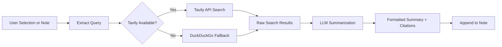

import TLDR from '@site/src/components/TLDR';

# Forskning og webbsøk

<TLDR>
**Notemd søker på nettet og injiserer LLM-sammanfattede resultater direkte i dine notater.** Tavily API er hovedsøkebakendøren; DuckDuckGo fungerer som en zero-config fallback. Resultatene sammanfattes med kilder og lagres under en `## Research`-overskrift. Støtter forskning i én notat, batch-forskning i mapper og valg av modell for sammanfattingssteget per oppgave.

Dette er en del av [Obsidian AI Knowledge Management Guide](/docs/pillar-ai-knowledge).
</TLDR>

## Oversikt

Forskning er en av Notemd's mest kraftfulle integrasjoner: den lukker sikken mellom lese, søke og skrive. Istedenfor å bytte til en nettleser for å finne ut en ukjent term, markerer du den og lar Notemd søke, sammanfattere og lagre resultatene – allt innenfor din vault.

Prosessen er fullstendig konfigurerbart. Du velger søkeleverandøren, den LLM som skriver sammanfattelsen, og om resultatene skal lagres i den aktive notaten eller i separate filer. Batch-modus gjør det mulig å forske i alle notater i en mappe med én klikk.

## Hvordan det fungerer

### Søk-og-sammanfattingspipeline



1. **Spørsmåletakning** -- Notemd tar ut søkeord fra din valg eller notatetitelen.
2. **Webbsøk** -- Tavily forsøkes først. Hvis ingen API-klave er konfigurert, brukes DuckDuckGo automatisk (ingen klave nødvendig).
3. **LLM-sammanfattelse** -- Rå søkeresultater sendes til den konfigurerte LLM, som lager en kort sammanfattelse med inline-kilder.
4. **Lagring** -- Den formaterede sammanfattelsen lagres under en `## Research`-overskrift i den aktive notaten.

### Tavily mot DuckDuckGo

| Aspekt | Tavily | DuckDuckGo |
|--------|--------|------------|
| API-klave | Nødvendig (gratis plan tilgjengelig) | Ikke nødvendig |
| Resultkvalitet | Høyere (spesifikt utviklet for AI) | Godt til generelle spørsmål |
| Ratebegrensninger | Rik free tier | Styrtes av throttling |
| Konfigurasjon | `tavilyApiKey` i innstillingene | Nul konfigurasjon -- automatisk fallback |

### Batch Folder Research

Klikk høyre på en mapp og velg **"Notemd: Research folder"**. Hver `.md`-fil i mappen behandles sekventielt (eller parallelt opp til konfigurert samtidighet). Hver notis får sin egen forskningsoppsummering.

## Konfigurasjon

| Innstilling | Standard | Effekt |
|---------|---------|--------|
| `tavilyApiKey` | `''` | Tavily API-klasse. Når den er tom, brukes kun DuckDuckGo. |
| `researchProvider` / `researchModel` | DeepSeek | Per-oppgave LLM for å oppsummere søkeresultater |
| `maxResearchContentTokens` | `4000` | Tokenbudget for innhold sendt til LLM. Overskuddet blir trunkert. |
| `researchAppendToNote` | `true` | Legg til oppsummering til kildenotis. Dersom falskt, skapas en separat fil. |
| `researchLanguage` | `'en'` | Utdataforståelse for den oppsummerte forskningen |

### Modellrekommendasjon per oppgave

Forskning nyter av en modell som kan hantere multilingvalt innhold og produsere godt strukturert prosa. Se på:

- **DeepSeek** -- standard, billig, god kvalitet
- **GPT-4o** -- høyere kvalitet på oppsummering, høyere kostnad
- **Gemini Flash** -- snabb og billig, god for enkle spørsmål

## Eksempel

Du leser en artikel om *transformer attention mechanisms* og støter på et ukjent termin: *relative positional encoding*. Istedenfor å lade Obsidian:

1. Markér **"relative positional encoding"**
2. Høyreklikk --> **"Notemd: Forskning og oppsummering"**
3. Notemd søker i nettet, oppsummerer de beste resultatene og legger til:

```markdown
## Research

### Relative Positional Encoding

Relative positional encoding is a method used in transformer models
where positional information is expressed as relative distances between
tokens rather than absolute positions. Introduced by Shaw et al. (2018),
it improves generalization to unseen sequence lengths compared to
absolute encodings (Vaswani et al., 2017).

Sources:
- [Shaw et al., Self-Attention with Relative Position Representations (2018)](https://arxiv.org/abs/1803.02155)
- [Transformer Positional Encoding Overview](https://example.com/transformer-pos-enc)
```

Oppsummelsen er nå en del av din vault, søkelig, kobelig og tilgjengelig uten nettforbindelse.

## Tips

- **Sett en Tavily-klave for beste resultat** -- selv den gratis versionen gir bedre relevans enn ren DuckDuckGo.
- **Bruk en effektiv oppsummeringsmodell** -- billige modeller kan gjøre teknisk innhold mindre detaljert.
- **Gjennomfør batch-forskning** etter en første lese for å fylle mellomrom i mange notater på en gang.
- **Gjennomgå de lagte til oppsummingsene** -- LLM kan skape falske kilder. Sjekk viktige påståelser.

---

## Neste trinn

- [Concept Notes](./concept-notes) -- Utvinn og gemm viktige termer fra forskningsresultater
- [Wiki-Links](./wiki-links) -- Koble konsep som ble funnet i forskningen sammen i din vault
- [Translation](./translation) -- Oversett forskningsoppsummeringer til et annet språk
- [LLM Tjänsteleverantörer](/docs/providers/overview) -- Konfigurera modellen som används för sammanfattning
