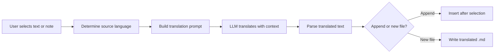

import TLDR from '@site/src/components/TLDR';

# Oversettelse

<TLDR>
**Notemd oversetter tekst mellom 21+ språk med hjelp av LLM-drivet oversettelsestjeneste.** Støtter oversettelse av enkelt valgt tekst, hele notater og batch-oversettelse av mapper. Hver oversettelsesoppgave kan bruke en egen leverandør og modell gjennom innstillinger per oppgave. Utgangsspråket kan konfigureres separat fra UI-språket. Resultatene legges til under den opprinnelige teksten eller skrives i en ny fil, avhengig av dine preferanser.

Dette er en del av [Obsidian AI Knowledge Management Guide](/docs/pillar-ai-knowledge).
</TLDR>

## Oversikt

Oversettelse i Notemd er ikke en ordforholdssøk – det er LLM-drivet, kontekstmedvetnt oversettelse. Modellen ser hele punktet eller notaten, og beholder tonen, terminologien i spesifikt område og setningsstrukturen. Dette gir bedre resultat enn tjenester som oversetter ord for ord, særskilt for teknisk, akademisk og kreativ skrift.

Funksjonen støtter tre områder: valgt tekst, aktive notater og hele mappe. I kombinasjon med modellvalg per oppgave kan du bruke en snell modell (Gemini Flash) for enkel oversettelse og en kraftig modell (Claude Sonnet) for innhold som krever finjustering – uten å endre din globale leverandør.

## Hvordan det fungerer

### Oversettelseskommandoen



1. **Kildeidentifisering** – LLM inferer kildespråket fra innholdet. Du trenger ikke å angive det manuelt.
2. **Prompt-oppbygging** – Notemd bygger en prompt som inkluderer målspråket, valgfri hint om område og teksten som skal oversettes.
3. **LLM-oversettelse** – Den konfigurerte `translateProvider` / `translateModel`-tjenesten bearbeider forespørselen. Modellen beholder markdown-formatering, wiki-linker og kodblokker.
4. **Utdata** – Den oversette teksten legges enten til under den opprinnelige teksten eller skrives i en ny fil i vaulten.

### Språkpar

Notemd støtter alle språkpar som den underliggende LLM støtter. Vanlige par inkluderer:

| Kilde | Mål | Typisk kvalitet |
|--------|--------|----------------|
| Engelsk | Kinesisk (simplifisert) | Utmerket |
| Kinesisk | Engelsk | Utmerket |
| Engelsk | Japansk | Mye god |
| Engelsk | Tysk / Fransk / Spansk | Mye god |
| Alle støttede språk | Alle støttede språk | Avhengig av modell |

Instillingen `translateLanguage` styrer **utdataspråket**. Kildespråket detekteres automatisk.

### Modellval per oppgave

Kvaliteten på oversettelsen varierer mye avhengig av modellen. Notemd gjør det mulig å velge en spesifikk modell kun for oversettelse:

| Modell | Hastighet | Kvalitet | Kostnad | Bedst til |
|-------|-------|--------|------|----------|
| `gemini-2.0-flash-exp` | Snabb | God | Lav | Casual, høy volum |
| `gpt-4o-mini` | Snabb | God | Lav | Raske søk |
| `deepseek-chat` | Middel | God | Mye lav | Budget med flere språk |
| `claude-3-5-sonnet` | Middel | Utmärkt | Middel | Teknisk / akademisk |
| `gpt-4o` | Middel | Utmärkt | Middel | Prosa med nøyansbehandling |

### Översättning av mappar i batch

Klicka höger på en mapp och välj **"Notemd: Translate folder"** för att översätta alla anteckningar i den mappen. Varje fil bearbetas separat. Konkurrensinställningen styr hur många filer som översätts samtidigt.

## Konfigurasjon

| Innstilling | Standard | Effekt |
|---------|---------|--------|
| `translateProvider` / `translateModel` | DeepSeek | Särskild tjänste för översättningstjänster |
| `translateLanguage` | `'en'` | Mål-språk for utdata |
| `translationAppendToNote` | `true` | Lägg till den översatta texten under den ursprungliga. Om det är falskt skapas en ny fil. |
| `batchConcurrency` | `3` | Antal filer som bearbetas samtidigt vid batchöversättning |

## Eksempel

Du läser ett kinesiskt forskningsanteckning och vill ha en engelsk version:

1. Öppna anteckningen
2. Klicka höger --> **"Notemd: Translate current file"**
3. Notemd upptäcker kinesiska, översätter till den av dig konfigurerade måländelsen (engelska) och lägger till:

```markdown
## Translation (English)

The experimental results show that the proposed method achieves
a 12% improvement in F1 score compared to the baseline, primarily
due to the enhanced feature extraction module described in Section 3.
```

Den ursprungliga kinesiska texten förblir oförändrad ovanför översättningen. `## Translation`-rubriken håller båda versionerna i samma fil för enkel referens.

## Tips

- **Använd Gemini Flash för stora mängder** -- det är den snabbaste och billigaste alternativet för batchöversättning av stora mappar.
- **Bevar wiki-linker** -- Notemd's anbefaling instruerer LLM til å holde `[[wiki-links]]` uforandret i oversettelsen. Sjekk etter oversettelse, da noen modeller ibland løser dem opp.
- **Stillt eksplisitt utdata-språket** -- automatisk deteksjon fungerer for kilden, men konfigurert alltid `translateLanguage` for å unngå tvil om målet.
- **Batch-oversettelse av konseptnotater** -- hvis din konseptmapp er på ett språk og du trenger den på et annet, hanterer oversettelse på mappen dette i én trinn.

---

## Neste trinn

- [Research](./research) -- Søk og sammanfatt på hva som helst språk, og oversett sedan resultatene
- [Workflows](./workflows) -- Koble sammen oversettelse med wiki-linking eller konseptutvinning
- [Batch Processing](/docs/advanced/batch-processing) -- Samtidighet og overskrivingsverdier for mappoperasjoner
- [LLM Providers](/docs/providers/overview) -- Velg den beste modellen for ditt språkpar
