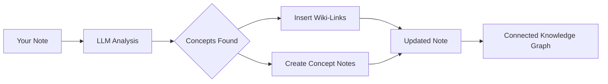

import TLDR from '@site/src/components/TLDR';

# Wiki-Linker

<TLDR>
**Notemd legger automatisk `[[wiki-links]]` til ved viktige konsepter i dine notater.** LLM leser innholdet ditt, identifiserer viktige termer i konteksten og setter inn wiki-linker i Obsidian-stil ved hver oppførsel. Valgfritt kan det skapes konseptnotater med baklinker. Støttes synonymsuppresjon, linkintegritet ved endring/deletering og ren utvinningssmodus (ingen endringer i filer). Tilsynelatende mot Auto Link som kun matcher eksisterende notetitel, bruker Notemd AI for å identifisere nye konsepter og skape tilsvarende notater. Dette er en del av [Obsidian AI Knowledge Management Guide](/docs/pillar-ai-knowledge).
</TLDR>

## Oversikt

Wiki-linking er kjernefunksjonen i Notemd. Den transformerer vanlig tekst til en koblet kunnskapsgraph gjennom:

1. **Analyse av din note** med ett LLM
2. **Identifisering av viktige konsepter** (termer, personer, metoder, teorier)
3. **Innsetting av `[[wiki-links]]`** ved hver oppførsel
4. **Skapelse av konseptnotater** (valgfritt) med baklinker

## Hvordan det fungerer

### Prosess



### Eksempel

**Før:**
```markdown
Machine learning models use neural networks to learn patterns from data.
The transformer architecture revolutionized natural language processing.
```

**Efter:**
```markdown
[[Machine learning]] models use [[neural networks]] to learn patterns from data.
The [[transformer architecture]] revolutionized [[natural language processing]].
```

## Bruk

### Basisk: Legg til linker i den aktuelle noten

1. Åpne en notat
2. Klikk høyre i redigeringsverktøyet → **"Process file (add links)"**
3. Vente noen sekunder
4. Konseptene er nå koblet sammen!

### Batch: Behandle flere notater

1. Klikk høyre på en mapp i filexploreren
2. Välj **"Notemd: Process mapp (legg til lenker)"**
3. Konfigurere:
   - Samtidighet (hvor mange filer parallelt)
   - Skriv over eksisterende lenker (ja/nei)
4. Klikk **Process**

### Selektivt: Lenke til spesifikt tekst

1. Hajser opp tekst til behandling
2. Klikk høyre → **"Process selection (add links)"**
3. Apenbarelysningen analyseres kun

## Notemd vs Auto Link

Obsidian har to metoder for automatisk wiki-linking:

| | **Auto Link** | **Notemd** |
|--|---------------|-------------|
| Lenkekilde | Existerende notetitel i vault | Konsepter identifisert av LLM i innholdet |
| Kan lage nye konsepter | Nei – titelen må allerede eksistere | Ja – AI identifiserer konsepter og skaper notater |
| Hantering av synonymer | Nei | Ja – undertrykkelse av synonymer |
| Skapelse av konseptnotater | Nei | Ja – med baklenger og duplikatkortning |
| Batchbehandling | Nei (enkelt fil) | Ja (mappnivå) |
| Modellrutning per oppgave | Nei | Ja |

**Auto Link** matcher titler: Hvis en notat med navnet "Machine Learning" eksisterer, omgjør det oppførselene i `[[Machine Learning]]`. Hvis notaten ikke eksisterer, skjer ingenting.

**Notemd** er AI-stuert: LLM leser din innhold, forstår konteksten, identifiserer konsepter som *bør* bli koblet – selv om ingen notat eksisterer ennå – og skaper både lenken og konseptnotaten.

## Funksjoner

### Undertrykkelse av synonymer

**Problem:** "transformer", "transformers", "Transformer architecture" → 3 separate konsepter

**Løsning:** Notemd oppdager nær-duplikater og bruker kanonisk form.

**Konfigurasjon:**
```
Settings → Advanced → Synonym Suppression
Threshold: 0.8 (0 = off, 1 = aggressive)
```

### Link Integrity

**Når du endrer navn på en konseptnotat:**
- Alle wiki-linker oppdateres automatisk (Obsidian kjernefunksjon)
- Backlinkene forblir intakte

**Når du sletter en konseptnotat:**
- Linkene forblir men vises som "unlinked mentions"
- Du kan skape den på nytt fra enhver forekomst

### Pure Extraction Mode

**Ekstraher konsepter uten å endre det opprinnelige:**

1. Høyreklikk → **"Extract concepts (no linking)"**
2. Konseptnotater blir skapt
3. Opprinnelig fil forblir uendret

Bruksfall: Behandling av kun-lese-innehold eller endelige utkast.

## Concept Note Generation

### Automatic Creation

**Når det er aktiveret (standard), skaper Notemd:**

```markdown
---
tags: [concept, auto-generated]
created: 2026-06-13
source: [[Original Note Name]]
---

# Machine Learning

A branch of artificial intelligence that enables computers
to learn from data without explicit programming.

## Occurrences in Your Vault

- [[Original Note Name#Section]]
- [[Another Note#Header]]

## Related Concepts

- [[Neural Networks]]
- [[Deep Learning]]
- [[Supervised Learning]]
```

### Konfigurasjon

**Utdata-mapp:**
```
Settings → Output → Concept Folder
Default: concepts/
```

**Hierarkisk struktur:**
```
Settings → Output → Use Hierarchical Folders
If enabled:
  papers/my-paper.md → papers/concepts/Concept.md
If disabled:
  → concepts/Concept.md
```

**Mall:**
```
Settings → Output → Concept Template
Customize with variables:
  {{concept}} — Concept name
  {{description}} — LLM-generated description
  {{backlinks}} — List of source notes
  {{date}} — Creation date
```

## Avanserte valg

### Kontekstvindu

**Hvor mye omgivende tekst skal sendes:**

```
Settings → Linking → Context Window
Options: Sentence | Paragraph | Full Note
Default: Paragraph
```

Større verdi = bedre nøyaktighet, høyere kostnad.

### Minimum antall forekomster

**Koppla kun sammen konsep som aparerer flere ganger:**

```
Settings → Linking → Min Occurrences
Default: 1 (link all)
```

Still på 2 eller 3 for å fokusere på gjentakende temaer.

### Utklære mønster

**Slett visse ord:**

```
Settings → Linking → Exclude List
Example: note, idea, example, thing
```

Forhindrer overkobling av generelle termer.

### Skrivetilpassede prompter

**Øverstille standard LLM-instruksjoner:**

```
Settings → Advanced → Custom Linking Prompt
Default:
  "Identify key concepts, theories, methods, and technical
   terms in the following text. Return as a list..."
```

Endre for domenespesifikke behov (f.eks. "Fokuser på medisinsk terminologi").

## Tips og beste praksis

### ✅ Gør

- **Behandle notater med >100 ord** — Korte notater gir få konsepter
- **Brug kraftfulde modeller** for bedre identifisering af konsepter (GPT-4o, Claude)
- **Gå gjennem før du accepterer** — Kontroller om de foreslåede links er logiske
- **Byg gradvist** — Behandle 5-10 notater, gå gjennom grafen, juster indstillinger

### ❌ Gør ikke

- **Overlink** — Ikke alle substantiver behøver en link
- **Behandle utkast flere ganger** — Konseptene kan endre sig, vent til de er stabile
- **Ignorer synonymer** — Aktiver suppression for at unngå "ML" vs "Machine Learning"

## Prestasjon

### Hastighet

| Størrelse på notater | GPT-4o-mini | Claude Sonnet | Ollama (lokalt) |
|-----------|-------------|---------------|----------------|
| 500 ord | 2-3 sekunder | 3-5 sekunder | 5-10 sekunder |
| 2000 ord | 5-8 sekunder | 10-15 sekunder | 20-40 sekunder |
| 5000+ ord | Delvis (mehrere kaller) | Delvis | Delvis |

### Kostutschatning

**Eksempel: 1000-ords notat med GPT-4o-mini**
- Inntak: ~1500 tokener
- Utdata: ~200 tokener
- Kostnad: ~

**Batchbehandling av 100 notater:** ~

## Feilforskning

### Ingen linker tilføyd

**Kontroll:**
1. LLM kallet med succes (Settings → Diagnostics)
2. Noten har tilstrekkelig innhold (>50 ord)
3. Konseptene er tekniske/spesifikke (ikke bare pronomer)

**Prøv:**
- Bruk en mer kraftig modell
- Øk contextvinduet
- Kontroller degens gyldighet for API

### For mange lenker

**Løsninger:**
1. Øk minst antall forekomster (2 eller 3)
2. Legg til vanlige ord til utelukkelseslisten
3. Bruk en mindre aggressiv modell

### Felle konsepknettert

**Løsninger:**
1. Bruk eksklusiv prompt for domen-specifikke resultater
2. Aktiver synonymsuppresjon
3. Gjennomgå manuelt og fjerne koblinger

### Koblingene brukes ikke etter endring av navn

**Dette er normalt Obsidian oppførsel.**

For å oppdatere alle koblinger:
1. Endre navnet på konseptnoten
2. Obsidian oppdaterer automatisk `[[old]]` → `[[new]]`

---

## Neste trinn

- 📖 [Konseptnoter](./concept-notes) — Dyptgående informasjon om generering av konseptnoter
- 🔍 [Forskning integrert](./research) — Kombinere koblinger med webbenorskning
- 🎨 [Diagrammer](./diagrams) — Visualisere din kunnskapsgraf
