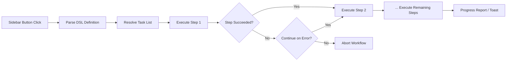

import TLDR from '@site/src/components/TLDR';

# Arbeidsfluer

<TLDR>
**Notemd Arbeidsfluer kobler sammen flere oppgaver til en enkelt en-klikk-handling.** Definér sekvenser som `add-links > extract-concepts > research > diagram` med en enkel DSL. Arbeidsfluer vises som knapper i sidenavn og kjører hele kedjen på den aktuelle noten eller mappen. Det leveres med fordefinerte arbeidsfluer; skap deg egne i innstillingene. Hver trinn bruker sin egen modellkonfigurasjon per oppgave.

Dette er en del av [Obsidian AI Knowledge Management Guide](/docs/pillar-ai-knowledge).
</TLDR>

## Oversikt

En arbeidsflue fjerner behovet for å kjøre oppgaver én etter en. Istedenfor å klikke høyre fire ganger for å legge til lenker, extrahere konsepter, undersøke ukjente termer og generere en diagramm, trykker du på en knapp i sidenavn og hele kedjen kjøres. Notemd hanterer sekvensering, feiloverføring og fremstilling av fremgang.

Arbeidsfluer defineres med en lett DSL (domen-spesifikt språk). De finnes i innstillingene, vises som klickbare knapper i Obsidian sidenavn, og kan bli brukt på den aktuelle noten eller hele mappen.

## Hvordan det fungerer

### Kjørpipeline for arbeidsfluer



1. **Parse** -- DSL-stringen delges på `>` (eller `>`) til en ordnet liste over oppgavidentifikatorer.
2. **Resolve** -- Hver identifikator mappes til en intern kommando (add-links, extract-concepts, research, translate, diagram osv.).
3. **Execute** -- Trinnene kjøres sekventielt. Hvert trinn bruker den konfigurerte leverandøren og modellen per oppgave.
4. **Error handling** -- Dersom et trinn feiler, stopper arbeidsfluen enten eller fortssetter til neste trinn, avhengig av din feilpolitikk.
5. **Done** -- En toast-notifikasjon rapporterer om suksess eller listar alle feilne trinn.

### DSL-format

Arbeidsfluer defineres som en `>`-skilt sekvens av oppgavidentifikatorer:

```
process-current-add-links>extract-concepts-current>research-and-summarize
```

**Tilgjengelige oppgavidentifikatorer:**

| Identifikator | Aksjon |
|------------|--------|
| `process-current-add-links` | Legg til wiki-linker til den aktive noten |
| `extract-concepts-current` | Utvinn konsep fra den aktive noten |
| `research-and-summarize` | Forskjek utvalgt tekst eller notetittel |
| `process-current-translate` | Oversett den aktive noten |
| `summarize-to-mermaid` | Generer en diagramm fra den aktive noten |
| `generate-from-title` | Generer innhold fra notetittelen |
| `extract-original-text` | Utvinn opprinnelig tekst (for OCR / skannet innhold) |

**Varianter på mappenivå**: Bytt `current` ut med `folder` i identifikasjonsnavnet.

### Fordefinerte vs. egne arbeidsfluer

Notemd leverer ferdige arbeidsfluer for vanlige mønster:

| Arbeidsfluss | Kedje | Bruksfall |
|----------|-------|----------|
| **En-klikk utvinning** | add-links > extract-concepts > research | Behandle en forskningsartikel i én gang |
| **Full pipeline** | add-links > extract-concepts > research > diagramm | Fullständig kunnskapsextraksjon med visualisering |
| **Overset + Lenk** | Oversette > Legg til linker | Overset og legg til lenker til konseptene i målspråket |

**Skrivet arbeidsfløyer** erstattes i innstillingene:

1. Åpne **Settings** --> **Notemd** --> **Workflows**
2. Klikk **"Add Workflow"**
3. Indtast DSL-keden (f.eks. `process-current-add-links>extract-concepts-current`)
4. Giv det en visningsnavn (f.eks. “Snabb kobling + Extrahere”)
5. Den nye knappen vises umiddelbart i sidenavn.

## Konfigurasjon

| Innstilling | Standard | Effekt |
|---------|---------|--------|
| `workflows` | Fordefinert sett | Array av arbeidsflussdefinisjoner (navn + DSL) |
| `workflowContinueOnError` | `true` | Fortsett til neste trinn dersom det aktuelle trinnet feiler |
| `workflowShowProgress` | `true` | Vis en fremstegsnotis etter hver trinn er fullført |

### Per-oppgave-modeller i arbeidsfluer

Hver trinn i en arbeidsfluss bruker sin egen modellkonfigurasjon per oppgave. Du trenger ikke å specificere modeller i DSL-en selv. Resolusjonsordren er:

1. Provider/modell per oppgave dersom `useMultiModelSettings` er til stede
2. Global `activeProvider` i annen tilfelle

Dette betyr at `add-links` kan kjøre på DeepSeek mens `research` kjører på GPT-4o – alt innenfor samme arbeidsflussklikk.

## Eksempel

Du har bare importert en PDF fra en maskininlerningsartikel til din vault og ønsker full kunnskapsextraksjon:

1. Opn den importerte noten
2. Klikk på **"Full Pipeline"**-knappen i siden
3. Notemd kjører:
   - **Trinn 1**: Legg til wiki-linker – `[[attention mechanism]]`, `[[transformer]]` osv.
   - **Trinn 2**: Extraher konsepter – skaper konseptnotater i din konseptmapp
   - **Trinn 3**: Forskning – sammanfatter webkilder for nøkkelord
   - **Trinn 4**: Diagram – genererer en Mermaid-mindmap av artikkelens struktur
4. Efter ca. 30 sekunder har din noter linker, konseptnotater finnes, forskningen er tilføyd og en diagramfil er lagret

Allt fra én enkelt klikk.

## Tips

- **Start med fordefinerte arbeidsflusser** – de dekker de vanligste mønstrene. Anpass bare når du trenger en annen sekvens.
- **Aktiver `workflowContinueOnError`** – en feil i diagramtrinnet bør ikke stoppe hele pipelineen.
- **Bruk mapparbeidsfløyer** for massbehandling – høyreklikk på en mappe, velg en arbeidsfløye, og alle notater blir bearbeidet.
- **Giv arbeidsfløyer klare navn** – plassen i sidenavnsplassen er begrenset. Bruk korte, handlingstilsatte navn som "Snabb utvinning" eller "Oversette + Lenke".

---

## Neste trinn

- [Research](./research) -- Forstå hva forskningsstappen gjør før du legger den til arbeidsfløyer
- [Wiki-Links](./wiki-links) -- Hovedlenkingsfunksjonen som brukes i de fleste arbeidsfløyer
- [Concept Notes](./concept-notes) -- Konseptutvinning som en arbeidsfløyesteg
- [Batch Processing](/docs/advanced/batch-processing) -- Samtidighet og fremstilling av fremgang for mapparbeidsfløyer
