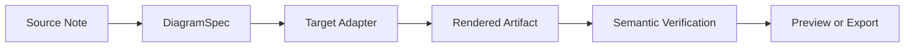
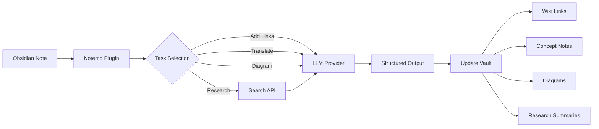

import TLDR from '@site/src/components/TLDR';

# Introduksjon til Notemd

<TLDR>
**Notemd** (Note + EMD — Enhanced Markdown Documents) er en open-source Obsidian-plugin som transformerer lestning med LLM til permanente kunnskaper. Tverskyggt med chat-baseret AI der insikter forsvinner etter sesjonen, skriver Notemd resultater **direkte inn i din vault** som wiki-linker, konseptnotater, forskningsoppsummeringer, oversettelser, arbeidsfløier og diagrammer. Den er bygget for forskere, studenter og kunnskapsarbeidere som ønsker at lestning, forskning og visuelle forklaringer samles inn i en strukturert, utviklingstilpasset kunnskapsgraph.
</TLDR>

## Hva er Notemd?

Notemd integrerer **30+ store språkmodeller** (OpenAI, Anthropic, Google, DeepSeek, Qwen, Ollama og mer) i din Obsidian-arbeidsfløye for å automatisere utvinning, organisering, oversettelse, forskning og generering av diagrammer.

### Kjernemunskap: Tidligenskappende vs. permanente kunnskap

| Aspekt | Chat-baseret AI (ChatGPT osv.) | Notemd |
|--------|-------------------------------|--------|
| **Hvor resultaterne går** | Chathistorikk (forsvinner) | Din Obsidian vault (persisterer) |
| **Format** | Plaintekstsvarer | Strukturerte filer: `[[wiki-links]]`, konseptnotater, diagrammer |
| **Langtidsverdien** | Må spørre om alt på nytt | Samles inn i en kunnskapsgraph |
| **Utenfor nettverk** | Kræver internett | Virker fullstendig utenfor nettverk med Ollama |

## Kernfunksjoner

### 1. **Automatisk Wiki-linking**
- LLM identifiserer nøkkelpersoner i dine notater
- Setter inn `[[wiki-links]]` ved hver oppførelse
- Skaper valgfritt linkede konsepnotater
- Synonymsuppresjon for å unngå duplikater

### 2. **Generering av konsepnotater**
- Ekstraherer kernkonsepter fra artikler, papirer og notater
- Genererer spesialiserte konsepfiler med baklinker
- Anpasselige utdatemuligheter og maller

### 3. **Integrasjon med webben**
- Søk Tavily eller DuckDuckGo innenfor Obsidian
- LLM sammanfatter resultater med kilder
- Legger til forskningsresultater til den nåværende noten

### 4. **Multilingual Translation**
- Oversette utvalgte deler eller hele noter
- Støtter over 21 UI språk
- Uavhengig konfigurasjon av utdataspråk
- Støtte for batch-oversettelse

### 5. **Diagram Generering**
- **Mermaid**: Flødesskjemer, sekvens-, klass-, tilstand-, ER- og Gantt-diagrammer
- **JSON Canvas**: Obsidian innbyggde layouter
- **Vega-Lite**: Datakurver, tidsserier og sprøytdiagrammer
- **HTML / Editable HTML/SVG**: Selvstendige figurartefakter med semantiske annotasjoner
- **Draw.io / Drawnix artifact boundaries**: Eksporveier for vedlikeholdere fra samme semantiske figurmodell
- **Circuit diagrams roadmap**: Støtte for circuitikz/TikZJax designes rundt gullstandarder, begrenset prompter, renderingsfeilrapporter og validasjon av topologi/layout fremfor ukontrolleret LLM TikZ
- **Preview diagnostics**: Renderartefakter kan vise kompilering-/renderingsfeilrapporter, og ikke-inline-kilder kan undersøkes uten å kreve en LaTeX-runtime på plugin-siden
- Automatisk feilretting for Mermaid-feil

### 6. **One-Click Workflows**
- Koble flere handlinger sammen til siderbarkknapper
- Definisjon av arbeidsfluss basert på DSL
- Eksempel: `add-links > extract-concepts > research > diagram`

## Hver bør bruke Notemd?

✅ **Forskere** som les artikler og bygger litteraturoversikter
✅ **Studenter** som organiserer studienotater og skaper konseptkarteler
✅ **Kunnskapsarbeidere** som ønsker at lesingsinsikter skal behandles lokalt
✅ **Bilinguala profesjonelle** som trenger oversettelse + wiki-linking
✅ **Brukere med privatlivsbevissthet** som ønsker lokal LLM-støtte (Ollama)
✅ **Kraftige brukere** som anpasser prompter og arbeidsflisser

## Hvorfor Notemd + Obsidian?

**Obsidian** er en lokalførst, markdown-basert kunnskapsbas. **Notemd** tilbyr AI-superkrafter:
- Dina data forblir i din egen databas (ikke i en molnettjeneste)
- Virker offline med lokale modeller
- Kostnadsfri og åpen kildekod (MIT-licens)
- Integrasjon med eksisterende Obsidian-pluginer
- Skalerer til ti tusenvis av noter

## Start med

1. **Installasjon**: Innstillinger → Community Plugins → Søk → "Notemd"
2. **Konfigurering**: Legg til din LLM-leverandørs API-nyckel (eller bruk lokale Ollama)
3. **Prøv det**: Åpne en note → Høyreklikk → "Processer fil (legg til lenker)"
4. **Utforsk**: Sjekk sidenfor en-klikk-arbeidsfluer

👉 [Installasjonsguide](./getting-started/installation) | [Snabbstarttutoriale](./getting-started/quick-start)

## Riktning for diagramfunksjonalitet

Notemds diagramarbeid beveger seg bort fra "be modellen om å skrive en syntaksstrang" og mot en laget pipeline:

Den nåværende implementasjonen støtter allerede Mermaid, JSON Canvas, Vega-Lite, HTML-fallback, redigerbare HTML/SVG, Draw.io XML-artefakter, en minimal Drawnix JSON-undermengde, forhandsvisningssjekk/allekilde-fallback, og en offline `CircuitSpec -> circuitikz`-prototyp for vanlige-kilde og CMOS-inverter-guldetemplater. Kretsdiagrammer er en sværere klasse: circuitikz kan uttrykke nøyaktig elektrisk topologi, men ukontrolleret LLM-utdata gir ofte ulesbar routering eller LaTeX som ikke renderes. Neste retningen er å holde circuitikz kontrollert med guldetilnærmingstemplater, regler for nodgridslayout, renderingssjekk, og screenshot-feedbackslinger.

Lest detaljene i [Diagrammer](./features/diagrams).

## Arkitektur

## Notemd vs andre Obsidian AI-pluginer

De fleste Obsidian AI-pluginene er konversasjonsfokusert (du spør, AI svarer, insikter forblir i chaten). Notemd er **skriv-fokusert**: AI bearbeider dine noter og skriver strukturerte resultater direkte inn i din vault.

| Funksjonalitet | Notemd | Copilot | Smart Connections | Text Generator |
|-----------|--------|---------|-------------------|-----------------|
| Automatisk innføring av wiki-linker | Ja | Nei | Nei | Nei |
| Generering av konseptnotater | Ja (med baklinker + duplikatkortning) | Nei | Nei | Nei |
| Generering av diagrammer | Ja (Mermaid, Canvas, Vega-Lite, HTML, redigerbare artefakter) | Nei | Nei | Nei |
| Integrasjon med webbenforhold | Ja (Tavily + DuckDuckGo) | Nei | Nei | Nei |
| Behandling av mapper i batch | Ja | Begrenset | Nei | Begrenset |
| Modellrutning per oppgave | Ja (7 oppgaver, uavhengige modeller) | Nei | Nei | Nei |
| En-klikk-workflow-kjeder | Ja (DSL) | Nei | Nei | Nei |
| Oversettelse (batch) | Ja | Nei | Nei | Nei |
| Chatt med vault | Nei | Ja | Nei | Nei |
| Semitisk likhetssøk | Nei | Nei | Ja | Nei |
| Mønsterbasert generering | Nei | Nei | Nei | Ja |
| LLM leverandører | 36 (cloud + gateway + lokal) | 3-5 | 2-3 | 3-5 |
| Fullt offline | Ja (Ollama) | Delvis | Delvis | Delvis |

**Når du velger Notemd**: Du vil at AI skal bygge en permanent kunnskapsgraph – ikke bare chatte om dine notater.

**Når du velger Copilot**: Du ønsker en konversasjonsbasert AI-assistent inni Obsidian.

**Når du velger Smart Connections**: Du vil oppdage eksisterende forhold mellom notater gjennom semantisk søk.

## Filosofi

**Notemd anser at AI bør styrke menneskers kunnskapsskapende arbeid, ikke ersatte det.** Pluginet:
- Holder deg i kontrollen (gjennomgå før du setter inn endringer)
- Bevarer konteksten (alle resultater refererer tilknytning til kilden)
- Respekterer privatlivet (lokalt LLM-støtte, ingen telemetri)
- Forblir ekstensibel (åpne APIs, egne arbeidsfluer)

## Open Source

- **Lisens**: MIT
- **Kildekod**: [github.com/Jacobinwwey/obsidian-NotEMD](https://github.com/Jacobinwwey/obsidian-NotEMD)
- **Samfunnet**: [Discord](https://discord.gg/qnGgsQ9W) | [GitHub Discussions](https://github.com/Jacobinwwey/obsidian-NotEMD/discussions)
- **Bidra**: PRs er velkomne, se [CONTRIBUTING.md](https://github.com/Jacobinwwey/obsidian-NotEMD/blob/main/CONTRIBUTING.md)

---

**Neste**: [Installation →](./getting-started/installation)
