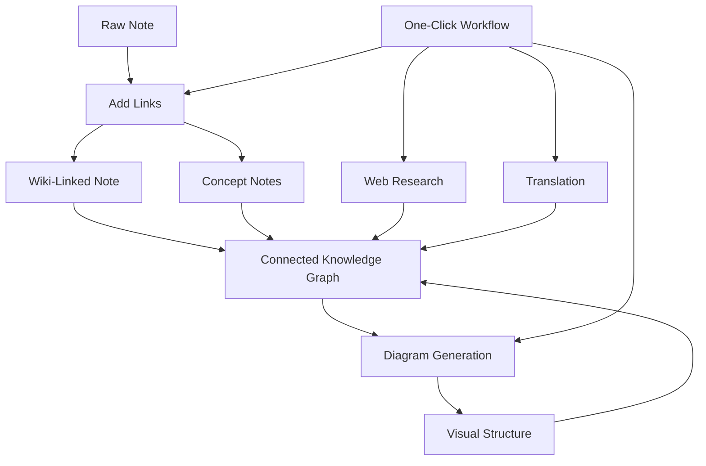

import TLDR from '@site/src/components/TLDR';

# Obsidian AI-kunnskapstilsynsguide

<TLDR>
**Notemd transformerer LLM-driven leseaktivitet til permanent kunnskap: wiki-linker kobler sammen konsepter, konseptnotater skaper en tilgjengelig graf, forskning tar inn nettet i din vault, oversettelse bryter språkbarrierer, diagrammer gjør strukturen synlig, og arbeidsfluer koble alt sammen med én klikk.** Dette guideet dekker hele prosessen – fra rå notater til en koblet, visuell, multilingual kunnskapsbas.
</TLDR>

## Hvorfor AI-kunnskapstilsyn?

Tradisjonell notatering gir flat filer. Selv med manuelle wiki-linker forblir de fleste notater uforståelige. Notemd bruker LLM for å automatisere koblingslaget:

- **LLM-systemene les din innhold** og identifiserer hva som er viktig – termer, metoder, personer, teorier
- **Linker blir automatisk innsett** ved hver konseptoppførsel, ikke begravd i "se også"
- **Konseptnotater genereres** som sjældne, tilgjengelige filer
- **Forskning beregner ut notater** med kontekst fra nettet
- **Diagrammer gjør strukturen synlig** – mind-mapper, fløe-diagrammer, data-diagrammer fra samme innhold

Resultatet: en kunnskapsgraf som vokser med hver notat du bearbeider, ikke bare når du husker å legge til linker.

## Helen prosessen



Hver trinn er uavhengig. Bruk én eller alle. Den mest effektive sekvensen: **Legg til linker → Konseptnotater → Diagrammer**.

---

## 1. Wiki-linker: Å gjøre koblingene uttrykkelige

Wiki-linker er ryggbeinet i en kunnskapsgraf. Notemd bruker en LLM for å:

1. Læs innholdet i din notat (del på deler for lange dokumenter)
2. Identifiser degenskaperne — prioriterer spesifikke, tekniske termer fremfor generelle substantiver
3. Sett inn `[[wiki-links]]` ved hver oppførelse
4. Undertrykk synonymer så at "ML" og "Machine Learning" ikke skaper separate noder

### Når å bruke

- **Alle notater >100 ord** — kortere notater gir få konsepter
- **Forskningsartikler, tekniske dokumenter, møtetekster** — rike på domenespesifikke termer
- **Efter innholdet er stabilt** — behandle ikke endelig utkast flere ganger

### Viktig innstilling

| Innstilling | Anbefalt | Hvorfor |
|---------|-----------|-----|
| `addLinksProvider` | DeepSeek eller GPT-4o-mini | God nøyaktighet til lav kostnad |
| Synonymundertrykkelse | Aktivert | Forhindrer dupliserte noder |
| Konsekvensvindu | Paragraf | Balansen mellom nøyaktighet og kostnad |

→ [Dypdypdyp i Wiki-linker](/docs/features/wiki-links)

---

## 2. Konseptnotater: Gjenopprettelige kunnskapsnoder

Wiki-linker kobler sammen idéer i teksten, men konseptnotater gjør det mulig å finne hver idé uavhengig. Hver konsept får sin egen `.md`-fil:

```markdown
# Machine Learning

## Linked From
- [[My Research Notes]]
- [[Neural Networks Explained]]
```

### Utdragningsprosessen

Prompten for LLM er mye strukturert:
- Normalisere til enkelform
- Førstegangig prefereres flerordige begreper fremfor enkelte ord (“Dielectric Relaxation” og ikke “Relaxation”)
- Slett referanser/bibliografi-seksjoner
- Utdata som `CONCEPT:` linjer for deterministisk parsing

Konseptene fjernes duplikater mellom delene gjennom `Set<string>`. LLM-feil i enkelte deler stopper ikke prosessen.

### Baklinker

Når det er aktiveret, følger hver konseptnoter hvilke kildenotater som nevner den. Obsidian's innbyggde backlink-paneel viser også omvendte forbindelser.

### Deduplisering

Notemd's 4-stegs dedup-maskin oppdager:
1. **Nøyaktige matcher** — sammenligning av filnavn uavhengig av store/basse bokstaver
2. **Mangeform** — "Models.md" mot "Model.md"
3. **Symbolnormalisering** — "A-B.md" mot "A B.md"
4. **Enordighetskontroll** — "ML.md" markeres når "Machine Learning.md" eksisterer

### Kjedeinnstillinger

| Innstilling | Anbefalt | Hvorfor |
|---------|-----------|-----|
| `conceptNoteFolder` | `concepts/` eller `🧠 concepts/` | Holder vault-organisert |
| `extractConceptsAddBacklink` | On | Muliggjør omvendt søk |
| `extractConceptsMinimalTemplate` | Off | Fullstendig mall med Linked From |
| Modell per oppgave | DeepSeek | Konseptutvinning trenger ikke dyre modeller |
| Synonymsuppresjon | On | Samme innstilling påvirker både kobling og utvinning |

→ [Concept Notes deep dive](/docs/features/concept-notes)

---

## 3. Forskning: Å introdusere webben

Notemd integrerer webbsøkking i din notateringsprosess:

1. **Søgeoppskrift** — ditt notetitel eller val blir en søgeoppskrift
2. **Webbsøkking** — Tavily (anbefalt, kræver API-nyckel) eller DuckDuckGo (gratis, ingen nyckel)
3. **LLM-sammanfattelse** — søgeresultaterne sammenspises til en relevant sammanfattelse
4. **Legg til i noten** — sammanfattelsen legges til ved markørposisjonen eller som en ny sekcjon

### Når man skal bruke

- Før man bearbeider et nytt tema — få først webbkontekst
- Når en konseptnotebesøker forbedring — forske før man legger til lenker
- For litteraturoversikter — forske i batch på en mapp med noter

### Viktig innstilling

| Innstilling | Anbefalt | Hvorfor |
|---------|-----------|-----|
| `researchProvider` | GPT-4o eller Claude | Forskning krever høyere kvalitet på sammanfattelser |
| Søkeservice | Tavily | Bedre relevans, konfigurerbar dybde |
| `maxResearchContentTokens` | 4000 | Balanse mellom dybde og kost |

→ [Research deep dive](/docs/features/research)

---

## 4. Oversettelse: Å bruke bort språkbarrierer

Notemd oversetter notater med den konfigurerte LLM-en din — ikke en spesialiserert oversettelses API-en. Det betyr dette:

- **Kontekstbevist oversettelse** — LLM forstår hele dokumentet, ikke sentens for sentens
- **Hantering av tekniske termer** — "gradient descent" bleier "梯度下降" og ikke "坡度向下"
- **Stasjonær oversettelse** — oversett hele mappen med notater i én operasjon
- **Modell per oppgave** — bruk Gemini Flash for oversettelse (snabb, billig, multilingual)

### Språkstøtte

Notemd selv støtter 21 UI-språk. Oversettelsesmålsspråket kan konfigureres per oppgave. Vanlige par: EN↔ZH, EN↔JA, EN↔KO, EN↔DE, EN↔FR, EN↔ES.

→ [Translation deep dive](/docs/features/translation)

---

## 5. Diagrammer: Å gjøre strukturen synlig

Notemd's diagrampipeline er basert på spesifikasjoner: LLM genererer en strukturert `DiagramSpec` JSON, og derefter oversetter adaptere det til målformatet. Dette gir mer tillitelig resultat enn å be LLM om rå Mermaid-syntax.

### Intent Detection

Notemd inferer den beste diagramtypen fra innholdet:

- **Tabeller med tall** → datachart (Vega-Lite)
- **Klient/server-ordforbørg** → sekvensdiagramm (Mermaid)
- **Entitet/hovednyckel** → ER-diagramm (Mermaid)
- **Trinn/processfluss** → flussdiagramm (Mermaid)
- **Konseptkort-sleutelord** → JSON Canvas (Obsidian native)
- **Standard** → mindmappe (Mermaid)

### Rendering Chain

Primært mål → fallback → fallback → HTML. Hvis Mermaid-syntaxen feiler, prøver det igjen en gang med feilkontekst til LLM, og faller deretter tilbake til et minimalt diagram.

### Kjedeinnstillinger

| Innstilling | Anbefalt | Hvorfor |
|---------|-----------|-----|
| `enableExperimentalDiagramPipeline` | På | Bedre kvalitet gjennom specifikasjonsførst |
| `experimentalDiagramCompatibilityMode` | `best-fit` | Native mål per intent |
| `summarizeToMermaidProvider` | GPT-4o eller Claude | Diagramm-specifikasjoner krever romlig resonans |
| `autoMermaidFixAfterGenerate` | På | Fanger LLM-syntaxfeil automatisk |
| Størkelse av lokal kunnskap | Aktivert for domen-spesifikt bruk | Forbedrer nøyaktigheten med vault-kontekst |

→ [Diagrams deep dive](/docs/features/diagrams)

---

## 6. Arbeidsfluer: En-klikk automatisering

Arbeidsfluer kobler flere oppgaver sammen i en enkelt sidebarknapp. DSL-formatet er:

```
task1 | task2 | task3
```

Eksempel: `addLinks | extractConcepts | generateDiagram` — bearbeider en not fra råtekst til en fullt koblet, visuell kunnskapsnode med én klikk.

### Anbefalte arbeidsfluer

| Arbeidsfluss | Kedje | Bruksfall |
|----------|-------|----------|
| Full prosess | `addLinks \| extractConcepts \| generateDiagram` | Nye noter |
| Forskning først | `research \| addLinks` | Ukjente emner |
| Polyglot | `translate \| addLinks` | Multilingual notes |
| Diagram kun | `generateDiagram` | Snabb visualisering |

→ [Workflows deep dive](/docs/features/workflows)

---

## 7. LLM leverandører: 36 valgmuligheter fra cloud til lokal

Notemd støtter 36 leverandører over 4 transporttyper. Hovedgrupper:

- **Internasjonalt cloud**: OpenAI, Anthropic, Google, Mistral, xAI
- **Kinesisk cloud**: DeepSeek, Qwen, Doubao, Moonshot, GLM, Baidu, SiliconFlow
- **Gatewayer**: OpenRouter, GitHub Models, Hugging Face, Vercel
- **Lokal**: Ollama, LMStudio, OVMS — ingen API-klasse, ingen data leaves your machine

### Strategi for modellbruk per oppgave

Den mest kosteffektive innstillingen bruker billige modeller for enkle oppgaver og kraftige modeller for komplekse oppgaver:

```
extractConcepts  → DeepSeek (fast, cheap, accurate enough)
addLinks          → DeepSeek or GPT-4o-mini
research          → GPT-4o or Claude (needs quality)
generateDiagram   → GPT-4o or Claude (needs spatial reasoning)
translate         → Gemini Flash (fast, multilingual)
```

→ [LLM Leverandøroversikt](/docs/providers/overview)

---

## Checkliste for å starte

1. **Installér Notemd** — [Community Plugins](/docs/getting-started/installation) (anbefalt) eller manuelt
2. **Konfigurér en leverandør** — DeepSeek (enkeltest), OpenAI, eller Ollama (gratis)
3. **Behandle din første note** — høyreklikk → "Process file (add links)"
4. **Ställ inn konseptmapp** — Innstillinger → Notemd → Utdata → Konseptmapp
5. **Utvinne konsepter** — kjør "Utvinne konsepter" på samme notat
6. **Generer en diagram** — kjør "Generer diagram" for å visualisere koblingene
7. **Skap en arbeidsfluss** — koble oppstående trinn til en en-klikk-knapp

## Anbefalte konfigurasjoner

### Student (Budget)

```
Provider: DeepSeek (free tier available)
Concept extraction: DeepSeek
Research: DuckDuckGo (free) + DeepSeek
Diagrams: Off (or legacy Mermaid)
Workflows: addLinks | extractConcepts
```

### Forskere (Kvalitet)

```
Provider: GPT-4o (primary)
Concept extraction: DeepSeek (cost savings)
Research: GPT-4o + Tavily
Diagrams: best-fit mode, GPT-4o
Workflows: research | addLinks | extractConcepts | generateDiagram
```

### Privatskap i førstehand (Endast lokal)

```
Provider: Ollama (llama3 or qwen2.5:7b)
All tasks: Ollama
Research: DuckDuckGo (free, no API key)
Diagrams: legacy Mermaid mode
```

### Tospråklig (ZH + EN)

```
Primary: DeepSeek (Chinese queries)
Translation: Google Gemini Flash
Research: Tavily + DeepSeek (Chinese search context)
Language output: per-task (extractConceptsLanguage: zh-CN)
```

---

## Vanlige mønster

### Mønster: Behandle en forskningsartikel

1. Importér PDF-innhold (eller kliste inn)
2. **Forskning** — få webbkontekst om emnet
3. **Legg til lenker** — identifisere og legge til lenker til nøkkelkonsepter
4. **Utvinne konsepter** — skape sjældne notater
5. **Generer Diagram** — visualisere artikkelens struktur

### Mønster: Daglig notatforbedring

1. Skriv daglig note
2. **Legg til lenker** — kobler dagens ideer til eksisterende konsepter
3. Konseptnotater oppdateres automatisk med baklenker

### Mønster: Literaturoversikt

1. Skap et mapp med artikler/notater
2. **Legg til lenker i batch** — behandle hele mappe
3. **Fjern dupliserte konsepter** — rens opp nær-dupliserte notater
4. **Generer diagram** — mind-mapp av hele litteraturen

---

*Notemd er open source (MIT) og fungerer med Obsidian 0.15.0+ på alle platformer. [Installere nå](/docs/getting-started/installation) eller [se på GitHub](https://github.com/Jacobinwwey/obsidian-NotEMD).*
