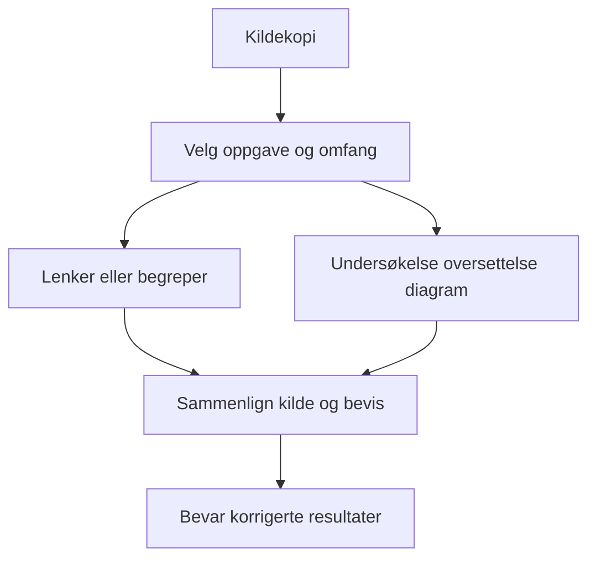

import TLDR from '@site/src/components/TLDR';

# Kunnskapsarbeid med KI i Obsidian

<TLDR>En nyttig metode skiller kilder, modellsvar og egne rettelser. Notemd gir lenker, begreper, undersøkelser, oversettelse og diagrammer som kontrollerbare dokumenter. Begynn med én kilde, vurder resultatet og automatiser deretter en avgrenset mappe.</TLDR>

## Velg resultat

Trenger du lenket notat, begreper, kildeunderbygd oppsummering, oversettelse eller diagram? Flere filer/lenker garanterer ikke forståelse eller gjenfinning. Avklar hvordan du kontrollerer og finner innholdet igjen.

## Hele forløpet


```mermaid
flowchart TD
    A[Kildekopi] --> B[Velg oppgave og omfang]
    B --> C[Lenker eller begreper]
    B --> D[Undersøkelse oversettelse diagram]
    C --> E[Sammenlign kilde og bevis]
    D --> E
    E --> F[Bevar korrigerte resultater]
```

Dette viser mulige oppgaver, ikke alle trinn i én standardknapp. Bevar kilden og se resultatet før du bygger kjeder.

## 1. Lenker: synliggjør relasjoner

Kjør **Process file (add links)** og se `_processed.md` for termer, sitater, kode og formler. Fagområde-/synonyminstruksjoner tvinger ikke fram identitet eller numerisk terskel. Deterministisk matching kan passe bedre for gjentakbare lenker til eksisterende titler. [Lenker](./features/wiki-links).

## 2. Begreper: skill term fra forklaring

Velg mappe. Selvstendig uttrekk bevarer kilde og oppretter titler. For `Linked From` i nye filer: tilbakekoblinger på, minimal form av. **Batch generate from titles** er separat og kan behandle eldre egnede notater. Kontroller complete-flytting og ulike betydninger bak samme navn. [Begreper](./features/concept-notes).

## 3. Undersøkelser: bevar bevis

Velg emne/tittel, Tavily eller DuckDuckGo og **Research & summarize**. Tom Tavily-nøkkel bytter ikke tjeneste. Åpne kilder og kontroller påstander. Valgfri leksikal lokal henting sender utdrag til valgt LLM; lokal indeks gjør ikke ruten frakoblet. [Undersøkelser](./features/research).

## 4. Oversettelse: betydning og struktur

Velg målspråk og oversett filen. Standard `_<language>.md` kan erstatte eksisterende resultat. Bruk midlertidig notat for en passasje. Kontroller termer, tall, kode, lenker og matematikk; oppdeling kan miste kontekst. UI-/nettspråk beviser ikke språkparets kvalitet. [Oversettelse](./features/translation).

## 5. Diagrammer: kilde for videre arbeid

Velg kompatibelt par og bevar kilde samt nødvendig SVG/PNG/PDF. Et bilde beviser ikke at alle relasjoner bevares i annen editor. CircuitikZ har avgrenset støtte og separat kompilering, Drawnix-grenpiler er statiske, og Mermaid/SVG kan være bilder i PPTX. [Diagrammer](./features/diagrams).

## 6. Arbeidsflyter: automatiser prøvde trinn

Navn, `::` og handlinger skilt av `>` definerer kjeden:

```text
One-Click Extract::process-current-add-links>batch-generate-from-titles>batch-mermaid-fix
```

Den inneholder lenker, tittelgenerering og Mermaid-reparasjon, ingen generell undersøkelses-/diagramhandling. Krav og resultater gjelder per trinn. Rapportert feil stopper normalt; fortsettelse krever at senere trinn tåler resterende inndata. Avbrudd fjerner ikke ferdige resultater. [Arbeidsflyter](./features/workflows).

## 7. Leverandører: oppgave og protokoll

36 profiler dekker fem familier. Velg etter adresse, rettigheter, datavilkår og målte resultater. Sammenlign tid/kostnad med samme kilde/instruksjon. Oppgaveruting er av fra start; se alle ruter før lokal behandling antas. [Leverandører](./providers/overview).

## Første kontroller

1. Installer og bevar kildekopier.
2. Konfigurer og test presis modell.
3. Velg begrepsmappe og atskilte mål.
4. Test en kopi.
5. Sammenlign og lagre rettelser.
6. Utvid til liten mappe og se delresultater før lange kjeder.

## Praktiske situasjoner

### Behandle en artikkel

Konverter eksternt til Markdown og se tabeller, formler og figurer. Hent begreper/passasjer, undersøk presise spørsmål og tegn bare etterprøvbare relasjoner. Bevar original og rettelser.

### Vedlikeholde begreper

Bruk separat mappe, vurder termene og generer forklaring for et begrenset utvalg. Ta backup før rydding. Antall erstatter ikke presise definisjoner og nyttig navigasjon.

### Privat materiale

Klargjør lokal server, modeller og avhengigheter. Kontroller ruter og unngå nettundersøkelser ved behov. Se rapporter før deling. En loopbackstandard hindrer ikke ekstern konfigurasjon.

### Gjenoppta batch

Vent på avslutning av feil/avbrudd, se rapport, resultater og gjenoppretting, sammenlign konflikter og gjenta målrettet. Avbrutt betyr ikke tomt; kontroller referanser før følgefiler slettes.

## Neste trinn

- [Hurtigstart](./getting-started/quick-start).
- [Batcher](./advanced/batch-processing).
- [Utviklere](./developers/overview).
- [Agenter](./agents/overview).
