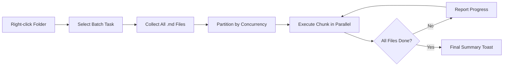

import TLDR from '@site/src/components/TLDR';

# Przetwarzanie partiami

<TLDR>
**Notemd przetwarza całe foldery w jednej operacji z możliwością konfiguracji równoległości i kontroli nad nadpisywaniem.** Kliknij prawym przyciskiem myszy na folder, aby partiami dodać linki wiki, wyekstrahować koncepcje, przeprowadzić badania lub przetłumaczyć wszystkie notatki w nim zawarte. Ograniczenia równoległości zapobiegają błędom związanym z limitem API. Postęp jest raportowany dla każdego pliku. Zachowanie przy nadpisywaniu można skonfigurować: pominąć istniejące, dodać na końcu lub zastąpić. Pliki, które zawiodły, są rejestrowane bez przerywania całej partii.

To jest część [Obsidian Przewodnika po zarządzaniu wiedzą AI](/docs/pillar-ai-knowledge).
</TLDR>

## Przegląd

Przetwarzanie partiami przekształca folder z notatkami w jedną operację. Zamiast otwierać każdą notatkę i wykonywać polecenia osobno, wystarczy kliknąć prawym przyciskiem myszy na folder i wybrać zadanie. Notemd przechodzi przez każdy plik `.md`, stosuje wybraną akcję i raportuje postęp w czasie rzeczywistym.

Ta funkcja jest niezbędna do ekstrakcji wiedzy w całym vault. Po imporcie dziesiątek PDF, na przykład po partiami dodaniu linków, a następnie partiami wyekstrahowaniu koncepcji, graf wiedzy może zostać utworzony w ciągu kilku minut, a nie godzin.

## Jak to działa

### Model wykonywania partiami

1. **Zbieranie plików** -- Notemd przeszukuje docelowy folder rekurencyjnie (lub tylko na poziomie najwyższym, w zależności od ustawień) i zbiera wszystkie pliki `.md`.
2. **Podział równoległości** -- Pliki są dzielone na grupy w zależności od ustawienia `batchConcurrency`. Każda grupa jest wykonywana równolegle; grupy mogą być również wykonywane sekwencyjnie.
3. **Wykonanie** -- Każdy plik jest przetwarzany przy użyciu tej samej logiki co w przypadku pojedynczego pliku. Są respektowane ustawienia dostawcy i modelu dla każdego zadania.
4. **Raportowanie postępu** -- Powiadomienie typu toast aktualizuje się po zakończeniu przetwarzania każdego pliku, pokazując postęp `N / Total`.
5. **Obsługa błędów** -- Jeśli plik zawiedzie (błąd API, timeout sieciowy itp.), błąd jest zapisany, a partia kontynuuje pracę. Ostateczny podsumowanie wymienia wszystkie nieudane pliki.
6. **Zakończenie** -- Podsumowujące powiadomienie typu toast informuje o łącznej liczbie przetworzonych plików, sukcesach i nieudanych próbach.

### Zachowanie nadpisywania

Podczas przetwarzania pliku, który już zawiera linki wiki, notatki koncepcyjne lub tłumaczenia, zachowanie Notemd zależy od ustawienia nadpisywania:

| Tryb | Zachowanie |
|------|----------|
| **Pomijaj** | Istniejąca treść pozostaje nietknięta. Przetwarzane są tylko niezmienione pliki. |
| **Dodawaj na końcu** (domyślnie) | Nowa treść jest dodawana na końcu. Istniejące linki wiki, koncepcje lub tłumaczenia są zachowywane. |
| **Zastępuj** | Plik jest w pełni przetwarzany na nowo. Wszystkie poprzednie modyfikacje Notemd są nadpisywane. |

Jeśli chodzi konkretnie o linki wiki: jeśli notatka już zawiera `[[wiki-links]]`, tryb **Pomijaj** pozostawia ją bez zmian, natomiast **Zastępuj** wysyła całą notatkę do LLM w celu nowego wstawienia linków. Używaj **Pomijaj** do przetwarzania stopniowego oraz **Zastępuj** po aktualizacji modelu.

### Kontrola współbieżności

Ustawienie `batchConcurrency` ogranicza liczba równoległych wywołań API. Zapobiega to błędom limitu przepustowości (HTTP 429) podczas przetwarzania dużych folderów w przypadku dostawców z surowymi limitami.

| Współbieżność | Zalecane dla | Typowy wpływ na limit przepustowości |
|-------------|----------------|---------------------------|
| `1` | Bezpłatne taryfy, rygorystyczni dostawcy | Brak (seria) |
| `3` (domyślny) | Większość dostawców chmurowych | Niski |
| `5` | Ollama (lokalny), hojne taryfy | Brak / Niski |
| `10` | Modele lokalne z szybką inferyencją | Brak |

Jeśli podczas przetwarzania zbiorczego napotkasz błędy 429, zmniejsz jednoczesność do 1 lub 2.

## Konfiguracja

| Ustawienie | Domyślny | Efekt |
|---------|---------|--------|
| `batchConcurrency` | `3` | Maksymalna liczba równoległych wywołań API podczas operacji folderów |
| `batchOverwriteExisting` | `false` | Przepisz istniejący zawartość Notemd. `false` oznacza tryb dodawania. |
| `batchSkipProcessed` | `false` | Pomijaj pliki, które już zawierają znaczniki Notemd (np. linki wiki) |
| `batchRecursive` | `true` | Włącz skanowanie podkatalogów podczas przeglądania folderu |
| `enableStableApiCall` | `false` | Włącz logikę ponawiania prób (do 4 prób) dla każdego pliku w procesie pakietowym |

### Modele dostosowane do zadań w procesie pakietowym

Każda operacja pakietowa wykorzystuje odpowiadający jej model dostosowany do zadań. batch-add-links używa `addLinksProvider`, batch-research używa `researchProvider` itp. Dzięki temu można przydzielić tańsze modele do operacji o dużym obciążeniu i zachować droższe modele dla zadań wymagających wysokiej jakości.

## Przykład

Masz folder `papers/` zawierający 40 zaimportowanych notatek badawczych. Chcesz dodać linki wiki i wyodrębnić koncepcje we wszystkich z nich:

1. Kliknij prawym przyciskiem myszy w folder `papers/`
2. Wybierz **"Notemd: Przetwarzanie folderu (dodawanie linków)"**
3. Notemd skanuje folder, znajduje 40 plików `.md` i przetwarza po 3 z nich jednocześnie (standardowa współdzielenie zasobów)
4. Na pasku postępów pokazuje się: `12/40 files processed...`
5. Po około 3 minutach na pasku podsumowującym pojawia się komunikat: `39 succeeded, 1 failed (API timeout on paper-37.md)`
6. Powtórz działanie za pomocą **"Notemd: Przetwarzanie folderu (wyciąganie koncepcji)"**, aby stworzyć notatki koncepcyjne dla wszystkich 40 plików

Plik, który nie udało się przetworzyć, zostaje zapisany. Możesz później ponownie uruchomić proces tylko dla tego pliku.

## Wskazówki

- **Zacznij od niskiego poziomu współdzielenia zasobów** -- Jeśli nie jesteś pewien co do ograniczeń przepustowości swojego dostawcy, zacznij od `1` i stopniowo je zwiększaj.
- **Użyj trybu pomijania dla aktualizacji inkrementalnych** -- Po pierwszej pełnej partii przełącz się na `batchSkipProcessed: true`, aby w kolejnych uruchomieniach przetwarzane były tylko nowe notatki.
- **Włącz stabilne wywołania API** -- `enableStableApiCall: true` dodaje logikę ponawiania prób, która pomaga odzyskać pracę w przypadku tymczasowych błędów sieciowych podczas długich procesów.
- **Ponownie uruchom po aktualizacjach modelu** -- Jeśli przejdziesz na lepszy model, ustaw `batchOverwriteExisting: true` i uruchom ponownie proces, aby uzyskać lepsze linki i koncepcje.

---

## Kolejne kroki

- [Workflows](/docs/features/workflows) -- Łącz zadania partii w jedno kliknięcie w przyciski na pasku bocznym
- [Custom Prompts](/docs/advanced/custom-prompts) -- Personalizuj polecenia do wydobywania danych w partiach
- [Troubleshooting](/docs/advanced/troubleshooting) -- Naprawia błędy ograniczeń przepustowości i problemy z połączeniem podczas uruchamiania procesów partii
- [LLM Dostawcy](/docs/providers/overview) -- Odniesienie do konfiguracji modelu na zadanie
