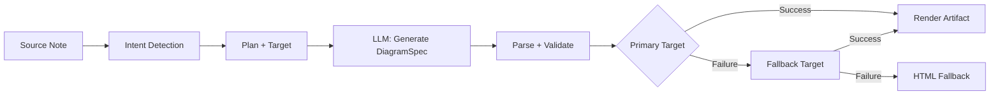
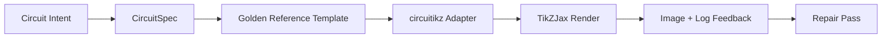

import TLDR from '@site/src/components/TLDR';

# Diagramy

<TLDR>
**Notemd tworzy diagramy z Twoich notatek za pomocą procesu opartego na specyfikacjach.** Sztuczna inteligencja generuje niezależny od konkretnego renderera plik JSON typu `DiagramSpec`, a następnie dedykowane adaptery przekształcają go w formaty Mermaid, JSON Canvas, Vega-Lite, HTML, edytowalny HTML/SVG, Draw.io, Drawnix lub ograniczone diagramy circuitikz. Obsługuje 9 typów zadań, automatyczne łańcuchy awaryjne, żywy przegląd wraz z eksportem do formatów SVG/PNG/PDF, weryfikację semantyczną oraz generowanie wzbogacone o lokalną wiedzę.
</TLDR>

To jest część [Obsidian Przewodnika po zarządzaniu wiedzą AI](/docs/pillar-ai-knowledge).

## Architektura: Pipeline oparty na specyfikacji

Notemd nigdy nie prosi LLM o bezpośrednie wygenerowanie składni Mermaid/Vega/Canvas. Zamiast tego:



**Dlaczego architektura oparta na specyfikacji?** LLM często generuje nieważną składnię renderera (szczególnie Mermaid). Strukturalna `DiagramSpec` może zostać zweryfikowana przed renderowaniem, a ta sama specyfikacja może być użyta jako fallback dla wielu rendererów.

## Obsługiwane typy diagramów

| Intencja | Główny renderer | Fallbacki | Przypadek użycia |
|--------|-----------------|-----------|----------|
| `mindmap` | Mermaid | HTML | Hierarchiczny podział tematów |
| `flowchart` | Mermaid | HTML | Przepływy procesów, drzewa decyzyjne |
| `sequence` | Mermaid | HTML | Interakcje klient-serwer, protokoły |
| `classDiagram` | Mermaid | HTML | Związki klas OOP |
| `erDiagram` | Mermaid | HTML | Schematy bazy danych, relacje między entytetami |
| `stateDiagram` | Mermaid | HTML | Maszyny stanowe, modele życiowego cyklu |
| `canvasMap` | JSON Canvas | Mermaid → HTML | Mapy koncepcyjne, grafy wiedzy |
| `dataChart` | Vega-Lite | Mermaid → HTML | Wykresy słupkowe, liniowe, powierzchniowe, rozproszone, kołowe, tabele |
| `circuit` | circuitikz | none | Ograniczone diagramy obwodów na podstawie zweryfikowanych danych wejściowych typu `CircuitSpec` |

## Rozpoznawanie intencji

Notemd wyznacza najlepszy typ diagramu na podstawie treści notatki przy użyciu oceny słów kluczowych:

| Intencja | Wyzwalacze | Pewność |
|--------|----------|------------|
| `dataChart` | Tabele, komórki liczbowe, słowa kluczowe dotyczące metryk/trendów, procenty | 0.88 |
| `sequence` | Słownictwo żądania/odpowiedzi (4+ dopasowania) lub znaczniki `->`/`=>` | 0.82 |
| `erDiagram` | Klucz główny, klucz obcy, entyteta, schemat (2+ dopasowania) | 0.80 |
| `stateDiagram` | Stan, przejście, w oczekiwaniu, w trakcie, nieudane (3+ dopasowania) | 0.76 |
| `flowchart` | Kroki numerowane (2+) lub słownictwo if/then/else/workflow | 0.74 |
| `canvasMap` | Mapa koncepcyjna, graf wiedzy, przestrzenny, klastry | 0.72 |
| `circuit` | circuitikz, TikZJax, circuit, schematic, CMOS, NMOS, PMOS, MOSFET, VDD/GND, `vin`/`vout` | 0.78 |
| `mindmap` | Domyślny fallback | 0.55 |

Przejąć kontrolę za pomocą ustawienia **Wolany typ diagramu**, selektora z paska bocznego lub wyraźnej opcji palety poleceń.

## Wybór celu renderowania

Eksperymentalny pipeline oparty na specyfikacji ma teraz dwa niezależne elementy sterujące:

| Element sterujący | Ustawienie | Efekt |
|---------|---------|--------|
| Wolany typ diagramu | `preferredDiagramIntent` | Kieruje semantyczną formą generowanego `DiagramSpec` |
| Wolany cel renderowania | `preferredDiagramRenderTarget` | Wybiera narzędzie renderowania dla **Generuj diagram** i **Przeglądaj diagram** |

Ustaw **Preferred render target** na **Auto**, aby zachować domyślną wartość dla planera, lub wybierz bezpośrednio Mermaid, JSON Canvas, Vega-Lite, HTML, Editable HTML/SVG, Draw.io, Drawnix lub Circuitikz. Ta zmiana ma zastosowanie wyłącznie do poleceń generowania plików i przeglądania. Standardowe polecenie **Summarise as Mermaid diagram** pozostaje przywiązane do formatu kompatybilnego z Mermaid, dzięki czemu istniejące procesy oparte na Markdown nie zmieniają ukrycie formatu.

To rozdzielenie ma znaczenie, ponieważ intencja `flowchart` może być teraz renderowana jako Mermaid dla notatek w formacie Markdown, jako HTML jako solidny fallback, jako edytowalny HTML/SVG do dalszej edycji lub jako pliki źródłowe Draw.io/Drawnix wraz z towarzyszącymi obrazami SVG do przeglądania. Intencja `circuit` kieruje na Circuitikz i wymaga zweryfikowanej specyfikacji `CircuitSpec`; nie jest to prośba o dowolny tekst w formacie TikZ.
## Zastosowanie

### Stwórz diagram

1. Otwórz notatkę
2. Uruchom **"Notemd: Stwórz diagram"** z palety poleceń
3. Notemd wykrywa intencję, generuje specyfikację, renderuje i zapisuje artefakt

**Pliki wyjściowe według celu:**

| Cel | Rozszerzenie | Wzorzec nazwy pliku |
|--------|-----------|------------------|
| Mermaid | `.md` | `{note}_summ.md` |
| JSON Canvas | `.canvas` | `{note}_diagram.canvas` |
| Vega-Lite | `.json` | `{note}_diagram.json` |
| HTML | `.html` | `{note}_diagram.html` |
| Edytowalne HTML/SVG | `.html` | `{note}_diagram.html` |
| Draw.io | `.drawio` + `.drawio.svg` + `.drawio.md` | `{note}_diagram.drawio` wraz z towarzyszącymi plikami do przeglądania |
| Drawnix | `.drawnix` + `.drawnix.svg` + `.drawnix.md` | `{note}_diagram.drawnix` wraz z towarzyszącymi plikami do przeglądania |
| Circuitikz | `.tex` + `.tex.svg` + `.tex.md` | `{note}_diagram.tex` wraz z towarzyszącymi plikami do przeglądania |

### Przegląd diagramu

1. Uruchom **"Notemd: Przegląd diagramu"**
2. Otwiera się modala z wyrenderowanym diagramem
3. Eksportuj jako SVG, PNG lub PDF za pomocą przycisków na pasku narzędzi

**Automatyczne otwieranie przeglądu** jest dostępne w ustawieniach — po generacji modala przeglądowa otwiera się automatycznie.

Eksport przeglądów w formatach PNG i PDF wykorzystuje ustawioną rozdzielczość PPI. Domyślna wartość to 300 PPI, a wartości powyżej 600 PPI są ograniczane do 600. Obrazy SVG zachowują rozmiar wektorowy. Pliki źródłowe takie jak `.drawio`, `.drawnix` i `.tex` mogą zawierać plik towarzyszący o nazwie `previewSvg`, dzięki czemu Obsidian może wyświetlać i eksportować obrazy przeznaczone do przeglądania, bez konieczności włączania bibliotek diagram.net, Drawnix, LaTeX czy TikZJax podczas działania wtyczki.

Modal prezentujący wstępny widok posiada również panel diagnostyki artefaktów. Narzędzia renderujące oraz testy wstępne mogą dołączać wartość `RenderArtifact.diagnostics`; modal pokazuje podsumowanie diagnostyczne z liczbami błędów, ostrzeżeń i informacji, a następnie stopień powagi, rodzaj diagnozy, komunikat oraz sugestie naprawy obok widoku prezentacyjnego. To samo podsumowanie jest wyświetlane w wpisach historii uwzględniających diagnostykę, dzięki czemu można porównywać powtarzające się próby renderowania circuitikz bez konieczności otwierania każdego wpisu osobno. W przypadku artefaktów, które posiadają treść źródłową, ale nie mogą zostać wyrenderowane w formie wstępnej ani za pośrednictwem ścieżki iframe HTML, modal teraz korzysta z prezentacji opartej wyłącznie na treści źródłowej zamiast wymuszać użycie pustego iframe. Dzięki temu testy kompilacji/renderowania circuitikz, sprawdzania tokenów tekstowych w SVG, sprawdzania pustych skrínshotów w formacie PNG, raportowanie nakładania się glifów opartych wyłącznie na ścieżkach oraz przyszłe raporty o nakładaniu się mają widoczną interfejs użytkownika, bez konieczności czynienia z TikZJax lub LaTeX silnym wymogiem runtime dla wtyczek ani udawania, że tekst źródłowy jest już zweryfikowanym renderem wizualnym.

### Tryb Legacy Mermaid

Gdy `enableExperimentalDiagramPipeline` jest wyłączone, Notemd wysyła bezpośredni prompt Mermaid do LLM. To całkowicie omija pipeline specyfikacji. Jeśli eksperymentalny pipeline zawiedzie, system przechodzi w ten tryb.

## Backendy renderowania

### Mermaid

6 adapterów (mapa umysłowa, schemat przepływu, sekwencja, ER, klasa, stan) przekształca `DiagramSpec` na składnię Mermaid. Po generacji `mermaid.parse()` waliduje wynik. Jeśli walidacja zawiedzie:

1. **Powtórzenie LLM** — jedna próba z komunikatem błędu Mermaid jako kontekstem
2. **Minimalny fallback** — prosty diagram Mermaid na podstawie identyfikatorów węzłów specyfikacji

**Legacy Mermaid Fixer** automatycznie naprawia powszechne błędy składniowe LLM: normalizację poleceń note, ucieczkę etykiet pipe-label, przestawianie średników, inteligentne cudzysłowy, strzałki z podwójnymi kreskami, niezgodności kształtów i wiele innych.

### JSON Canvas

Tworzy format Obsidian JSON Canvas z układem przestrzennym:
- Węzły umieszczone według głębokości (x = głębokość × 420) oraz indeksu (y = indeks × 170)
- Szerokość obliczana na podstawie długości etykiety
- Krawędzie z `fromSide: 'right'`, `toSide: 'left'`, `toEnd: 'arrow'`

### Vega-Lite

Tworzy kompletną specyfikację Vega-Lite v5 JSON z automatycznym kodowaniem:
- **Wykresy kartezjańskie** (stosowe/liniowe/powierzchniowe/punktowe/rozproszone): kanały x + y oraz kolor dla wielu serii
- **Piec**: theta = y (ilościowy), kolor = x (nominalny)
- **Tabela**: wiersz = x, tekst = y + kolumna = seria

Plagi tematów ciemnego i jasnego są łączone głęboko przed kompilacją.

### HTML

Uniwersalna alternatywa. Samodzielny dokument HTML zawierający:
- Meta‑tagi CSP
- Tryb jasny/ciemny za pomocą `prefers-color-scheme`
- Lokalizowane etykiety UI dla 20 lokalizacji
- Sekcje: hero, struktura (drzewo węzłów), relacje, komentarze, tabele serii danych

### Edytowalne HTML/SVG

Jasny cel graficzny dla pracowni eksportu edytowalnego. Projektuje `DiagramSpec` do deterministycznego `SemanticFigureModel`, a następnie renderuje samodzielny dokument HTML z grupami SVG wewnątrz tekstu, które zawierają adnotacje w stylu Draw.io:

- `data-drawio-type`, `data-drawio-id` i `data-drawio-role` na węzłach semantycznych
- `data-drawio-source` i `data-drawio-target` na krawędziach semantycznych
- stabilne identyfikatory węzłów/krawędzi po normalizacji odstępów i obsłudze kolizji
- brak skryptów, brak zewnętrznych czcionek oraz brak zasobów zdalnych

Ten cel celowo nie jest jeszcze domyślną ścieżką planera. Jest dostępny jako wyraźny cel renderowania, dopóki ścieżka produktu nie udowodni zachowań edycyjnych w rzeczywistych narzędziach.

### Draw.io i Drawnix Granice eksportu

Obecna implementacja utrzymuje obsługę narzędzi stworzonych przez inne firmy na granicy pliku wynikowego, jednocześnie udostępniając wyraźne cele renderowania:

| Cel | Umowa | Zależność w czasie wykonywania |
|--------|----------|--------------------|
| Draw.io | deterministyczny, niespakowany XML typu `mxfile` pochodzący z `SemanticFigureModel`, wraz z plikami SVG/PNG/PDF służącymi do przeglądania | brak takich elementów w czasie działania wtyczki ani w procesie CI |
| Drawnix | minimalny podzbiór JSON w formacie `.drawnix`, wykorzystujący elementy `geometry` oraz `arrow-line`, wraz z plikami SVG/PNG/PDF służącymi do przeglądania | brak takich elementów w czasie działania wtyczki ani w procesie CI |

Ta kompromis jest celowy: Notemd może sprawdzać widoczne etykiety, stabilne ID oraz obsługę podstawowych elementów bez włączania diagram.net Desktop, Drawnix, Plait lub stanu edytora dostępnego tylko w przeglądarce do pluginu.

### circuitikz / TikZJax Kierunek

Schematy obwodów to nie to samo co ogólne schematy przepływu. Poprawną składnią do reprezentacji obwodów elektrycznych jest zazwyczaj **circuitikz**, która jest renderowana w Obsidian za pomocą pluginów takich jak TikZJax. TikZJax może ładować pakiety takie jak `circuitikz`, `pgfplots`, `tikz-cd` i `chemfig`, co czyni go atrakcyjnym narzędziem do notatek z fizyki, elektroniki, chemii i matematyki.

Ryzyko polega na tym, że surowy plik TikZ wygenerowany przez LLM jest kruchy:

- skomplikowana topologia obwodu może być poprawna pod względem elektrycznym, ale trudna do odczytania wizualnie;
- przeplatające się przewody i etykiety mogą sprawić, że poprawny plik netlist stanie się nieprzydatny do notatek studenckich;
- brak wprowadzeń pakietów, błędne punkty mocowania lub nieważne nazwy komponentów mogą uniemożliwić renderowanie;
- informacje zwrotne od narzędzia renderującego pochodzą zazwyczaj na poziomie obrazu, podczas gdy LLM generuje geometrię na poziomie tekstu.

Lepszą architekturą jest traktowanie circuitikz jako ograniczonego celu diagramowania, a nie jako swobodnego promptu:



Model pierwszej klasy powinien opisywać topologię obwodu oraz układ oddzielnie:

| Warstwa | Odpowiedzialność | Przykład |
|-------|----------------|---------|
| Topologia | węzły elektryczne i połączenia komponentów | `VDD -> RD -> drain(M1)`, `source(M1) -> GND` |
| Układ | rozmieszczenie w siatce, orientacja, ścieżki routingu | `M1 at (3,2.2)`, wejście po lewej, wyjście po prawej |
| Styl | pakiet, konwencja napięć, etykiety, ankruty | `\begin{circuitikz}[american voltages]` |
| Walidacja | dziennik kompilacji, brakujące ankruty, sprawdzenia nakładania się/zdjęcia ekranu | TikZJax/Diagnozy LaTeX plus przegląd wizualny |

### Obecny prototyp circuitikz

Notemd obejmuje teraz pierwszy ograniczony prototyp repozytorium dla tej kierunku. Jest celowo offline i związany z szablonem:

```bash
npm run diagram:export-circuitikz -- --input cmos-inverter.json --output cmos-inverter.tex
```

Prototyp wprowadza ograniczoną granicę typu `CircuitSpec` oraz deterministycznego eksporterów dla sześciu rodzin wzorcowych:

W eksperymentalnym pipeline do tworzenia diagramów można teraz również uzyskać ten efekt za pomocą parametru `intent: "circuit"` oraz celu renderowania `circuitikz`. Wygenerowany plik `DiagramSpec` może zawierać element `circuitSpec` wyłącznie w przypadku zamiaru tworzenia diagramów obwodowych. `CircuitikzRenderer` zapisuje ten sam deterministyczny plik źródłowy typu `.tex` i dołącza plik przeglądania w formacie SVG, utworzony na podstawie zweryfikowanej topologii obwodu, co umożliwia przeglądanie w Obsidian oraz eksport plików w formatach SVG/PNG/PDF. Ten plik przeglądania nie jest wynikiem kompilacji LaTeX/TikZJax; rzeczywiste dowody pochodzące od renderera pozostają w postaci wyraźnych poleceń testowych podanych poniżej.

Dla obsługiwanych szablonów wzorcowych, pola `layoutHints.inputSide` oraz `layoutHints.outputSide` pozostają jedynie elementami służącymi do prezentacji. Mogą one zmieniać pozycję portów wejściowych/wyjściowych w sposób deterministyczny, ale nie modyfikują sygnatury topologii ani nie umożliwiają wykonywania kroku naprawczego służącego do przeprowadzenia przełączeń w obwodzie.

| Rodzaj obwodu | Złota referencja | Gwarancja prądu |
|--------------|------------------|-------------------|
| `common-source-amplifier` | `common-source-nmos-v1` | waliduje `VDD -> R_D -> M1.D`, `vin -> M1.G`, `M1.S -> GND` i `M1.D -> vout` przed zapisaniem do LaTeX |
| `cmos-inverter` | `cmos-inverter-v1` | waliduje topologię PMOS-over-NMOS, wejście wspólne bramy, wyjście wspólne drenu, `VDD -> MP.S` i `MN.S -> GND` przed zapisaniem do LaTeX |
| `cmos-buffer` | `cmos-buffer-v1` | waliduje dwa kaskadowe stopnie inwertera, węzeł pośredni `vmid`, przywrócone `vout` oraz wspólne tory VDD/GND przed zapisaniem do LaTeX |
| `cmos-transmission-gate` | `cmos-transmission-gate-v1` | waliduje równoległe urządzenia PMOS/NMOS pomiędzy `vin` a `vout` z komplementarnymi kontrolami `phib` / `phi` przed zapisaniem do LaTeX |
| `cmos-nand2` | `cmos-nand2-v1` | weryfikuje równoległe podciąganie PMOS, szeregowe opuszczanie NMOS, podwójne wejścia `va` / `vb` oraz `vout` przed zapisem do LaTeX |
| `cmos-nor2` | `cmos-nor2-v1` | weryfikuje szeregowe podciąganie PMOS, równoległe opuszczanie NMOS, podwójne wejścia `va` / `vb` oraz `vout` przed zapisem do LaTeX |

Nie jest to ogólny generator kodu TikZ. Nie przyjmuje on dowolnych plików w formacie TikZ, nie kompiluje kodu LaTeX, nie wywołuje TikZJax, nie analizuje ekranówek w czasie działania wtyczki ani nie uruchamia automatycznych procesów naprawczych na podstawie informacji z obrazów. Te funkcje pozostają elementami realizowanymi w późniejszych etapach.

Polecenie Diagramu Przeglądowego może ponownie otworzyć zapisane artefakty źródłowe circuitikz bezpośrednio, gdy rozszerzenie pliku to `.tex` lub `.tikz`, a źródło zawiera `\usepackage{circuitikz}` lub `\begin{circuitikz}`. Ta ścieżka to przegląd tylko źródła typu circuitikz: okno modalne pokazuje źródło, diagnozy, kontrolery kopiowania/zapisu oraz metadane historii, ale nie kompiluje LaTeX ani nie wywołuje TikZJax w trakcie działania wtyczki.

Ten sam przegląd tylko źródła obejmuje teraz zapisane artefakty Draw.io i Drawnix. Pliki `.drawio` są akceptowane, gdy wyglądają jak Draw.io XML (`mxfile` lub `mxGraphModel`), a pliki `.drawnix` są akceptowane, gdy są Drawnix JSON z `type: "drawnix"` i tablicą `elements`. Wtyczka nadal nie włącza diagram.net ani hosta tablicy Drawnix; te przeglądy pokazują źródło, diagnozy oraz historię artefaktów bez potrzeby posiadania wewnętrznego edytora wizualnego.

Aby dokonać naprawy zachowującej topologię, należy przekazać specyfikację przed naprawą jako odniesienie przed przyjęciem kandydata na naprawiony:

```bash
npm run diagram:export-circuitikz -- --input repaired-cmos-inverter.json --topology-reference cmos-inverter.json --output cmos-inverter.tex
```

Zaawansowany mechanizm naprawy wykorzystuje `createCircuitTopologySignature` i `assertCircuitTopologyUnchanged` do porównywania `circuitKind`, `goldenReferenceId`, sieci, identyfikatorów komponentów typów/zakończeń oraz niezorientowanych końcówek połączeń przed wygenerowaniem wyniku. Etykiety, tekst tytułu, wskazówki układu, kolejność połączeń oraz etykiety połączeń są celowo ignorowane. Kandydat, który dodaje krótki element lub przepina zakończenie, zostaje odrzucony z błędem `Circuit topology drift detected` przed zapisaniem pliku `.tex`.

CLI może teraz analizować istniejący log kompilacji LaTeX/TikZJax bez uruchamiania kompilatora:

```bash
npm run diagram:export-circuitikz -- --input cmos-inverter.json --output cmos-inverter.tex --compile-log cmos-inverter.log --diagnostics-output cmos-inverter.diagnostics.json
```

Ta ścieżka diagnostyczna zgłasza brakujące pakiety takie jak `circuitikz.sty`, nieznane klucze TikZ/circuitikz, błędy składni ścieżek TikZ, takie jak brakcyfry, nadmiarowe argumenty wynikające z nierównowagowych nawiasów lub niezamkniętych etykiet, niezdefiniowane sekwencje sterujące, ogólne błędy LaTeX, awarie awaryjne oraz ostrzeżenia o przepełnieniu `\hbox`. Nadal opiera się na logach: lokalna kompilacja LaTeX/TikZJax oraz mechanizmy jakości ekranów zrzutów to nadal osobne zadania na przyszłość.

Dla kontrol sprawności przez administratorów ten sam CLI może opcjonalnie uruchomić wyraźnie skonfigurowanego renderera bez analizy poleceń shell:

```bash
npm run diagram:export-circuitikz -- --input cmos-inverter.json --output cmos-inverter.tex --compile-executable pdflatex --compile-arg -interaction=nonstopmode --compile-arg -halt-on-error --compile-arg -output-directory={outputDir} --compile-arg {tex} --expected-artifact {outputDir}/{jobName}.pdf
```

Uruchamiający kompilację wykorzystuje `shell: false`, rozszerza miejsca zastępcze `{tex}`, `{outputDir}` i `{jobName}` na wartości tablic argumentów, odczytuje wygenerowany `{jobName}.log` i zwraca `compileExecution` wraz z `compileDiagnostics` w wyniku typu CLI JSON. `--compile-executable` to jedynie ścieżka binarna renderera lub wrappera; flagi renderera znajdują się w powtarzanych wartościach `--compile-arg`. Puste pliki wykonywalne są odrzucane jako `compile-executable-invalid`, brakujące binarne pliki jako `compile-executable-not-found`, a łańcuchy wykonywalnych plików w formie poleceń shell otrzymują zalecenia dotyczące dzielenia argumentów, aby Windows, Linux i macOS spełniały ten sam kontrakt bezpośredniego uruchamiania. Za pomocą `--expected-artifact` zgłasza również `compileExecution.renderSmoke` i odrzuca CLI, jeśli renderer nie stworzy niepustego artefaktu. Nadal nie pakuje LaTeX, nie czyni TikZJax zależnością w czasie działania wtyczki ani nie przeprowadza naprawy wizualnej na poziomie ekranów zrzutów.

Jeśli oczekiwany artefakt to `.svg`, kontrola sprawności zagłębia się o jeden poziom głębiej:

```bash
npm run diagram:export-circuitikz -- --input cmos-inverter.json --output cmos-inverter.tex --compile-executable dvisvgm --compile-arg ... --expected-artifact {outputDir}/{jobName}.svg --expected-svg-text v_{in} --expected-svg-text v_{out}
```

SVG sprawdza korzeń `<svg>`, dodatnie wymiary lub `viewBox`, przynajmniej jeden widoczny element rysunku po wykluczeniu elementów ukrytych/przezroczystych, wszystkie żądane tokeny tekstowe, oczywiste elementy poza `viewBox`, oczywiste nakładające się umieszczone etykiety `<text>` / `<tspan>` oraz oczywiste etykiety tekstowe nakładające się na elementy rysunkowe za pomocą `render-svg-label-overlap`. Oczekiwany tekst jest wyszukiwany w widocznym tekście oraz dekodowany z metadanych dostępności takich jak `aria-label`, `<title>` i `<desc>`, więc renderery, które zachowują semantyczne etykiety poza widocznym `<text>`, mogą nadal spełniać kontrolę tokenów tekstowych bez potrzeby OCR. Przejście geometryczne to teraz geometria świadoma transformacji dla typowych atrybutów grup i elementów `transform`, więc przekształcone, skalowane, obrócone, zniekształcone lub przekształcone macierzowo pola SVG są sprawdzane po kompozycji transformacji. Obejmuje to dokładne granice łuków dla ekstremów łuków A/a, dokładne granice krzywych Bezier dla ekstremów krzywych C/S/Q/T, granice SVG uwzględniające grubość linii oraz sprawdzanie nakładania się etykiet, geometrię rysunku `polyline` / `polygon`, a także rozwiązuje umieszczanie glyphów tylko na ścieżce z referencji `<use href="#...">`, tak że etykiety przekształcone w użyteczne ścieżki glyphów mogą nadal zawieść w kontrolach obszaru obrazu, gdy geometria umieszczonego glyphu wykracza poza `viewBox`. Wiele umieszczonych etykiet `tspan` pod jednym rodzicem `<text>` jest porównywanych jako oddzielne pola etykiet, co pozwala wykryć wyniki typu LaTeX SVG, które w przeciwnym razie połączyłyby odrębne etykiety w jeden węzeł tekstowy. Umieszczone pola SVG `text` i `tspan` respektują wartości `text-anchor` `start`, `middle` i `end`, więc etykiety centralizowane i wyrównane w prawo mogą wywołać diagnozy nakładania się tekstu/tekstu oraz etykiet na rysunek bez konieczności używania układu tekstu na poziomie przeglądarki. Ścieżki glyphów tylko definicyjne wewnątrz `<defs>` nie są liczone jako widoczne elementy rysunku, ale ich własne atrybuty lokalne `transform` są stosowane przed umieszczeniem `<use>`, tak że skalowane lub lustrzane definicje glyphów nie są niedoliczane. Sprawdzenie etykiet na rysunek wykorzystuje małą tolerancję pola rysunku oraz deklarowane `stroke-width`, więc cienkie przewody, grube przewody oraz kontury elementów wielokątnych mogą być traktowane jako potencjalne błędy czytelności etykiet, gdy ich widoczna linia osiąga etykietę. Etykiety glyphów tylko na ścieżce rozwiązane z `<use href="#...">` są również porównywane z polami rysunku i zawodzą z błędem `render-svg-path-glyph-overlap`, gdy użyteczna geometria glyphów nakłada się na przewody lub komponenty. Jeśli renderer przekształca etykiety w użyteczne ścieżki glyphów zamiast wyszukiwalnych `<text>` i nie zachowuje metadanych dostępności, raport sprawności rejestruje `pathOnlyGlyphUseCount` i zawodzi żądany token tekstowy poprzez `render-svg-text-path-only` zamiast udawać, że etykieta po prostu nie istnieje. Inne błędy są zgłaszane poprzez `render-svg-invalid`, `render-svg-dimension-missing`, `render-svg-no-visible-elements`, `render-svg-text-missing`, `render-svg-out-of-bounds`, `render-svg-text-overlap`, `render-svg-label-overlap` lub `render-svg-path-glyph-overlap`. Kontrole tokenów tekstowych i nakładania się powinny być traktowane jedynie jako kontrola strukturalna dla rendererów, które zachowują etykiety jako wyszukiwalny tekst SVG lub metadane dostępności; wyniki tylko na ścieżce SVG nadal wymagają późniejszego mechanizmu ekranu zrzutu/OCR, aby udowodnić czytelność wizualną etykiet, a ta kontrola sprawności nadal nie rości sobie prawa do pełnego pokrycia SVG ścieżek.

Ukryte grupy i elementy SVG są konsekwentnie pomijane podczas liczenia widocznych elementów oraz zbierania geometrii. Atrybuty lub styl inline `display:none`, `visibility:hidden`, `visibility:collapse` oraz ogólny `opacity:0` nie mogą sprawić, że inaczej pusty artefakt renderowania przejdzie kontrolę wyjścia widocznego.

Definicje glyphów tylko na ścieżce mogą być bezpośrednimi ścieżkami lub grupami/kontenerami symboli wewnątrz `<defs>`. Kontrola sprawności rozwiązuje geometrię potomnych ścieżek z `<g id="...">` i `<symbol id="...">` przed umieszczeniem `<use>`, więc wygenerowany output glyphów nadal jest dostarczany do `pathOnlyGlyphUseCount`, kontrol obszaru obrazu oraz `render-svg-path-glyph-overlap`.

Parser ścieżek śledzi również początki podścieżek i resetuje aktualny punkt na `Z/z`, więc polecenia względne po zamkniętej podścieżce kontynuują od właściwego punktu SVG zamiast tworzyć fałszywe diagnozy `render-svg-out-of-bounds`.

Ten sam przepływ geometrii stosuje SVG zasadę numeracji dla dziesiętnych liczb z kropką przed miejscem dziesiętnym oraz wyraźnych znaków plusa, dzięki czemu zwięzłe współrzędne dvisvgm takie jak `.5`, `-.5` lub `+.5` pozostają ułamkowe podczas sprawdzania granic, zamiast stawać się fałszywie poza granicami geometrii lub być pomijane.

Jeśli renderer wytwarza `.png`, ten sam oczekiwany ścieżka artefaktu staje się pierwszym zrzutem ekranu do testów: Notemd dekoduje pliki PNG o indeksowanej kolorystyce 1/2/4/8 bitów bez przerw między kadrami, pliki PNG w szarościach 1/2/4/8/16 bitów oraz pliki PNG w szarościach z alfa/kolorami RGB/RGBA 8/16 bitów. Obrazy o indeksowanej kolorystyce i podbajtowej szarości obsługują spakowane próbki; obrazy o indeksowanej kolorystyce obsługują również dane PLTE oraz opcjonalne dane tRNS; obrazy w szarościach/kolorach RGB obsługują przezroczyste próbki tRNS. Próbki bezpośrednie 16-bitowe są normalizowane do tego samego przestrzeni porównawczej 8-bitowej RGBA używanej przy testach dymnych. Test dymny sprawdza dodatnie wymiary, rejestruje granice tła jako `foregroundBounds`, rejestruje gęstość tła wewnątrz tej przestrzeni jako `foregroundDensity`, zawodzi przy `render-png-blank` gdy każdy widoczny piksel odpowiada kolorowi tła w lewym górnym rogu, zawodzi przy `render-png-content-clipped` gdy treść tła dotyka granic obrazu, zawodzi przy `render-png-foreground-too-small` gdy duży zrzut ekranu ma mniej niż cztery piksele tła, oraz zawodzi przy `render-png-foreground-dense` gdy piksele tła są niezwykle gęste wewnątrz niestandardowej przestrzeni ograniczeń. Nieobsługiwane formaty PNG powodują błąd `render-png-unsupported` oraz dostarczają specyficznych wskazówek dotyczących formatów Adam7 z przerwami między kadrami lub nieobsługiwanych głębi kolorów indeksowanych. To pozwala wykryć puste zrzuty ekranu, oczywiste obcięcia obrazu, niedostatecznie wyrenderowane ślady tła, pierwsze błędy związane z przepełnieniem na poziomie pikseli oraz niewłaściwe ustawienia eksportu PNG renderera, bez konieczności dodawania zależności od interfejsu platformowego. Nie jest to jeszcze rozpoznawanie etykiet na poziomie OCR, precyzyjne wykrywanie nakładania się tekstu ani naprawa obrazów z zachowaniem topologii.

Gdy diagnostyka pokazuje nieudane skompilowanie lub wykonywanie testu render-smoke, CLI może również zapisać krótki opis naprawy z zachowaniem topologii:

```bash
npm run diagram:export-circuitikz -- --input cmos-inverter.json --topology-reference cmos-inverter.json --output cmos-inverter.tex --compile-log cmos-inverter.log --repair-brief-output cmos-inverter.repair-brief.json
```

Krótki opis naprawy używa schematu `notemd.circuitikz.repair-brief.v1` i zawiera źródło `CircuitSpec`, podpis topologiczny, diagnostykę kompilacji/renderowania, dozwolone edycje, zabronione edycje topologiczne, kolejne kroki weryfikacji oraz ustrukturyzowany `repairPrompt`. Rola promptu to `topology-preserving-circuitikz-repair`; jego lista `diagnosticFocus` pochodzi z diagnostyki kompilacji/renderowania, a jego wymagania `acceptanceCriteria` wymagają weryfikacji kandydata oraz nowych testów kompilacji i render-smoke. Jest to format przekazywany do późniejszego cyklu naprawy, a nie stwierdzenie, że Notemd już wykonuje autonomiczną naprawę wizualną.

Po stworzeniu kandydata na naprawę, ten sam CLI może go zweryfikować w odniesieniu do opisu przed zapisaniem wyniku:

```bash
npm run diagram:export-circuitikz -- --input repaired-cmos-inverter.json --repair-brief cmos-inverter.repair-brief.json --output repaired-cmos-inverter.tex
```

`--repair-brief` sprawdza podpis topologiczny kandydata z opisu i jest wykluczający względem `--topology-reference`. Przejście tej bramy potwierdza jedynie zachowanie topologii; kandydat nadal wymaga diagnostyki kompilacji oraz testów render-smoke.

Wynik `--repair-brief` zawiera również dowody `repairAcceptance` w schemacie `notemd.circuitikz.repair-acceptance.v1`. Raportuje bramy `topology-signature`, `compile-diagnostics` i `render-smoke` jako `passed`, `failed` lub `missing`; ujawnia `remainingChecks`; oraz utrzymuje `readyForVisualAcceptance` jako fałszywe, dopóki wykonywanie kandydata nie obejmie wszystkich wymaganych dowodów.

Używaj `--repair-acceptance-output` wraz z `--repair-brief`, gdy dowody CI lub wersji wymagają trwałego pliku JSON:

```bash
npm run diagram:export-circuitikz -- --input repaired-cmos-inverter.json --repair-brief cmos-inverter.repair-brief.json --output repaired-cmos-inverter.tex --repair-acceptance-output repaired-cmos-inverter.repair-acceptance.json
```

Dla dowodów wersji lub administratora uruchom każdą obsługiwaną rodzinę złotych przykładów za pomocą narzędzia do wykonywania testów zbiorczych:

```bash
npm run diagram:smoke-circuitikz -- --output-dir docs/export/circuitikz-smoke --compile-executable pdflatex --compile-arg -interaction=nonstopmode --compile-arg -halt-on-error --compile-arg -output-directory={outputDir} --compile-arg {tex} --expected-artifact {outputDir}/{jobName}.pdf
```

Narzędzie to używa `docs/maintainer/fixtures/circuitikz/common-source-nmos-v1.json`, `docs/maintainer/fixtures/circuitikz/cmos-inverter-v1.json`, `docs/maintainer/fixtures/circuitikz/cmos-buffer-v1.json`, `docs/maintainer/fixtures/circuitikz/cmos-transmission-gate-v1.json`, `docs/maintainer/fixtures/circuitikz/cmos-nand2-v1.json` i `docs/maintainer/fixtures/circuitikz/cmos-nor2-v1.json`, wywołuje ten sam bezinterfejsowy ścieżkę eksportera dla każdego przykładu i zwraca zbiorczy raport JSON z danymi `compileExecution` i `compileDiagnostics` dla każdego przykładu. Nadal jest to polecenie administratora, a nie zależność w czasie działania pluginu.

Gdy maszyna administratora nie ma jeszcze skonfigurowanego renderera, uruchom to samo polecenie przykładu bez `--compile-executable` i wyraźnie zapisz bramę środowiskową:

```bash
npm run diagram:smoke-circuitikz -- --output-dir docs/export/circuitikz-smoke --report-output docs/export/circuitikz-smoke/renderer-availability.json
```

Ta ścieżka nadal zapisuje deterministyczne artefakty przykładu `.tex`, ale zwraca `ok: false` z `rendererAvailability.status` ustawionym na `missing-configuration` oraz z diagnozą `compile-executable-invalid`. Traktuj to jedynie jako dowód dostępności renderera; nie jest to kompilacja, test render-smoke ani akceptacja wizualna.

### Kształt złotego wzorca promptu

Dla krótkoterminowego użycia podaj renderowalny złoty wzorzec przed poproszeniem o wariant obwodu. Ograniczony prompt powinien zachować wstęp, skalę współrzędnych, styl ankerów oraz konwencje routingu:

```latex
\usepackage{circuitikz}
\begin{document}
\begin{circuitikz}[american voltages]
\draw
  (3,5) node[vcc]{$V_{DD}$}
  to [R, l=$R_D$] (3,3)
  to [short, *-o] (5,3) node[right]{$v_{out}$}
  (3,3) to [short] (3,2.2)
  node[nmos, anchor=D] (M1) {$M_1$}
  (M1.S) to [short] (3,0.5)
  node[ground]{}
  (M1.G) to [short, -o] (0.8,2.2)
  node[left]{$v_{in}$};
\draw
  (3,0.5) node[below right]{$S$};
\end{circuitikz}
\end{document}
```

Dla inwertera CMOS prompt powinien wymagać wyraźnej topologii oraz ograniczeń układu, a nie tylko „narysuj inwerter CMOS”:

- umieść `VDD` u góry, `GND` u dołu, wejście po lewej stronie, wyjście po prawej stronie;
- Użyj `pmos` powyżej `nmos`, z wspólnymi bramkami i wspólnymi odpływami;
- Zachowaj węzeł wyjściowy przy połączeniu odpływu i oznacz go `*-o`;
- Użyj nazwanych ankerów (`PM1.G`, `NM1.G`, `PM1.D`, `NM1.D`) zamiast współrzędnych wywnioskowanych wizualnie;
- Unikaj przewodów diagonalnych lub krzyżujących się, chyba że jest to konieczne pod względem elektrycznym.

### Bieżący postęp i kolejne etapy

| Powierzchnia | Obecny stan | Kolejny krok |
|------|----------------|-----------|
| Ogólne schematy | Zaimplementowano pipeline oparty na specyfikacji dla Mermaid, JSON Canvas, Vega-Lite, HTML | Kontynuuj rozszerzanie zakresu weryfikacji semantycznej |
| Rysunki edytowalne | Zaimplementowano granice artefaktów `editable-html-svg`, Draw.io XML oraz Drawnix JSON | Dodawaj bardziej złożone prymitywy tylko po tym, jak testy potwierdzą możliwość edycji |
| Obsługa CLI | `npm run diagram:export-artifact` eksportuje edytowalne pliki HTML/SVG, Draw.io, Drawnix, Circuitikz oraz pliki SVG/PNG/PDF jako dowody weryfikacji pochodzące z jednego zweryfikowanego `DiagramSpec` | Dodawanie specyficznych dla celu testów smoke po wprowadzeniu nowych celów |
| circuitikz | `DiagramSpec(intent: "circuit", circuitSpec) -> CircuitikzRenderer -> circuitikz` eksportuje szablony typu golden dla struktur common-source, inwertera CMOS, `cmos-buffer` / `cmos-buffer-v1`, `cmos-transmission-gate` / `cmos-transmission-gate-v1`, `cmos-nand2` / `cmos-nand2-v1` oraz `cmos-nor2` / `cmos-nor2-v1`, udostępnia opcje intencji interfejsu i celu renderowania, zapisuje pliki TeX wraz z prewizjami w formacie SVG/PNG/PDF, weryfikuje topologię przed wygenerowaniem wyniku, analizuje logi kompilacji, może uruchamiać lokalne renderery w sposób wyraźny wraz z flagą `--expected-artifact`, a także zapewnia fallback oparty wyłącznie na źródle oraz widoczność diagnostyk prewizji poprzez `RenderArtifact.diagnostics` i moduł prewizji | Dodanie rozpoznawania etykiet na poziomie OCR dla tekstu wizualnego składającego się wyłącznie z ścieżek, dokładnych sprawdzeń nakładania się na poziomie pikseli, szerszego pokrycia ścieżek SVG tam, gdzie jest to konieczne, automatycznego instalowania lub wykrywania rendererów tylko wtedy, gdy pozostaną one opcjonalne, oraz automatycznego wykonywania napraw zachowujących topologię |
| Integracja TikZJax | Host renderowania kandydatów dla wyświetlania po stronie Obsidian | Utrzymać to jako opcjonalne; nie uczyniać TikZJax obowiązkową zależnością runtime'owej wtyczki |

## Konfiguracja

| Ustawienie | Domyślny | Efekt |
|---------|---------|--------|
| `enableExperimentalDiagramPipeline` | `false` | Przełączanie między podejściem opartym na specyfikacji a starszym Mermaid |
| `experimentalDiagramCompatibilityMode` | `'legacy-mermaid'` | `'legacy-mermaid'` = Mermaid tylko; `'best-fit'` = cele natywne + fallbacki |
| `preferredDiagramIntent` | `undefined` (automatycznie) | Przejęcie automatycznego wykrywania intencji |
| `preferredDiagramRenderTarget` | `undefined` (automatycznie) | Przezbrojenie renderera artefaktów, w tym Draw.io, Drawnix oraz Circuitikz |
| `summarizeToMermaidLanguage` | `'en'` | Język celu dla etykiet diagramu |
| `summarizeToMermaidProvider` / `Model` | DeepSeek | LLM na poziomie zadania dla generowania diagramu |
| `autoMermaidFixAfterGenerate` | (z stałych) | Automatyczne uruchomienie starszego naprawiacza na wyjściu Mermaid |
| `enableLocalKnowledgeForDiagramGeneration` | `false` | Wzbogacanie źródła wiedzą z lokalnego vault |

### Wzbogacanie wiedzą lokalną

Gdy jest włączone, Notemd pobiera odpowiednie fragmenty kontekstu z lokalnej bazy wiedzy twojego sejfu (opartej na MiniSearch) i dodaje je na początek oryginalnego pliku markdown. W instrukcji wzbogacania zaznaczono: "tylko pomocnicza odniesienie; zachowaj podstawową strukturę wierną oryginalnej notatce."

### Tryby kompatybilności

- **`legacy-mermaid`**: Wszystkie intencje są kierowane do Mermaid. Intencje niebędące Mermaid (canvasMap, dataChart) są przymuszane do użycia `flowchart` lub `mindmap`. Brak łańcucha awaryjnego.
- **`best-fit`**: Każda intencja jest kierowana do swojego naturalnego celu. Jeśli główny cel zawiedzie, następuje przejście przez łańcuch awaryjny (np. Vega-Lite → Mermaid → HTML).

## Przegląd i eksport

| Działanie | Metoda |
|--------|--------|
| SVG export | Budownik `mermaid.render()` / `vega.View.toSVG()` / SVG dla Canvas |
| Eksport do PNG | SVG → Obraz → Canvas / rasterizator prezentacyjny przy ustawionej rozdzielczości punktowej → Bufor danych PNG |
| Eksport do PDF | SVG → obraz rasterowy przy ustawionej rozdzielczości punktowej → pojedyncza strona PDF |
| Zapis źródła | Treść surowego artefaktu jest zapisywana z rozszerzeniem specyficznym dla celu |
| Przegląd tylko źródła | Artefakty nieinline z treścią źródłową wyświetlane jako kod wraz z diagnozami, bez renderowania iframe |
| Audyt semantyczny | Mermaid, JSON Canvas, Vega-Lite, edytowalny HTML/SVG, Draw.io, Drawnix oraz ograniczony Circuitikz są sprawdzane przez plik `scripts/diagram-semantic-verification.js` w połączeniu z testami renderera i interfejsu CLI |

**Caching**: RenderCache wykorzystuje deterministyczny klucz JSON od `{spec, target, theme}`. Eliminacja duplikatów w trakcie przetwarzania zapobiega powtarzającym się renderom.

## Wskazówki

- **Zacznij od trybu `best-fit`** — daje on najlepszy wynik wizualny dla każdego typu intencji
- **Używaj potężnych modeli do złożonych diagramów** — schematy przepływu i diagramy ER korzystają z GPT-4o lub Claude
- **Włącz lokalną wiedzę** dla diagramów specyficznych dla danej dziedziny — odpowiedni kontekst vault poprawia dokładność
- **Ustaw `autoMermaidFixAfterGenerate`** — błędy składniowe Mermaid są częste bez niego
- **Narzędzie naprawcze dla starszych wersji jest wszechstronne** — jeśli przeglądanie Mermaid się nie udaje, ręczne uruchomienie polecenia naprawczego często rozwiązuje problem

---

## Kolejne kroki

- 🔗 [Wiki-Links](./wiki-links) — Jak łączyć koncepcje w tekście
- 📝 [Concept Notes](./concept-notes) — Wyodrębnianie koncepcji do materiałów źródłowych diagramów
- 🔍 [Research](./research) — Wzbogacanie diagramów danymi z internetu
