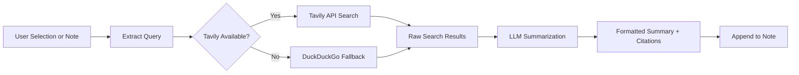

import TLDR from '@site/src/components/TLDR';

# Badania i wyszukiwanie w sieci

<TLDR>
**Notemd przeszukuje internet i wstawia LLM-streszczone wyniki bezpośrednio do twoich notatek.** Tavily API jest głównym silnikiem wyszukiwania; DuckDuckGo pełni rolę fallbacku bez konfiguracji. Wyniki są streszczane z odnośnikami do źródeł i dodawane pod nagłówkiem `## Research`. Dostępna jest funkcja badania pojedynczych notatek, badania folderów pakietowo oraz wybór modelu do kroku streszczania dla poszczególnych zadań.

To jest część [Obsidian Przewodnika po zarządzaniu wiedzą AI](/docs/pillar-ai-knowledge).
</TLDR>

## Przegląd

Badania to jedna z najpotężniejszych integracji Notemd: łączy ona procesy czytania, wyszukiwania i pisania. Zamiast przechodzić do przeglądarki, aby sprawdzić nieznany termin, wystarczy go zaznaczyć i pozwolić Notemd na wyszukiwanie, streszczanie oraz dodawanie wyników – wszystko wewnątrz twojego vault.

Proces jest w pełni konfigurowalny. Możesz wybrać dostawcę wyszukiwania, LLM, które będzie pisać streszczenie, oraz określić, czy wyniki mają być dodawane do aktywnej notatki, czy zapisywane w osobnych plikach. Tryb pakietowy umożliwia badanie wszystkich notatek w folderze jednym kliknięciem.

## Jak to działa

### Przepływ wyszukiwanie-następnie-streszczanie



1. **Wyciąganie zapytań** – Notemd wyodrębnia terminy wyszukiwania z wybranej części tekstu lub tytułu notatki.
2. **Wyszukiwanie w sieci** – najpierw próbuje się użyć Tavily. Jeśli nie jest skonfigurowany klucz API, automatycznie używane jest DuckDuckGo (brak konieczności ustawienia klucza).
3. **Streszczanie LLM** – surowe wyniki wyszukiwania są przesyłane do skonfigurowanego LLM, który tworzy zwięzłe streszczenie z odnośnikami do źródeł.
4. **Dodawanie** – sformatowane streszczenie jest dodawane pod nagłówkiem `## Research` w aktywnej notatce.

### Tavily kontra DuckDuckGo

| Aspekt | Tavily | DuckDuckGo |
|--------|--------|------------|
| Klucz API | Wymagany (dostępna wersja darmowa) | Nie wymagany |
| Jakość wyników | Wyższa (stworzona specjalnie dla AI) | Wystarczająca do zwykłych zapytań |
| Ograniczenia szybkości | Obfita darmowa wersja | Podlega ograniczeniom przepustowości |
| Konfiguracja | `tavilyApiKey` w ustawieniach | Brak konfiguracji – automatyczne przejście na alternatywę |

### Badanie folderów partiami

Kliknij prawym przyciskiem myszy na folder i wybierz **"Notemd: Folder badawczy"**. Każdy plik `.md` w folderze jest przetwarzany kolejno (lub równolegle do ustalonej liczby wątków). Każda notatka otrzymuje własny podsumowanie wyników badań.

## Konfiguracja

| Ustawienie | Domyślny | Efekt |
|---------|---------|--------|
| `tavilyApiKey` | `''` | Klucz Tavily API. Gdy jest pusty, używany jest wyłącznie DuckDuckGo. |
| `researchProvider` / `researchModel` | DeepSeek | LLM na zadanie do podsumowywania wyników wyszukiwania |
| `maxResearchContentTokens` | `4000` | Budżet tokenów dla treści wysyłanych do LLM. Nadmiar jest skracany. |
| `researchAppendToNote` | `true` | Dodaj podsumowanie do oryginalnej notatki. Jeśli wartość to false, tworzy się oddzielny plik. |
| `researchLanguage` | `'en'` | Język wyjściowy dla podsumowanego wyniku badań |

### Rekomendacja modelu na zadanie

Badania czerpią korzyści z modelu, który radzi sobie z treściami wielojęzycznymi i tworzy dobrze ustrukturyzowany tekst. Rozważmy następujące opcje:

- **DeepSeek** -- standardowy, tani, dobra jakość
- **GPT-4o** -- lepsza jakość podsumowań, wyższy koszt
- **Gemini Flash** -- szybki i niedrogi, odpowiedni do prostych zapytań

## Przykład

Czytasz artykuł na temat *mechanizmów uwagi transformer* i napotykasz nieznany termin: *relative positional encoding*. Zamiast pozostawić Obsidian:

1. Zaznacz **"relative positional encoding"**
2. Kliknij prawym przyciskiem myszy --> **"Notemd: Badania i podsumowanie"**
3. Notemd wyszukuje w internecie, podsumowuje najlepsze wyniki i dodaje:

```markdown
## Research

### Relative Positional Encoding

Relative positional encoding is a method used in transformer models
where positional information is expressed as relative distances between
tokens rather than absolute positions. Introduced by Shaw et al. (2018),
it improves generalization to unseen sequence lengths compared to
absolute encodings (Vaswani et al., 2017).

Sources:
- [Shaw et al., Self-Attention with Relative Position Representations (2018)](https://arxiv.org/abs/1803.02155)
- [Transformer Positional Encoding Overview](https://example.com/transformer-pos-enc)
```

Podsumowanie staje się teraz częścią twojej bazy danych, dostępną do wyszukiwania, łączenia i korzystania offline.

## Wskazówki

- **Ustaw klucz Tavily dla lepszych wyników** -- nawet wersja darmowa zapewnia lepszą trafność niż surowe DuckDuckGo.
- **Użyj wydajnego modelu do podsumowywania** -- tanie modele mogą uproszczać złożone treści techniczne.
- **Przeprowadź badania grupowe** po wstępnym przeczytaniu, aby jednocześnie uzupełnić luki w wielu notatkach.
- **Sprawdź dodane podsumowania** -- LLM może tworzyć fałszywe informacje o źródłach. Sprawdź kluczowe twierdzenia.

---

## Kolejne kroki

- [Notatki konceptualne](./concept-notes) -- Wyodrębnij i przechowaj kluczowe terminy z wyników badań
- [Linki wiki](./wiki-links) -- Łącz koncepcje pochodzące z badań w całej twojej bazie danych
- [Tłumaczenie](./translation) -- Tłumacz podsumowania badań na inny język
- [LLM Dostawcy](/docs/providers/overview) -- Konfiguruj model używany do streszczania
