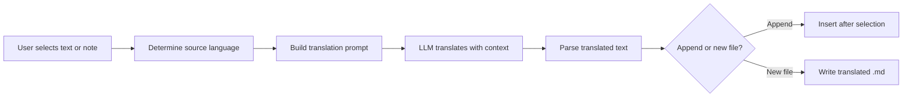

import TLDR from '@site/src/components/TLDR';

# Tłumaczenie

<TLDR>
**Notemd tłumaczy tekst pomiędzy 21+ językami przy użyciu tłumaczenia napędzanego przez LLM.** Obsługuje tłumaczenie pojedynczych wybranych fragmentów, całych notatek oraz folderów w pakiecie. Każde zadanie tłumaczeniowe może korzystać z dedykowanego dostawcy i modelu poprzez ustawienia specyficzne dla tego zadania. Język wyjściowy można niezależnie skonfigurować od języka UI. Wyniki są dodawane poniżej oryginału lub zapisywane w nowym pliku w zależności od Twoich preferencji.

To jest część [Obsidian Przewodnika po zarządzaniu wiedzą AI](/docs/pillar-ai-knowledge).
</TLDR>

## Przegląd

Tłumaczenie w Notemd nie polega na wyszukiwaniu w słowniku – jest to tłumaczenie napędzane przez LLM i uwzględniające kontekst. Model widzi cały akapit lub notatkę, zachowując ton, terminologię specjalistyczną oraz strukturę zdań. Dzięki temu uzyskuje się wyniki o wyższej jakości w porównaniu z usługami tłumaczącymi frazę po frazie, szczególnie przy tekście technicznym, akademickim i twórczym.

Funkcja ta obsługuje trzy zakresy: wybrane fragmenty, aktywną notatkę oraz cały folder. W połączeniu z możliwością wyboru modelu dla każdego zadania można użyć szybkiego modelu (Gemini Flash) do casualowego tłumaczenia oraz potężnego modelu (Claude Sonnet) do treści wymagających precyzyjnego oddania niuansów – bez konieczności zmiany globalnego dostawcy.

## Jak to działa

### Polecenie Translate



1. **Wykrywanie źródła** – LLM wywnioskowuje język źródłowy na podstawie treści. Nie musisz go ręcznie określać.
2. **Konstruowanie promptu** – Notemd tworzy prompt, który zawiera język docelowy, opcjonalną wskazówkę dotyczącą dziedziny oraz treść do tłumaczenia.
3. **Tłumaczenie LLM** – skonfigurowany `translateProvider` / `translateModel` przetwarza żądanie. Model zachowuje formatowanie markdown, linki wiki oraz bloki kodu.
4. **Wynik** – przetłumaczony tekst jest albo dodawany poniżej oryginału, albo zapisywany w nowym pliku w chmurze.

### Pary językowe

Notemd obsługuje każdą parę językową, którą obsługuje podstawowy LLM. Powszechne pary to:

| Źródło | Cel | Typowa jakość |
|--------|--------|----------------|
| Angielski | Chiński uproszczony | Doskonała |
| Chiński | Angielski | Doskonały |
| Angielski | Japoński | Bardzo dobry |
| Angielski | Niemiecki / Francuski / Hiszpański | Bardzo dobry |
| Jakikolwiek obsługiwany | Jakikolwiek obsługiwany | Zależne od modelu |

Ustawienie `translateLanguage` kontroluje **język wyjściowy**. Język źródłowy jest automatycznie wykrywany.

### Wybór modelu na zasadzie zadania

Jakość tłumaczenia znacznie się różni w zależności od modelu. Notemd umożliwia przypisanie dedykowanego modelu wyłącznie do tłumaczeń:

| Model | Szybkość | Jakość | Koszt | Dla kogo |
|-------|-------|--------|------|----------|
| `gemini-2.0-flash-exp` | Szybki | Dobry | Niski | Casual, wysoka objętość |
| `gpt-4o-mini` | Szybki | Dobry | Niski | Szybkie wyszukiwania |
| `deepseek-chat` | Średni | Dobry | Bardzo niski | Budżetowy, wielojęzyczny |
| `claude-3-5-sonnet` | Średni | Doskonały | Średni | Techniczny / akademicki |
| `gpt-4o` | Średni | Doskonały | Średni | Proza wrażliwa na niuanse |

### Tłumaczenie folderów partiami

Kliknij prawym przyciskiem myszy na folder i wybierz **"Notemd: Tłumaczyć folder"**, aby przetłumaczyć wszystkie notatki w tym folderze. Każdy plik jest przetwarzany niezależnie. Ustawienie równoległości kontroluje, ile plików jest tłumaczonych jednocześnie.

## Konfiguracja

| Ustawienie | Domyślny | Efekt |
|---------|---------|--------|
| `translateProvider` / `translateModel` | DeepSeek | Dedykowany dostawca do zadań tłumaczeniowych |
| `translateLanguage` | `'en'` | Język docelowy |
| `translationAppendToNote` | `true` | Dodaj tłumaczony tekst poniżej oryginału. Jeśli wartość to false, zostanie utworzony nowy plik. |
| `batchConcurrency` | `3` | Liczba plików przetwarzanych równolegle podczas tłumaczenia partiami |

## Przykład

Czytasz chińską notatkę badawczą i chcesz jej wersję w języku angielskim:

1. Otwórz notatkę
2. Kliknij prawym przyciskiem --> **"Notemd: Tłumaczyć bieżący plik"**
3. Notemd rozpoznaje chiński, tłumaczy go na ustawiony język docelowy (angielski) i dodaje:

```markdown
## Translation (English)

The experimental results show that the proposed method achieves
a 12% improvement in F1 score compared to the baseline, primarily
due to the enhanced feature extraction module described in Section 3.
```

Oryginalny tekst w języku chińskim pozostaje nietknięty powyżej tłumaczenia. Nagłówek `## Translation` umożliwia przechowywanie obu wersji w tym samym pliku dla łatwiejszego odniesienia.

## Wskazówki

- **Użyj Gemini Flash do dużych ilości** -- jest to najszybsza i najtańsza opcja do tłumaczenia partiami dużych folderów.
- **Zachowaj linki wiki** -- instrukcja Notemd nakazuje LLM zachować `[[wiki-links]]` w niezmienionej formie podczas tłumaczenia. Sprawdź wynik po tłumaczeniu, ponieważ niektóre modele czasami je rozbierają.
- **Jasno określ język wyjściowy** -- automatyczne wykrywanie działa w przypadku tekstu źródłowego, ale zawsze konfiguruj `translateLanguage`, aby uniknąć niejasności co do języka docelowego.
- **Tłumacz grupowo notatki koncepcyjne** -- jeśli folder z koncepcjami jest w jednym języku, a potrzebujesz go w innym, tłumaczenie na poziomie folderu załatwia to w jednym kroku.

---

## Kolejne kroki

- [Badania](./research) -- Szukaj i podsumowuj w dowolnym języku, a następnie tłumacz wyniki
- [Przepływy pracy](./workflows) -- Łącz tłumaczenie z linkami wiki lub wyodrębnianiem koncepcji
- [Przetwarzanie grupowe](/docs/advanced/batch-processing) -- Funkcje równoległości i zachowanie nadpisywania przy operacjach na folderach
- [LLM Dostawcy](/docs/providers/overview) -- Wybierz najlepszy model dla swojej pary języków
