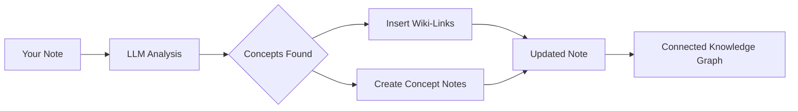

import TLDR from '@site/src/components/TLDR';

# Wiki-Linki

<TLDR>
**Notemd automatycznie dodaje `[[wiki-links]]` do kluczowych pojęć w twoich notatkach.** LLM czyta twój treść, identyfikuje ważne terminy w kontekście i wstawia linki wiki w stylu Obsidian przy każdym wystąpieniu. Opcjonalnie tworzy pliki notatek konceptualnych z odnośnikami zwrotnymi. Obsługuje tłumienie synonimów, zachowanie integralności linków przy przemianowaniu/usunięciu oraz tryb czystej ekstrakcji (bez modyfikacji plików). W odróżnieniu od Auto Link, który dopasowuje się tylko do istniejących tytułów notatek, Notemd wykorzystuje AI do identyfikacji nowych pojęć i tworzenia odpowiadających im notatek. Jest to część [Obsidian Przewodnika AI w zarządzaniu wiedzą](/docs/pillar-ai-knowledge).
</TLDR>

## Przegląd

Tworzenie linków wiki jest podstawową funkcją Notemd. Przekształca ono zwykły tekst w połączoną grafę wiedzy poprzez:

1. **Analizowanie twojej notatki** za pomocą LLM
2. **Identyfikację kluczowych pojęć** (terminów, osób, metod, teorii)
3. **Wstawianie `[[wiki-links]]`** przy każdym wystąpieniu
4. **Tworzenie notatek konceptualnych** (opcjonalnie) z odnośnikami zwrotnymi

## Jak to działa

### Proces



### Przykład

**Przed:**
```markdown
Machine learning models use neural networks to learn patterns from data.
The transformer architecture revolutionized natural language processing.
```

**Po:**
```markdown
[[Machine learning]] models use [[neural networks]] to learn patterns from data.
The [[transformer architecture]] revolutionized [[natural language processing]].
```

## Zastosowanie

### Podstawowe: Dodanie linków do obecnej notatki

1. Otwórz notatkę
2. Kliknij prawym przyciskiem myszy w edytorze → **"Przetworzyć plik (dodaj linki)"**
3. Poczekaj kilka sekund
4. Teraz pojęcia są ze sobą powiązane!

### Partia: Przetwarzanie wielu notatek

1. Kliknij prawym przyciskiem myszy folder w przeglądarce plików
2. Wybierz **"Notemd: Przetwarzanie folderu (dodawanie linków)"**
3. Konfiguracja:
   - Zadziałanie równoległe (ile plików jednocześnie)
   - Przepisanie istniejących linków (tak/nie)
4. Kliknij **Przetworzyć**

### Selektywne: Łączenie określonego tekstu

1. Wyróżnij tekst do przetworzenia
2. Kliknij prawym przyciskiem → **"Przetworzyć wybrany fragment (dodaj linki)"**
3. Analizowana jest tylko wyróżniona część

## Notemd kontra Auto Link

Obsidian ma dwa podejścia do automatycznego tworzenia linków wiki:

| | **Auto Link** | **Notemd** |
|--|---------------|-------------|
| Źródło linku | Tytuły istniejących notatek w sejfie | Koncepcje zidentyfikowane przez LLM w treści |
| Możliwość tworzenia powiązań nowych pojęć | Nie — tytuł musi już istnieć | Tak — AI identyfikuje pojęcia i tworzy notatki |
| Obsługa synonimów | Nie | Tak — tłumienie synonimów |
| Tworzenie notatki pojęciowej | Nie | Tak — z powiązaniami zwrotnymi i usuwaniem duplikatów |
| Przetwarzanie partiami | Nie (jeden plik) | Tak (na poziomie folderu) |
| Kierowanie modelem według zadania | Nie | Tak |

**Auto Link** polega na dopasowywaniu do tytułu: jeśli istnieje notatka o nazwie "Machine Learning", otacza ona wystąpienia w `[[Machine Learning]]`. Jeśli takiej notatki nie ma, nic się nie dzieje.

**Notemd** jest sterowane przez AI: LLM czyta twój treść, rozumie kontekst, identyfikuje pojęcia, które *powinny* być powiązane — nawet jeśli jeszcze nie ma notatki — i tworzy zarówno powiązanie, jak i notatkę pojęciową.

## Funkcje

### Tłumienie synonimów

**Problem:** "transformer", "transformers", "Transformer architecture" → 3 oddzielne pojęcia

**Rozwiązanie:** Notemd wykrywa niemal identyczne elementy i używa formy kanonicznej.

**Konfiguracja:**
```
Settings → Advanced → Synonym Suppression
Threshold: 0.8 (0 = off, 1 = aggressive)
```

### Integritet linków

**Gdy przemieniasz notatkę koncepcyjną:**
- Wszystkie linki wiki są automatycznie aktualizowane (Obsidian podstawowa funkcja)
- Linki zwrotne pozostają nienaruszone

**Gdy usuwasz notatkę koncepcyjną:**
- Linki pozostają, ale wyświetlają się jako "niepowiązane wzmianki"
- Można ją odtworzyć z dowolnego wystąpienia

### Tryb czystego wydobywania

**Wydobywanie koncepcji bez modyfikacji oryginału:**

1. Kliknij prawym przyciskiem → **"Wydobyj koncepcje (bez łączeń)"**
2. Tworzone są notatki koncepcyjne
3. Oryginalny plik pozostaje nietknięty

Przypadek użycia: przetwarzanie treści tylko do odczytu lub wersji końcowych.

## Generowanie notatek koncepcyjnych

### Automatyczne tworzenie

**Gdy jest włączone (domyślnie), Notemd tworzy:**

```markdown
---
tags: [concept, auto-generated]
created: 2026-06-13
source: [[Original Note Name]]
---

# Machine Learning

A branch of artificial intelligence that enables computers
to learn from data without explicit programming.

## Occurrences in Your Vault

- [[Original Note Name#Section]]
- [[Another Note#Header]]

## Related Concepts

- [[Neural Networks]]
- [[Deep Learning]]
- [[Supervised Learning]]
```

### Konfiguracja

**Katalog wyjściowy:**
```
Settings → Output → Concept Folder
Default: concepts/
```

**Struktura hierarchiczna:**
```
Settings → Output → Use Hierarchical Folders
If enabled:
  papers/my-paper.md → papers/concepts/Concept.md
If disabled:
  → concepts/Concept.md
```

**Szablon:**
```
Settings → Output → Concept Template
Customize with variables:
  {{concept}} — Concept name
  {{description}} — LLM-generated description
  {{backlinks}} — List of source notes
  {{date}} — Creation date
```

## Opcje zaawansowane

### Okno kontekstowe

**Ile tekstu otoczenia wysłać:**

```
Settings → Linking → Context Window
Options: Sentence | Paragraph | Full Note
Default: Paragraph
```

Większa wartość = lepsza dokładność, wyższy koszt.

### Minimum wystąpień

**Tylko łącz koncepcje, które pojawiają się kilka razy:**

```
Settings → Linking → Min Occurrences
Default: 1 (link all)
```

Ustaw na 2 lub 3, aby skupić się na powtarzających się tematach.

### Wykluczenie wzorców

**Pomijaj określone słowa:**

```
Settings → Linking → Exclude List
Example: note, idea, example, thing
```

Zapobiega nadmiernemu łączeniu terminów ogólnych.

### Własne prompty

**Przezwyciężenie domyślnych instrukcji LLM:**

```
Settings → Advanced → Custom Linking Prompt
Default:
  "Identify key concepts, theories, methods, and technical
   terms in the following text. Return as a list..."
```

Zmodyfikuj je pod potrzeby konkretnego dziedziny (np. "Skup się na terminologii medycznej").

## Wskazówki i najlepsze praktyki

### ✅ RÓB

- **Przetwarzaj notatki o długości powyżej 100 słów** — Krótkie notatki zawierają niewiele koncepcji
- **Używaj potężnych modeli** do lepszej identyfikacji koncepcji (GPT-4o, Claude)
- **Sprawdzaj przed przyjęciem** — Upewnij się, że proponowane linki są sensowne
- **Buduj iteracyjnie** — Przetwarzaj 5-10 notatek, sprawdź graf, dostosuj ustawienia

### ❌ UNIKAJ

- **Zbyt wiele linków** — Nie każde rzeczownik musi mieć link
- **Przetwarzaj szkice wielokrotnie** — Koncepcje mogą się zmieniać, poczekaj aż staną się stabilne
- **Ignoruj synonimy** — Włącz funkcję tłumaczenia, aby uniknąć różnic między „ML” a „Machine Learning”

## Wydajność

### Szybkość

| Rozmiar notatki | GPT-4o-mini | Claude Sonnet | Ollama (lokalnie) |
|-----------|-------------|---------------|----------------|
| 500 słów | 2-3 sekundy | 3-5 sekundy | 5-10 sekund |
| 2000 słów | 5-8 sekund | 10-15 sekund | 20-40 sekund |
| 5000+ słów | Podzielone na części (wiele wywołań) | Podzielone | Podzielone |

### Oszacowanie kosztu

**Przykład: notatka o 1000 słowach z GPT-4o-mini**
- Wejście: ~1500 tokenów
- Wyjście: ~200 tokenów
- Koszt: ~0,001 USD

**Przetwarzanie partiami 100 notatek:** ~0,10 USD

## Rozwiązywanie problemów

### Żadne linki nie zostały dodane

**Sprawdzenie:**
1. LLM wywołanie zakończyło się pomyślnie (Ustawienia → Diagnostyka)
2. Notatka zawiera wystarczającą ilość treści (>50 słów)
3. Koncepcje są techniczne/specyficzne (a nie tylko zaimki)

**Spróbuj:**
- Użyj silniejszego modelu
- Zwiększ okno kontekstowe
- Sprawdź ważność klucza API

### Zbyt wiele linków

**Rozwiązania:**
1. Zwiększ minimalną liczbę wystąpień (2 lub 3)
2. Dodaj słowa powszechne do listy do wykluczenia
3. Użyj mniej agresywnego modelu

### Błędnie powiązane koncepcje

**Poprawki:**
1. Użyj własnego promptu dla specyfiki domeny
2. Włącz tłumienie synonimów
3. Przeglądaj ręcznie i usuwaj powiązania

### Linki przestają działać po przemianowaniu

**To jest normalne Obsidian zachowanie.**

Aby zaktualizować wszystkie linki:
1. Przemień nazwę notatki koncepcyjnej
2. Obsidian automatycznie aktualizuje `[[old]]` → `[[new]]`

---

## Kolejne kroki

- 📖 [Notatki koncepcyjne](./concept-notes) — Szczegółowe omówienie tworzenia notatek koncepcyjnych
- 🔍 [Integracja z badaniami](./research) — Łączenie powiązań z badaniami internetowymi
- 🎨 [Diagramy](./diagrams) — Wizualizacja twojej grafy wiedzy
