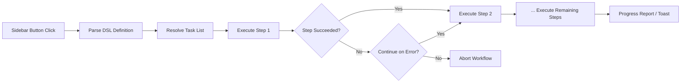

import TLDR from '@site/src/components/TLDR';

# Prace zlecone

<TLDR>
**Notemd Prace zlecone łączą wiele zadań w jedną akcję jednym kliknięciem.** Można definiować sekwencje takie jak `add-links > extract-concepts > research > diagram` przy użyciu prostego DSL. Prace zlecone pojawiają się jako przyciski na pasku bocznym, które uruchamiają cały łańcuch w aktualnej notatce lub folderze. Oprogramowanie zawiera już przygotowane prace zlecone; można tworzyć własne w ustawieniach. Każdy krok wykorzystuje własną konfigurację modelu dostosowaną do danego zadania.

To jest część [Obsidian Przewodnika po zarządzaniu wiedzą AI](/docs/pillar-ai-knowledge).
</TLDR>

## Przegląd

Praca zlecona eliminuje konieczność wykonywania zadań pojedynczo. Zamiast czterokrotnie kliknąć prawym przyciskiem myszy, aby dodać linki, wydobywać koncepcje, szukać nieznanych terminów i generować diagram, wystarczy nacisnąć jeden przycisk na pasku bocznym, a cały łańcuch zostanie uruchomiony. Notemd zajmuje się sekwencjonowaniem, przenoszeniem błędów i raportowaniem postępów.

Prace zlecone są definiowane w lekkim DSL (języku specjalistycznym dla danej dziedziny). Znajdują się w ustawieniach, pojawiają się jako przyciski klikalne na pasku bocznym Obsidian i mogą być zastosowane zarówno do aktualnej notatki, jak i do całego folderu.

## Jak to działa

### Łańcuch wykonywania prac zleconych



1. **Analiza** -- Ciąg DSL jest dzielony na `>` (lub `>`) na uporządkowaną listę identyfikatorów zadań.
2. **Mapowanie** -- Każdy identyfikator odpowiada wewnętrznemu poleceniu (add-links, extract-concepts, research, translate, diagram itp.).
3. **Wykonanie** -- Kroki są wykonywane kolejno. Każdy krok korzysta z skonfigurowanego dostawcy i modelu odpowiedniego dla danego zadania.
4. **Obsługa błędów** -- Jeśli jakiś krok się nie powiedzie, praca zlecona albo zostaje przerwana, albo kontynuuje do następnego kroku, w zależności od ustalonej polityki obsługi błędów.
5. **Zakończenie** -- Powiadomienie typu toast informuje o sukcesie lub wymienia wszystkie nieudane kroki.

### Format DSL

Prace zlecone są definiowane jako sekwencja identyfikatorów zadań oddzielona `>`:

```
process-current-add-links>extract-concepts-current>research-and-summarize
```

**Dostępne identyfikatory zadań:**

| Identyfikator | Działanie |
|------------|--------|
| `process-current-add-links` | Dodaj linki wiki do aktywnej notatki |
| `extract-concepts-current` | Wyciągnij koncepcje z aktywnej notatki |
| `research-and-summarize` | Przeprowadź badania nad wybranym tekstem lub tytułem notatki |
| `process-current-translate` | Przetłumacz aktywną notatkę |
| `summarize-to-mermaid` | Stwórz diagram na podstawie aktywnej notatki |
| `generate-from-title` | Wygeneruj treść na podstawie tytułu notatki |
| `extract-original-text` | Wyciągnij oryginalny tekst (dla OCR / zeskanowanego treści) |

**Warianty na poziomie folderu** – zastąp `current` przez `folder` w nazwie identyfikatora.

### Przepisywanie zdefiniowane vs. dostosowane

Notemd zawiera gotowe przepisywania dla częstych wzorców:

| Przepisywanie | Łańcuch | Przypadek użycia |
|----------|-------|----------|
| **Wyciąganie jednym kliknięciem** | add-links > extract-concepts > research | Przetwarzaj artykuł naukowy w jednej rundzie |
| **Pełny pipeline** | add-links > extract-concepty > research > diagram | Kompletne wydobywanie wiedzy z wizualizacją |
| **Tłumacz + Łącz** | tłumacz > add-links | Tłumacz i następnie łącz koncepcje w języku docelowym |

**Zaawansowane schematy pracy** są tworzone w ustawieniach:

1. Otwórz **Ustawienia** --> **Notemd** --> **Schematy pracy**
2. Kliknij **"Dodaj schemat pracy"**
3. Wpisz łańcuch DSL (np. `process-current-add-links>extract-concepts-current`)
4. Podaj nazwę wyświetlania (np. "Szybkie połączenie + Wydobywanie")
5. Nowy przycisk pojawia się natychmiast na pasku bocznym

## Konfiguracja

| Ustawienie | Domyślny | Efekt |
|---------|---------|--------|
| `workflows` | Zaawansowana lista | Tablica definicji schematów pracy (nazwa + DSL) |
| `workflowContinueOnError` | `true` | Przejdź do następnego kroku, jeśli obecny nie powiedzie się |
| `workflowShowProgress` | `true` | Pokaż komunikat postępu po zakończeniu każdego kroku |

### Modele na poziomie zadań w schematach pracy

Każdy krok w procesie pracy wykorzystuje swoją **własną** konfigurację modelu na poziomie zadania. Nie musisz określać modeli bezpośrednio w DSL. Kolejność rozwiązywania problemów jest następująca:

1. Dostawca/model na poziomie zadania, jeśli `useMultiModelSettings` jest dostępny
2. `activeProvider` globalny w przeciwnym razie

To oznacza, że `add-links` może działać na DeepSeek, podczas gdy `research` działa na GPT-4o – wszystko to w ramach tego samego procesu pracy.

## Przykład

Właśnie zaimportowałeś PDF artykułu z dziedziny sztucznej inteligencji do swojego sejfu i chcesz uzyskać pełne wydobywanie wiedzy:

1. Otwórz zaimportowaną notatkę
2. Kliknij przycisk **"Pełny pipeline"** na pasku bocznym
3. Notemd uruchamia następujące kroki:
   - **Krok 1**: Dodaj linki wiki – `[[attention mechanism]]`, `[[transformer]]` itp.
   - **Krok 2**: Wydobyj koncepcje – tworzy notatki koncepcyjne w folderze koncepcji
   - **Krok 3**: Badania – podsumowuje źródła internetowe dotyczące kluczowych terminów
   - **Krok 4**: Diagram – generuje Mermaid mapę myśli przedstawiającą strukturę artykułu
4. Po około 30 sekundach twoja notatka zawiera linki, istnieją notatki koncepcyjne, dodano wyniki badań i zapisano plik z diagramem

Wszystko to przy jednym kliknięciu.

## Wskazówki

- **Zacznij od z góry zdefiniowanych procesów pracy** – obejmują one najczęstsze wzorce. Personalizuj je tylko wtedy, gdy potrzebujesz innej sekwencji.
- **Włącz `workflowContinueOnError`** – nieudany krok tworzenia diagramu nie powinien przerywać całego pipeline.
- **Użyj pracowników folderowych** do przetwarzania masowego – kliknij prawym przyciskiem myszy na folder, wybierz pracownika i każda notatka zostanie przetworzona.
- **Nazwij pracowników jasno** – przestrzeń w pasku bocznym jest ograniczona. Używaj krótkich, orientowanych na działanie nazw takich jak "Szybkie wydobycie" lub "Tłumaczenie + link".

---

## Kolejne kroki

- [Badania](./research) – Zrozum, co robi krok badawczy, zanim dodasz go do pracowników
- [Linki wiki](./wiki-links) – Podstawowa funkcja łączenia używana w większości pracowników
- [Notatki koncepcyjne](./concept-notes) – Wyodrębnianie koncepcji jako krok w pracowniku
- [Przetwarzanie zbiorcze](/docs/advanced/batch-processing) – Współbieżność i raportowanie postępów dla pracowników folderowych
