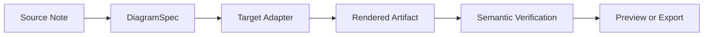
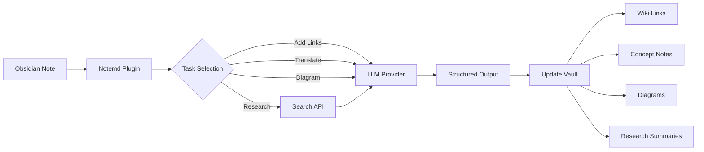

import TLDR from '@site/src/components/TLDR';

# Wprowadzenie do Notemd

<TLDR>
**Notemd** (Note + EMD — Enhanced Markdown Documents) to otwarty plugin Obsidian, który przekształca lektury wykonywane za pomocą LLM w trwałą wiedzę. W odróżnieniu od AI opartego na czacie, gdzie informacje znikają po zakończeniu sesji, Notemd zapisuje wyniki **bezpośrednio do twojej skrzynki** w postaci linków wiki, notatek koncepcyjnych, streszczeń badań, tłumaczeń, pracowników i diagramów. Jest przeznaczony dla badaczy, studentów oraz osób pracujących z wiedzą, które chcą, aby lektury, badania i wyjaśnienia wizualne gromadziły się w uporządkowanym, rozwijającym się grafie wiedzy.
</TLDR>

## Czym jest Notemd?

Notemd integruje **ponad 30 dużych modeli językowych** (OpenAI, Anthropic, Google, DeepSeek, Qwen, Ollama i inne) z twoim workflow Obsidian w celu automatyzacji wydobywania wiedzy, jej organizacji, tłumaczenia, badań oraz generowania diagramów.

### Główna różnica: wiedza ulotna vs. trwała

| Aspekt | AI oparty na czacie (ChatGPT itp.) | Notemd |
|--------|-------------------------------|--------|
| **Dokąd trafiają wyniki** | Historia rozmowy (znika) | Twoja skrzynka Obsidian (przetrwa) |
| **Format** | Odpowiedzi w formacie prostego tekstu | Pliki strukturyzowane: `[[wiki-links]]`, notatki koncepcyjne, diagramy |
| **Wartość długoterminowa** | Konieczność ponownego zadawania pytania za każdym razem | Gromadzenie w grafie wiedzy |
| **Dostęp offline** | Wymaga połączenia z Internetem | Działa w pełni offline z Ollama |

## Podstawowe funkcje

### 1. **Automatyczne łączenie z Wiki**
- LLM identyfikuje kluczowe koncepcje w twoich notatkach
- Wstawia `[[wiki-links]]` przy każdym wystąpieniu
- Opcjonalnie tworzy powiązane notatki o koncepcjach
- Tłumienie synonimów w celu uniknięcia duplikatów

### 2. **Generowanie notatek o koncepcjach**
- Wyciąga podstawowe koncepcje z artykułów naukowych, publikacji i notatek
- Tworzy dedykowane pliki z koncepcjami wraz z odnośnikami
- Dostosowalne ścieżki wyjściowe i szablony

### 3. **Integracja z wyszukiwarką internetową**
- Wyszukuj Tavily lub DuckDuckGo bezpośrednio w Obsidian
- LLM podsumowuje wyniki z cytatami źródłowymi
- Dodaje wyniki badań do obecnej notatki

### 4. **Tłumaczenie wielojęzyczne**
- Tłumaczy wybrane fragmenty lub całe notatki
- Obsługuje ponad 21 języka UI
- Niezależna konfiguracja języka wyjściowego
- Obsługa tłumaczenia partiami

### 5. **Generowanie diagramów**
- **Mermaid**: schematy przepływu, sekwencyjne, klasowe, stanowe, ER, Gantt
- **JSON Canvas**: natywne układy Obsidian
- **Vega-Lite**: wykresy danych, serie czasowe, wykresy rozproszenia
- **HTML / Edytowalne HTML/SVG**: samodzielne artefakty graficzne z anotacjami semantycznymi
- **Draw.io / Granice artefaktów Drawnix**: ścieżki eksportu przeznaczone dla administratorów, wychodzące z tego samego modelu graficznego semantycznego
- **Plan rozwoju schematów obwodów**: obsługa circuitikz/TikZJax jest projektowana wokół złotych referencji, ograniczonych promptów, informacji zwrotnej z renderowania oraz walidacji topologii/układu, a nie surowego, nieograniczonego LLM TikZ
- **Diagnostyka wstępna**: artefakty renderowane mogą pokazywać informacje o błędach kompilacji/renderowania, a źródła nieliniowe można sprawdzać bez konieczności używania środowiska LaTeX na stronie pluginu
- Automatyczne poprawianie składni w przypadku błędów Mermaid

### 6. **Przepisy szybkiego działania**
- Łączenie wielu działań w przyciski na pasku bocznym
- Definicja procesów oparta na DSL
- Przykład: `add-links > extract-concepts > research > diagram`

## Kto powinien używać Notemd?

✅ **Badacze** czytający artykuły i tworzący przeglądy literatury
✅ **Studenci** organizujący notatki i tworzący mapy pojęciowe
✅ **Pracownicy wiedzy**, którzy chcą, aby wnioski z lektury były przechowywane
✅ **Profesjonaliści dwujęzyczni**, potrzebujący tłumaczeń + łączeń do wiki
✅ **Użytkownicy dbający o prywatność**, którzy chcą lokalnego wsparcia LLM (Ollama)
✅ **Użytkownicy zaawansowani**, którzy personalizują prompty i procesy

## Dlaczego Notemd + Obsidian?

**Obsidian** to baza wiedzy oparta na markdownu, skupiona na lokalnym przechowywaniu. **Notemd** dodaje supermoc AI:
- Twoje dane pozostają w twoim sejfie (a nie w usłudze chmurowej)
- Działa offline z lokalnymi modelami
- Darmowe i otwarte oprogramowanie (licencja MIT)
- Integruje się z istniejącymi wtyczkami Obsidian
- Może obsługiwać dziesiątki tysięcy notatek

## Pierwsze kroki

1. **Instalacja**: Ustawienia → Wtyczki społecznościowe → Przeglądaj → "Notemd"
2. **Konfiguracja**: Dodaj swój klucz dostawcy LLM API (lub użyj lokalnego Ollama)
3. **Spróbuj**: Otwórz notatkę → Kliknij prawym przyciskiem → "Przetworzyć plik (dodaj linki)"
4. **Odkrywaj**: Sprawdź pasek boczny w poszukiwaniu jedno-klikowych procesów pracy

👉 [Przewodnik instalacyjny](./getting-started/installation) | [Szybki przewodnik](./getting-started/quick-start)

## Kierunek rozwoju funkcji diagramów

Praca z diagramami w Notemd zmierza od „prośby modelu o napisanie jednej ciągu składniowego” ku warstwowemu pipeline’owi:

Obecna implementacja już obsługuje Mermaid, JSON Canvas, Vega-Lite, fallback HTML, edytowalne HTML/SVG, artefakty Draw.io XML, minimalny zestaw Drawnix JSON, diagnostykę wstępną/z fallbackiem tylko źródła oraz prototyp offline `CircuitSpec -> circuitikz` dla typowych szablonów zasilania i inwerterów CMOS. Diagramy obwodów to trudniejsza kategoria: circuitikz potrafi przedstawić dokładną topologię elektryczną, ale niekontrolowane wyniki LLM często dają nieczytelne ścieżki lub LaTeX, który się nie renderuje. Kolejnym kierunkiem jest utrzymanie circuitikz w ramach szablonów odniesienia złotego, reguł układu siatki węzłów, diagnostyki renderowania oraz pętli zwrotnej z zrzutami ekranu.

Przeczytaj szczegóły w [Diagramy](./features/diagrams).

## Architektura

## Notemd kontra inne wtyczki AI Obsidian

Większość wtyczek AI Obsidian jest skoncentrowana na rozmowie (pytasz, AI odpowiada, informacje pozostają w czacie). Notemd jest **skoncentrowany na pisaniu**: AI przetwarza twoje notatki i zapisuje strukturyzowane wyniki bezpośrednio do twojego vault.

| Zdolności | Notemd | Copilot | Smart Connections | Text Generator |
|-----------|--------|---------|-------------------|-----------------|
| Wstawianie automatycznych linków wiki | Tak | Nie | Nie | Nie |
| Generowanie notatki koncepcyjnej | Tak (z odnośnikami wstecznymi + usuwaniem duplikatów) | Nie | Nie | Nie |
| Generowanie diagramów | Tak (Mermaid, Canvas, Vega-Lite, HTML, edytowalne artefakty) | Nie | Nie | Nie |
| Integracja z badaniami internetowymi | Tak (Tavily + DuckDuckGo) | Nie | Nie | Nie |
| Przetwarzanie folderów partiiowo | Tak | Ograniczone | Nie | Ograniczone |
| Kierowanie modelem według zadania | Tak (7 zadań, niezależne modele) | Nie | Nie | Nie |
| Łańcuchy procesów jednym kliknięciem | Tak (DSL) | Nie | Nie | Nie |
| Tłumaczenie (partiami) | Tak | Nie | Nie | Nie |
| Rozmowa z sejfem | Nie | Tak | Nie | Nie |
| Szukanie podobieństwa semantycznego | Nie | Nie | Tak | Nie |
| Generowanie oparte na szablonach | Nie | Nie | Nie | Tak |
| dostawcy LLM | 36 (chmura + brama + lokalny) | 3-5 | 2-3 | 3-5 |
| Całkowicie offline | Tak (Ollama) | Częściowy | Częściowy | Częściowy |

**Kiedy wybrać Notemd**: Chcesz, aby sztuczna inteligencja stworzyła trwałą grafę wiedzy — a nie tylko rozmawiała o twoich notatkach.

**Kiedy wybrać Copilot**: Chcesz mieć asystenta AI do rozmów wewnątrz Obsidian.

**Kiedy wybrać Smart Connections**: Chcesz odkryć istniejące związki między notatkami za pomocą wyszukiwania semantycznego.

## Filozofia

**Notemd uważa, że sztuczna inteligencja powinna uzupełniać pracę ludzi związana z wiedzą, a nie ją zastępować.** Wtyczka:
- Umożliwia kontrolę nad procesem (przeczytaj recenzję przed zastosowaniem zmian)
- Zachowuje kontekst (wszystkie wyniki odnoszą się do źródła)
- Szanuje prywatność (lokalne wsparcie LLM, brak telemetrii)
- Zachowuje się elastycznie (otwarte APIs, niestandardowe procesy pracy)

## Otwarty kod źródłowy

- **Licencja**: MIT
- **Źródło**: [github.com/Jacobinwwey/obsidian-NotEMD](https://github.com/Jacobinwwey/obsidian-NotEMD)
- **Społeczność**: [Discord](https://discord.gg/qnGgsQ9W) | [GitHub Discussions](https://github.com/Jacobinwwey/obsidian-NotEMD/discussions)
- **Wkład**: Witamy PR-y, patrz [CONTRIBUTING.md](https://github.com/Jacobinwwey/obsidian-NotEMD/blob/main/CONTRIBUTING.md)

---

**Następny krok**: [Installation →](./getting-started/installation)
