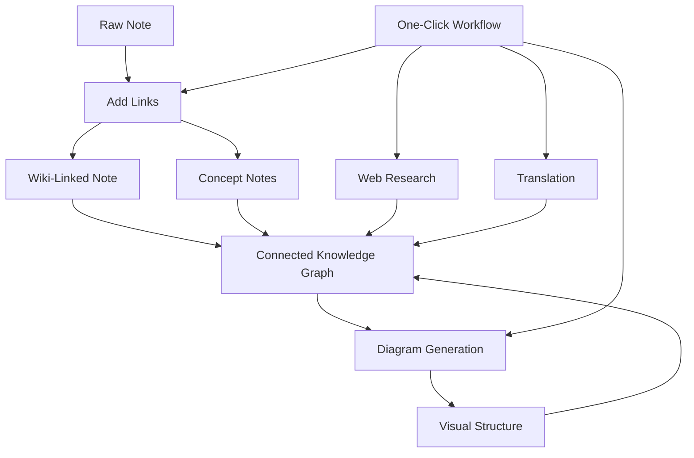

import TLDR from '@site/src/components/TLDR';

# Przewodnik zarządzania wiedzą AI Obsidian

<TLDR>
**Notemd przekształca czytanie napędzane LLM w trwałą wiedzę: linki wiki łączą koncepcje, notatki koncepcyjne tworzą dostępny graf, badania wprowadzają treści z internetu do twojej bazy, tłumaczenie usuwa bariery językowe, diagramy ułatwiają widoczność struktury, a workflow łączą wszystko w jeden kliknięcie.** Ten przewodnik obejmuje cały proces — od surowych notatek do połączonej, wizualnej, wielojęzycznej bazy wiedzy.
</TLDR>

## Dlaczego zarządzanie wiedzą AI?

Tradycyjne notowanie tworzy płaskie pliki. Nawet przy ręcznych linkach wiki, większość notatek pozostaje niepowiązana. Notemd wykorzystuje LLM do automatyzacji warstwy połączeń:

- **LLMs czytają twój treść** i identyfikują to, co jest ważne — terminy, metody, osoby, teorie
- **Linki są wstawiane automatycznie** przy każdym wystąpieniu koncepcji, a nie ukryte w sekcji „zobacz także
- **Notatki koncepcyjne są generowane** jako samodzielne pliki dostępne do wyszukiwania
- **Badania wzbogacają notatki** o kontekście z internetu
- **Diagramy ułatwiają widoczność struktury** — mapy myśli, schematy przepływu, wykresy danych powstałe z tej samej treści

Rezultat: graf wiedzy, który rośnie z każdą przetworzoną notatką, a nie tylko wtedy, gdy pamiętasz o dodaniu linków.

## Pełny proces



Każdy krok jest niezależny. Można użyć jednego lub wszystkich. Najskuteczniejsza sekwencja: **Dodaj linki → Notatki koncepcyjne → Diagramy**.

---

## 1. Linki wiki: Ujawnianie połączeń

Linki wiki stanowią podstawę grafu wiedzy. Notemd wykorzystuje LLM do:

1. Przeczytaj treść swojej notatki (podziel ją na fragmenty w przypadku długich dokumentów)
2. Zidentyfikuj kluczowe koncepcje — priorytetowo traktując konkretne terminy techniczne nad ogólnymi rzeczownikami
3. Wstaw `[[wiki-links]]` przy każdym wystąpieniu
4. Zablokuj synonimy, aby „ML” i „Machine Learning” nie tworzyły oddzielnych węzłów

### Kiedy stosować

- **Każda notatka >100 słów** — krótsze notatki dają niewiele koncepcji
- **Artykuły badawcze, dokumenty techniczne, notatki ze spotkań** — bogate w terminy specyficzne dla danej dziedziny
- **Po ustabilizowaniu treści** — nie przetwarzaj ponownie szkiców

### Ustawienia kluczowe

| Ustawienie | Zalecane | Dlaczego |
|---------|-----------|-----|
| `addLinksProvider` | DeepSeek lub GPT-4o-mini | Dobra dokładność przy niskich kosztach |
| Zablokowanie synonimów | Włączone | Zapobiega tworzeniu duplikatów węzłów |
| Okno kontekstowe | Akapit | Równowaga między dokładnością a kosztem |

→ [Wiki-Links deep dive](/docs/features/wiki-links)

---

## 2. Notatki koncepcyjne: węzły wiedzy dostępne do wydobycia

Linki wiki łączą pomysły w tekście, natomiast notatki koncepcyjne umożliwiają niezależne wydobycie każdego pomysłu. Każda koncepcja ma swój własny plik `.md`:

```markdown
# Machine Learning

## Linked From
- [[My Research Notes]]
- [[Neural Networks Explained]]
```

### Proces wydobywania

Prompt LLM jest bardzo ustrukturyzowany:
- Unormalizuj do formy liczby pojedynczej
- Wolimy wielosłowowe pojęcia zamiast pojedynczych słów („Dielectric Relaxation”, a nie „Relaxation”)
- Pomijaj sekcje odniesień/bibliografii
- Wynik w postaci linii `CONCEPT:` dla pewnego parsowania

Koncepcje są usuwane z duplikatów w poszczególnych fragmentach za pomocą `Set<string>`. Błędy LLM w pojedynczych fragmentach nie powodują przerwania operacji.

### Powrotnie linkujące się elementy

Gdy jest to włączone, każda notatka koncepcyjna odnotowuje, które notatki źródłowe o niej wspominają. Wbudowany panel powrotnych linków Obsidian pokazuje również połączenia wsteczne.

### Deduplikacja

4-etapowy silnik usuwania duplikatów Notemd wykrywa:
1. **Dokładne zgodności** — porównanie nazw plików bez względu na wielkość liter
2. **Formy liczby mnogiej** — "Models.md" vs "Model.md"
3. **Normalizacja symboli** — "A-B.md" vs "A B.md"
4. **Zawieranie jednego słowa** — "ML.md" jest oznaczane, gdy istnieje "Machine Learning.md"

### Ustawienia kluczowe

| Ustawienie | Zalecane | Dlaczego |
|---------|-----------|-----|
| `conceptNoteFolder` | `concepts/` lub `🧠 concepts/` | Utrzymuje skarbiec uporządkowany |
| `extractConceptsAddBacklink` | Włączone | Umożliwia odwrotne wyszukiwanie |
| `extractConceptsMinimalTemplate` | Wyłączone | Pełny szablon z Linked From |
| Model na zadanie | DeepSeek | Ekstrakcja pojęć nie wymaga drogich modeli |
| Tłumienie synonimów | Włączone | Ta sama ustawienie wpływa zarówno na łączenie, jak i ekstrakcję |

→ [Szczegółowe omówienie Notatek koncepcyjnych](/docs/features/concept-notes)

---

## 3. Badania: Włączenie sieci

Notemd integruje wyszukiwanie w sieci z Twoim procesem roboczym notatek:

1. **Konstruowanie zapytania** — tytuł lub wybrany fragment notatki staje się zapytaniem wyszukiwania
2. **Wyszukiwanie w sieci** — Tavily (zalecane, wymagana klucz API) lub DuckDuckGo (darmowe, bez klucza)
3. **Sumaryzacja LLM** — wyniki wyszukiwania są skracane do istotnego streszczenia
4. **Dodanie do notatki** — streszczenie jest dodawane w pozycji kursora lub jako nowy rozdział

### Kiedy używać

- Przed przetwarzaniem nowego tematu — najpierw uzyskaj kontekst z sieci
- Gdy nota koncepcyjna wymaga uzupełnienia — najpierw przeprowadź badania, a następnie dodaj linki
- Do przeglądów literatury — przeprowadź masowe badania folderu notatek

### Główne ustawienia

| Ustawienie | Zalecane | Dlaczego |
|---------|-----------|-----|
| `researchProvider` | GPT-4o lub Claude | Badania wymagają wyższej jakości sumaryzacji |
| Usługa wyszukiwania | Tavily | Lepsza trafność, możliwość konfiguracji głębokości |
| `maxResearchContentTokens` | 4000 | Równowaga pomiędzy głębokością a kosztem |

→ [Szczegółowe badanie tematu](/docs/features/research)

---

## 4. Tłumaczenie: Przełamywanie barier językowych

Notemd tłumaczy notatki przy użyciu skonfigurowanego LLM — nie jest to dedykowany narzędzie do tłumaczenia API. Oznacza to:

- **Tłumaczenia zrozumiałe w kontekście** — LLM rozumie cały dokument, a nie tylko poszczególne zdania
- **Obsługa terminów technicznych** — „gradient descent” pozostaje jako „梯度下降”, a nie „坡度向下
- **Obsługa grup** — możliwość tłumaczenia całej folderu z notatkami za jednym razem
- **Model dostosowany do zadania** — wykorzystanie Gemini Flash do tłumaczeń (szybko, tanio, wielojęzycznie)

### Obsługa języków

Sam Notemd obsługuje 21 języków UI. Język docelowy tłumaczenia można skonfigurować dla każdego zadania. Najczęstsze pary: EN↔ZH, EN↔JA, EN↔KO, EN↔DE, EN↔FR, EN↔ES.

→ [Szczegółowe omówienie tłumaczenia](/docs/features/translation)

---

## 5. Diagramy: Ujawnianie struktury

Pipeline diagramów Notemd opiera się na specyfikacji: LLM tworzy ustrukturyzowany `DiagramSpec` JSON, a następnie adaptery przekształcają go do formatu docelowego. Dzięki temu uzyskuje się bardziej wiarygodny wynik niż proszenie LLM o surową składnię Mermaid.

### Rozpoznawanie intencji

Notemd wywnioskowuje najlepszy typ diagramu na podstawie treści:

- **Tabele z liczbami** → wykres danych (Vega-Lite)
- **Słownictwo klienta/servera** → diagram sekwencyjny (Mermaid)
- **Entyteta/klucz główny** → diagram ER (Mermaid)
- **Krok/przepływ procesu** → schemat przepływu (Mermaid)
- **Słowa kluczowe mapy koncepcyjnej** → JSON Canvas (Obsidian native)
- **Domyślnie** → mapa umysłowa (Mermaid)

### Łańcuch renderowania

Cel główny → alternatywa → alternatywa → HTML. Jeśli składnia Mermaid zawiedzie, próbuje ponownie raz z kontekstem błędu dla LLM, a następnie przechodzi na minimalny diagram.

### Ustawienia kluczowe

| Ustawienie | Zalecane | Dlaczego |
|---------|-----------|-----|
| `enableExperimentalDiagramPipeline` | Włączone | Lepsza jakość dzięki podejściu opartemu na specyfikacji |
| `experimentalDiagramCompatibilityMode` | `best-fit` | Cel natywny według intencji |
| `summarizeToMermaidProvider` | GPT-4o lub Claude | Specyfikacje diagramów wymagają rozumowania przestrzennego |
| `autoMermaidFixAfterGenerate` | Włączone | Automatycznie wykrywa błędy składni LLM |
| Wzmacnianie lokalnej wiedzy | Włączone dla specyficznych domen | Poprawia dokładność dzięki kontekstowi vault |

→ [Szczegółowe omówienie diagramów](/docs/features/diagrams)

---

## 6. Przepływy pracy: Automatyzacja jednym kliknięciem

Przepływy pracy łączą wiele zadań w jeden przycisk na pasku bocznym. Format DSL to:

```
task1 | task2 | task3
```

Przykład: `addLinks | extractConcepts | generateDiagram` — przetwarzanie notatki z tekstu surowego na w pełni połączony, wizualny węzeł wiedzy jednym kliknięciem.

### Zalecane przepływy pracy

| Przepisywanie | Łańcuch | Przypadek użycia |
|----------|-------|----------|
| Pełny proces | `addLinks \| extractConcepts \| generateDiagram` | Nowe notatki |
| Badania najpierw | `research \| addLinks` | Tematy nieznane |
| Polyglot | `translate \| addLinks` | Notatki wielojęzyczne |
| Tylko diagram | `generateDiagram` | Szybka wizualizacja |

→ [Szczegółowe omówienie workflow](/docs/features/workflows)

---

## 7. LLM Dostawcy: 36 opcji od chmury do lokalnego serwera

Notemd obsługuje 36 dostawców w 4 typach transmisji. Główne grupy:

- **Chmura międzynarodowa**: OpenAI, Anthropic, Google, Mistral, xAI
- **Chmura w Chinach**: DeepSeek, Qwen, Doubao, Moonshot, GLM, Baidu, SiliconFlow
- **Bramy**: OpenRouter, GitHub Models, Hugging Face, Vercel
- **Lokalny**: Ollama, LMStudio, OVMS — brak klucza API, żadne dane nie opuszczają twojego komputera

### Strategia modeli na poziomie zadań

Najbardziej ekonomiczne rozwiązanie polega na używaniu tanich modeli do prostych zadań oraz potężnych modeli do złożonych:

```
extractConcepts  → DeepSeek (fast, cheap, accurate enough)
addLinks          → DeepSeek or GPT-4o-mini
research          → GPT-4o or Claude (needs quality)
generateDiagram   → GPT-4o or Claude (needs spatial reasoning)
translate         → Gemini Flash (fast, multilingual)
```

→ [Przegląd LLM Dostawców](/docs/providers/overview)

---

## Lista kontrolna rozpoczęcia pracy

1. **Zainstaluj Notemd** — [Community Plugins](/docs/getting-started/installation) (zalecane) lub ręcznie
2. **Skonfiguruj dostawcę** — DeepSeek (najprościej), OpenAI lub Ollama (darmowe)
3. **Przetwórz swoją pierwszą notatkę** — kliknij prawym przyciskiem → "Przetworzyć plik (dodaj linki)"
4. **Ustaw folder koncepcji** — Ustawienia → Notemd → Wyjście → Folder koncepcji
5. **Wyciągnij koncepcje** — uruchom „Wyciągnij koncepcje” w tej samej notatce
6. **Stwórz diagram** — uruchom „Stwórz diagram”, aby zobrazować połączenia
7. **Stwórz przepływ pracy** — połącz powyższe elementy w jeden przycisk jednym kliknięciem

## Zalecane konfiguracje

### Student (Budżet)

```
Provider: DeepSeek (free tier available)
Concept extraction: DeepSeek
Research: DuckDuckGo (free) + DeepSeek
Diagrams: Off (or legacy Mermaid)
Workflows: addLinks | extractConcepts
```

### Badacz (Jakość)

```
Provider: GPT-4o (primary)
Concept extraction: DeepSeek (cost savings)
Research: GPT-4o + Tavily
Diagrams: best-fit mode, GPT-4o
Workflows: research | addLinks | extractConcepts | generateDiagram
```

### Priorytet prywatności (tylko lokalnie)

```
Provider: Ollama (llama3 or qwen2.5:7b)
All tasks: Ollama
Research: DuckDuckGo (free, no API key)
Diagrams: legacy Mermaid mode
```

### Dwujęzyczny (ZH + EN)

```
Primary: DeepSeek (Chinese queries)
Translation: Google Gemini Flash
Research: Tavily + DeepSeek (Chinese search context)
Language output: per-task (extractConceptsLanguage: zh-CN)
```

---

## Częste wzorce

### Wzorzec: Przetwarzanie artykułu badawczego

1. Imporcie treści PDF (lub wklej)
2. **Badania** — uzyskaj kontekst internetowy na temat
3. **Dodaj linki** — zidentyfikuj i połącz kluczowe koncepcje
4. **Wyciągnij koncepcje** — utwórz oddzielne notatki
5. **Stwórz diagram** — zobrazuj strukturę artykułu

### Wzorzec: Wzbogacanie codziennej notatki

1. Pisać codzienną notatkę
2. **Dodaj linki** — łączy dzisiejsze pomysły z istniejącymi koncepcjami
3. Notatki koncepcyjne automatycznie aktualizują się dzięki odnośnikom zwrotnym

### Wzorzec: Przegląd literatury

1. Stworzyć folder z artykułami/notatkami
2. **Dodaj linki masowo** — przetworzyć cały folder
3. **Usuń duplikaty koncepcji** — oczyścić niemal identyczne notatki
4. **Wygeneruj diagram** — mapa myśli całej literatury

---

*Notemd jest oprogramowaniem otwartym (MIT) i działa z Obsidian 0.15.0+ na wszystkich platformach. [Zainstaluj teraz](/docs/getting-started/installation) lub [przeglądaj na GitHubie](https://github.com/Jacobinwwey/obsidian-NotEMD).*
