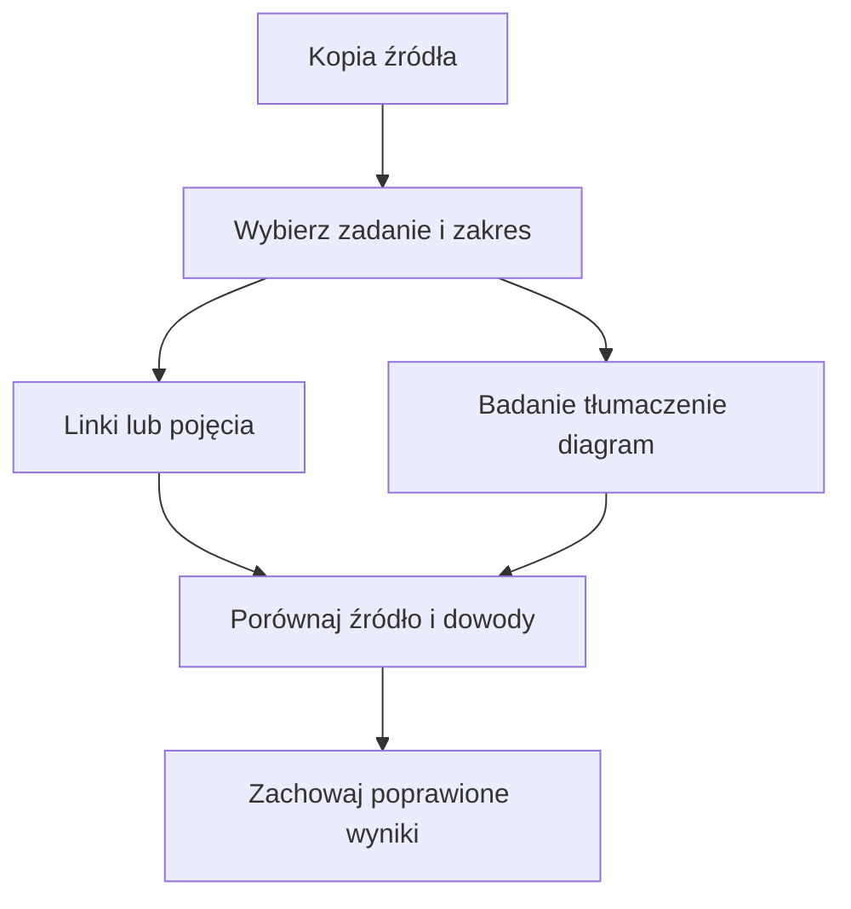

import TLDR from '@site/src/components/TLDR';

# Zarządzanie wiedzą z AI w Obsidianie

<TLDR>Przydatna metoda odróżnia źródła, odpowiedzi modelu i własne poprawki. Notemd dostarcza linki, pojęcia, badania, tłumaczenia i diagramy jako dokumenty do przeglądu. Zacznij od jednego źródła, sprawdź je i dopiero potem automatyzuj ograniczony folder.</TLDR>

## Wybierz wynik

Potrzebujesz powiązanej notatki, pojęć, podsumowania opartego na źródłach, tłumaczenia czy diagramu? Więcej plików/linków nie gwarantuje zrozumienia lub odnajdywania informacji. Ustal sposób kontroli i ponownego wyszukania treści.

## Cała ścieżka


```mermaid
flowchart TD
    A[Kopia źródła] --> B[Wybierz zadanie i zakres]
    B --> C[Linki lub pojęcia]
    B --> D[Badanie tłumaczenie diagram]
    C --> E[Porównaj źródło i dowody]
    D --> E
    E --> F[Zachowaj poprawione wyniki]
```

To dostępne zadania, nie wszystkie kroki jednego domyślnego przycisku. Zachowaj źródło i sprawdź wynik przed budową łańcucha.

## 1. Linki: uwidocznij relacje

Użyj **Przetwórz plik (dodaj linki)** i porównaj `_processed.md`: terminy, cytaty, kod oraz wzory. Instrukcje domeny/synonimów nie egzekwują tożsamości ani progu liczbowego. Do powtarzalnego łączenia istniejących tytułów może lepiej pasować dopasowanie deterministyczne. [Linki](./features/wiki-links).

## 2. Pojęcia: oddziel termin od wyjaśnienia

Wybierz folder. Samodzielna ekstrakcja zachowuje źródło i tworzy tytuły. Dla `Linked From` w nowych plikach włącz linki zwrotne i wyłącz minimalną formę. **Generowanie wsadowe z tytułów** jest osobne i może objąć starsze odpowiednie notatki. Sprawdź przeniesienie do complete i różne znaczenia identycznych nazw. [Pojęcia](./features/concept-notes).

## 3. Badanie: zachowaj dowody

Wybierz temat/tytuł, Tavily lub DuckDuckGo i **Badanie i podsumowanie**. Pusty klucz Tavily nie przełącza usługi. Otwórz źródła i sprawdź twierdzenia. Opcjonalne lokalne pobieranie leksykalne wysyła fragmenty do wybranego LLM; lokalny indeks nie czyni trasy offline. [Badanie](./features/research).

## 4. Tłumaczenie: znaczenie i struktura

Wybierz język docelowy i przetłumacz plik. Domyślne `_<language>.md` może zastąpić poprzedni wynik. Dla fragmentu użyj notatki tymczasowej. Sprawdź terminy, liczby, kod, linki i matematykę; podział może utracić kontekst. Liczby języków UI/witryny nie dowodzą jakości pary językowej. [Tłumaczenie](./features/translation).

## 5. Diagramy: źródło dalszej edycji

Wybierz wiele typów diagramów w jednym uruchomieniu i osobne zestawy formatów dla każdego typu. Odznaczenie typu zachowuje jego formaty; brak wyboru oznacza automatyczną analizę treści. Pole wyboru włącza typ. Kliknięcie nazwy wybiera go i otwiera formaty. Najechanie kursorem lub fokus klawiatury zmienia podgląd bez zapisu ustawień. Escape zamyka menu i przywraca fokus.

## 6. Przepływy: automatyzuj sprawdzone kroki

Nazwa, `::` i działania oddzielone `>` definiują łańcuch:

```text
One-Click Extract::process-current-add-links>batch-generate-from-titles>batch-mermaid-fix
```

Obejmuje linki, generowanie z tytułów i naprawę Mermaid, nie ogólne badanie ani diagramy. Wymagania i wyniki pozostają przypisane działaniom. Zgłoszony błąd domyślnie zatrzymuje przepływ; kontynuowanie wymaga odporności późniejszych kroków na pozostałe wejście. Anulowanie nie usuwa gotowych wyników. [Przepływy](./features/workflows).

## 7. Dostawcy: zadanie i protokół

36 profili obejmuje pięć rodzin. Dobieraj według adresu, praw, zasad danych i zmierzonych wyników. Porównuj czas/koszt na tym samym źródle i prompcie. Trasy zadań są początkowo wyłączone; sprawdź wszystkie przed założeniem lokalnej pracy. [Dostawcy](./providers/overview).

## Pierwsze kontrole

1. Zainstaluj i zachowaj kopie źródeł.
2. Skonfiguruj oraz przetestuj dokładny model.
3. Wybierz folder pojęć i różne cele.
4. Uruchom kopię.
5. Porównaj i zapisz poprawki.
6. Rozszerz na mały folder i przejrzyj wyniki częściowe przed długimi łańcuchami.

## Praktyczne sytuacje

### Przetwarzanie artykułu

Przekształć zewnętrznie do Markdown, sprawdź tabele, wzory i ilustracje. Wyodrębnij pojęcia/fragmenty, zbadaj precyzyjne pytania i rysuj tylko weryfikowalne relacje. Zachowaj oryginał i poprawki.

### Utrzymanie pojęć

Użyj osobnego folderu, oceń terminy i generuj objaśnienia dla wybranego podzbioru. Zrób backup przed sprzątaniem. Liczby nie zastępują trafnych definicji ani użytecznej nawigacji.

### Prywatny materiał

Przygotuj lokalny serwer, modele i zależności. Sprawdź trasy, unikaj badania sieci w razie potrzeby. Czytaj raporty przed udostępnieniem. Domyślny loopback nie blokuje konfiguracji zdalnej.

### Wznawianie partii

Poczekaj na zakończenie błędu/anulowania, sprawdź raport, wyniki i odzyskiwanie, porównaj konflikty i ponawiaj celowo. Anulowane nie oznacza pustego. Sprawdź odwołania przed usuwaniem plików towarzyszących.

## Dalej

- [Szybki start](./getting-started/quick-start).
- [Przetwarzanie wsadowe](./advanced/batch-processing).
- [Deweloperzy](./developers/overview).
- [Agenci](./agents/overview).
