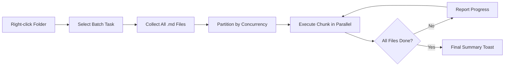

import TLDR from '@site/src/components/TLDR';

# Processamento em Lote

<TLDR>
**Notemd processa pastas inteiras em uma única ação, com concorrência configurável e controle de sobrescrita.** Clique com o botão direito em uma pasta para adicionar links do wiki em lote, extrair conceitos, pesquisar ou traduzir todas as anotações contidas nela. Os limites de concorrência evitam erros de limite de taxa API. O progresso é informado por arquivo. O comportamento de sobrescrita pode ser configurado: ignorar o existente, anexar ou substituir. Os arquivos que falham são registrados sem interromper o processamento em lote.

Isso faz parte do [Obsidian Guia de Gestão de Conhecimento de IA](/docs/pillar-ai-knowledge).
</TLDR>

## Visão Geral

O processamento em lote transforma uma pasta de anotações em uma única operação. Em vez de abrir cada anotação e executar comandos individualmente, basta clicar com o botão direito na pasta e selecionar a tarefa. Notemd percorre todos os arquivos `.md`, aplica a ação escolhida e informa o progresso em tempo real.

Esse recurso é essencial para a extração de conhecimento em toda a estrutura de armazenamento. Após importar dezenas de PDFs, por exemplo, adicionar links em lote seguido de extração de conceitos em lote cria seu grafo de conhecimento em minutos, e não em horas.

## Como Funciona

### Modelo de Execução em Lote

1. **Coleta de arquivos** -- Notemd escaneia a pasta alvo recursivamente (ou apenas no nível superior, dependendo das configurações) e coleta todos os arquivos `.md`.
2. **Particionamento por concorrência** -- Os arquivos são divididos em blocos com base na configuração `batchConcurrency`. Cada bloco é executado paralelamente; os blocos são executados sequencialmente.
3. **Execução** -- Cada arquivo é processado usando a mesma lógica do comando para um único arquivo. As configurações do provedor e do modelo por tarefa são respeitadas.
4. **Relatórios de progresso** -- Uma notificação aparece após a conclusão de cada arquivo, mostrando o progresso `N / Total`.
5. **Tratamento de erros** -- Se um arquivo falhar (erro API, tempo de espera da rede, etc.), o erro é registrado e o processamento em lote continua. O resumo final lista todos os arquivos que falharam.
6. **Conclusão** -- Uma notificação de resumo informa o total processado, os sucessos e as falhas.

### Comportamento de Sobrescrita

Ao processar um arquivo que já possui links wiki, notas conceituais ou traduções, o comportamento do Notemd depende da configuração de sobrescrita:

| Modo | Comportamento |
|------|----------|
| **Ignorar** | O conteúdo existente é deixado intacto. Apenas arquivos não modificados são processados. |
| **Anexar** (padrão) | Novo conteúdo é anexado. Os links wiki, conceitos ou traduções existentes são preservados. |
| **Substituir** | O arquivo é completamente reprocessado. Todas as modificações anteriores do Notemd são sobrescritas. |

Especificamente para links wiki: se uma nota já contiver `[[wiki-links]]`, o modo **Ignorar** a deixa como está, enquanto **Substituir** envia toda a nota para o LLM para inserção de novos links. Use **Ignorar** para processamento incremental e **Substituir** para reprocessamento após atualização do modelo.

### Controle de Concorrência

A configuração do `batchConcurrency` limita as chamadas paralelas de API. Isso evita erros de limite de taxa (HTTP 429) ao processar pastas grandes em provedores com cotas rígidas.

| Concorrência | Recomendado para | Impacto típico no limite de taxa |
|-------------|----------------|---------------------------|
| `1` | Planos gratuitos, provedores rigorosos | Nenhum (serial) |
| `3` (padrão) | A maioria dos provedores de nuvem | Baixo |
| `5` | Ollama (local), planos generosos | Nenhum / Baixo |
| `10` | Modelos locais com inferência rápida | Nenhum |

Se você encontrar erros 429 durante o processamento em lote, reduza a concorrência para 1 ou 2.

## Configuração

| Parâmetro | Padrão | Efeito |
|---------|---------|--------|
| `batchConcurrency` | `3` | Máximo de chamadas paralelas API durante operações em pastas |
| `batchOverwriteExisting` | `false` | Sobrescrever o conteúdo existente de Notemd. `false` = modo de anexar. |
| `batchSkipProcessed` | `false` | Ignorar arquivos que já contenham marcadores Notemd (por exemplo, links wiki) |
| `batchRecursive` | `true` | Incluir subdiretórios ao escanear a pasta |
| `enableStableApiCall` | `false` | Habilitar lógica de tentativa (até 4 tentativas) por arquivo durante o processamento em lote |

### Modelos por Tarefa no Lote

Cada operação em lote utiliza o modelo correspondente à tarefa. batch-add-links usa `addLinksProvider`, batch-research usa `researchProvider`, e assim por diante. Isso permite que você atribua modelos baratos para operações de grande volume e reserve modelos caros para tarefas sensíveis à qualidade.

## Exemplo

Você tem uma pasta `papers/` com 40 notas de pesquisa importadas. Você deseja adicionar links wiki e extrair conceitos de todas elas:

1. Clique com o botão direito na pasta `papers/`
2. Selecione **"Notemd: Processar pasta (adicionar links)"**
3. Notemd escaneia a pasta, encontra 40 arquivos `.md` e processa 3 de cada vez (concorrência padrão)
4. Uma notificação de progresso exibe: `12/40 files processed...`
5. Após cerca de 3 minutos, uma notificação de resumo informa: `39 succeeded, 1 failed (API timeout on paper-37.md)`
6. Repita com **"Notemd: Processar pasta (extrair conceitos)"** para criar notas de conceito para todos os 40

O arquivo que falhou é registrado. Você pode executá‑lo novamente apenas nesse arquivo posteriormente.

## Dicas

- **Comece com baixa concorrência** -- Se você não tem certeza dos limites de taxa do seu provedor, comece com `1` e aumente gradualmente.
- **Use o modo pular para atualizações incrementais** -- Após o primeiro lote completo, mude para `batchSkipProcessed: true` para que apenas novas notas sejam processadas nas execuções subsequentes.
- **Ative chamadas estáveis de API** -- `enableStableApiCall: true` adiciona lógica de tentativa que recupera erros temporários de rede durante lotes longos.
- **Reexecute após atualizações do modelo** -- Se você mudar para um modelo melhor, defina `batchOverwriteExisting: true` e execute novamente para obter links e conceitos aprimorados.

---

## Próximos passos

- [Workflows](/docs/features/workflows) -- Conecte tarefas em lote em botões de barra lateral de um clique
- [Custom Prompts](/docs/advanced/custom-prompts) -- Personalize prompts para extração em lote
- [Troubleshooting](/docs/advanced/troubleshooting) -- Corrija erros de limite de taxa e falhas de conexão durante execuções em lote
- [LLM Fornecedores](/docs/providers/overview) -- Referência de configuração do modelo por tarefa
