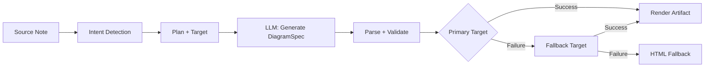
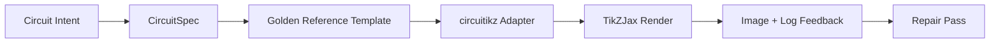

import TLDR from '@site/src/components/TLDR';

# Diagramas

<TLDR>
**Notemd gera diagramas a partir de suas anotações por meio de um pipeline baseado em especificações primeiro.** O LLM produz um `DiagramSpec` JSON independente do renderizador, e então adaptadores dedicados o traduzem para Mermaid, JSON Canvas, Vega-Lite, HTML ou saída editável HTML/SVG. Suporta 8 tipos de intenção, cadeias de fallback automáticas, visualização ao vivo com exportação para SVG/PNG, verificação semântica e geração aprimorada com conhecimento local.
</TLDR>

Isso faz parte do [Obsidian Guia de Gestão de Conhecimento de IA](/docs/pillar-ai-knowledge).

## Arquitetura: Pipeline Baseado em Especificações

O Notemd nunca solicita que o LLM gere diretamente sintaxe Mermaid/Vega/Canvas. Em vez disso:



**Por que especificações primeiro?** Os LLM geram frequentemente sintaxe inválida para o renderizador (Mermaid em particular). Um `DiagramSpec` estruturado pode ser validado antes da renderização, e a mesma especificação pode alimentar vários renderizadores como fallbacks.

## Tipos de Diagramas Suportados

| Intenção | Renderizador Primário | Fallbacks | Caso de Uso |
|--------|-----------------|-----------|----------|
| `mindmap` | Mermaid | HTML | Desdobramento hierárquico de tópicos |
| `flowchart` | Mermaid | HTML | Fluxos de processo, árvores de decisão |
| `sequence` | Mermaid | HTML | Interações cliente-servidor, protocolos |
| `classDiagram` | Mermaid | HTML | Relacionamentos entre classes OOP |
| `erDiagram` | Mermaid | HTML | Esquemas de banco de dados, relações entre entidades |
| `stateDiagram` | Mermaid | HTML | Máquinas de estado, modelos de ciclo de vida |
| `canvasMap` | JSON Canvas | Mermaid → HTML | Mapas conceituais, grafos de conhecimento |
| `dataChart` | Vega-Lite | Mermaid → HTML | Barra, linha, área, dispersão, pizza, tabelas |

## Detecção de intenção

Notemd infere o melhor tipo de diagrama a partir do conteúdo da sua anotação usando pontuação de palavras-chave:

| Intenção | Gatilhos | Confiança |
|--------|----------|------------|
| `dataChart` | Tabelas, células numéricas, palavras-chave de métrica/tendência, porcentagens | 0.88 |
| `sequence` | Vocabulário de solicitação/resposta (4+ correspondências) ou marcadores `->`/`=>` | 0.82 |
| `erDiagram` | Chave primária, chave estrangeira, entidade, esquema (2+ correspondências) | 0.80 |
| `stateDiagram` | Estado, transição, pendente, em execução, falho (3+ correspondências) | 0.76 |
| `flowchart` | Passos numerados (2+) ou vocabulário if/then/else/workflow | 0.74 |
| `canvasMap` | Mapa conceitual, grafo de conhecimento, espacial, cluster | 0.72 |
| `mindmap` | Valor padrão de fallback | 0.55 |

Sobrescreva usando a configuração **Tipo de diagrama preferido**, o seletor da barra lateral ou uma opção explícita da paleta de comandos.

## Seleção do alvo de renderização

O pipeline experimental baseado em especificações agora possui dois controles independentes:

| Controle | Parâmetro | Efeito |
|---------|---------|--------|
| Tipo de diagrama preferido | `preferredDiagramIntent` | Direciona a forma semântica do `DiagramSpec` gerado |
| Alvo de renderização preferido | `preferredDiagramRenderTarget` | Escolhe o processador de artefatos para **Gerar diagrama** e **Visualizar diagrama** |

Defina **Alvo de renderização preferido** como **Auto** como padrão do planejador, ou escolha Mermaid, JSON Canvas, Vega-Lite, HTML ou Editable HTML/SVG explicitamente. A sobrescrita aplica‑se apenas aos comandos de artefato e visualização. O comando padrão **Resumir como diagrama Mermaid** permanece vinculado a saídas compatíveis com Mermaid, para que os fluxos de trabalho atuais em Markdown não alterem silenciosamente o formato.

Essa separação é importante porque uma intenção `flowchart` agora pode ser renderizada como Mermaid para notas em Markdown, como HTML para fallback robusto, ou como Editable HTML/SVG para edição posterior. Draw.io e Drawnix continuam sendo exportadores de artefatos CLI e não alvos de renderização dentro do plugin.

## Uso

### Gerar um Diagrama

1. Abra uma nota
2. Execute **"Notemd: Gerar diagrama"** a partir da paleta de comandos
3. Notemd detecta a intenção, gera a especificação, realiza a renderização e salva o artefato

**Arquivos de saída por alvo:**

| Alvo | Extensão | Padrão de Nome do Arquivo |
|--------|-----------|------------------|
| Mermaid | `.md` | `{note}_summ.md` |
| JSON Canvas | `.canvas` | `{note}_diagram.canvas` |
| Vega-Lite | `.json` | `{note}_diagram.json` |
| HTML | `.html` | `{note}_diagram.html` |
| Editável HTML/SVG | `.html` | `{note}_diagram.html` |

### Visualizar um Diagrama

1. Executar **"Notemd: Visualizar diagrama"**
2. Uma janela modal é aberta com o diagrama renderizado
3. Exportar como SVG ou PNG usando os botões da barra de ferramentas

**Abrir visualização automaticamente** está disponível nas configurações — após a geração, a janela modal de visualização é aberta automaticamente.

A janela modal de visualização também possui um painel de diagnóstico de artefatos. Os renderizadores e testes de validação podem anexar `RenderArtifact.diagnostics`; a janela mostra um resumo de diagnóstico com contagens de erros/avisos/informações, seguido da gravidade, tipo de diagnóstico, mensagem e sugestões de correção ao lado da visualização. O mesmo resumo é exibido nas entradas do histórico de visualizações, permitindo comparar tentativas repetidas de teste circuitikz sem abrir cada entrada. Para artefatos que possuem conteúdo de origem, mas não podem ser renderizados inline ou por meio do caminho do iframe HTML, a janela modal agora recorre a uma visualização apenas de código-fonte em vez de forçar um iframe vazio. Isso permite testes de compilação/renderização circuitikz, verificações de tokens de texto SVG, verificações de captura de tela em branco PNG e relatórios futuros de sobreposição com uma superfície visível UI, sem tornar o TikZJax ou o LaTeX uma dependência obrigatória em tempo de execução do plugin ou fingir que o texto de origem é uma renderização visual verificada.

### Modo Legado Mermaid

Quando `enableExperimentalDiagramPipeline` está desativado, Notemd envia um prompt direto Mermaid ao LLM. Isso ignora completamente o pipeline padrão. Se o pipeline experimental falhar, ele recorre a este modo.

## Backends de Renderização

### Mermaid

6 adaptadores (mapa mental, fluxograma, sequência, ER, classe, estado) convertem `DiagramSpec` em sintaxe Mermaid. Após a geração, `mermaid.parse()` valida a saída. Se a validação falhar:

1. **Retentativa LLM** — uma tentativa com a mensagem de erro Mermaid como contexto
2. **Fallback Mínimo** — um diagrama básico Mermaid feito a partir dos IDs dos nós da especificação

**Legacy Mermaid Fixer** corrige automaticamente os erros de sintaxe LLM mais comuns: normalização da diretiva note, escape de rótulos com pipe, reposicionamento de ponto e vírgula, aspas inteligentes, setas com dois traços, discrepâncias de formato e muito mais.

### JSON Canvas

Gera formato Obsidian JSON Canvas com layout espacial:
- Os nós são posicionados por profundidade (x = profundidade × 420) e índice (y = índice × 170)
- A largura é estimada a partir do comprimento do rótulo
- Arestas com `fromSide: 'right'`, `toSide: 'left'`, `toEnd: 'arrow'`

### Vega-Lite

Cria especificações completas de Vega-Lite v5 JSON com codificação automática:
- **Gráficos cartesianos** (barras/linha/área/ponto/dispersão): canais x + y mais cor para múltiplas séries
- **Pizza**: theta = y (quantitativo), cor = x (nominal)
- **Tabela**: linha = x, texto = y + coluna = série

Os patches de tema escuro e claro são fundidos profundamente antes da compilação.

### HTML

Fallback universal. Documento HTML autônomo que contém:
- Metadados CSP
- Modo claro/escuro por meio de `prefers-color-scheme`
- Rótulos UI localizados para 20 idiomas
- Seções: hero, estrutura (árvore de nós), relacionamentos, destaques, tabelas de séries de dados

### Editável em HTML/SVG

Alvo explícito de figura para fluxos de trabalho de exportação editáveis. Ele projeta `DiagramSpec` em um `SemanticFigureModel` determinístico e, em seguida, gera um documento autônomo HTML com grupos SVG embutidos que contêm anotações no estilo Draw.io:

- `data-drawio-type`, `data-drawio-id` e `data-drawio-role` em nós semânticos
- `data-drawio-source` e `data-drawio-target` em arestas semânticas
- identificadores estáveis de nó/aresta após normalização de espaços em branco e tratamento de colisões
- sem scripts, sem fontes externas e sem ativos remotos

Esse alvo ainda não é intencionalmente a rota padrão do planejador. Ele está disponível como um alvo de renderização explícito enquanto o caminho do produto comprova o comportamento de edição em ferramentas reais.

### Draw.io e Drawnix Limites de Exportação

A implementação atual mantém o suporte a editores de terceiros na fronteira do artefato:

| Alvo | Contrato | Dependência em Tempo de Execução |
|--------|----------|--------------------|
| Draw.io | `mxfile` XML descompactado e determinístico a partir de `SemanticFigureModel` | nenhum na execução do plugin ou no CI |
| Drawnix | subconjunto mínimo de `.drawnix` JSON usando elementos `geometry` e `arrow-line` | nenhum na execução do plugin ou no CI |

O trade‑off é intencional: Notemd pode verificar rótulos visíveis, IDs estáveis e cobertura de primitivas suportadas sem incorporar o Diagrams.net Desktop, Drawnix, Plait ou o estado do editor apenas para navegador ao plugin.

### circuitikz / TikZJax Direção

Os diagramas de circuito não são o mesmo problema que os fluxogramas genéricos. A sintaxe correta para circuitos elétricos costuma ser **circuitikz**, renderizada em Obsidian por meio de plugins como TikZJax. TikZJax pode carregar pacotes como `circuitikz`, `pgfplots`, `tikz-cd` e `chemfig`, o que o torna atrativo para anotações de física, circuitos, química e matemática.

O risco é que o TikZ gerado diretamente por LLM seja frágil:

- uma topologia de circuito complexa pode ser eletricamente correta, mas visualmente ilegível;
- fios e rótulos sobrepostos podem tornar uma lista de conexões correta inutilizável para anotações de estudo;
- falta de preâmbulos de pacotes, âncoras incorretas ou nomes de componentes inválidos podem impedir a renderização;
- o feedback do renderizador costuma ser em nível de imagem, enquanto o LLM gera geometria em nível de texto.

A arquitetura melhor é tratar circuitikz como um alvo de diagrama restrito, e não como um prompt livre:



O modelo de primeira classe deve descrever a topologia e o layout do circuito separadamente:

| Camada | Responsabilidade | Exemplo |
|-------|----------------|---------|
| Topologia | nós elétricos e conexões de componentes | `VDD -> RD -> drain(M1)`, `source(M1) -> GND` |
| Layout | posicionamento na grade, orientação, vias de roteamento | `M1 at (3,2.2)`, entrada esquerda, saída direita |
| Estilo | pacote, convenção de tensão, rótulos, âncoras | `\begin{circuitikz}[american voltages]` |
| Validação | registro de compilação, ausência de âncoras, verificações de sobreposição/tela | TikZJax/Diagnósticos LaTeX mais revisão visual |

### Protótipo atual circuitikz

Notemd agora inclui o primeiro protótipo de repositório restrito para esta direção. Ele está intencionalmente offline e vinculado a um modelo:

```bash
npm run diagram:export-circuitikz -- --input cmos-inverter.json --output cmos-inverter.tex
```

O protótipo adiciona uma fronteira `CircuitSpec` separada e um exportador determinístico para seis famílias de referência dourada:

| Tipo de circuito | Referência dourada | Garantia de corrente |
|--------------|------------------|-------------------|
| `common-source-amplifier` | `common-source-nmos-v1` | valida `VDD -> R_D -> M1.D`, `vin -> M1.G`, `M1.S -> GND` e `M1.D -> vout` antes de escrever o LaTeX |
| `cmos-inverter` | `cmos-inverter-v1` | valida topologia PMOS-over-NMOS, entrada de porta compartilhada, saída de dreno compartilhada, `VDD -> MP.S` e `MN.S -> GND` antes de escrever o LaTeX |
| `cmos-buffer` | `cmos-buffer-v1` | valida duas etapas de inversor em cascata, nó intermediário `vmid`, `vout` restaurado e trilhas VDD/GND compartilhadas antes de escrever o LaTeX |
| `cmos-transmission-gate` | `cmos-transmission-gate-v1` | valida dispositivos paralelos PMOS/NMOS entre `vin` e `vout` com controles complementares `phib` / `phi` antes de escrever o LaTeX |
| `cmos-nand2` | `cmos-nand2-v1` | valida o pull-up paralelo de PMOS, o pull-down em série de NMOS, entradas duplas `va` / `vb` e `vout` antes de gerar LaTeX |
| `cmos-nor2` | `cmos-nor2-v1` | valida o pull-up em série de PMOS, o pull-down paralelo de NMOS, entradas duplas `va` / `vb` e `vout` antes de gerar LaTeX |

Este ainda não é um gerador geral de TikZ. Ele não compila LaTeX, chama TikZJax, inspeciona capturas de tela ou executa reparo automático de imagem. Essas funcionalidades ficam para fases posteriores.

O comando Diagrama de Pré-visualização pode reabrir diretamente os artefatos de código circuitikz salvos quando a extensão do arquivo é `.tex` ou `.tikz` e o código contém `\usepackage{circuitikz}` ou `\begin{circuitikz}`. Esse modo é uma pré-visualização apenas de código: a janela modal exibe o código, diagnósticos, controles de cópia/gravar e metadados de histórico, mas não compila LaTeX nem chama TikZJax durante a execução do plugin.

Agora a mesma pré-visualização apenas de código abrange os artefatos Draw.io e Drawnix salvos. Arquivos `.drawio` são aceitos quando se assemelham a Draw.io XML (`mxfile` ou `mxGraphModel`), e arquivos `.drawnix` são aceitos quando são Drawnix JSON com `type: "drawnix"` e um array `elements`. O plugin ainda não incorpora o diagrams.net nem o host de quadro branco Drawnix; essas pré-visualizações exibem código, diagnósticos e histórico de artefatos sem oferecer um editor visual interno.

Para reparo que preserva a topologia, passe a especificação pré-reparo como referência antes de aceitar um candidato reparado:

```bash
npm run diagram:export-circuitikz -- --input repaired-cmos-inverter.json --topology-reference cmos-inverter.json --output cmos-inverter.tex
```

O mecanismo de proteção usa `createCircuitTopologySignature` e `assertCircuitTopologyUnchanged` para comparar `circuitKind`, `goldenReferenceId`, redes, IDs/tipos/terminais de componentes e extremidades de conexões não direcionadas antes da saída. Rótulos, texto de título, dicas de layout, ordem de conexão e rótulos de conexão são intencionalmente ignorados. Um candidato que adicione um elemento curto ou reconfigure um terminal falha com `Circuit topology drift detected` antes que o arquivo `.tex` seja gravado.

O CLI agora pode analisar um log de compilação existente de LaTeX/TikZJax sem executar um compilador:

```bash
npm run diagram:export-circuitikz -- --input cmos-inverter.json --output cmos-inverter.tex --compile-log cmos-inverter.log --diagnostics-output cmos-inverter.diagnostics.json
```

Esse caminho de diagnóstico relata pacotes faltantes como `circuitikz.sty`, chaves desconhecidas de TikZ/circuitikz, erros de sintaxe de caminho do TikZ, como falta de pontos e vírgula, argumentos excessivos de chaves desbalanceadas ou rótulos não finalizados, sequências de controle indefinidas, erros gerais do LaTeX, paradas de emergência e avisos de sobrecarga do `\hbox`. Ele continua sendo baseado em logs: execução local de LaTeX/TikZJax e mecanismos de qualidade de captura de tela ainda são tarefas futuras separadas.

Para verificações rápidas dos mantenedores, o mesmo CLI pode opcionalmente executar um renderizador configurado explicitamente sem analisar comandos de shell:

```bash
npm run diagram:export-circuitikz -- --input cmos-inverter.json --output cmos-inverter.tex --compile-executable pdflatex --compile-arg -interaction=nonstopmode --compile-arg -halt-on-error --compile-arg -output-directory={outputDir} --compile-arg {tex} --expected-artifact {outputDir}/{jobName}.pdf
```

O executor de compilação usa `shell: false`, expande os placeholders `{tex}`, `{outputDir}` e `{jobName}` em valores de array de argumentos, lê o `{jobName}.log` gerado e retorna `compileExecution` além de `compileDiagnostics` na saída CLI JSON. `--compile-executable` refere‑se apenas ao caminho do binário ou wrapper do renderizador; flags do renderizador devem estar em valores repetidos de `--compile-arg`. Executáveis vazios falham como `compile-executable-invalid`, binários faltantes falham como `compile-executable-not-found`, e strings executáveis com formato de comando de shell recebem orientações para dividir argumentos, de modo que Windows, Linux e macOS sigam o mesmo contrato de execução direta. Com `--expected-artifact`, ele também relata `compileExecution.renderSmoke` e falha no CLI se o renderizador não criar um artefato não vazio. Ele ainda não inclui o LaTeX, torna TikZJax uma dependência em tempo de execução do plugin nem realiza reparo visual em nível de captura de tela.

Se o artefato esperado for `.svg`, a verificação rápida vai um nível mais a fundo:

```bash
npm run diagram:export-circuitikz -- --input cmos-inverter.json --output cmos-inverter.tex --compile-executable dvisvgm --compile-arg ... --expected-artifact {outputDir}/{jobName}.svg --expected-svg-text v_{in} --expected-svg-text v_{out}
```

A verificação de fumaça SVG verifica a raiz `<svg>`, dimensões positivas ou `viewBox`, pelo menos um elemento gráfico visível após exclusão de elementos ocultos/translúcidos, quaisquer tokens de texto solicitados, elementos óbvios fora do `viewBox`, rótulos `<text>` / `<tspan>` posicionados sobrepostos de forma óbvia e rótulos de texto óbvios sobrepostos a elementos gráficos por meio de `render-svg-label-overlap`. O texto esperado é procurado no texto visível e em metadados de acessibilidade decodificados, como `aria-label`, `<title>` e `<desc>`, de modo que renderizadores que preservam rótulos semânticos fora do `<text>` ainda podem satisfazer a verificação de tokens de texto sem precisar de OCR. A etapa de geometria agora utiliza geometria sensível a transformações para atributos comuns de grupo e elemento `transform`, portanto caixas SVG traduzidas, escaladas, rotacionadas, distorcidas ou transformadas por matriz são verificadas após a composição da transformação. Ela cobre limites exatos de arcos para extremos de arco A/a, limites exatos de curvas Bezier para extremos de curvas C/S/Q/T, limites SVG sensíveis à espessura da linha e verificações de sobreposição de rótulos, geometria de desenho `polyline` / `polygon`, além de resolver a colocação de glifos apenas por caminho a partir de referências `<use href="#...">`, de modo que rótulos convertidos em caminhos de glifo reutilizáveis ainda podem falhar nas verificações de canvas delimitado quando a geometria do glifo excede o `viewBox`. Vários rótulos `tspan` posicionados sob um mesmo pai `<text>` são comparados como caixas de rótulo separadas, o que detecta saídas no estilo LaTeX SVG que, de outra forma, fundiriam rótulos distintos em um único nó de texto. Caixas SVG `text` e `tspan` posicionadas respeitam os valores `start`, `middle` e `end`, de modo que rótulos centralizados e alinhados à direita podem acionar diagnósticos de sobreposição de texto/rótulo sem exigir layout de texto no nível do navegador. Caminhos de glifo apenas de definição dentro de `<defs>` não são contabilizados como elementos gráficos visíveis, mas seus próprios atributos locais de definição `transform` são aplicados antes da colocação `<use>`, de modo que definições de glifo escaladas ou espelhadas não sejam subcontadas. A verificação rótulo‑vs‑desenho utiliza uma pequena tolerância para caixas de desenho e o valor declarado `stroke-width`, de modo que fios finos, fios grossos e contornos poligonais de componentes podem ser considerados falhas potenciais de legibilidade de rótulo quando seu traço visível alcança um rótulo. Rótulos de glifo apenas por caminho resolvidos a partir de `<use href="#...">` também são comparados com caixas de desenho e falham com `render-svg-path-glyph-overlap` quando a geometria de glifo reutilizável sobreposta fios ou componentes. Se um renderizador converter rótulos em glifos por caminho reutilizáveis em vez de `<text>` pesquisáveis e não preservar metadados de acessibilidade, o relatório de fumaça registra `pathOnlyGlyphUseCount` e falha no token de texto solicitado por meio de `render-svg-text-path-only`, em vez de fingir que o rótulo simplesmente está ausente. Outras falhas são relatadas por meio de `render-svg-invalid`, `render-svg-dimension-missing`, `render-svg-no-visible-elements`, `render-svg-text-missing`, `render-svg-out-of-bounds`, `render-svg-text-overlap`, `render-svg-label-overlap` ou `render-svg-path-glyph-overlap`. As verificações de token de texto e sobreposição devem ser tratadas apenas como verificação estrutural para renderizadores que preservam rótulos como texto SVG pesquisável ou metadados de acessibilidade; saídas apenas por caminho SVG ainda precisam da etapa posterior de captura de tela/OCR para comprovar a legibilidade visual dos rótulos, e essa verificação de fumaça ainda não garante cobertura completa de SVG caminhos.

Grupos e elementos ocultos SVG são sempre ignorados durante a contagem de elementos visíveis e a coleta de geometria. Atributos ou estilos inline `display:none`, `visibility:hidden`, `visibility:collapse` e o geral `opacity:0` não fazem com que um artefato de renderização vazio passe na verificação de saída visível.

As definições de glifo apenas por caminho podem ser caminhos diretos ou contêineres agrupados/símbolos dentro de `<defs>`. A verificação de fumaça resolve a geometria dos caminhos filhos a partir de `<g id="...">` e `<symbol id="...">` antes da colocação em `<use>`, de modo que a saída de glifo embalado ainda alimenta as verificações de `pathOnlyGlyphUseCount`, canvas delimitado e `render-svg-path-glyph-overlap`.

O analisador de caminho também rastreia o início de subcaminhos e redefine o ponto atual em `Z/z`, de modo que comandos relativos após um subcaminho fechado continuem a partir do ponto correto SVG em vez de gerar diagnósticos falsos de `render-svg-out-of-bounds`.

A mesma etapa de geometria segue a gramática SVG para decimais com ponto inicial e sinais de mais explícitos, de modo que coordenadas compactas dvisvgm como `.5`, `-.5` ou `+.5` permanecem fracionárias durante as verificações de limite, em vez de gerarem geometria fora dos limites falsa ou serem ignoradas.

Se o renderizador emitir `.png`, o mesmo caminho esperado para artefatos resultará em uma primeira captura de tela como fumaça: Notemd decodifica arquivos PNG de cor indexada de 1/2/4/8 bits não entrelaçados, arquivos PNG em tons de cinza de 1/2/4/8/16 bits e arquivos PNG em tons de cinza‑alfa/RGB/RGBA de 8/16 bits. Imagens em cor indexada e em tons de cinza sub‑byte suportam amostras compactadas; imagens em cor indexada também suportam PLTE e dados tRNS opcionais; imagens em tons de cinza/RGB suportam amostras transparentes tRNS. Amostras diretas de 16 bits são normalizadas para o mesmo espaço de comparação RGBA de 8 bits usado pelas verificações de fumaça. A verificação de fumaça confirma dimensões positivas, registra os limites do primeiro plano como `foregroundBounds`, registra a densidade do primeiro plano dentro dessa caixa como `foregroundDensity`, falha com `render-png-blank` quando cada pixel visível corresponde à cor de fundo no canto superior esquerdo, falha com `render-png-content-clipped` quando o conteúdo do primeiro plano toca a borda da imagem, falha com `render-png-foreground-too-small` quando uma captura de tela grande tem menos de quatro pixels de primeiro plano e falha com `render-png-foreground-dense` quando os pixels do primeiro plano são excepcionalmente densos dentro de uma caixa delimitadora não trivial. Formatos PNG não suportados causam falha com `render-png-unsupported`, além de orientações específicas para PNGs entrelaçados Adam7 ou profundidades de cor indexada não suportadas. Isso detecta capturas de tela vazias, recortes óbvios da tela, pegadas de primeiro plano sub‑renderizadas, falhas de superlotação no nível do primeiro pixel e configurações incorretas de exportação de PNG pelo renderizador, sem exigir dependência de shell específica da plataforma. Trata‑se ainda de um sistema que não alcança o nível de reconhecimento de rótulos OCR, detecção precisa de sobreposição de texto ou reparo de imagem que preserve a topologia.

Quando os diagnósticos indicam uma compilação falha ou execução de render‑smoke inválida, o CLI também pode gerar um resumo de reparo que preserva a topologia:

```bash
npm run diagram:export-circuitikz -- --input cmos-inverter.json --topology-reference cmos-inverter.json --output cmos-inverter.tex --compile-log cmos-inverter.log --repair-brief-output cmos-inverter.repair-brief.json
```

O resumo de reparo utiliza o esquema `notemd.circuitikz.repair-brief.v1` e contém a fonte `CircuitSpec`, assinatura de topologia, diagnósticos de compilação/render, edições permitidas, edições de topologia proibidas, próximos passos de verificação e um `repairPrompt` estruturado. O papel do prompt é `topology-preserving-circuitikz-repair`; sua lista `diagnosticFocus` é derivada dos diagnósticos de compilação/render, e seus requisitos `acceptanceCriteria` exigem validação do candidato além de novas compilações e verificações de render‑smoke. Trata‑se do formato de transferência para um ciclo posterior de reparo, e não da afirmação de que Notemd já executa reparo visual autônomo.

Após a geração de um candidato de reparo, o mesmo CLI pode validá‑lo em relação ao resumo antes de gerar a saída:

```bash
npm run diagram:export-circuitikz -- --input repaired-cmos-inverter.json --repair-brief cmos-inverter.repair-brief.json --output repaired-cmos-inverter.tex
```

`--repair-brief` verifica a assinatura de topologia do candidato extraída do resumo, sendo mutuamente exclusivo com `--topology-reference`. Superar essa etapa prova apenas a preservação da topologia; o candidato ainda precisa dos diagnósticos de compilação e das verificações de render‑smoke.

O resultado do `--repair-brief` também inclui evidências `repairAcceptance` com o esquema `notemd.circuitikz.repair-acceptance.v1`. Ele relata as etapas `topology-signature`, `compile-diagnostics` e `render-smoke` como `passed`, `failed` ou `missing`; expõe `remainingChecks`; e mantém `readyForVisualAcceptance` como falso até que a execução do candidato contenha todas as evidências necessárias.

Use `--repair-acceptance-output` com `--repair-brief` quando as evidências de CI ou de lançamento precisarem de um arquivo JSON duradouro:

```bash
npm run diagram:export-circuitikz -- --input repaired-cmos-inverter.json --repair-brief cmos-inverter.repair-brief.json --output repaired-cmos-inverter.tex --repair-acceptance-output repaired-cmos-inverter.repair-acceptance.json
```

Para evidências de lançamento ou de mantenedor, execute cada família dourada suportada por meio do executor de fixtures agregados:

```bash
npm run diagram:smoke-circuitikz -- --output-dir docs/export/circuitikz-smoke --compile-executable pdflatex --compile-arg -interaction=nonstopmode --compile-arg -halt-on-error --compile-arg -output-directory={outputDir} --compile-arg {tex} --expected-artifact {outputDir}/{jobName}.pdf
```

O executor utiliza `docs/maintainer/fixtures/circuitikz/common-source-nmos-v1.json`, `docs/maintainer/fixtures/circuitikz/cmos-inverter-v1.json`, `docs/maintainer/fixtures/circuitikz/cmos-buffer-v1.json`, `docs/maintainer/fixtures/circuitikz/cmos-transmission-gate-v1.json`, `docs/maintainer/fixtures/circuitikz/cmos-nand2-v1.json` e `docs/maintainer/fixtures/circuitikz/cmos-nor2-v1.json`, chama o mesmo caminho de exportador sem shell para cada fixture e retorna um relatório agregado JSON com `compileExecution` e `compileDiagnostics` por fixture. Continua sendo um comando de mantenedor, e não uma dependência em tempo de execução de plugin.

Quando a máquina do mantenedor ainda não tem um renderizador configurado, execute o mesmo comando de fixture sem `--compile-executable` e registre explicitamente o status do ambiente:

```bash
npm run diagram:smoke-circuitikz -- --output-dir docs/export/circuitikz-smoke --report-output docs/export/circuitikz-smoke/renderer-availability.json
```

Esse caminho ainda gera os artefatos determinísticos de fixture `.tex`, mas retorna `ok: false` com `rendererAvailability.status` definido como `missing-configuration` e um diagnóstico `compile-executable-invalid`. Trate‑o apenas como evidência de disponibilidade do renderizador; não se trata de compilação, render‑smoke ou aceitação visual.

### Forma de Prompt de Referência Dourada

Para uso imediato, forneça uma referência dourada renderizável antes de solicitar uma variante de circuito. Um prompt restrito deve preservar o preâmbulo, a escala de coordenadas, o estilo de âncora e as convenções de roteamento:

```latex
\usepackage{circuitikz}
\begin{document}
\begin{circuitikz}[american voltages]
\draw
  (3,5) node[vcc]{$V_{DD}$}
  to [R, l=$R_D$] (3,3)
  to [short, *-o] (5,3) node[right]{$v_{out}$}
  (3,3) to [short] (3,2.2)
  node[nmos, anchor=D] (M1) {$M_1$}
  (M1.S) to [short] (3,0.5)
  node[ground]{}
  (M1.G) to [short, -o] (0.8,2.2)
  node[left]{$v_{in}$};
\draw
  (3,0.5) node[below right]{$S$};
\end{circuitikz}
\end{document}
```

Para um inversor CMOS, o prompt deve solicitar explicitamente a topologia e restrições de layout, e não apenas "desenhe um inversor CMOS":

- mantenha `VDD` no topo, `GND` na parte inferior, entrada à esquerda e saída à direita;
- Use `pmos` acima de `nmos`, com portas compartilhadas e drenos compartilhados;
- Mantenha o nó de saída na junção do dreno e marque‑o com `*-o`;
- Use âncoras nomeadas (`PM1.G`, `NM1.G`, `PM1.D`, `NM1.D`) em vez de coordenadas inferidas visualmente;
- Evite fios diagonais ou cruzados, a menos que seja necessário electricamente.

### Progresso Atual e Próximas Fases

| Área | Status Atual | Próximo Passo |
|------|----------------|-----------|
| Diagramas Gerais | Pipeline baseado em especificações implementado para Mermaid, JSON Canvas, Vega-Lite, HTML | Continue ampliando a cobertura de verificação semântica |
| Figuras Editáveis | As fronteiras dos artefatos `editable-html-svg`, Draw.io XML e Drawnix JSON foram implementadas | Adicione primitivas mais avançadas somente após testes comprovarem a editabilidade |
| Suporte a CLI | O `npm run diagram:export-artifact` exporta HTML/SVG, Draw.io e Drawnix editáveis a partir de um `DiagramSpec` | Adicionar dispositivos de fumaça específicos para cada alvo quando novos alvos forem enviados |
| circuitikz | `CircuitSpec -> circuitikz` o protótipo exporta modelos padrão de código aberto, inversor CMOS, `cmos-buffer` / `cmos-buffer-v1`, `cmos-transmission-gate` / `cmos-transmission-gate-v1`, `cmos-nand2` / `cmos-nand2-v1` e `cmos-nor2` / `cmos-nor2-v1` modelos‑ouro, projetos `layoutHints.inputSide` e `layoutHints.outputSide` para uma disposição determinística das portas de entrada/saída sem alterar a topologia, rejeita mudanças na topologia de reparo por meio de `--topology-reference`, emite relatórios de reparo que preservam a topologia por meio de `--repair-brief-output` e do esquema `notemd.circuitikz.repair-brief.v1`, inclui conteúdo estruturado de transferência `repairPrompt` com `diagnosticFocus`, `acceptanceCriteria` e o papel `topology-preserving-circuitikz-repair`, valida candidatos a reparo por meio de `--repair-brief`, retorna evidências da porta `repairAcceptance` por meio do esquema `notemd.circuitikz.repair-acceptance.v1` com `readyForVisualAcceptance` e `remainingChecks`, mantém essas evidências por meio de `--repair-acceptance-output`, analisa logs de compilação, pode executar renderizadores locais explícitos além de `--expected-artifact`, SVG `--expected-svg-text`, verificações de metadados de acessibilidade por meio de `aria-label`, `<title>` e `<desc>`, exclusão de elementos SVG ocultos/translúcidos, classificação `render-svg-text-path-only` / `pathOnlyGlyphUseCount` para rótulos apenas de caminho, verificações de posicionamento de glifos apenas de caminho para `<use href="#...">`, diagnósticos de sobreposição de glifos apenas de caminho por meio de `render-svg-path-glyph-overlap`, tratamento do ponto atual em caminhos fechados para `Z/z`, limites exatos dos arcos A/a nos extremos, limites exatos das curvas Bezier C/S/Q/T nos extremos, verificações de sobreposição de rótulos com consideração à espessura da linha SVG, verificações geométricas de desenho `polyline` / `polygon`, geometria de rótulos posicionados `tspan`, geometria de texto posicionado sensível a `text-anchor`, geometria sensível a transformações para SVG sobreposição de texto em canvas delimitado e fumaça de rótulo vs desenho por meio de `render-svg-label-overlap`, além de verificações de captura de tela PNG sem vazio / recortada / com fundo denso, incluindo paleta de cores indexadas com alfa, amostras transparentes em tons de cinza/RGB tRNS e orientações específicas para formatos `render-png-unsupported` em PNGs entrelaçados Adam7 e falhas de profundidade de bits indexada, por meio de `foregroundBounds`, `foregroundDensity`, `render-png-content-clipped` e `render-png-foreground-dense` sem análise de shell, inclui dispositivos de fumaça agregados para mantenedores por meio de `npm run diagram:smoke-circuitikz`, registra configurações de renderizador ausentes por meio de `rendererAvailability.status: "missing-configuration"` e `compile-executable-invalid`, e possui diagnósticos gerais de visualização, contagens de resumo de diagnósticos, entradas de histórico sensíveis a diagnósticos e fallback apenas de código-fonte por meio de `RenderArtifact.diagnostics` e do modal de visualização | Adicionar reconhecimento de rótulos em nível OCR para texto visual apenas de caminho, verificações precisas de sobreposição em nível de pixel, cobertura mais ampla de caminhos SVG quando necessário, instalação/descoberta automática de renderizadores somente se puder permanecer opcional, e execução automática de reparo que preserva a topologia |
| Integração TikZJax | Host de renderização candidato para exibição do lado Obsidian | Manter como opcional; não tornar TikZJax uma dependência obrigatória em tempo de execução do plugin |

## Configuração

| Parâmetro | Padrão | Efeito |
|---------|---------|--------|
| `enableExperimentalDiagramPipeline` | `false` | Alternar entre modo focado em especificações e modo legado Mermaid |
| `experimentalDiagramCompatibilityMode` | `'legacy-mermaid'` | `'legacy-mermaid'` = Mermaid apenas; `'best-fit'` = alvos nativos + alternativas |
| `preferredDiagramIntent` | `undefined` (automático) | Sobrescrever a detecção automática de intenção |
| `summarizeToMermaidLanguage` | `'en'` | Idioma do alvo para rótulos de diagrama |
| `summarizeToMermaidProvider` / `Model` | DeepSeek | LLM por tarefa para geração de diagramas |
| `autoMermaidFixAfterGenerate` | (de constantes) | Executar automaticamente o corretor legado nos resultados de Mermaid |
| `enableLocalKnowledgeForDiagramGeneration` | `false` | Aumentar o código‑fonte com conhecimento do vault local |

### Aumento de Conhecimento Local

Quando ativado, Notemd busca trechos de contexto relevantes da base de conhecimento local do seu vault (baseada em MiniSearch) e os insere no início do markdown de origem. O prompt de aprimoramento indica: "apenas referência de apoio; mantenha a estrutura principal fiel à nota original."

### Modos de Compatibilidade

- **`legacy-mermaid`**: Todas as intenções são direcionadas para Mermaid. Intenções que não são Mermaid (canvasMap, dataChart) são forçadas a `flowchart` ou `mindmap`. Não há cadeia de fallback.
- **`best-fit`**: Cada intenção é direcionada ao seu alvo nativo. Se o principal falhar, é percorrida a cadeia de fallback (por exemplo, Vega-Lite → Mermaid → HTML).

## Pré-visualização e Exportação

| Ação | Método |
|--------|--------|
| SVG export | Construtor `mermaid.render()` / `vega.View.toSVG()` / SVG para Canvas |
| Exportação em PNG | SVG → Imagem → Canvas (relação de pixels do dispositivo de 1x a 3x) → ArrayBuffer PNG |
| Salvar a Fonte | O conteúdo bruto do artefato é salvo com a extensão específica do destino |
| Pré-visualização apenas da Fonte | Artefatos não inline com o conteúdo da fonte são exibidos como código acompanhado de diagnósticos, sem renderização em iframe |
| Auditoria Semântica | Mermaid, JSON Canvas, Vega-Lite e HTML/SVG editável verificado por `scripts/diagram-semantic-verification.js` |

**Armazenamento em cache**: O RenderCache utiliza uma chave JSON determinística de `{spec, target, theme}`. A deduplicação em tempo real impede renderizações duplicadas.

## Dicas

- **Comece com o modo `best-fit`** — ele gera a melhor saída visual para cada tipo de intenção
- **Use modelos poderosos para diagramas complexos** — fluxogramas e diagramas ER se beneficiam do GPT-4o ou Claude
- **Ative o conhecimento local** para diagramas específicos de domínio — o contexto relevante do vault melhora a precisão
- **Defina `autoMermaidFixAfterGenerate`** — erros de sintaxe Mermaid são comuns sem ele
- **O corretor legado é abrangente** — se a pré-visualização de Mermaid falhar, executar manualmente o comando do corretor costuma resolvê‑lo

---

## Próximos passos

- 🔗 [Links da Wiki](./wiki-links) — Como os conceitos são vinculados inline
- 📝 [Notas de Conceito](./concept-notes) — Extrair conceitos para material de origem dos diagramas
- 🔍 [Pesquisa](./research) — Enriquecer diagramas com dados de fontes da web
