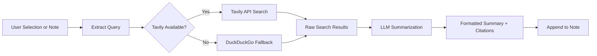

import TLDR from '@site/src/components/TLDR';

# Pesquisa e Busca na Web

<TLDR>
**Notemd consulta a web e insere os resultados resumidos em LLM diretamente nas suas anotações.** Tavily API é o backend de busca principal; DuckDuckGo funciona como um fallback sem configuração. Os resultados são resumidos com citações das fontes e anexados sob um cabeçalho `## Research`. Suporta pesquisa em única anotação, pesquisa em pastas em lote e seleção de modelo por tarefa para a etapa de resumo.

Isso faz parte do [Obsidian Guia de Gestão de Conhecimento de IA](/docs/pillar-ai-knowledge).
</TLDR>

## Visão Geral

A pesquisa é uma das integrações mais poderosas do Notemd: ela fecha o ciclo entre leitura, busca e escrita. Em vez de abrir um navegador para buscar um termo desconhecido, basta destacá‑lo e deixar que Notemd faça a busca, o resumo e anexe as descobertas — tudo dentro do seu vault.

O processo é totalmente configurável. Você escolhe o provedor de busca, o LLM que escreve o resumo e se os resultados devem ser anexados à anotação ativa ou gravados em arquivos separados. O modo em lote permite pesquisar todas as anotações de uma pasta com um único clique.

## Como Funciona

### Pipeline de Busca e Resumo



1. **Extração da consulta** -- Notemd extrai os termos de busca da sua seleção ou do título da anotação.
2. **Busca na web** -- Tavily é tentado primeiro. Se nenhuma chave API estiver configurada, DuckDuckGo é usado automaticamente (não é necessária chave alguma).
3. **Resumo com LLM** -- Os resultados brutos da busca são enviados ao LLM configurado, que gera um resumo conciso com citações de fonte embutidas.
4. **Anexar** -- O resumo formatado é anexado sob um cabeçalho `## Research` na anotação ativa.

### Tavily vs. DuckDuckGo

| Aspecto | Tavily | DuckDuckGo |
|--------|--------|------------|
| Chave API | Necessário (versão gratuita disponível) | Não necessário |
| Qualidade do resultado | Mais alta (desenvolvida especificamente para IA) | Adequada para consultas gerais |
| Limites de taxa | Nível gratuito generoso | Sujeito a limitação de velocidade |
| Configuração | `tavilyApiKey` nas configurações | Sem configuração -- fallback automático |

### Pesquisa em pasta em lote

Clique com o botão direito em uma pasta e selecione **"Notemd: Pasta de pesquisa"**. Cada arquivo `.md` na pasta é processado sequencialmente (ou em paralelo, até a concorrência configurada). Cada nota recebe seu próprio resumo da pesquisa.

## Configuração

| Parâmetro | Padrão | Efeito |
|---------|---------|--------|
| `tavilyApiKey` | `''` | Chave Tavily API. Quando vazia, DuckDuckGo é usado exclusivamente. |
| `researchProvider` / `researchModel` | DeepSeek | LLM por tarefa para resumir resultados de busca |
| `maxResearchContentTokens` | `4000` | Orçamento de tokens para o conteúdo enviado ao LLM. O excesso é truncado. |
| `researchAppendToNote` | `true` | Anexar resumo à nota original. Se for falso, cria um arquivo separado. |
| `researchLanguage` | `'en'` | Idioma de saída para a pesquisa resumida |

### Recomendação de modelo por tarefa

A pesquisa se beneficia de um modelo que lida com conteúdo multilíngue e gera textos bem estruturados. Veja alguns exemplos:

- **DeepSeek** -- padrão, acessível e de boa qualidade
- **GPT-4o** -- resumos de maior qualidade, porém mais caro
- **Gemini Flash** -- rápido e barato, adequado para consultas simples

## Exemplo

Você está lendo um artigo sobre *mecanismos de atenção do transformer* e encontra um termo desconhecido: *relative positional encoding*. Em vez de deixar Obsidian:

1. Destaque **"relative positional encoding"**
2. Clique com o botão direito --> **"Notemd: Pesquisar e resumir"**
3. Notemd busca na internet, resume os principais resultados e acrescenta:

```markdown
## Research

### Relative Positional Encoding

Relative positional encoding is a method used in transformer models
where positional information is expressed as relative distances between
tokens rather than absolute positions. Introduced by Shaw et al. (2018),
it improves generalization to unseen sequence lengths compared to
absolute encodings (Vaswani et al., 2017).

Sources:
- [Shaw et al., Self-Attention with Relative Position Representations (2018)](https://arxiv.org/abs/1803.02155)
- [Transformer Positional Encoding Overview](https://example.com/transformer-pos-enc)
```

O resumo agora faz parte do seu repositório, podendo ser pesquisado, vinculado e acessado offline.

## Dicas

- **Defina uma chave Tavily para obter melhores resultados** -- mesmo a versão gratuita oferece maior relevância do que o DuckDuckGo bruto.
- **Use um modelo de resumo eficaz** -- modelos baratos podem simplificar demais conteúdo técnico detalhado.
- **Realize pesquisas em lote** após uma leitura inicial para preencher lacunas em várias anotações ao mesmo tempo.
- **Revise os resumos adicionados** -- LLMs podem gerar informações falsas sobre as fontes. Verifique as afirmações principais.

---

## Próximos passos

- [Notas de Conceito](./concept-notes) -- Extraia e armazene termos importantes dos resultados da pesquisa
- [Links da Wiki](./wiki-links) -- Vincule conceitos derivados da pesquisa em todo o seu repositório
- [Tradução](./translation) -- Traduza resumos de pesquisa para outro idioma
- [LLM Fornecedores](/docs/providers/overview) -- Configurar o modelo usado para resumo
