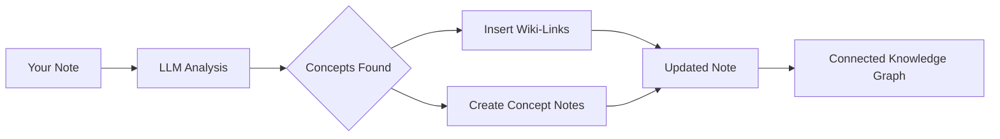

import TLDR from '@site/src/components/TLDR';

# Wiki-Links

<TLDR>
**Notemd adiciona automaticamente `[[wiki-links]]` aos conceitos-chave em suas anotações.** O LLM lê seu conteúdo, identifica termos importantes no contexto e insere links wiki no estilo Obsidian em cada ocorrência. Opcionalmente cria arquivos de notas de conceito com backlinks. Suporta supressão de sinônimos, integridade dos links ao renomear/excluir e modo de extração pura (sem modificação de arquivos). Diferentemente do Auto Link, que apenas corresponde a títulos de anotações existentes, Notemd utiliza IA para identificar novos conceitos e criar as anotações correspondentes. Isso faz parte do [Obsidian Guia de Gestão de Conhecimento com IA](/docs/pillar-ai-knowledge).
</TLDR>

## Visão Geral

A criação de links wiki é a funcionalidade principal do Notemd. Ela transforma texto simples em um grafo de conhecimento interconectado por meio de:

1. **Analisando sua anotação** com um LLM
2. **Identificando conceitos-chave** (termos, pessoas, métodos, teorias)
3. **Inserindo `[[wiki-links]]`** em cada ocorrência
4. **Criando notas de conceito** (opcional) com backlinks

## Como Funciona

### Processo



### Exemplo

**Antes:**
```markdown
Machine learning models use neural networks to learn patterns from data.
The transformer architecture revolutionized natural language processing.
```

**Depois:**
```markdown
[[Machine learning]] models use [[neural networks]] to learn patterns from data.
The [[transformer architecture]] revolutionized [[natural language processing]].
```

## Uso

### Básico: Adicionar links à anotação atual

1. Abra uma nota
2. Clique com o botão direito no editor → **"Processar arquivo (adicionar links)"**
3. Aguarde alguns segundos
4. Os conceitos agora estão vinculados!

### Lote: Processar Várias Anotações

1. Clique com o botão direito em uma pasta no explorador de arquivos
2. Selecione **"Notemd: Processar pasta (adicionar links)"**
3. Configurar:
   - Concorrência (quantos arquivos em paralelo)
   - Sobrescrever links existentes (sim/não)
4. Clique em **Processar**

### Seletivo: Vincular Texto Específico

1. Destacar o texto a ser processado
2. Clique com o botão direito → **"Processar seleção (adicionar links)"**
3. Apenas a parte destacada é analisada

## Notemd vs Link Automático

Obsidian possui duas abordagens para vinculação automática em wiki:

| | **Link Automático** | **Notemd** |
|--|---------------|-------------|
| Fonte do link | Títulos de anotações existentes no vault | Conceitos identificados por LLM no conteúdo |
| Pode criar links para novos conceitos | Não — o título já deve existir | Sim — a IA identifica conceitos e cria notas |
| Tratamento de sinônimos | Não | Sim — supressão de sinônimos |
| Criação de nota de conceito | Não | Sim — com backlinks e eliminação de duplicatas |
| Processamento em lote | Não (arquivo único) | Sim (nível de pasta) |
| Roteamento de modelo por tarefa | Não | Sim |

**Auto Link** faz correspondência de título: se houver uma nota chamada "Machine Learning", ela envolve as ocorrências em `[[Machine Learning]]`. Se a nota não existir, nada acontece.

**Notemd** é controlado pela IA: o LLM lê seu conteúdo, entende o contexto, identifica conceitos que *deveriam* ser vinculados — mesmo que ainda não haja nota — e cria tanto o link quanto a nota de conceito.

## Recursos

### Supressão de Sinônimos

**Problema:** "transformer", "transformers", "Transformer architecture" → 3 conceitos separados

**Solução:** Notemd detecta quase duplicatas e utiliza a forma canônica.

**Configuração:**
```
Settings → Advanced → Synonym Suppression
Threshold: 0.8 (0 = off, 1 = aggressive)
```

### Integridade do link

**Ao renomear uma nota conceitual:**
- Todos os links da wiki são atualizados automaticamente (Obsidian recurso principal)
- Os backlinks permanecem intactos

**Ao excluir uma nota conceitual:**
- Os links permanecem, mas aparecem como "menções desvinculadas"
- É possível recriá‑la a partir de qualquer ocorrência

### Modo de extração pura

**Extraia conceitos sem modificar o original:**

1. Clique com o botão direito → **"Extrair conceitos (sem vinculação)"**
2. As notas conceituais são criadas
3. O arquivo original permanece inalterado

Caso de uso: Processamento de conteúdo somente leitura ou rascunhos finais.

## Geração de Nota Conceitual

### Criação automática

**Quando ativado (padrão), Notemd cria:**

```markdown
---
tags: [concept, auto-generated]
created: 2026-06-13
source: [[Original Note Name]]
---

# Machine Learning

A branch of artificial intelligence that enables computers
to learn from data without explicit programming.

## Occurrences in Your Vault

- [[Original Note Name#Section]]
- [[Another Note#Header]]

## Related Concepts

- [[Neural Networks]]
- [[Deep Learning]]
- [[Supervised Learning]]
```

### Configuração

**Pasta de saída:**
```
Settings → Output → Concept Folder
Default: concepts/
```

**Estrutura hierárquica:**
```
Settings → Output → Use Hierarchical Folders
If enabled:
  papers/my-paper.md → papers/concepts/Concept.md
If disabled:
  → concepts/Concept.md
```

**Modelo:**
```
Settings → Output → Concept Template
Customize with variables:
  {{concept}} — Concept name
  {{description}} — LLM-generated description
  {{backlinks}} — List of source notes
  {{date}} — Creation date
```

## Opções Avançadas

### Janela de Contexto

**Quantidade de texto ao redor a ser enviado:**

```
Settings → Linking → Context Window
Options: Sentence | Paragraph | Full Note
Default: Paragraph
```

Mais = maior precisão, custo mais alto.

### Ocorrências Mínimas

**Somente vincular conceitos que aparecem várias vezes:**

```
Settings → Linking → Min Occurrences
Default: 1 (link all)
```

Defina como 2 ou 3 para focar em temas recorrentes.

### Padrões a Excluir

**Ignorar certas palavras:**

```
Settings → Linking → Exclude List
Example: note, idea, example, thing
```

Impede o vinculamento excessivo de termos genéricos.

### Prompts Personalizados

**Sobrescrever as instruções padrão do LLM:**

```
Settings → Advanced → Custom Linking Prompt
Default:
  "Identify key concepts, theories, methods, and technical
   terms in the following text. Return as a list..."
```

Modifique conforme necessidades específicas do domínio (por exemplo, "Foco em terminologia médica").

## Dicas e Melhores Práticas

### ✅ FAÇA

- **Processe notas com mais de 100 palavras** — Notas curtas apresentam poucos conceitos
- **Use modelos poderosos** para uma melhor identificação de conceitos (GPT-4o, Claude)
- **Revise antes de aceitar** — Verifique se os links sugeridos fazem sentido
- **Construa de forma iterativa** — Processe de 5 a 10 notas, revise o grafo e ajuste as configurações

### ❌ NÃO FAÇA

- **Excesso de links** — Nem todo substantivo precisa de um link
- **Processe rascunhos repetidamente** — Os conceitos podem mudar, aguarde até que fiquem estáveis
- **Ignore sinônimos** — Ative a supressão para evitar "ML" vs "Machine Learning"

## Desempenho

### Velocidade

| Tamanho da Nota | GPT-4o-mini | Claude Sonnet | Ollama (local) |
|-----------|-------------|---------------|----------------|
| 500 palavras | 2-3 segundos | 3-5 segundos | 5-10 segundos |
| 2000 palavras | 5-8 segundos | 10-15 segundos | 20-40 segundos |
| 5000+ palavras | Em blocos (várias chamadas) | Em blocos | Em blocos |

### Estimativa de Custo

**Exemplo: nota de 1000 palavras com GPT-4o-mini**
- Entrada: ~1500 tokens
- Saída: ~200 tokens
- Custo: ~

**Processamento em lote de 100 notas:** ~

## Solução de problemas

### Nenhum link adicionado

**Verificar:**
1. LLM A chamada foi bem-sucedida (Configurações → Diagnóstico)
2. A nota tem conteúdo suficiente (>50 palavras)
3. Os conceitos são técnicos/específicos (não apenas pronomes)

**Tente:**
- Use um modelo mais poderoso
- Aumentar a janela de contexto
- Verificar a validade da chave API

### Muitos links

**Soluções:**
1. Aumentar o número mínimo de ocorrências (2 ou 3)
2. Adicionar palavras comuns à lista de exclusão
3. Use um modelo menos agressivo

### Conceitos incorretos vinculados

**Correções:**
1. Use um prompt personalizado para especificidade de domínio
2. Habilite a supressão de sinônimos
3. Revise manualmente e desvincule

### Os links quebram após renomear

**Esse é um comportamento normal Obsidian.**

Para atualizar todos os links:
1. Renomeie a nota conceitual
2. Obsidian atualiza automaticamente `[[old]]` → `[[new]]`

---

## Próximos passos

- 📖 [Notas Conceituais](./concept-notes) — Análise aprofundada da geração de notas conceituais
- 🔍 [Integração de Pesquisa](./research) — Combine vinculação com pesquisa na web
- 🎨 [Diagramas](./diagrams) — Visualize seu grafo de conhecimento
