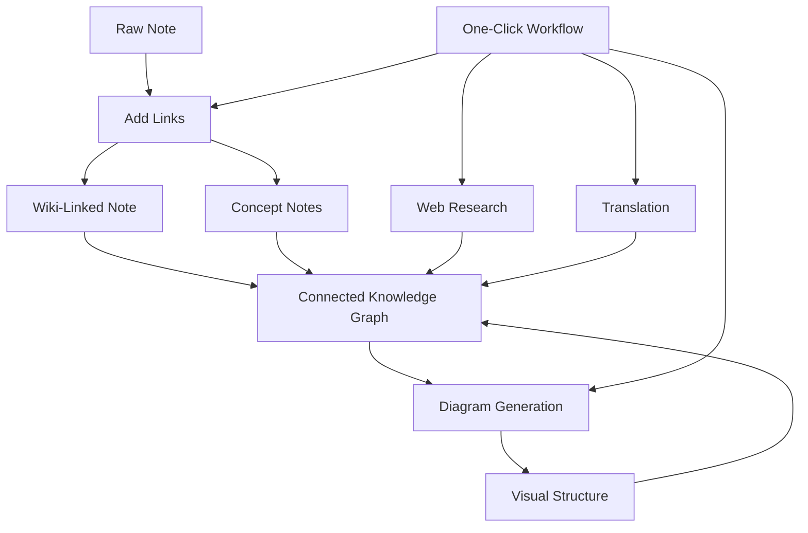

import TLDR from '@site/src/components/TLDR';

# Obsidian Guia de Gestão de Conhecimento com IA

<TLDR>
**Notemd transforma a leitura impulsionada por LLM em conhecimento persistente: links de wiki conectam conceitos, notas de conceito criam um grafo recuperável, a pesquisa traz informações da web para o seu repositório, a tradução quebra barreiras linguísticas, os diagramas tornam a estrutura visível e os fluxos de trabalho unem tudo com um único clique.** Este guia abrange todo o processo — desde notas brutas até uma base de conhecimento interconectada, visual e multilíngue.
</TLDR>

## Por que Gestão de Conhecimento com IA?

A anotação tradicional gera arquivos planos. Mesmo com links de wiki manuais, a maioria das notas permanece desconectada. Notemd utiliza LLMs para automatizar a camada de conexão:

- **LLMs leem seu conteúdo** e identificam o que é importante — termos, métodos, pessoas, teorias
- **Os links são inseridos automaticamente** em cada ocorrência de conceito, sem ficarem escondidos em "ver também"
- **Notas de conceito são geradas** como arquivos independentes e recuperáveis
- **A pesquisa enriquece as notas** com contexto proveniente da web
- **Os diagramas tornam a estrutura visível** — mapas mentais, fluxogramas, gráficos de dados a partir do mesmo conteúdo

O resultado: um grafo de conhecimento que cresce a cada nota que você processa, e não apenas quando se lembra de adicionar links.

## O Processo Completo



Cada etapa é independente. Use uma ou todas. A sequência mais eficaz: **Adicionar Links → Notas de Conceito → Diagramas**.

---

## 1. Links de Wiki: Tornando as Conexões Explícitas

Links de wiki são a espinha dorsal de um grafo de conhecimento. Notemd utiliza um LLM para:

1. Leia o conteúdo da sua nota (dividindo em partes para documentos longos)
2. Identifique os conceitos principais — dando prioridade a termos técnicos específicos em vez de substantivos genéricos
3. Insira `[[wiki-links]]` em cada ocorrência
4. Suprima sinônimos para que "ML" e "Machine Learning" não criem nós separados

### Quando usar

- **Todas as notas com mais de 100 palavras** — notas mais curtas geram poucos conceitos
- **Artigos de pesquisa, documentos técnicos, notas de reunião** — ricos em termos específicos do domínio
- **Depois que o conteúdo estiver estável** — não processe repetidamente rascunhos

### Configurações principais

| Parâmetro | Recomendado | Por quê |
|---------|-----------|-----|
| `addLinksProvider` | DeepSeek ou GPT-4o-mini | Boa precisão a baixo custo |
| Supressão de sinônimos | Ativado | Impede a criação de nós duplicados |
| Janela de contexto | Parágrafo | Equilíbrio entre precisão e custo |

→ [Aprofundamento em links da Wiki](/docs/features/wiki-links)

---

## 2. Notas conceituais: Nós de conhecimento recuperáveis

Os links da Wiki conectam ideias de forma inline, mas as notas conceituais permitem que cada ideia seja recuperada independentemente. Cada conceito possui seu próprio arquivo `.md`:

```markdown
# Machine Learning

## Linked From
- [[My Research Notes]]
- [[Neural Networks Explained]]
```

### O processo de extração

O prompt LLM é altamente estruturado:
- Normalizar para forma singular
- Preferir conceitos de várias palavras em vez de palavras únicas ("Relaxação dielétrica" e não "Relaxação")
- Ignorar seções de referências/bibliografia
- Gerar saída em linhas `CONCEPT:` para uma análise determinística

Os conceitos são deduplicados entre os blocos por meio de `Set<string>`. Erros LLM em blocos individuais não interrompem a operação.

### Backlinks

Quando ativado, cada nota conceitual registra quais notas de fonte a mencionam. O painel de backlinks nativo do Obsidian também exibe conexões reversas.

### Deduplicação

O mecanismo de deduplicação em 4 etapas do Notemd detecta:
1. **Correspondências exatas** — comparação de nomes de arquivo insensível a maiúsculas e minúsculas
2. **Formas plurais** — "Models.md" vs "Model.md"
3. **Normalização de símbolos** — "A-B.md" vs "A B.md"
4. **Contenção de palavra única** — "ML.md" é marcado quando "Machine Learning.md" existe

### Configurações da chave

| Parâmetro | Recomendado | Por quê |
|---------|-----------|-----|
| `conceptNoteFolder` | `concepts/` ou `🧠 concepts/` | Mantém o vault organizado |
| `extractConceptsAddBacklink` | Ativado | Habilita busca reversa |
| `extractConceptsMinimalTemplate` | Desativado | Modelo completo com Linked From |
| Modelo por tarefa | DeepSeek | A extração de conceitos não precisa de modelos caros |
| Supressão de sinônimos | Ativado | A mesma configuração afeta tanto a vinculação quanto a extração |

→ [Notas de Conceito: Aprofundamento](/docs/features/concept-notes)

---

## 3. Pesquisa: Integrando a Web

Notemd integra a busca na web ao seu fluxo de trabalho de anotações:

1. **Construção da consulta** — o título ou seleção da nota se torna uma consulta de busca
2. **Busca na web** — Tavily (recomendado, chave API necessária) ou DuckDuckGo (grátis, sem chave)
3. **Resumo LLM** — os resultados da busca são condensados em um resumo relevante
4. **Anexar à nota** — o resumo é adicionado na posição do cursor ou como uma nova seção

### Quando usar

- Antes de processar um novo tópico — obtenha primeiro o contexto da web
- Quando uma nota de conceito precisa de enriquecimento — pesquise e depois adicione links
- Para revisões bibliográficas — faça pesquisa em lote em uma pasta de notas

### Configurações principais

| Parâmetro | Recomendado | Por quê |
|---------|-----------|-----|
| `researchProvider` | GPT-4o ou Claude | A pesquisa requer um resumo de maior qualidade |
| Serviço de busca | Tavily | Melhor relevância, profundidade configurável |
| `maxResearchContentTokens` | 4000 | Equilíbrio entre profundidade e custo |

→ [Pesquisa aprofundada](/docs/features/research)

---

## 4. Tradução: Quebrando barreiras linguísticas

Notemd traduz notas usando o LLM configurado por você — não um serviço de tradução dedicado API. Isso significa:

- **Traduções com compreensão de contexto** — o LLM entende todo o documento, e não apenas frase por frase
- **Tratamento de termos técnicos** — "gradient descent" permanece como "梯度下降" e não como "坡度向下"
- **Suporte a lotes** — traduza uma pasta inteira de notas em uma única operação
- **Modelo por tarefa** — use o Gemini Flash para tradução (rápido, barato e multilíngue)

### Suporte a idiomas

O Notemd em si suporta 21 idiomas UI. O idioma de destino da tradução pode ser configurado por tarefa. Pares comuns: EN↔ZH, EN↔JA, EN↔KO, EN↔DE, EN↔FR, EN↔ES.

→ [Aprofundamento em tradução](/docs/features/translation)

---

## 5. Diagramas: Tornando a estrutura visível

O pipeline de diagramas do Notemd segue primeiro as especificações: o LLM gera um `DiagramSpec` JSON estruturado, e depois os adaptadores o convertem para o formato desejado. Isso resulta em saídas mais confiáveis do que solicitar ao LLM a sintaxe bruta do Mermaid.

### Detecção de intenção

O Notemd infere o melhor tipo de diagrama a partir do conteúdo:

- **Tabelas com números** → gráfico de dados (Vega-Lite)
- **Vocabulário cliente/servidor** → diagrama de sequência (Mermaid)
- **Entidade/chave primária** → diagrama ER (Mermaid)
- **Etapa/fluxo de processo** → fluxograma (Mermaid)
- **Palavras-chave do mapa conceitual** → JSON Canvas (Obsidian nativo)
- **Padrão** → mapa mental (Mermaid)

### Cadeia de renderização

Alvo principal → fallback → fallback → HTML. Se a sintaxe Mermaid falhar, ele tenta novamente uma vez com o contexto do erro para o LLM, e depois recorre a um diagrama mínimo.

### Configurações principais

| Parâmetro | Recomendado | Por quê |
|---------|-----------|-----|
| `enableExperimentalDiagramPipeline` | Ativado | Melhor qualidade por meio de especificação em primeiro lugar |
| `experimentalDiagramCompatibilityMode` | `best-fit` | Alvo nativo por intenção |
| `summarizeToMermaidProvider` | GPT-4o ou Claude | As especificações do diagrama exigem raciocínio espacial |
| `autoMermaidFixAfterGenerate` | Ativado | Captura automaticamente erros de sintaxe LLM |
| Aumento do conhecimento local | Ativado para domínios específicos | Melhora a precisão com o contexto do vault |

→ [Diagrams deep dive](/docs/features/diagrams)

---

## 6. Fluxos de trabalho: Automação com um clique

Os fluxos de trabalho conectam várias tarefas em um único botão da barra lateral. O formato DSL é:

```
task1 | task2 | task3
```

Exemplo: `addLinks | extractConcepts | generateDiagram` — transforma uma nota de texto bruto em um nó de conhecimento visual totalmente conectado com um único clique.

### Fluxos de trabalho recomendados

| Fluxo de trabalho | Cadeia | Caso de Uso |
|----------|-------|----------|
| Processo completo | `addLinks \| extractConcepts \| generateDiagram` | Novas notas |
| Pesquisa primeiro | `research \| addLinks` | Tópicos desconhecidos |
| Polyglot | `translate \| addLinks` | Notas multilíngues |
| Apenas diagrama | `generateDiagram` | Visualização rápida |

→ [Análise aprofundada de fluxos de trabalho](/docs/features/workflows)

---

## 7. LLM Provedores: 36 opções, do cloud ao local

Notemd suporta 36 provedores em 4 tipos de transporte. Grupos principais:

- **Cloud internacional**: OpenAI, Anthropic, Google, Mistral, xAI
- **Cloud da China**: DeepSeek, Qwen, Doubao, Moonshot, GLM, Baidu, SiliconFlow
- **Gateways**: OpenRouter, GitHub Models, Hugging Face, Vercel
- **Local**: Ollama, LMStudio, OVMS — sem chave API, nenhum dado sai da sua máquina

### Estratégia de modelo por tarefa

A configuração mais econômica utiliza modelos baratos para tarefas simples e modelos poderosos para tarefas complexas:

```
extractConcepts  → DeepSeek (fast, cheap, accurate enough)
addLinks          → DeepSeek or GPT-4o-mini
research          → GPT-4o or Claude (needs quality)
generateDiagram   → GPT-4o or Claude (needs spatial reasoning)
translate         → Gemini Flash (fast, multilingual)
```

→ [Visão geral dos LLM Provedores](/docs/providers/overview)

---

## Lista de verificação para começar

1. **Instalar Notemd** — [Plugins da comunidade](/docs/getting-started/installation) (recomendado) ou manualmente
2. **Configurar um provedor** — DeepSeek (mais fácil), OpenAI ou Ollama (grátis)
3. **Processar sua primeira nota** — clique com o botão direito → "Processar arquivo (adicionar links)"
4. **Definir pasta de conceitos** — Configurações → Notemd → Saída → Pasta de Conceitos
5. **Extrair conceitos** — execute "Extrair conceitos" na mesma anotação
6. **Gerar um diagrama** — execute "Gerar diagrama" para visualizar as conexões
7. **Criar um fluxo de trabalho** — conecte os passos acima em um botão de um clique

## Configurações Recomendadas

### Estudante (Orçamento)

```
Provider: DeepSeek (free tier available)
Concept extraction: DeepSeek
Research: DuckDuckGo (free) + DeepSeek
Diagrams: Off (or legacy Mermaid)
Workflows: addLinks | extractConcepts
```

### Pesquisador (Qualidade)

```
Provider: GPT-4o (primary)
Concept extraction: DeepSeek (cost savings)
Research: GPT-4o + Tavily
Diagrams: best-fit mode, GPT-4o
Workflows: research | addLinks | extractConcepts | generateDiagram
```

### Privacidade em Primeiro Lugar (Apenas Local)

```
Provider: Ollama (llama3 or qwen2.5:7b)
All tasks: Ollama
Research: DuckDuckGo (free, no API key)
Diagrams: legacy Mermaid mode
```

### Bilingue (ZH + EN)

```
Primary: DeepSeek (Chinese queries)
Translation: Google Gemini Flash
Research: Tavily + DeepSeek (Chinese search context)
Language output: per-task (extractConceptsLanguage: zh-CN)
```

---

## Padrões Comuns

### Padrão: Processar um artigo de pesquisa

1. Importar conteúdo de PDF (ou colar)
2. **Pesquisar** — obter contexto da web sobre o tema
3. **Adicionar links** — identificar e vincular conceitos importantes
4. **Extrair conceitos** — criar anotações independentes
5. **Gerar Diagrama** — visualizar a estrutura do artigo

### Padrão: Enriquecimento de notas diárias

1. Escrever nota diária
2. **Adicionar Links** — conecta as ideias de hoje a conceitos existentes
3. As notas de conceito são atualizadas automaticamente com backlinks

### Padrão: Revisão Bibliográfica

1. Criar pasta com artigos/notas
2. **Adicionar Links em Lote** — processar toda a pasta
3. **Deduplicar Conceitos** — limpar notas quase duplicadas
4. **Gerar Diagrama** — mapa mental de toda a literatura

---

*Notemd é de código aberto (MIT) e funciona com Obsidian 0.15.0+ em todas as plataformas. [Instalar agora](/docs/getting-started/installation) ou [ver no GitHub](https://github.com/Jacobinwwey/obsidian-NotEMD).*
