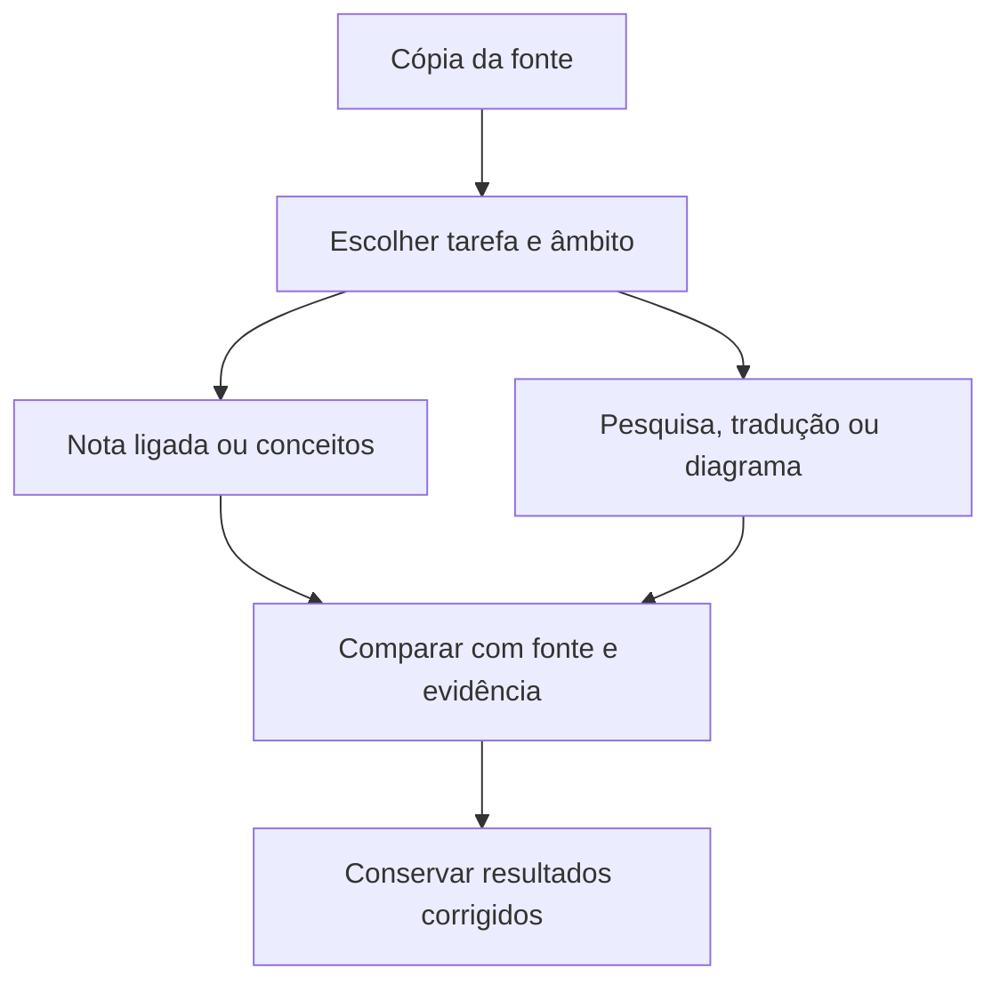

import TLDR from '@site/src/components/TLDR';

# Gestão do conhecimento com IA no Obsidian

<TLDR>
Um fluxo útil distingue fontes, respostas do modelo e correções próprias. Notemd oferece links, extração, pesquisa, tradução e diagramas como documentos verificáveis. Começar com uma fonte, rever e depois automatizar uma pasta delimitada.
</TLDR>

## Definir o resultado

Escolher nota ligada, conceitos, resumo com fontes, tradução ou diagrama. Mais documentos e ligações não garantem compreensão ou recuperação. Definir como verificar e reencontrar o conteúdo.

## Percurso completo


```mermaid
flowchart TD
    A[Cópia da fonte] --> B[Escolher tarefa e âmbito]
    B --> C[Nota ligada ou conceitos]
    B --> D[Pesquisa, tradução ou diagrama]
    C --> E[Comparar com fonte e evidência]
    D --> E
    E --> F[Conservar resultados corrigidos]
```

São tarefas disponíveis, não etapas executadas todas por um botão padrão. Preservar origem e verificar destinos antes de encadear.

## 1. Links: tornar relações explícitas

Executar **Processar arquivo (adicionar links)** e rever `_processed.md`. Verificar utilidade dos termos e fidelidade de citações, código e fórmulas.

Domínio e instruções contra equivalências orientam sem impor identidade ou limiar numérico. Preferir correspondência determinista quando a repetibilidade de títulos existentes for prioritária. [Links](./features/wiki-links).

## 2. Conceitos: separar termo e explicação

Escolher pasta. Extração independente mantém a origem e cria apenas títulos. Para `Linked From` nas novas notas, ativar backlinks e desativar forma mínima.

**Gerar em lote a partir dos títulos** é separado e pode completar notas anteriores elegíveis. Usar pasta de teste e verificar movimento para complete. Rever duplicados por nome antes de apagar; significados podem diferir. [Conceitos](./features/concept-notes).

## 3. Pesquisa: conservar evidência

Escolher tema/título e Tavily ou DuckDuckGo, depois **Pesquisar e resumir**. Chave Tavily ausente não muda o motor. Abrir fontes e confirmar afirmações.

A pesquisa local opcional é lexical e envia excertos ao modelo escolhido. Indexação local não garante percurso offline ou restrito ao dispositivo. [Pesquisa](./features/research).

## 4. Tradução: sentido e estrutura

Escolher idioma e traduzir o documento. Sufixo padrão `_<language>.md`; resultados existentes podem ser substituídos. Para trecho, criar nota temporária.

Comparar termos, números, código, links e matemática. Divisão pode perder contexto. Os 21 idiomas UI e 34 rotas do site não comprovam qualidade de pares linguísticos. [Tradução](./features/translation).

## 5. Diagramas: escolher fontes editáveis

Selecione vários tipos de diagrama em uma execução e vários formatos independentes para cada tipo. Desmarcar um tipo mantém seus formatos; sem seleção, o conteúdo é analisado automaticamente. A caixa de seleção inclui o tipo. Clique no nome para selecioná-lo e editar os formatos. Passar o ponteiro ou usar o foco do teclado muda a prévia sem salvar configurações. Escape fecha o menu e devolve o foco.

CircuitikZ é restrito e a compilação tem teste próprio. Setas Drawnix entre ramos são estáticas. Tabelas PowerPoint melhoram, mas Mermaid/SVG podem ser imagens. [Diagramas](./features/diagrams).

## 6. Fluxos: automatizar uma sequência validada

Nome, `::` e ações separadas por `>` definem a cadeia:

```text
One-Click Extract::process-current-add-links>batch-generate-from-titles>batch-mermaid-fix
```

Inclui links, geração por títulos e reparação Mermaid, não pesquisa ou diagrama genéricos. Cada ação mantém requisitos e saídas.

O padrão interrompe após erro comunicado. Continuar só quando as etapas seguintes aceitam as entradas restantes. Cancelar não desfaz resultados concluídos. [Fluxos](./features/workflows).

## 7. Fornecedores: protocolo e tarefa

36 perfis cobrem cinco famílias. Escolher por endereço, direitos, regras de dados e resultados medidos. Comparar tempo/custo com a mesma fonte e prompt.

Rotas por tarefa começam desligadas. Ativar para separar perfis e rever todas antes de considerar o fluxo local. [Fornecedores](./providers/overview).

## Verificações iniciais

1. Instalar e guardar cópia das fontes.
2. Configurar e testar modelo exato.
3. Escolher pasta conceptual e destinos distintos.
4. Testar uma cópia.
5. Comparar e guardar correções.
6. Ampliar para pasta pequena e rever resultados parciais antes de cadeias longas.

## Casos habituais

### Trabalhar um artigo

Converter para Markdown externamente e rever tabelas, fórmulas e imagens. Extrair conceitos/passagens, pesquisar perguntas específicas e desenhar apenas relações verificáveis. Conservar artigo e correções.

### Manter conceitos

Usar pasta dedicada, rever termos e gerar explicações para subconjunto escolhido. Fazer backup antes de limpeza. Quantidade não substitui definições exatas e navegação útil.

### Material privado

Preparar servidor local, modelos e dependências. Verificar rotas e evitar pesquisa de rede quando necessário. Rever diagnósticos antes de partilhar. Um padrão loopback não impede configuração remota.

### Retomar um lote

Esperar pela conclusão do cancelamento ou falha. Rever relatório, saídas e recuperação; comparar conflitos e repetir apenas o pretendido. Cancelado não significa vazio; não apagar acompanhantes sem verificar referências.

## Próximos passos

- [Início rápido](./getting-started/quick-start).
- [Lotes](./advanced/batch-processing).
- [Desenvolvimento](./developers/overview).
- [Agentes](./agents/overview).
