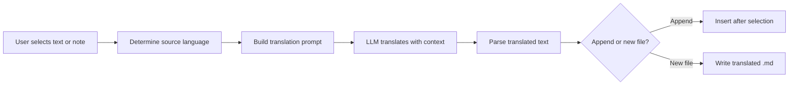

import TLDR from '@site/src/components/TLDR';

# Tradução

<TLDR>
**Notemd traduz texto entre 21+ idiomas usando a tradução alimentada por LLM.** Suporta tradução de seleção única, tradução de toda a nota e tradução em lote de pastas. Cada tarefa de tradução pode usar um provedor e modelo dedicados por meio das configurações da tarefa. O idioma de saída pode ser configurado independentemente do idioma UI. Os resultados são anexados ou gravados em um novo arquivo, dependendo da sua preferência.

Isso faz parte do [Obsidian Guia de Gestão de Conhecimento de IA](/docs/pillar-ai-knowledge).
</TLDR>

## Visão Geral

A tradução em Notemd não é uma busca em dicionário -- é uma tradução consciente do contexto, alimentada por LLM. O modelo analisa o parágrafo ou nota inteira, preservando o tom, a terminologia do domínio e a estrutura das frases. Isso gera resultados de maior qualidade em comparação com serviços de tradução frase a frase, especialmente para textos técnicos, acadêmicos e criativos.

O recurso suporta três escopos: seleção, nota ativa e toda a pasta. Combinado com a seleção de modelo por tarefa, você pode usar um modelo rápido (Gemini Flash) para traduções casuais e um modelo poderoso (Claude Sonnet) para conteúdo sensível a nuances -- sem precisar alterar seu provedor global.

## Como Funciona

### O Comando Traduzir



1. **Detecção de fonte** -- O LLM infere o idioma de origem a partir do conteúdo. Não é necessário especificá‑lo manualmente.
2. **Construção do prompt** -- Notemd cria um prompt que inclui o idioma de destino, uma dica opcional de domínio e o conteúdo a ser traduzido.
3. **Tradução LLM** -- O `translateProvider` / `translateModel` configurado processa o pedido. O modelo preserva a formatação em markdown, links wiki e blocos de código.
4. **Saída** -- O texto traduzido é anexado abaixo do original ou gravado em um novo arquivo no vault.

### Pares de Idiomas

Notemd suporta qualquer par de idiomas que o LLM subjacente suporte. Pares comuns incluem:

| Fonte | Alvo | Qualidade Típica |
|--------|--------|----------------|
| Inglês | Chinês Simplificado | Excelente |
| Chinês | Inglês | Excelente |
| Inglês | Japonês | Muito bom |
| Inglês | Alemão / Francês / Espanhol | Muito bom |
| Qualquer idioma suportado | Qualquer idioma suportado | Depende do modelo |

A configuração `translateLanguage` controla o **idioma de saída**. O idioma de origem é detectado automaticamente.

### Seleção de Modelo por Tarefa

A qualidade da tradução varia significativamente conforme o modelo. Notemd permite que você atribua um modelo dedicado apenas para tradução:

| Modelo | Velocidade | Qualidade | Custo | Melhor para |
|-------|-------|--------|------|----------|
| `gemini-2.0-flash-exp` | Rápido | Bom | Baixo | Uso casual, alto volume |
| `gpt-4o-mini` | Rápido | Bom | Baixo | Consultas rápidas |
| `deepseek-chat` | Médio | Bom | Muito baixo | Multilíngue de orçamento |
| `claude-3-5-sonnet` | Médio | Excelente | Médio | Técnico / acadêmico |
| `gpt-4o` | Médio | Excelente | Médio | Prosa sensível a nuances |

### Tradução de pasta em lote

Clique com o botão direito em uma pasta e selecione **"Notemd: Traduzir pasta"** para traduzir todas as anotações nessa pasta. Cada arquivo é processado independentemente. A configuração de concorrência controla quantos arquivos são traduzidos simultaneamente.

## Configuração

| Parâmetro | Padrão | Efeito |
|---------|---------|--------|
| `translateProvider` / `translateModel` | DeepSeek | Fornecedor dedicado para tarefas de tradução |
| `translateLanguage` | `'en'` | Linguagem de saída alvo |
| `translationAppendToNote` | `true` | Adicione o texto traduzido abaixo do original. Se for false, será criado um novo arquivo. |
| `batchConcurrency` | `3` | Número de arquivos processados em paralelo durante a tradução em lote |

## Exemplo

Você está lendo uma nota de pesquisa em chinês e deseja uma versão em inglês:

1. Abra a nota
2. Clique com o botão direito --> **"Notemd: Traduzir arquivo atual"**
3. Notemd detecta o chinês, traduz para o idioma de destino configurado (inglês) e adiciona:

```markdown
## Translation (English)

The experimental results show that the proposed method achieves
a 12% improvement in F1 score compared to the baseline, primarily
due to the enhanced feature extraction module described in Section 3.
```

O texto chinês original permanece intacto acima da tradução. O cabeçalho `## Translation` mantém ambas as versões no mesmo arquivo para fácil referência.

## Dicas

- **Use Gemini Flash para grandes volumes** -- é a opção mais rápida e econômica para tradução em lote de pastas grandes.
- **Preservar links da wiki** -- O comando de Notemd instrui o LLM a manter `[[wiki-links]]` intacto na tradução. Verifique após a tradução, pois alguns modelos às vezes os desempacotam.
- **Definir explicitamente o idioma de saída** -- A detecção automática funciona para o texto de origem, mas configure sempre `translateLanguage` para evitar ambiguidades quanto ao destino.
- **Traduzir em lote notas conceituais** -- Se sua pasta de conceitos estiver em um idioma e você precisar dela em outro, a tradução em nível de pasta resolve isso em um único passo.

---

## Próximos passos

- [Pesquisa](./research) -- Pesquise e resuma em qualquer idioma, depois traduza os resultados
- [Fluxos de trabalho](./workflows) -- Encadeie traduções com links da wiki ou extração de conceitos
- [Processamento em lote](/docs/advanced/batch-processing) -- Comportamento de concorrência e sobrescrita para operações em pastas
- [LLM Fornecedores](/docs/providers/overview) -- Escolha o melhor modelo para seu par de idiomas
