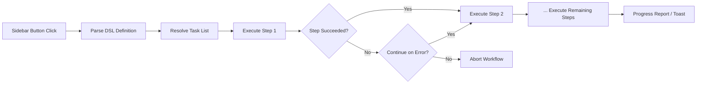

import TLDR from '@site/src/components/TLDR';

# Fluxos de trabalho

<TLDR>
**Notemd fluxos de trabalho encadeiam várias tarefas em uma única ação de um clique.** Defina sequências como `add-links > extract-concepts > research > diagram` usando uma DSL simples. Os fluxos de trabalho aparecem como botões na barra lateral que executam toda a cadeia na nota ou pasta atual. Vêm com fluxos de trabalho predefinidos; crie outros personalizados nas configurações. Cada etapa utiliza sua própria configuração de modelo por tarefa.

Isso faz parte do [Obsidian Guia de Gestão de Conhecimento de IA](/docs/pillar-ai-knowledge).
</TLDR>

## Visão Geral

Um fluxo de trabalho elimina a dificuldade de executar tarefas uma por uma. Em vez de clicar com o botão direito quatro vezes para adicionar links, extrair conceitos, pesquisar termos desconhecidos e gerar um diagrama, basta pressionar um botão na barra lateral e toda a cadeia é executada. Notemd cuida da sequenciamento, propagação de erros e relatórios de progresso.

Os fluxos de trabalho são definidos em uma DSL leve (linguagem específica do domínio). Eles ficam nas configurações, aparecem como botões clicáveis na barra lateral de Obsidian e podem ser aplicados à nota atual ou a uma pasta inteira.

## Como Funciona

### Pipeline de Execução de Fluxos de Trabalho



1. **Parse** -- A string da DSL é dividida em `>` (ou `>`) para obter uma lista ordenada de identificadores de tarefa.
2. **Resolve** -- Cada identificador é mapeado a um comando interno (add-links, extract-concepts, research, translate, diagram, etc.).
3. **Execute** -- As etapas são executadas sequencialmente. Cada etapa utiliza o provedor e modelo configurados para aquela tarefa.
4. **Tratamento de erros** -- Se uma etapa falhar, o fluxo de trabalho pode ser interrompido ou continuar para a próxima etapa, dependendo da política de erro definida.
5. **Done** -- Uma notificação aparece para informar o sucesso ou listar quaisquer etapas que falharam.

### Formato da DSL

Os fluxos de trabalho são definidos como uma sequência de identificadores de tarefa separados por `>`:

```
process-current-add-links>extract-concepts-current>research-and-summarize
```

**Identificadores de tarefa disponíveis:**

| Identificador | Ação |
|------------|--------|
| `process-current-add-links` | Adicionar links da wiki à nota ativa |
| `extract-concepts-current` | Extrair conceitos da nota ativa |
| `research-and-summarize` | Pesquisar o texto selecionado ou o título da nota |
| `process-current-translate` | Traduzir a nota ativa |
| `summarize-to-mermaid` | Gerar um diagrama a partir da nota ativa |
| `generate-from-title` | Gerar conteúdo a partir do título da nota |
| `extract-original-text` | Extrair o texto original (para OCR / conteúdo escaneado) |

**Variantes em nível de pasta** substituem `current` por `folder` no nome do identificador.

### Fluxos de trabalho predefinidos vs. personalizados

Notemd vem com fluxos de trabalho prontos para padrões comuns:

| Fluxo de trabalho | Cadeia | Caso de Uso |
|----------|-------|----------|
| **Extração com um clique** | adicionar-links > extrair-conceitos > pesquisar | Processar um artigo científico em uma única etapa |
| **Pipeline completo** | adicionar-links > extrair-conceitos > pesquisa > diagrama | Extração completa de conhecimento com visualização |
| **Traduzir + Link** | traduzir > adicionar-links | Traduzir e depois vincular conceitos na língua alvo |

**Fluxos de trabalho personalizados** são criados nas configurações:

1. Abrir **Configurações** --> **Notemd** --> **Fluxos de trabalho**
2. Clicar em **"Adicionar Fluxo de Trabalho"**
3. Inserir a cadeia DSL (por exemplo, `process-current-add-links>extract-concepts-current`)
4. Dar um nome de exibição (por exemplo, "Link Rápido + Extrair")
5. O novo botão aparece imediatamente na barra lateral

## Configuração

| Parâmetro | Padrão | Efeito |
|---------|---------|--------|
| `workflows` | Conjunto predefinido | Array de definições de fluxo de trabalho (nome + DSL) |
| `workflowContinueOnError` | `true` | Continuar para a próxima etapa se a atual falhar |
| `workflowShowProgress` | `true` | Exibir uma notificação de progresso após cada etapa ser concluída |

### Modelos por Tarefa nos Fluxos de Trabalho

Cada etapa em um fluxo de trabalho utiliza sua própria configuração de modelo por tarefa. Não é necessário especificar modelos na própria DSL. A ordem de resolução é:

1. O provedor/modelo por tarefa se `useMultiModelSettings` estiver disponível
2. O `activeProvider` global caso contrário

Isso significa que `add-links` pode ser executado em DeepSeek enquanto `research` é executado no GPT-4o -- tudo dentro do mesmo clique do fluxo de trabalho.

## Exemplo

Você acabou de importar um PDF de um artigo de aprendizado de máquina para o seu vault e deseja extração completa de conhecimento:

1. Abra a nota importada
2. Clique no botão da barra lateral **"Full Pipeline"**
3. Notemd é executado:
   - **Etapa 1**: Adicionar links da wiki -- `[[attention mechanism]]`, `[[transformer]]`, etc.
   - **Etapa 2**: Extrair conceitos -- cria notas de conceito na sua pasta de conceitos
   - **Etapa 3**: Pesquisar -- resume fontes da web para termos-chave
   - **Etapa 4**: Diagrama -- gera um mapa mental Mermaid da estrutura do artigo
4. Após cerca de 30 segundos, sua nota terá links, as notas de conceito estarão disponíveis, a pesquisa será anexada e um arquivo de diagrama será salvo

Tudo isso com apenas um clique.

## Dicas

- **Comece com fluxos de trabalho predefinidos** -- eles cobrem os padrões mais comuns. Personalize apenas quando precisar de uma sequência diferente.
- **Ative `workflowContinueOnError`** -- um erro na etapa de diagrama não deve interromper todo o pipeline.
- **Use fluxos de trabalho de pasta** para processamento em lote -- clique com o botão direito em uma pasta, escolha um fluxo de trabalho e todas as anotações serão processadas.
- **Dê nomes claros aos fluxos de trabalho** -- o espaço na barra lateral é limitado. Use nomes curtos e orientados a ação, como "Extração Rápida" ou "Traduzir + Link".

---

## Próximos passos

- [Pesquisa](./research) -- Entenda o que a etapa de pesquisa faz antes de adicioná‑la aos fluxos de trabalho
- [Links da Wiki](./wiki-links) -- Recurso básico de vinculação usado na maioria dos fluxos de trabalho
- [Notas de Conceito](./concept-notes) -- Extração de conceitos como etapa de fluxo de trabalho
- [Processamento em Lote](/docs/advanced/batch-processing) -- Concorrência e relatórios de progresso para fluxos de trabalho de pasta
