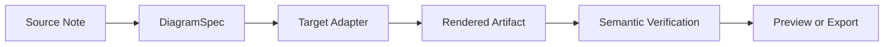
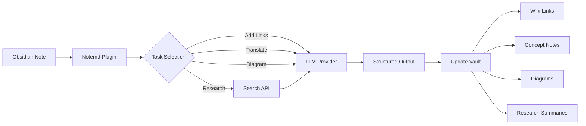

import TLDR from '@site/src/components/TLDR';

# Introdução ao Notemd

<TLDR>
**Notemd** (Nota + EMD — Documentos Markdown aprimorados) é um plugin de código aberto para Obsidian que transforma a leitura impulsionada por LLM em conhecimento persistente. Diferentemente da IA baseada em chat, onde as informações desaparecem após a sessão, Notemd grava os resultados **diretamente no seu vault** na forma de links wiki, notas conceituais, resumos de pesquisa, traduções, fluxos de trabalho e diagramas. Ele foi desenvolvido para pesquisadores, estudantes e profissionais de conhecimento que desejam que a leitura, a pesquisa e as explicações visuais se acumulem em um grafo de conhecimento estruturado e em constante evolução.
</TLDR>

## O que é Notemd?

Notemd integra **mais de 30 modelos de linguagem grandes** (OpenAI, Anthropic, Google, DeepSeek, Qwen, Ollama e outros) ao seu fluxo de trabalho Obsidian para automatizar a extração de conhecimento, sua organização, tradução, pesquisa e geração de diagramas.

### Diferença principal: Conhecimento efêmero vs. persistente

| Aspecto | IA baseada em chat (ChatGPT, etc.) | Notemd |
|--------|-------------------------------|--------|
| **Para onde vão os resultados** | Histórico de conversa (desaparece) | Seu vault Obsidian (permanece) |
| **Formato** | Respostas em texto simples | Arquivos estruturados: `[[wiki-links]]`, notas conceituais, diagramas |
| **Valor a longo prazo** | É preciso perguntar novamente a cada vez | Acumula em um grafo de conhecimento |
| **Acesso off-line** | Requer internet | Funciona totalmente off-line com Ollama |

## Recursos principais

### 1. **Vinculação automática de Wiki**
- LLM identifica conceitos-chave em suas anotações
- Insere `[[wiki-links]]` em cada ocorrência
- Cria opcionalmente anotações de conceitos vinculados
- Supressão de sinônimos para evitar duplicatas

### 2. **Geração de anotações de conceito**
- Extraí os conceitos principais de artigos, papers e anotações
- Gera arquivos de conceito dedicados com backlinks
- Caminhos de saída e modelos personalizáveis

### 3. **Integração de pesquisa na web**
- Consulte Tavily ou DuckDuckGo diretamente dentro de Obsidian
- LLM resume os resultados com citações das fontes
- Adiciona resultados de pesquisa à nota atual

### 4. **Tradução Multilíngue**
- Traduz seleções ou notas inteiras
- Suporta mais de 21 UI idiomas
- Configuração independente da língua de saída
- Suporte a tradução em lote

### 5. **Geração de Diagramas**
- **Mermaid**: Fluxogramas, sequência, classe, estado, ER, Gantt
- **JSON Canvas**: Layouts nativos Obsidian
- **Vega-Lite**: Gráficos de dados, séries temporais, gráficos de dispersão
- **HTML / HTML editável/SVG**: Artefatos de figura autônomos com anotações semânticas
- **Draw.io / limites do artefato Drawnix**: Caminhos de exportação voltados para mantenedores a partir do mesmo modelo de figura semântica
- **Roteiro de diagramas de circuito**: O suporte circuitikz/TikZJax está sendo projetado com base em referências padrão, prompts restritos, feedback de renderização e validação de topologia/layout, em vez de TikZ bruto e sem restrições.
- **Diagnósticos de visualização**: Os artefatos gerados podem exibir diagnósticos de compilação/renderização, e fontes não inline podem ser inspecionadas sem a necessidade de um ambiente LaTeX no lado do plugin
- Correção automática de sintaxe para erros Mermaid

### 6. **Fluxos de Trabalho com Um Clique**
- Conectar várias ações em botões de barra lateral
- Definição de fluxo de trabalho baseado em DSL
- Exemplo: `add-links > extract-concepts > research > diagram`

## Quem deve usar Notemd?

✅ **Pesquisadores** que leem artigos e criam revisões bibliográficas
✅ **Estudantes** que organizam anotações de estudo e criam mapas conceituais
✅ **Trabalhadores do conhecimento** que desejam que as percepções de leitura sejam armazenadas
✅ **Profissionais bilíngues** que precisam de tradução + links para wiki
✅ **Usuários preocupados com privacidade** que querem suporte local LLM (Ollama)
✅ **Usuários avançados** que personalizam prompts e fluxos de trabalho

## Por que Notemd + Obsidian?

**Obsidian** é uma base de conhecimento focada no local, baseada em markdown. **Notemd** adiciona superpoderes de IA:
- Seus dados ficam em seu cofre (não em um serviço em nuvem)
- Funciona off-line com modelos locais
- Gratuito e de código aberto (licença MIT)
- Integra‑se aos plugins Obsidian existentes
- Escala para dezenas de milhares de notas

## Introdução

1. **Instalar**: Configurações → Plugins da Comunidade → Navegar → "Notemd"
2. **Configurar**: Adicione a chave do provedor LLM API (ou use o Ollama local)
3. **Testar**: Abra uma nota → Clique com o botão direito → "Processar arquivo (adicionar links)"
4. **Explorar**: Verifique a barra lateral para fluxos de trabalho com um clique

👉 [Guia de Instalação](./getting-started/installation) | [Tutorial Rápido](./getting-started/quick-start)

## Direção da Capacidade de Diagramas

O trabalho com diagramas do Notemd está se afastando de "pedir ao modelo que escreva uma única string de sintaxe" e indo em direção a um pipeline em camadas:

A implementação atual já suporta Mermaid, JSON Canvas, Vega-Lite, fallback HTML, HTML/SVG editáveis, artefatos Draw.io XML, um subconjunto mínimo de Drawnix JSON, diagnósticos de pré-visualização/fallback apenas de código-fonte, e um protótipo offline do `CircuitSpec -> circuitikz` para modelos comuns e templates dourados de inversor CMOS. Diagramas de circuito são uma classe mais difícil: o circuitikz pode expressar topologia elétrica precisa, mas a saída irrestrita do LLM frequentemente gera roteamento ilegível ou LaTeX que não é renderizado. A próxima direção é manter o circuitikz restrito com templates de referência dourada, regras de layout de grade de nós, diagnósticos de renderização e loops de feedback de captura de tela.

Leia os detalhes em [Diagramas](./features/diagrams).

## Arquitetura

## Notemd vs Outros Plugins de IA do Obsidian

A maioria dos plugins de IA do Obsidian é focada em conversação (você pergunta, a IA responde, as informações ficam no chat). O Notemd é **focado em escrita**: a IA processa suas notas e escreve resultados estruturados diretamente em seu vault.

| Capacidade | Notemd | Copilot | Smart Connections | Text Generator |
|-----------|--------|---------|-------------------|-----------------|
| Inserção automática de link wiki | Sim | Não | Não | Não |
| Geração de nota conceitual | Sim (com backlinks + eliminação de duplicatas) | Não | Não | Não |
| Geração de diagramas | Sim (Mermaid, Canvas, Vega-Lite, HTML, artefatos editáveis) | Não | Não | Não |
| Integração com pesquisa na web | Sim (Tavily + DuckDuckGo) | Não | Não | Não |
| Processamento em lote de pastas | Sim | Limitado | Não | Limitado |
| Roteamento de modelo por tarefa | Sim (7 tarefas, modelos independentes) | Não | Não | Não |
| Cadeias de fluxo de trabalho com um clique | Sim (DSL) | Não | Não | Não |
| Tradução em lote | Sim | Não | Não | Não |
| Bate-papo com vault | Não | Sim | Não | Não |
| Busca de similaridade semântica | Não | Não | Sim | Não |
| Geração baseada em templates | Não | Não | Não | Sim |
| Fornecedores LLM | 36 (nuvem + gateway + local) | 3-5 | 2-3 | 3-5 |
| Totalmente offline | Sim (Ollama) | Parcial | Parcial | Parcial |

**Quando escolher Notemd**: você deseja que a IA crie um grafo de conhecimento persistente — e não apenas converse sobre suas anotações.

**Quando escolher Copilot**: você quer um assistente de IA conversacional dentro de Obsidian.

**Quando escolher Smart Connections**: você deseja descobrir relações existentes entre anotações por meio de busca semântica.

## Filosofia

**Notemd acredita que a IA deve complementar o trabalho de conhecimento humano, e não substituí‑lo.** O plugin:
- Mantém você no controle (revisão antes de aplicar alterações)
- Preserva o contexto (todos os resultados remetem à fonte)
- Respeita a privacidade (suporte local LLM, sem telemetria)
- Permanece extensível (arquivos API abertos, fluxos de trabalho personalizados)

<!-- notemd-acknowledgments -->
## Agradecimentos e projetos de referência

O Notemd é mantido de forma independente. Agradecemos aos projetos e comunidades de código aberto que informaram decisões de design documentadas ou fornecem bases de integração. A inclusão reconhece apenas influência ou interoperabilidade; não implica endosso, afiliação, código incluído ou alegação de reutilização de código.

- **Projetos de referência:** [cloudy-tech-diagrams-skill](https://github.com/cloudy-liu/cloudy-tech-diagrams-skill), [Drawnix](https://github.com/plait-board/drawnix), [diagrams.net / draw.io](https://www.diagrams.net/), [repo-saga](https://github.com/teee32/repo-saga).
- **Fundamentos de código aberto:** [Mermaid](https://github.com/mermaid-js/mermaid), [Vega-Lite](https://vega.github.io/vega-lite/), [Slidev](https://github.com/slidevjs/slidev), [CircuitikZ](https://github.com/circuitikz/circuitikz), [Tectonic](https://github.com/tectonic-typesetting/tectonic), [Docusaurus](https://docusaurus.io).
- Cada projeto mantém a sua própria licença e termos; o Notemd está disponível sob a [licença MIT](https://github.com/Jacobinwwey/obsidian-NotEMD/blob/main/LICENSE).

## Código Aberto

- **Licença**: MIT
- **Fonte**: [github.com/Jacobinwwey/obsidian-NotEMD](https://github.com/Jacobinwwey/obsidian-NotEMD)
- **Comunidade**: [Discord](https://discord.gg/qnGgsQ9W) | [GitHub Discussions](https://github.com/Jacobinwwey/obsidian-NotEMD/discussions)
- **Contribuir**: PRs bem-vindos, consulte [CONTRIBUTING.md](https://github.com/Jacobinwwey/obsidian-NotEMD/blob/main/CONTRIBUTING.md)

---

**Próximo**: [Instalação →](./getting-started/installation)
