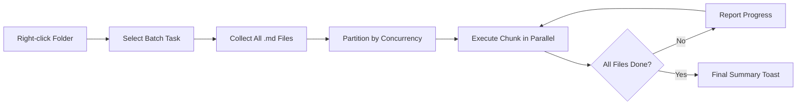

import TLDR from '@site/src/components/TLDR';

# Procesare în loturi

<TLDR>
**Notemd procesează întregi foldere într-o singură acțiune, cu concurență configurabilă și control de suprascriere.** Faceți clic dreapta pe o folderă pentru a adăuga în lot link-uri wiki, extrage concepte, efectuează cercetări sau traduce toate notițele din ea. Limitele de concurență previn erorile de rate-limiting API. Progresul este raportat pentru fiecare fișier. Comportamentul de suprascriere este configurabil: sărate existente, adăugare sau înlocuire. Fișierele eșuate sunt înregistrate fără a opri procesarea în lot.

Acesta face parte din [Obsidian Ghidul de gestionare a cunoștințelor AI](/docs/pillar-ai-knowledge).
</TLDR>

## Prezentare generală

Procesarea în loturi transformă o folderă cu notițe într-o singură operațiune. În loc să deschideți fiecare notă și să rulați comenzi individual, faceți clic dreapta pe folderă și alegeți sarcina. Notemd parcurge fiecare fișier `.md`, aplică acțiunea alesă și raportează progresul în timp real.

Această funcție este esențială pentru extragerea cunoștințelor la nivelul întregului depozit. După importarea a zeci de PDF, de exemplu, adăugarea în lot a linkurilor urmată de extragerea în lot a conceptelor construiește graful dumneavoastră de cunoștințe în câteva minute, nu ore.

## Cum funcționează

### Modelul de execuție în loturi

1. **Colectarea fișierelor** -- Notemd scanează foldera țintă recursiv (sau doar la nivel superior, în funcție de setările) și colectează toate fișierele `.md`.
2. **Partizionarea concurenței** -- Fișierele sunt împărțite în bucăți în funcție de setarea `batchConcurrency`. Fiecare bucăță este executată în paralel; bucățile sunt executate secvențial.
3. **Execuția** -- Fiecare fișier este procesat folosind aceeași logică ca comanda pentru un singur fișier. Sunt respectate setările furnizorului și ale modelului pentru fiecare sarcină.
4. **Raportarea progresului** -- O notificare de tip toast se actualizează după finalizarea fiecărui fișier, afișând progresul `N / Total`.
5. **Gestionarea erorilor** -- Dacă o fișier eșuează (erere API, timeout de rețea etc.), eroarea este înregistrată și procesarea în lot continuă. Rezumatul final listează toate fișierele eșuate.
6. **Finalizare** -- O notificare de rezumat raportează numărul total procesat, succesurile și eșecurile.

### Comportamentul de suprascriere

Atunci când se procesează un fișier care conține deja linkuri wiki, note conceptuale sau traduceri, comportamentul Notemd depinde de setarea de suprascriere:

| Mod | Comportament |
|------|----------|
| **Sări** | Conținutul existent rămâne neschimbat. Se procesează doar fișierele nemonulate. |
| **Adaugare** (valoare implicită) | Nouul conținut este adăugat. Linkurile wiki, conceptele sau traduceri existente sunt păstrate. |
| **Înlocuire** | Fișierul este procesat complet din nou. Toate modificările anterioare efectuate de Notemd sunt suprascrise. |

În cazul linkurilor wiki în special: dacă o notă conține deja `[[wiki-links]]`, modul **Sări** o lase pe loc, în timp ce **Înlocuirea** trimite întreagă nota către LLM pentru inserarea nouă a linkurilor. Folosiți **Sări** pentru procesare incrementală și **Înlocuire** pentru reprocesare după o actualizare a modelului.

### Controlul concurenței

Setarea `batchConcurrency` limitează numărul de apeluri paralele API. Acest lucru previne erorile de limitare a ratelor (HTTP 429) atunci când se procesează foldere mari la furnizori cu cote stricte.

| Concurență | Recomandat pentru | Impactul tipic asupra limitării ratelor |
|-------------|----------------|---------------------------|
| `1` | Tiere gratuite, furnizori stricți | Niciunul (serial) |
| `3` (implicit) | Majoritatea furnizorilor cloud | Scăzut |
| `5` | Ollama (local), tiere generoase | Niciunul / Scăzut |
| `10` | Modele locale cu inferență rapidă | Niciunul |

Dacă întâlniți erori 429 în timpul procesării în lot, reduceți concurența la 1 sau 2.

## Configurație

| Setare | Implicit | Efect |
|---------|---------|--------|
| `batchConcurrency` | `3` | Număr maxim de apeluri paralele API în timpul operațiilor cu foldere |
| `batchOverwriteExisting` | `false` | Scrie peste conținutul existent Notemd. `false` = modul de adăugare. |
| `batchSkipProcessed` | `false` | Săriți peste fișierele care conțin deja markeri Notemd (de exemplu, linkuri wiki) |
| `batchRecursive` | `true` | Incluzi subdirecțiile atunci când scanați folderul |
| `enableStableApiCall` | `false` | Activează logica de repetare (până la 4 încercări) pentru fiecare fișier în lot |

### Modele per-task în lot

Fiecare operație de lot folosește modelul corespunzător per-task. batch-add-links folosește `addLinksProvider`, batch-research folosește `researchProvider` și așa mai departe. Acest lucru înseamnă că puteți atribui modele ieftine pentru operații de volum mare și rezerva modele scumpe pentru sarcini sensibile la calitate.

## Exemplu

Aveți un folder `papers/` care conține 40 de note de cercetare importate. Doriți să adăugați linkuri wiki și să extrageți concepte din toate ele:

1. Faceți clic dreapta pe folderul `papers/`
2. Selectați **"Notemd: Process folder (add links)"**
3. Notemd scanează folderul, găsește 40 fișiere `.md` și le procesează pe 3 la rând (concurrentism standard)
4. O notificare de progres arată: `12/40 files processed...`
5. După aproximativ 3 minute, o notificare de rezumat raportează: `39 succeeded, 1 failed (API timeout on paper-37.md)`
6. Repetați cu **"Notemd: Process folder (extract concepts)"** pentru a crea note conceptuale pentru toate cele 40

Fișierul care a eșuat este înregistrat. Puteți rula procesul doar pe acel fișier ulterior.

## Sfaturi

- **Începeți cu un concurrentism scăzut** -- Dacă nu sunteți siguri cu limitele de rate ale furnizorului dumneavoastră, începeți cu `1` și creșteți treptat.
- **Folosiți modul de omisie pentru actualizări incrementale** -- După prima porție completă, treceti la `batchSkipProcessed: true` astfel încât doar notele noi să fie procesate în execuțiile ulterioare.
- **Activezați apelurile stabile API** -- `enableStableApiCall: true` adaugă logică de reîncercare care se recuperează de erorile temporare de rețea în timpul loturilor lungi.
- **Rulați din nou după actualizările modelelor** -- Dacă treceti la un model mai bun, setați `batchOverwriteExisting: true` și rulați din nou pentru a obține linkuri și concepte îmbunătățite.

---

## Următoarele pași

- [Workflows](/docs/features/workflows) -- Legați sarcinile în lot în butoane de bara laterală cu un clic
- [Custom Prompts](/docs/advanced/custom-prompts) -- Personalizați prompturile pentru extracția în lot
- [Troubleshooting](/docs/advanced/troubleshooting) -- Rezolvați erorile de limită de rate și eșecurile de conexiune în timpul execuțiilor în lot
- [LLM Furnizori](/docs/providers/overview) -- Referință de configurare a modelului pe sarcină
