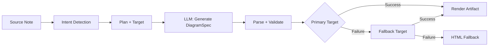
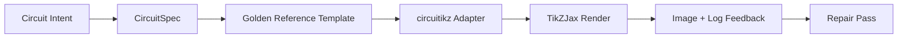

import TLDR from '@site/src/components/TLDR';

# Diagrame

<TLDR>
**Notemd generează diagrame din notele dumneavoastră printr-un pipeline bazat pe specificații.** LLM produce un `DiagramSpec` JSON independent de renderer, apoi adapteri specializați îl traduc în Mermaid, JSON Canvas, Vega-Lite, HTML sau în rezultate editabile HTML/SVG. Suportă 8 tipuri de intenție, lanțuri automatice de fallback, previsualizare în timp real cu export în SVG/PNG, verificare semantică și generare îmbunătățită cu cunoștințe locale.
</TLDR>

Acesta face parte din [Obsidian Ghidul de gestionare a cunoștințelor AI](/docs/pillar-ai-knowledge).

## Arhitectură: Pipeline bazat pe specificații

Notemd nu cere niciodată LLM să genereze direct sintaxa Mermaid/Vega/Canvas. În schimb:



**De ce specificații în primul rând?** LLM generează adesea sintaxă inválidă pentru rendereri (Mermaid în special). Un `DiagramSpec` structurat poate fi validat înainte de renderizare, iar aceeași specificație poate fi utilizată ca fallback pentru mai mulți rendereri.

## Tipuri de diagrame suportate

| Intenție | Renderer principal | Fallback-uri | Caz de utilizare |
|--------|-----------------|-----------|----------|
| `mindmap` | Mermaid | HTML | Descompunere hierarhică a subiectelor |
| `flowchart` | Mermaid | HTML | Fluxuri de proces, arbori de decizie |
| `sequence` | Mermaid | HTML | Interacțiuni client-server, protocoale |
| `classDiagram` | Mermaid | HTML | Relații între clase OOP |
| `erDiagram` | Mermaid | HTML | Schema-uri de baze de date, relații între entități |
| `stateDiagram` | Mermaid | HTML | Machinile de stare, modelele de ciclu de viață |
| `canvasMap` | JSON Canvas | Mermaid → HTML | Hărți conceptuale, grafe de cunoaștere |
| `dataChart` | Vega-Lite | Mermaid → HTML | Charte: bar, linie, zonă, dispersie, piatră, tabele |

## Detectarea intenției

Notemd inferă cel mai bun tip de diagramă din conținutul notei folosind scorare pe baza cuvintelor cheie:

| Intenție | Trigere | Confidență |
|--------|----------|------------|
| `dataChart` | Tabele, celule numerice, cuvinte cheie legate de metrice/tendințe, procente | 0.88 |
| `sequence` | Vocabularul cererii/răspunsului (4+ corespondențe) sau markeri `->`/`=>` | 0.82 |
| `erDiagram` | Cheie primară, cheie străină, entitate, schema (2+ corespondențe) | 0.80 |
| `stateDiagram` | Stare, tranziție, așteptare, în execuție, eșuat (3+ corespondențe) | 0.76 |
| `flowchart` | Pași numerotați (2+) sau vocabular if/then/else/workflow | 0.74 |
| `canvasMap` | Hartă conceptuală, graf de cunoștințe, spațial, cluster | 0.72 |
| `mindmap` | Valoare implicită de rezervă | 0.55 |

Să se suprascrie cu setarea **Tipul preferat de diagramă**, selectorul din bara laterală sau o opțiune explicită din panoul de comenzi.

## Selectarea țintei de afișare

Pipeline-ul experimental bazat pe specificații are acum două controale independente:

| Control | Setare | Efect |
|---------|---------|--------|
| Tipul preferat de diagramă | `preferredDiagramIntent` | Ghidează forma semantică a `DiagramSpec` generatului |
| Ținta preferată de afișare | `preferredDiagramRenderTarget` | Alege rendererul pentru artefact în funcție de opțiunile **Genera diagramă** și **Previsualizare a diagramării** |

Setați **Ținta preferată de afișare** la **Auto** ca valoare implicită pentru planificator, sau alegeți explicit Mermaid, JSON Canvas, Vega-Lite, HTML sau Editable HTML/SVG. Suprascrierea se aplică doar la comenzile de generare a artefactului și previsualizare. Comanda standard **Summarise as Mermaid diagram** rămâne legată de ieșire compatibilă cu Mermaid, astfel încât fluxurile existente în Markdown nu se schimbă fără observație de format.

Această separare este importantă deoarece o intenție `flowchart` poate fi acum afișată ca Mermaid pentru notele în Markdown, ca HTML pentru o valoare de rezervă robustă, sau ca Editable HTML/SVG pentru editare ulterioară. Draw.io și Drawnix rămân exportatori de artefacte CLI, nu ținte de afișare din interiorul pluginului.

## Utilizare

### Genera un diagramă

1. Deschideți o notă
2. Rulați **"Notemd: Genera diagramă"** din panoul de comenzi
3. Notemd detectează intenția, generează specificația, afișează și salvează artefactul

**Fișierele de ieșire după țintă:**

| Target | Extensie | Patternul de nume al fișierului |
|--------|-----------|------------------|
| Mermaid | `.md` | `{note}_summ.md` |
| JSON Canvas | `.canvas` | `{note}_diagram.canvas` |
| Vega-Lite | `.json` | `{note}_diagram.json` |
| HTML | `.html` | `{note}_diagram.html` |
| Editable HTML/SVG | `.html` | `{note}_diagram.html` |

### Previsualizare a unui diagram

1. Rulați **"Notemd: Previsualizare diagram"**
2. Se deschide o fereastră modală cu diagrama generată
3. Exportați ca SVG sau PNG folosind butoanele din bara de instrumente

**Deschiderea automată a previsualizării** este disponibilă în setările — după generare, fereastra modală de previsualizare se deschide automat.

Fereastra modală de previsualizare are și un panou de diagnostic al artefactelor. Rendererele și verificările smoke pot atașa `RenderArtifact.diagnostics`; fereastra afișează o rezumată diagnostică cu numărurile de erori/avertismente/informații, apoi severitatea, tipul diagnosticului, mesajul și sfaturile de reparare lângă previsualizare. Aceeași rezumată este afișată în intrările istoricului de previsualizare, astfel încât tentativele repetate de circuitikz smoke pot fi comparate fără a deschide fiecare intrare. Pentru artefactele care au conținut sursă dar nu pot fi renderizate inline sau prin calea iframe-ului HTML, fereastra modală recurge acum la o previsualizare doar cu sursă în loc să forțeze un iframe gol. Acest lucru oferă circuitikz de compilare/render smoke, SVG de verificare a tokenilor text, verificări PNG cu captură de ecran golă și rapoarte viabile de suprapunere viitoare fără a face din TikZJax sau LaTeX o dependență strictă la timpul rulării pluginului sau fără a pretinde că textul sursă este o renderizare vizuală verificată.

### Modul legacy Mermaid

Când `enableExperimentalDiagramPipeline` este dezactivat, Notemd trimite un prompt direct Mermaid către LLM. Acest lucru omite complet pipeline-ul spec. Dacă pipeline-ul experimental eșuează, se recurge la acest mod.

## Backend-urile de renderizare

### Mermaid

6 adapteri (mindmap, flowchart, sequence, ER, class, state) traduc `DiagramSpec` în sintaxa Mermaid. După generare, `mermaid.parse()` validează rezultatul. Dacă validarea eșuează:

1. **Reîncercare LLM** — o tentativă cu mesajul de eroare Mermaid ca context
2. **Fallback minim** — un diagram simplu Mermaid din ID-urile nodurilor spec

**Legacy Mermaid Fixer** repară automat erorile de sintaxe comune LLM: normalizarea directivei note, evitarea problemelor cu pipe-label, repositionarea punctului și virgulă, citatele inteligente, săgețile cu dublu tiret, neconcordanțele de formă și altele.

### JSON Canvas

Creează format Obsidian JSON Canvas cu o distribuție spațială:
- Node-urile sunt poziționate în funcție de adâncime (x = adâncime × 420) și index (y = index × 170)
- Lățimea se estimează pe baza lungimii etichetei
- Edge-urile conțin `fromSide: 'right'`, `toSide: 'left'`, `toEnd: 'arrow'`

### Vega-Lite

Construiește specificațiile complete Vega-Lite v5 JSON cu codificare automată:
- **Chart-uri carteziene** (bară/linie/arie/punct/dispersie): canale x + y plus culoare pentru mai multe serii
- **Pie**: theta = y (cantitativ), culoare = x (nominal)
- **Tabel**: rând = x, text = y + coloană = serie

Patch-urile de tema întunecată și luminosă sunt fuzionate profund înainte de compilare.

### HTML

Soluție universală. Document HTML autonom cu:
- Header-urile CSP
- Modul luminos/intunecat prin `prefers-color-scheme`
- Etichete UI localizate pentru 20 de locale
- Secțiuni: hero, structură (arbore de node), relații, note, tabele cu serii de date

### Editabil HTML/SVG

Scop explicit pentru figurile în fluxurile de export editabile. Acesta proiectează `DiagramSpec` într-un `SemanticFigureModel` determinist, apoi generează un document autonom HTML cu grupuri inline SVG care conțin annotații în stil Draw.io:

- `data-drawio-type`, `data-drawio-id` și `data-drawio-role` pe nodurile semantice
- `data-drawio-source` și `data-drawio-target` pe marginile semantice
- identificatori stabili de nod/margină după normalizarea spațiilor goluri și gestionarea coliziunilor
- fără scripturi, fără fonturi externe și fără resurse distante

Acest scop nu este intenționat să fie ruta implicită a planificatorului. Este disponibil ca scop de renderizare explicit până când traseul produs dovedește comportamentul de editare în instrumentele reale.

### Draw.io și Drawnix Granițele de export

Implementarea actuală păstrează suportul editorilor de terți la granița artifactului:

| Scop | Contract | Dependență de execuție |
|--------|----------|--------------------|
| Draw.io | `mxfile` XML dezcomprimat determinist din `SemanticFigureModel` | niciunul în timpul execuției pluginului sau în CI |
| Drawnix | subset minim de `.drawnix` JSON folosind elementele `geometry` și `arrow-line` | niciunul în timpul execuției pluginului sau în CI |

Compromisul este intenționat: Notemd poate verifica etichete vizibile, ID stabili și acoperirea primitivelor suportate fără a integra diagram.net Desktop, Drawnix, Plait sau starea editorului doar pentru browser în plugin.

### circuitikz / TikZJax Direcție

Diagramele de circuite nu reprezintă același problemă ca fluxarele generice. Șablonul sintactic corect pentru circuitele electrice este de obicei **circuitikz**, afișat în Obsidian prin pluginuri precum TikZJax. TikZJax poate încărca pachete precum `circuitikz`, `pgfplots`, `tikz-cd` și `chemfig`, ceea ce îl face atrăgător pentru notele de fizică, circuite, chimie și matematică.

Riscul constă în faptul că TikZ generat direct din LLM este fragil:

- o topologie complexă a circuitului poate fi corectă din punct de vedere electric, dar nerezistibilă din punct de vedere vizual;
- fiiarele și etichetele suprapuse pot face ca o listă de rețea corectă să fie inutilizabilă pentru notele de studiu;
- faltul de preambule ale pachetelor, ancorele greșite sau numele incorecte ale componentelor pot împiedica afișarea;
- feedback-ul furnizat de renderer este de obicei la nivel de imagine, în timp ce LLM generează geometrie la nivel de text.

Arhitectura mai bună constă în a trata circuitikz ca un șablon de diagramă cu restricții, nu ca o instrucțiune liberă:



Modelul de clasa întâi ar trebui să descrie separat topologia și dispunerea circuitului:

| Strat | Responsabilitate | Exemplu |
|-------|----------------|---------|
| Topologie | nodurile electrice și conexiunile componentelor | `VDD -> RD -> drain(M1)`, `source(M1) -> GND` |
| Dispunere | plasarea în rețea, orientarea, căile de rutare | `M1 at (3,2.2)`, intrare stânga, ieșire dreapta |
| Stil | pachet, convenție de tensiune, etichete, ancore | `\begin{circuitikz}[american voltages]` |
| Validare | jurnal de compilare, ancore lipsă, verificări de suprapunere/scrinshot | TikZJax/Diagnosticuri LaTeX plus revizuire vizuală |

### Prototipul actual circuitikz

Notemd include acum primul prototip de repository restricționat pentru această direcție. Este intenționat offline și limitat de șablonuri:

```bash
npm run diagram:export-circuitikz -- --input cmos-inverter.json --output cmos-inverter.tex
```

Prototipul adaugă o frontieră separată `CircuitSpec` și un exporter determinist pentru șase familii de referință aurie:

| Tip circuit | Referință aurie | Garanție de curent |
|--------------|------------------|-------------------|
| `common-source-amplifier` | `common-source-nmos-v1` | validă `VDD -> R_D -> M1.D`, `vin -> M1.G`, `M1.S -> GND` și `M1.D -> vout` înainte de a scrie LaTeX |
| `cmos-inverter` | `cmos-inverter-v1` | validă topologia PMOS-over-NMOS, intrare comună de poartă, ieșire comună de drenaj, `VDD -> MP.S` și `MN.S -> GND` înainte de a scrie LaTeX |
| `cmos-buffer` | `cmos-buffer-v1` | validă două etape de inversor cascade, nod intermediar `vmid`, `vout` restabilit și railuri VDD/GND partajate înainte de a scrie LaTeX |
| `cmos-transmission-gate` | `cmos-transmission-gate-v1` | validă dispozitive paralele PMOS/NMOS între `vin` și `vout` cu controale complementare `phib` / `phi` înainte de a scrie LaTeX |
| `cmos-nand2` | `cmos-nand2-v1` | validează tracțiunea paralelă cu PMOS, tracțiunea seri cu NMOS, intrările duble `va` / `vb` și `vout` înainte de scriere în LaTeX |
| `cmos-nor2` | `cmos-nor2-v1` | validează tracțiunea seri cu PMOS, tracțiunea paralelă cu NMOS, intrările duble `va` / `vb` și `vout` înainte de scriere în LaTeX |

Acesta nu este încă un generator general TikZ. Nu compilează LaTeX, nu apelează TikZJax, nu inspectează ecranele de captură și nu rulează reparări automate prin feedback de imagine. Aceste funcții rămân pentru etape ulterioare.

Comanda Diagrama de previsualizare poate redeschide direct artefactele sărate circuitikz atunci când extensia fișierului este `.tex` sau `.tikz` și sursa conține `\usepackage{circuitikz}` sau `\begin{circuitikz}`. Această rută este o previsualizare doar a sursei circuitikz: modalul afișează sursa, diagnosticele, controalele de copiere/sărit și metadatele istoricului, dar nu compilează LaTeX sau nu apelează TikZJax în timpul execuției pluginului.

Același limitru de previsualizare doar a sursei acoperă acum artefactele sărate Draw.io și Drawnix. Fișierele `.drawio` sunt acceptate atunci când arată ca Draw.io XML (`mxfile` sau `mxGraphModel`), iar fișierele `.drawnix` sunt acceptate atunci când sunt Drawnix JSON cu `type: "drawnix"` și un array `elements`. Pluginul nu integrează încă diagram.net sau gazda tabloului alb Drawnix; aceste previsualizări afișează sursa, diagnosticele și istoricul artefactelor fără a pretinde un editor vizual în cadrul pluginului.

Pentru reparare care păstrează topologia, transmiteți specificația pre-reparare ca referință înainte de a accepta un candidat reparat:

```bash
npm run diagram:export-circuitikz -- --input repaired-cmos-inverter.json --topology-reference cmos-inverter.json --output cmos-inverter.tex
```

Guard-ul de reparare folosește `createCircuitTopologySignature` și `assertCircuitTopologyUnchanged` pentru a compara `circuitKind`, `goldenReferenceId`, rețelele, ID-urile/tipurile/terminalurile componentelor și extreptele conexiunilor nedirecționate înainte de a genera rezultat. Etichetele, textul titlu, indiciile de layout, ordinea conexiunilor și etichetele conexiunilor sunt ignorate intenționat. Un candidat care adaugă un element scurt sau rewirează un terminal e respins cu `Circuit topology drift detected` înainte ca fișierul `.tex` să fie scris.

CLI poate acum analiza un log existent de compilare LaTeX/TikZJax fără a executa un compiler:

```bash
npm run diagram:export-circuitikz -- --input cmos-inverter.json --output cmos-inverter.tex --compile-log cmos-inverter.log --diagnostics-output cmos-inverter.diagnostics.json
```

Acest traseu diagnostic raportează pachetele lipsă precum `circuitikz.sty`, cheile necunoscute TikZ/circuitikz, erori de sintaxă în calea TikZ cum ar fi semnulele puncte și virgulă lipsă, argumente excesive din paranteze neechilibrate sau etichete neterminate, secvențe de control nedefinite, erori generice LaTeX, oprieri de urgență și avertismente de supraplinire `\hbox`. Rămâne bazat pe log: execuția locală LaTeX/TikZJax și gate-urile de calitate a ecranelor de captură sunt încă lucruri viitoare separate.

Pentru verificările de funcționare pentru administratorii, același CLI poate rula opțional un renderer configurat explicit fără analizarea comenzelor shell:

```bash
npm run diagram:export-circuitikz -- --input cmos-inverter.json --output cmos-inverter.tex --compile-executable pdflatex --compile-arg -interaction=nonstopmode --compile-arg -halt-on-error --compile-arg -output-directory={outputDir} --compile-arg {tex} --expected-artifact {outputDir}/{jobName}.pdf
```

Executatorul de compilare folosește `shell: false`, extinde `{tex}`, `{outputDir}` și `{jobName}` în valori de array de argumente, citește `{jobName}.log` generat și returnează `compileExecution` plus `compileDiagnostics` în ieșirea CLI JSON. `--compile-executable` este doar calea binaryului sau wrapper-ului renderer; flag-urile rendererului aparțin valorilor repetate `--compile-arg`. Executabilele goale eșuează ca `compile-executable-invalid`, cele fără binary eșuează ca `compile-executable-not-found`, iar șirurile executabile în formă de comandă shell primesc sfaturi pentru a împărți argumentele astfel încât Windows, Linux și macOS să respecte același contract de execuție directă. Cu `--expected-artifact`, raportează și `compileExecution.renderSmoke` și eșuează la CLI dacă rendererul nu creează un artifact necruțit. Pluginul nu integrează încă LaTeX, nu face din TikZJax o dependență a timpului de execuție pluginului și nu efectuează reparări vizuale la nivel de ecran de captură.

Dacă artifactul așteptat este `.svg`, verificarea de funcționare intră într-un strat mai profund:

```bash
npm run diagram:export-circuitikz -- --input cmos-inverter.json --output cmos-inverter.tex --compile-executable dvisvgm --compile-arg ... --expected-artifact {outputDir}/{jobName}.svg --expected-svg-text v_{in} --expected-svg-text v_{out}
```

Verificarea de fum SVG confirmă rădăcina `<svg>`, dimensiunile pozitive sau `viewBox`, cel puțin un element vizibil după exclusia elementelor ascunse/transparente, orice tokenuri de text solicitate, elemente evidente în afara `viewBox`, etichete evidente suprapuse `<text>` / `<tspan>` poziționate și etichete de text evidente suprapuse peste elementele vizuale prin `render-svg-label-overlap`. Textul așteptat este căutat în textul vizibil și decodificat din metadatele de accesibilitate precum `aria-label`, `<title>` și `<desc>`, astfel încât rendererii care păstrează etichete semantice în afara `<text>` vizibile pot răspunde totuși la verificarea tokenurilor de text fără a necesita OCR. Passul geometric este acum geometrie conștientă de transformare pentru atributele comune de grup și element `transform`, astfel încât cutiile SVG traduse, scalate, rotite, deformate sau transformate prin matrice sunt verificate după compunerea transformărilor. Acesta acoperă limitele exacte ale arcurilor pentru extreptele arcului A/a, limitele exacte ale curbelor Bezier pentru extreptele curbelor C/S/Q/T, limitele SVG conștiente de grosimea tracției și verificările de suprapunere a etichetelor, geometria de desen `polyline` / `polygon` și rezolvă și poziționarea doar a glyphurilor din `<use href="#...">` astfel încât etichetele convertite în trasee de glyph reutilizabile pot totuși eșua la verificările de canvas limitat atunci când geometria glyph-ului plasat escapează din `viewBox`. Multiple etichete poziționate `tspan` sub un părinte `<text>` sunt comparate ca cutii separate de etichetă, ceea ce detectează output-ul în stil LaTeX SVG care altfel ar reduce etichetele distincte într-un singur nod de text. Cutiile poziționate SVG `text` și `tspan` respectă valorile `text-anchor` `start`, `middle` și `end`, astfel încât etichetele centrate și aliniate în dreapta pot declanșa diagnostice de suprapunere text/text și etichetă-versus-desen fără a pretinde o distribuție a textului la nivel de browser. Traseele de glyph doar de definiție din `<defs>` nu sunt numărate ca elemente vizibile de desen, dar propriile lor atribute locale `transform` sunt aplicate înainte de plasare `<use>` astfel încât definițiile de glyph scalate sau reflectate nu sunt subnumărate. Verificarea etichetă-versus-desen folosește o toleranță mică pentru cutiile de desen și `stroke-width` declarat, astfel încât firele subțiri, firele groase și contururile componente poligonale pot fi tratate toate ca posibile eșecuri de legibilitate a etichetelor atunci când tracțiunea lor vizibilă ajunge la o etichetă. Etichetele de glyph doar de traseu rezolvate din `<use href="#...">` sunt, de asemenea, comparate cu cutiile de desen și eșuează cu `render-svg-path-glyph-overlap` atunci când geometria glyph-ului reutilizabil suprapune firele sau componentele. Dacă un renderer convertește etichetele în glyphuri de traseu reutilizabile în loc de `<text>` cărora se pot căuta și nu păstrează metadatele de accesibilitate, raportul de fum înregistrează `pathOnlyGlyphUseCount` și eșuează tokenul de text solicitat prin `render-svg-text-path-only` în loc să pretindă că eticheta este pur și simplu absentă. Alte eșecuri sunt raportate prin `render-svg-invalid`, `render-svg-dimension-missing`, `render-svg-no-visible-elements`, `render-svg-text-missing`, `render-svg-out-of-bounds`, `render-svg-text-overlap`, `render-svg-label-overlap` sau `render-svg-path-glyph-overlap`. Verificările tokenurilor de text și de suprapunere ar trebui tratate doar ca verificări structurale pentru rendererii care păstrează etichetele ca text SVG cărora se pot căuta sau ca metadate de accesibilitate; output-ul doar de traseu SVG necesită totuși gate-ul ulterior de ecran de captură/OCR pentru a dovedi legibilitatea vizuală a etichetelor, iar acest pass de fum nu pretinde încă acoperire completă a SVG traseului.

Grupurile și elementele ascunse SVG sunt omise în mod constant în timpul numărării elementelor vizibile și colectării geometriei. Atributele sau stilurile inline `display:none`, `visibility:hidden`, `visibility:collapse` și cel general `opacity:0` nu pot face ca un artifact de renderizare altfel gol să treacă verificarea de output vizibil.

Definițiile de glyph doar de traseu pot fi trasee directe sau conteneuri grupate/simbolice în interiorul `<defs>`. Passul de fum rezolvă geometria traseului copil din `<g id="...">` și `<symbol id="...">` înainte de plasarea `<use>`, astfel încât output-ul glyph învelit alimentează totuși `pathOnlyGlyphUseCount`, verificările de canvas limitat și `render-svg-path-glyph-overlap`.

Parserul de traseu urmărește și starturile subtraseului și resetează punctul curent pe `Z/z`, astfel încât comenzele relative după un subtraseu închis continuă de la punctul corect SVG în loc să creeze diagnostice false `render-svg-out-of-bounds`.

Același proces de geometrie urmează gramatica SVG pentru zecimale cu punct înainte și semne plus explicite, astfel încât coordonatele compacte dvisvgm precum `.5`, `-.5` sau `+.5` rămân fracționale în timpul verificărilor de limite, în loc să devină geometrie nevalidă din cauza depășirii limitelor sau să fie ignorate.

Dacă rendererul emit `.png`, același drum pentru artifactul așteptat devine prima captură de ecran: Notemd decodifică fișiere PNG cu culori indexate de 1/2/4/8 biți, fără interlacing, fișiere PNG în gri de 1/2/4/8/16 biți și fișiere PNG în gri-alpha/RGB/RGBA de 8/16 biți. Imaginile cu culori indexate și cele în gri sub-bit suportă eșantioane compactate; imaginile cu culori indexate suportă, de asemenea, date PLTE și opționale tRNS; imaginile în gri/RGB suportă eșantioane transparente tRNS. Eșantioanele directe de 16 biți sunt normalizate în același spațiu de comparație RGBA de 8 biți folosit de verificările smoke. Verificarea smoke verifică dimensiunile pozitive, înregistrează limitele fundalului ca `foregroundBounds`, înregistrează densitatea fundalului în interiorul acelei box-uri ca `foregroundDensity`, eșuează cu `render-png-blank` atunci când fiecare pixel vizibil corespunde culorii fundalului din colțul stâng sus, eșuează cu `render-png-content-clipped` atunci când conținutul fundalului atinge limitele imaginii, eșuează cu `render-png-foreground-too-small` atunci când o captură de ecran mare are mai puțini de patru pixeli de fundal și eșuează cu `render-png-foreground-dense` atunci când pixelii fundalului sunt excesiv densi în interiorul unei box-uri de delimitare non-triviale. Formatele PNG nesusținute eșuează cu `render-png-unsupported`, fiind oferite indicări specifice pentru PNG-urile interlaced Adam7 sau adâncimile de biți cu culori indexate nesusținute. Acest sistem detectează capturile de ecran goale, clipările evidente de pe canvas, urmările fundalului subrenderizate, eșecurile de aglomerație la nivel de pixel și setările greșite de export PNG ale rendererului, fără a necesita dependențe specifice platformei. Nu este încă o metodă de recunoaștere a etichetelor la nivel OCR, o detectare precisă a suprapunerii textului sau o reparare a imaginilor care păstrează topologia.

Când diagnostica arată o compilare eșuată sau o execuție a scriptului render-smoke eșuată, CLI poate scrie și un raport de reparare care păstrează topologia:

```bash
npm run diagram:export-circuitikz -- --input cmos-inverter.json --topology-reference cmos-inverter.json --output cmos-inverter.tex --compile-log cmos-inverter.log --repair-brief-output cmos-inverter.repair-brief.json
```

Descrierea reparării folosește schema `notemd.circuitikz.repair-brief.v1` și conține sursa `CircuitSpec`, semnătura topologiei, diagnostice de compilare/renderizare, editări permise, editări interzise ale topologiei, pașii următori de verificare și un `repairPrompt` structurat. Rolul promptului este `topology-preserving-circuitikz-repair`; lista sa `diagnosticFocus` este derivată din diagnosticele de compilare/renderizare, iar cerințele sale `acceptanceCriteria` necesită validare a candidaților, precum și verificări noi de compilare și renderizare. Acesta este formatul de transfer pentru o iterare ulterioară de reparare, nu o afirmație că Notemd execută deja repararea vizuală autonomă.

După ce este generat un candidat de reparare, același CLI poate să-l valideze în raport cu specificațiile inițiale înainte de a scrie rezultatul:

```bash
npm run diagram:export-circuitikz -- --input repaired-cmos-inverter.json --repair-brief cmos-inverter.repair-brief.json --output repaired-cmos-inverter.tex
```

`--repair-brief` verifică semnătura topologiei candidate din brief și este exclusiv mutual cu `--topology-reference`. Trecerea acestei verificări dovedește doar păstrarea topologiei; candidatul are încă nevoie de diagnostice de compilare și verificări render-smoke.

Rezultatul `--repair-brief` include și dovezi `repairAcceptance` în formatul `notemd.circuitikz.repair-acceptance.v1`. Acesta raportează gate-urile `topology-signature`, `compile-diagnostics` și `render-smoke` ca fiind `passed`, `failed` sau `missing`; dezvăluie `remainingChecks`; și păstrează valoarea `readyForVisualAcceptance` dreaptă până când execuția candidatului include toate dovezile necesare.

Folosiți `--repair-acceptance-output` împreună cu `--repair-brief` atunci când dovezile CI sau ale lansării necesită un fișier durabil JSON:

```bash
npm run diagram:export-circuitikz -- --input repaired-cmos-inverter.json --repair-brief cmos-inverter.repair-brief.json --output repaired-cmos-inverter.tex --repair-acceptance-output repaired-cmos-inverter.repair-acceptance.json
```

Pentru dovezi legate de lansare sau de întreținere, rulați fiecare familie „golden” suportată prin tool-ul aggregate fixture runner:

```bash
npm run diagram:smoke-circuitikz -- --output-dir docs/export/circuitikz-smoke --compile-executable pdflatex --compile-arg -interaction=nonstopmode --compile-arg -halt-on-error --compile-arg -output-directory={outputDir} --compile-arg {tex} --expected-artifact {outputDir}/{jobName}.pdf
```

Executorul folosește `docs/maintainer/fixtures/circuitikz/common-source-nmos-v1.json`, `docs/maintainer/fixtures/circuitikz/cmos-inverter-v1.json`, `docs/maintainer/fixtures/circuitikz/cmos-buffer-v1.json`, `docs/maintainer/fixtures/circuitikz/cmos-transmission-gate-v1.json`, `docs/maintainer/fixtures/circuitikz/cmos-nand2-v1.json` și `docs/maintainer/fixtures/circuitikz/cmos-nor2-v1.json`, apelează același drum de export fără shell pentru fiecare fixture și returnează un raport agregat JSON cu valorile `compileExecution` și `compileDiagnostics` pentru fiecare fixture. Rămâne o comandă de întreținere, nu o dependență la timpul rulări a unui plugin.

Când o mașină de întreținere nu are încă un renderer configurat, rulați același comandă de fixture fără `--compile-executable` și mențineți în mod explicit poarta de mediu:

```bash
npm run diagram:smoke-circuitikz -- --output-dir docs/export/circuitikz-smoke --report-output docs/export/circuitikz-smoke/renderer-availability.json
```

Acel drum continuă să scrie artefactele deterministe `.tex`, dar returnează `ok: false` cu `rendererAvailability.status` setat la `missing-configuration` și un diagnostic `compile-executable-invalid`. Tratez-l doar ca dovadă de disponibilitate a rendererului; nu reprezintă o verificare de compilare, render-smoke sau acceptare vizuală.

### Forma de prompt de referință aurie

Pentru utilizare pe termen scurt, furnizați o referință de aur reprezentabilă înainte de a solicita o variantă a circuitului. Un prompt restrâns ar trebui să păstreze preambulul, scala de coordonate, stilul de ancrare și convențiile de rutare:

```latex
\usepackage{circuitikz}
\begin{document}
\begin{circuitikz}[american voltages]
\draw
  (3,5) node[vcc]{$V_{DD}$}
  to [R, l=$R_D$] (3,3)
  to [short, *-o] (5,3) node[right]{$v_{out}$}
  (3,3) to [short] (3,2.2)
  node[nmos, anchor=D] (M1) {$M_1$}
  (M1.S) to [short] (3,0.5)
  node[ground]{}
  (M1.G) to [short, -o] (0.8,2.2)
  node[left]{$v_{in}$};
\draw
  (3,0.5) node[below right]{$S$};
\end{circuitikz}
\end{document}
```

Pentru un inversor CMOS, instrucțiunea ar trebui să solicite o topologie explicită precum și constrângeri de planare, nu doar „desenați un inversor CMOS”:

- Păstrează `VDD` în partea de sus, `GND` în partea de jos, intrarea la stânga, ieșirea la dreapta;
- Folosi `pmos` deasupra `nmos`, cu poartele și drenajele partajate;
- Păstrează nodul de ieșire la joncțiunea drenajului și marchează-l cu `*-o`;
- Folosește ancore cu nume (`PM1.G`, `NM1.G`, `PM1.D`, `NM1.D`) în loc de coordonate deduse vizual;
- Evită firele diagonale sau intersectante, cu excepția cazurilor necesare din punct de vedere electric.

### Progresul actual și fazele următoare

| Area | Starea actuală | Următorul pas |
|------|----------------|-----------|
| Diagrame generale | Pipeline bazat pe specificații implementat pentru Mermaid, JSON Canvas, Vega-Lite, HTML | Continuă extinderea acoperirii de verificare semantică |
| Figuri editabile | Granițele artefactelor `editable-html-svg`, Draw.io XML și Drawnix JSON implementate | Adaugă primitive mai complexe doar după ce testele dovedesc editabilitatea |
| Suport CLI | `npm run diagram:export-artifact` exportează fișiere editabile HTML/SVG, Draw.io și Drawnix dintr-un singur `DiagramSpec` | Adaugă componente de fum specificate pentru ținte atunci când se livrează noi ținte |
| circuitikz | `CircuitSpec -> circuitikz` prototipul exportează surse comune, inversor CMOS, `cmos-buffer` / `cmos-buffer-v1`, `cmos-transmission-gate` / `cmos-transmission-gate-v1`, `cmos-nand2` / `cmos-nand2-v1` și `cmos-nor2` / `cmos-nor2-v1` template-uri goldene, proiectele `layoutHints.inputSide` și `layoutHints.outputSide` într-o plasare deterministică a porturilor de intrare/ieșire fără a schimba topologia, respinge derivația topologică prin `--topology-reference`, emite briefuri de reparare care păstrează topologia prin `--repair-brief-output` și schema `notemd.circuitikz.repair-brief.v1`, include conținut structurat de transfer `repairPrompt` cu `diagnosticFocus`, `acceptanceCriteria` și rolul `topology-preserving-circuitikz-repair`, validează candidații la reparare prin `--repair-brief`, returnează dovezi de poartă `repairAcceptance` prin schema `notemd.circuitikz.repair-acceptance.v1` cu `readyForVisualAcceptance` și `remainingChecks`, păstrează acele dovezi prin `--repair-acceptance-output`, parsează jurnalele de compilare, poate rula rendereri locale explicite plus `--expected-artifact`, SVG `--expected-svg-text`, verificări de metadate de accesibilitate prin `aria-label`, `<title>` și `<desc>`, exclusiunea elementelor SVG ascunse/transparente, clasificarea `render-svg-text-path-only` / `pathOnlyGlyphUseCount` pentru etichete doar cu cale, verificări de plasare a glyph-urilor doar cu cale pentru `<use href="#...">`, diagnostice de suprapunere a glyph-urilor doar cu cale prin `render-svg-path-glyph-overlap`, gestionarea punctului curent al căilor închise pentru `Z/z`, limite exacte ale arcelor A/a la extremități, limite exacte ale curbelor Bezier pentru extremitățile curbelor C/S/Q/T, verificări de suprapunere a etichet cu limite conștiente de lățimea traseului și SVG, verificări de geometrie de desen `polyline` / `polygon`, geometria etichetelor poziționate `tspan`, geometria textului poziționat conștientă de `text-anchor`, geometrie conștientă de transformare pentru SVG bounded-canvas/text-overlap și fumul etichetă-versus-desen prin `render-svg-label-overlap`, precum și verificări de screenshot PNG nonblank / clipped / dense-foreground, inclusiv alfa din paleta de culori indexate, eșantioane transparente grayscale/RGB tRNS și ghiduri specifice formatului `render-png-unsupported` pentru PNG-uri interlaced Adam7 și eșecuri de adâncime de biți indexată, prin `foregroundBounds`, `foregroundDensity`, `render-png-content-clipped` și `render-png-foreground-dense` fără parsare în shell, include componente de fum aggregate pentru administratori prin `npm run diagram:smoke-circuitikz`, înregistrează configurația rendererului lipsă prin `rendererAvailability.status: "missing-configuration"` și `compile-executable-invalid`, și are diagnostice generice de previsualizare, numere de sumar diagnostic, intrări de istoric conștiente de diagnostice și fallback doar din sursă prin `RenderArtifact.diagnostics` și modalul de previsualizare | Adaugă recunoaștere a etichet la nivel OCR pentru textul vizual doar cu cale, verificări precise de suprapunere la nivel de pixel, acoperire mai largă a căilor SVG unde este necesar, instalare/discoverie automată a rendererului doar dacă poate rămâne opțională, și executare automată a reparărilor care păstrează topologia |
| Integrare TikZJax | Host de renderizare pentru afișarea de pe partea Obsidian | Păstrați-l opțional; nu faceți din TikZJax o dependență obligatorie la timpul rulării plugin-ului |

## Configurație

| Setare | Implicit | Efect |
|---------|---------|--------|
| `enableExperimentalDiagramPipeline` | `false` | Schimb între modul spec-first și legacy Mermaid |
| `experimentalDiagramCompatibilityMode` | `'legacy-mermaid'` | `'legacy-mermaid'` = Mermaid doar; `'best-fit'` = ținte native + fallback-uri |
| `preferredDiagramIntent` | `undefined` (auto) | Suprascrie detectarea automată a intenției |
| `summarizeToMermaidLanguage` | `'en'` | Limbajul țintei pentru etichetele diagramelor |
| `summarizeToMermaidProvider` / `Model` | DeepSeek | LLM per sarcină pentru generarea diagramelor |
| `autoMermaidFixAfterGenerate` | (din constante) | Rulare automată a fixerului legacy pe rezultatul Mermaid |
| `enableLocalKnowledgeForDiagramGeneration` | `false` | Amplifică sursa cu cunoștințele din vault local |

### Amplificare a cunoștințelor locale

Când este activat, Notemd extrage fragmente de context relevant din baza de cunoștințe locală a seifului dumneavoastră (bazată pe MiniSearch) și le adaugă în începutul markdown-ului sursă. Nota de augmentare spune: "Doar referință de sprijin; păstrați structura principală fidelă notei sursă."

### Modele de compatibilitate

- **`legacy-mermaid`**: Toate intențiile sunt direcționate către Mermaid. Intențiile care nu sunt Mermaid (canvasMap, dataChart) sunt forțate să fie procesate prin `flowchart` sau `mindmap`. Nu există lanț de fallback.
- **`best-fit`**: Fiecare intenție este direcționată către ținta sa nativă. Dacă aceasta eșuează, se parcurge lanțul de fallback (de exemplu, Vega-Lite → Mermaid → HTML).

## Prévisualizare și export

| Acțiune | Metodă |
|--------|--------|
| SVG export | Constructor `mermaid.render()` / `vega.View.toSVG()` / SVG pentru Canvas |
| Export în PNG | SVG → Image → Canvas (ratio de pixeli a dispozitivului 1x-3x) → PNG ArrayBuffer |
| Salvare a sursării | Conținutul brut al artefactului este salvat cu extensia specifică țintei |
| Prévisualizare doar a sursării | Artefactele care nu sunt inline sunt afișate ca cod împreună cu diagnostice, fără renderizare în iframe |
| Audit semantic | Mermaid, JSON Canvas, Vega-Lite, și HTML/SVG editabil verificat de `scripts/diagram-semantic-verification.js` |

**Caching**: RenderCache folosește cheia deterministică JSON a `{spec, target, theme}`. Deduplarea în timp real previne afișările duplicate.

## Sfaturi

- **Începeți cu modul `best-fit`** — acesta produce cea mai bună rezultat vizual pentru fiecare tip de intenție
- **Folosiți modele puternice pentru diagrame complexe** — diagramele de flux și ER beneficiază de GPT-4o sau Claude
- **Activeazăți cunoștințele locale** pentru diagrame specifice domenului — contextul relevant din vault îmbunătățește precizia
- **Setați `autoMermaidFixAfterGenerate`** — erorile de sintaxă Mermaid sunt frecvente fără el
- **Tool-ul de reparare legacy este complet** — dacă previsualizarea Mermaid eșuează, rularea manuală a comenzii de reparare rezolvă adesea problema

---

## Următoarele pași

- 🔗 [Wiki-Links](./wiki-links) — Cum sunt linkate conceptele în linie
- 📝 [Concept Notes](./concept-notes) — Extrageți concepte pentru materialul sursă al diagramelor
- 🔍 [Research](./research) — Îmbunătățiți diagramele cu date provenite din web
