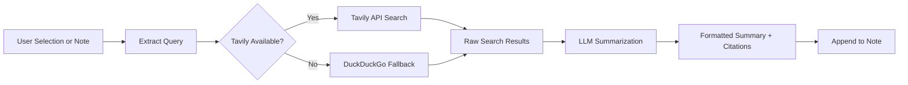

import TLDR from '@site/src/components/TLDR';

# Cercetare și căutare pe web

<TLDR>
**Notemd citește pe web și injectează rezultatele LLM-summarizate direct în notele tale.** Tavily API este backend-ul principal de căutare; DuckDuckGo servește drept opțiune fără configurare. Rezultatele sunt sumarizate cu citate din surse și adăugate sub o titlul `## Research`. Suportă cercetare într-o singură notă, cercetare în folderuri în lot și selecție a modelului pentru pasul de sumarizare în funcție de sarcină.

Acesta face parte din [Obsidian Ghidul de gestionare a cunoștințelor AI](/docs/pillar-ai-knowledge).
</TLDR>

## Prezentare generală

Cercetarea este una dintre cele mai puternice integrări ale Notemd: ea încheie ciclul între citire, căutare și scriere. În loc să treci la un browser pentru a căuta un termen necunoscut, poți evidenția-l și lăsa pe Notemd să caute, să sumarizeze și să adauge rezultatele – totul în cadrul seifului tău.

Procesul este complet configurabil. Alegi furnizorul de căutare, LLM care scrie sumarul și dacă rezultatele sunt adăugate în nota activă sau scrise în fișiere separate. Modul în lot îți permite să cercetezi toate notele dintr-un folder cu un singur clic.

## Cum funcționează

### Pipeline-ul Căutare-apoi-Sumarizare



1. **Extragerea interogărilor** -- Notemd extrage termenii de căutare din selecția ta sau din titlul notei.
2. **Căutarea pe web** -- Mai întâi se încearcă Tavily. Dacă nu este configurată nicio cheie API, se folosește automat DuckDuckGo (fără nevoie de cheie).
3. **Sumarizarea cu LLM** -- Rezultatele brute de căutare sunt trimise către LLM configurat, care generează un sumar concis cu citate din surse inline.
4. **Adăugare** -- Sumarul format este adăugat sub o titlul `## Research` în nota activă.

### Tavily vs. DuckDuckGo

| Aspect | Tavily | DuckDuckGo |
|--------|--------|------------|
| Cheia API | Requerit (există nivel gratuit) | Nu este necesar |
| Calitatea rezultatului | Superioară (construită special pentru AI) | Adevată pentru interogări generale |
| Limite de rată | Nivel gratuit generos | Supus throttling-ului |
| Configurație | `tavilyApiKey` în setările | Fără configurație – fallback automat |

### Cercetare în folderul în lot

Faceți clic dreapta pe un folder și alegeți **"Notemd: Folder de cercetare"**. Fiecare fișier `.md` din folder este procesat secvențial (sau paralel până la concurența configurată). Fiecare notă primește propriul său rezumat de cercetare.

## Configurație

| Setare | Implicit | Efect |
|---------|---------|--------|
| `tavilyApiKey` | `''` | Cheia Tavily API. Când este golă, se folosește exclusiv DuckDuckGo. |
| `researchProvider` / `researchModel` | DeepSeek | LLM pe sarcină pentru rezumarea rezultatelor de căutare |
| `maxResearchContentTokens` | `4000` | Bugetul de tokeni pentru conținutul trimis la LLM. Excesul este trunchiat. |
| `researchAppendToNote` | `true` | Adaugă rezumatul la nota sursă. Dacă este false, se creează un fișier separat. |
| `researchLanguage` | `'en'` | Limba de ieșire pentru cercetarea rezumată |

### Recomandare de model pe sarcină

Cercetarea beneficiază de un model care gestionează conținutul multilingv și produce texturi bine structurate. Luați în considerare:

- **DeepSeek** -- standard, accesibil, calitate bună
- **GPT-4o** -- rezumări de calitate superioară, cost mai ridicat
- **Gemini Flash** -- rapid și ieftin, potrivit pentru interogări simple

## Exemplu

Citiți un articol despre *mecanismele de atenție transformer* și întâlniți un termen necunoscut: *relative positional encoding*. În loc să lăsați Obsidian:

1. Highlightați **"relative positional encoding"**
2. Faceți clic dreapta --> **"Notemd: Cercetare și rezumare"**
3. Notemd căută pe web, rezumă cele mai bune rezultate și adaugă:

```markdown
## Research

### Relative Positional Encoding

Relative positional encoding is a method used in transformer models
where positional information is expressed as relative distances between
tokens rather than absolute positions. Introduced by Shaw et al. (2018),
it improves generalization to unseen sequence lengths compared to
absolute encodings (Vaswani et al., 2017).

Sources:
- [Shaw et al., Self-Attention with Relative Position Representations (2018)](https://arxiv.org/abs/1803.02155)
- [Transformer Positional Encoding Overview](https://example.com/transformer-pos-enc)
```

Rezumatul face acum parte din depozitul dumneavoastră, fiabil pentru căutare, linkabil și accesibil offline.

## Sfaturi

- **Setați o cheie Tavily pentru cele mai bune rezultate** -- chiar nivelul gratuit oferă o relevanță mai bună decât DuckDuckGo brut.
- **Folosiți un model de rezumare capabil** -- modelele ieftine pot simplifica conținutul tehnic subtil.
- **Cercetați în lot** după o citire inițială pentru a umple lacunele din multiple note simultan.
- **Verificați rezumaturile adăugate** -- LLM poate inventa detalii despre sursă. Verificați afirmațiile esențiale.

---

## Următoarele pași

- [Concept Notes](./concept-notes) -- Extrageți și păstrați termenii cheie din rezultatele cercetării
- [Wiki-Links](./wiki-links) -- Legați conceptele obținute din cercetare între ele în depozitul dumneavoastră
- [Translation](./translation) -- Traduceți rezumaturile de cercetare într-o altă limbă
- [LLM Furnizori](/docs/providers/overview) -- Configura modelul utilizat pentru rezumat
