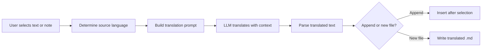

import TLDR from '@site/src/components/TLDR';

# Traducere

<TLDR>
**Notemd traduce textul între peste 21 de limbi folosind tehnologiea LLM.** Suportă traducerea a unei selecții, a întregii note și a unui folder în lot. Fiecare sarcină de traducere poate folosi un furnizor și un model dedicat prin setări specifice pentru acea sarcină. Limba de ieșire poate fi configurată independent de limbă UI. Rezultatele sunt adăugate sau scrise într-un fișier nou în funcție de preferințele dumneavoastră.

Acesta face parte din [Obsidian Ghidul de gestionare a cunoștințelor AI](/docs/pillar-ai-knowledge).
</TLDR>

## Prezentare generală

Traducerea în Notemd nu este o căutare din dicționar – este o traducere bazată pe LLM, conștientă de context. Modelul vede întreg paragraful sau nota, păstrând tonul, terminologia specifică domeniu și structura propozițiilor. Acest lucru oferă rezultate de calitate mai ridicată decât serviciile de traducere cuvânt cu cuvânt, în special pentru texte tehnice, academice și creative.

Funcția suportă trei domenii: selecție, nota activă și întreg folder. În combinație cu selectarea modelului pentru fiecare sarcină, puteți folosi un model rapid (Gemini Flash) pentru traduceri obișnuite și un model puternic (Claude Sonnet) pentru conținut care necesită sensibilitate la nuanțe – fără a schimba furnizorul global.

## Cum funcționează

### Comanda Translate



1. **Detectarea sursă** – LLM deduce limbajul sursă din conținut. Nu este nevoie să-l specificați manual.
2. **Construcția promptului** – Notemd creează un prompt care include limba țintă, o sugestie opțională de domeniu și conținutul care trebuie tradus.
3. **Traducerea LLM** – `translateProvider` / `translateModel` configurat procesează cererea. Modelul păstrează formatarea markdown, linkurile wiki și blocurile de cod.
4. **Ieșire** – Textul tradus este fie adăugat sub original, fie scris într-un fișier nou din depozit.

### Perechi de limbi

Notemd suportă orice pereche de limbi pe care LLM o susține. Printre perechile comune se numără:

| Sursă | Target | Calitate tipică |
|--------|--------|----------------|
| Engleză | Chineză simplificată | Excelent |
| Chineză | Engleză | Excelent |
| Engleză | Japoneză | Foarte bun |
| Engleză | Germană / Franțuzea / Spaniolă | Foarte bun |
| Orice limbă suportată | Orice limbă suportată | Depinde de model |

Setarea `translateLanguage` controlează **limbajul de ieșire**. Limbajul sursă este detectat automat.

### Selectare a modelului pe sarcină

Calitatea traducerii variază semnificativ în funcție de model. Notemd vă permite să atribuiți un model dedicat doar pentru traducere:

| Model | Viteza | Calitate | Costul | Cel mai potrivit pentru |
|-------|-------|--------|------|----------|
| `gemini-2.0-flash-exp` | Rapid | Bun | Scăzut | Casual, volum mare |
| `gpt-4o-mini` | Rapid | Bun | Scăzut | Căutări rapide |
| `deepseek-chat` | Mediu | Bun | Foarte scăzut | Budjet multilingv |
| `claude-3-5-sonnet` | Mediu | Excelent | Mediu | Tehnic / academic |
| `gpt-4o` | Mediu | Excelent | Mediu | Proză sensibilă la nuanțe |

### Traducere a folderului în lot

Faceți clic dreapta pe un folder și selectați **"Notemd: Translate folder"** pentru a traduce toate notele din acel folder. Fiecare fișier este procesat independent. Setarea de concurență controlează câte fișiere se traduc simultan.

## Configurație

| Setare | Implicit | Efect |
|---------|---------|--------|
| `translateProvider` / `translateModel` | DeepSeek | Provider dedicat pentru sarcini de traducere |
| `translateLanguage` | `'en'` | Limbajul țintă pentru output |
| `translationAppendToNote` | `true` | Adăugați textul tradus sub textul original. Dacă este setat pe false, se creează un fișier nou. |
| `batchConcurrency` | `3` | Numărul de fișiere procesate simultan în timpul traducerii în lot |

## Exemplu

Citiți o notă de cercetare în chineză și doriți o versiune în engleză:

1. Deschideți nota
2. Clic dreapta --> **"Notemd: Translate current file"**
3. Notemd detectează limba chineză, o traduce în limbă țintă configurată (engleză) și adaugă:

```markdown
## Translation (English)

The experimental results show that the proposed method achieves
a 12% improvement in F1 score compared to the baseline, primarily
due to the enhanced feature extraction module described in Section 3.
```

Textul chinez original rămâne neschimbat deasupra traducerii. Titlul `## Translation` păstrează ambele versiuni în același fișier pentru ușor referință.

## Sfaturi

- **Utilizați Gemini Flash pentru volume** -- este cea mai rapidă și ieftină opțiune pentru traducerea în lot a folderurilor mari.
- **Păstra linkurile wiki** -- instrucțiunea Notemd solicită LLM să păstreze `[[wiki-links]]` intact în traducere. Verificați după traducere, deoarece unele modele le dezpachetează ocazional.
- **Setează limba de ieșire explicit** -- detectarea automată funcționează pentru sursă, dar configurați întotdeauna `translateLanguage` pentru a evita ambiguitățile legate de țintă.
- **Traducere în lot a notițelor conceptuale** -- dacă folderul dumneavoastră cu concepte este într-o limbă și doriți el să fie în alta, traducerea la nivel de folder o gestionează într-un singur pas.

---

## Următoarele pași

- [Cercetare](./research) -- Căutați și rezumați în orice limbă, apoi traduceți rezultatele
- [Fluxuri de lucru](./workflows) -- Înșirați traducerea cu linkuri wiki sau extracție a conceptelor
- [Procesare în lot](/docs/advanced/batch-processing) -- Concurgență și comportamentul de suprascriere pentru operațiile pe folder
- [LLM Furnizori](/docs/providers/overview) -- Alegeți cel mai bun model pentru perechea dumneavoastră de limbi
