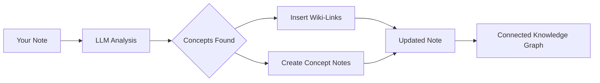

import TLDR from '@site/src/components/TLDR';

# Wiki-Linkuri

<TLDR>
**Notemd adaugă automat `[[wiki-links]]` la conceptele cheie din notele tale.** LLM citește conținutul tău, identifică termenii importanți în context și inserează linkuri wiki în stil Obsidian la fiecare apariție. Opțional, creează fișiere de note conceptuale cu backlink-uri. Suportă suprimarea sinonimelor, integritatea linkurilor la renumire/eliminare și modul de extracție pură (fără modificări ale fișierelor). Spre deosebire de Auto Link care se potrivește doar cu titlurile existente ale notelor, Notemd folosește IA pentru a identifica concepte noi și creează note corespunzătoare. Acesta face parte din [Obsidian Ghidul de gestionare a cunoștințelor cu IA](/docs/pillar-ai-knowledge).
</TLDR>

## Prezentare generală

Linkarea wiki este caracteristica principală a Notemd. Ea transformă textul simplu într-o grafică de cunoștințe conectată prin:

1. **Analizarea notei tale** cu un LLM
2. **Identificarea conceptelor cheie** (termeni, persoane, metode, teorii)
3. **Inserearea `[[wiki-links]]`** la fiecare apariție
4. **Crearea de note conceptuale** (opțional) cu backlink-uri

## Cum funcționează

### Proces



### Exemplu

**Înainte:**
```markdown
Machine learning models use neural networks to learn patterns from data.
The transformer architecture revolutionized natural language processing.
```

**După:**
```markdown
[[Machine learning]] models use [[neural networks]] to learn patterns from data.
The [[transformer architecture]] revolutionized [[natural language processing]].
```

## Utilizare

### Bună: Adaugare a linkurilor în nota curentă

1. Deschideți o notă
2. Face clic dreapta în editor → **"Procesează fișierul (adaugă linkuri)"**
3. Așteaptă câteva secunde
4. Conceptele sunt acum linkate!

### Lot: Procesare a mai multor note

1. Faceți clic dreapta pe o folderă în Explorerul fișierelor
2. Selectați **"Notemd: Process folder (add links)"**
3. Configurație:
   - Concurrentism (câte fișiere în paralel)
   - Scrie peste linkurile existente (da/nu)
4. Apăsați **Procesare**

### Selectiv: Linkare a unui text specific

1. Evidențiați textul care urmează procesat
2. Faceți clic dreapta → **"Procesare a selecției (adăugare linkuri)"**
3. Doar partea evidențiată este analizată

## Notemd versus Linkare automată

Obsidian are două abordări pentru linkarea automată la wiki:

| | **Linkare automată** | **Notemd** |
|--|---------------|-------------|
| Sursa linkului | Titlurile noteurilor existente în depozit | Conceptele identificate de LLM în conținut |
| Poate crea legături între noile concepte | Nu — titlul trebuie să existe deja | Da — IA identifică conceptele și creează note |
| Gestionarea sinonimelor | Nu | Da — suprimarea sinonimelor |
| Crearea notei de concept | Nu | Da — cu backlink-uri și eliminare a duplicatelor |
| Procesare în lot | Nu (fișier unic) | Da (la nivel de folder) |
| Ruteare a modelului pe sarcină | Nu | Da |

**Auto Link** se bazează pe corespondența titlurilor: dacă există o notă numită „Machine Learning“, aceasta încadrează aparițiile în `[[Machine Learning]]`. Dacă nota nu există, nu se întâmplă nimic.

**Notemd** este pilotat de IA: LLM citește conținutul dumneavoastră, înțelege contextul, identifică conceptele care *ar trebui* legate — chiar dacă nu există încă nicio notă — și creează atât legătura, cât și nota de concept.

## Funcții

### Suprimarea sinonimelor

**Problema:** „transformer“, „transformers“, „Transformer architecture“ → 3 concepte separate

**Soluția:** Notemd detectează duplicatele apropiate și folosește forma canonicală.

**Configurație:**
```
Settings → Advanced → Synonym Suppression
Threshold: 0.8 (0 = off, 1 = aggressive)
```

### Integritatea linkurilor

**Când renumești o notă de concept:**
- Toate linkurile wiki se actualizează automat (Obsidian caracteristică principală)
- Linkurile inverse rămân intacte

**Când ștergi o notă de concept:**
- Linkurile rămân, dar apar ca „mențiuni nelinkate"
- Poți recrea-o din orice apariție

### Modul de extracție pură

**Extrage concepte fără a modifica originalul:**

1. Clic dreapta → **„Extrage concepte (fără linkare)"**
2. Sunt create note de concept
3. Fișierul original rămâne neschimbat

Cas de utilizare: Procesarea conținutului doar pentru citire sau a drafturilor finale.

## Generarea notei de concept

### Creare automată

**Când este activat (valoare implicită), Notemd creează:**

```markdown
---
tags: [concept, auto-generated]
created: 2026-06-13
source: [[Original Note Name]]
---

# Machine Learning

A branch of artificial intelligence that enables computers
to learn from data without explicit programming.

## Occurrences in Your Vault

- [[Original Note Name#Section]]
- [[Another Note#Header]]

## Related Concepts

- [[Neural Networks]]
- [[Deep Learning]]
- [[Supervised Learning]]
```

### Configurație

**Folderul de ieșire:**
```
Settings → Output → Concept Folder
Default: concepts/
```

**Structura ierarhică:**
```
Settings → Output → Use Hierarchical Folders
If enabled:
  papers/my-paper.md → papers/concepts/Concept.md
If disabled:
  → concepts/Concept.md
```

**Șablonul:**
```
Settings → Output → Concept Template
Customize with variables:
  {{concept}} — Concept name
  {{description}} — LLM-generated description
  {{backlinks}} — List of source notes
  {{date}} — Creation date
```

## Opțiuni avansate

### Fenestra de context

**Cât text înconjurător să fie trimis:**

```
Settings → Linking → Context Window
Options: Sentence | Paragraph | Full Note
Default: Paragraph
```

Mai mare = precizie mai bună, cost mai ridicat.

### Apariții minime

**Linka doar conceptele care apar de mai multe ori:**

```
Settings → Linking → Min Occurrences
Default: 1 (link all)
```

Setați la 2 sau 3 pentru a vă concentra asupra temelor recurente.

### Modele de exclusie

**Săriți peste anumite cuvinte:**

```
Settings → Linking → Exclude List
Example: note, idea, example, thing
```

Împiedică linkarea excesivă a termenilor generici.

### Prompturi personalizate

**Să înlocuiți instrucțiunile default ale LLM:**

```
Settings → Advanced → Custom Linking Prompt
Default:
  "Identify key concepts, theories, methods, and technical
   terms in the following text. Return as a list..."
```

Modificați-le pentru nevoi specifice domeniu (de exemplu, "Concentrați-vă pe terminologia medicală").

## Sfaturi și cele mai bune practici

### ✅ DA

- **Procesează notele cu >100 de cuvinte** — Notele scurte conțin puține concepte
- **Folosiți modele puternice** pentru o identificare mai bună a conceptelor (GPT-4o, Claude)
- **Revizionare înainte de acceptare** — Verificați dacă linkurile sugerate sunt logice
- **Construiește în mod iterativ** — Procesează 5-10 note, revizui graful, ajustează setările

### ❌ NU

- **Over-link** — Nu fiecare substantiv necesită un link
- **Procesează proiectele în mod repetat** — Conceptele se pot schimba, așteaptă până devin stabile
- **Ignora sinonimele** — Activează suprimarea pentru a evita „ML” în loc de „Machine Learning”

## Performanță

### Viteza

| Dimensiunea notei | GPT-4o-mini | Claude Sonnet | Ollama (local) |
|-----------|-------------|---------------|----------------|
| 500 de cuvinte | 2-3 secunde | 3-5 secunde | 5-10 secunde |
| 2000 de cuvinte | 5-8 secunde | 10-15 secunde | 20-40 secunde |
| 5000+ cuvinte | În bucăți (calle multiple) | În bucăți | În bucăți |

### Estimare a costurilor

**Exemplu: Notă de 1000 de cuvinte cu GPT-4o-mini**
- Entrare: ~1500 tokeni
- Rezultat: ~200 tokeni
- Cost: ~

**Procesare în lot a 100 de note:** ~

## Dezvoltarea de soluții

### Niciun link adăugat

**Verificare:**
1. LLM apelul a avut succes (Setări → Diagnosticare)
2. Noteta conține suficient conținut (>50 de cuvinte)
3. Conceptele sunt tehnice/specifice (nu doar pronume).

**Încercați:**
- Folosește un model mai puternic
- Crește fereastra de context
- Verifică validitatea cheii API

### Prea multe linkuri

**Soluții:**
1. Crește numărul minim de apariții (2 sau 3)
2. Adaugă cuvinte comune în lista de exclusii
3. Folosește un model mai puțin agresiv

### Concepte greșite legate

**Correcții:**
1. Folosiți un prompt personalizat pentru specificitatea domeniu
2. Activeazăți suprimarea sinonimelor
3. Revizuiți manual și dezlegați

### Legăturile se strică după redenumire

**Acesta este un comportament normal Obsidian.**

Pentru a actualiza toate legăturile:
1. Redenumiți nota conceptuală
2. Obsidian actualizează automat `[[old]]` → `[[new]]`

---

## Următoarele pași

- 📖 [Note conceptuale](./concept-notes) — O analiză aprofundată a generării notelor conceptuale
- 🔍 [Integrare cercetării](./research) — Combinați legături cu cercetarea pe web
- 🎨 [Diagrame](./diagrams) — Vizualizați graful dumneavoastră de cunoștințe
