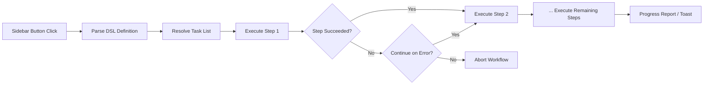

import TLDR from '@site/src/components/TLDR';

# Fluxuri de lucru

<TLDR>
**Notemd Fluxurile de lucru leagă mai multe sarcini într-o singură acțiune cu un clic.** Definiți secvențe precum `add-links > extract-concepts > research > diagram` folosind un DSL simplu. Fluxurile de lucru apar ca butoane în bara laterală care execută întreaga lanțare pe nota curentă sau folderul. Sunt incluse fluxuri de lucru predefinite; creați altele personalizate în setările aplicației. Fiecare pas folosește propria sa configurare de model pentru sarcina respectivă.

Acesta face parte din [Obsidian Ghidul de gestionare a cunoștințelor AI](/docs/pillar-ai-knowledge).
</TLDR>

## Prezentare generală

O fluxură de lucru elimină dificultățile legate de executarea sarcinilor una câte una. În loc să faceți clic dreapta de patru ori pentru a adăuga linkuri, extrage concepte, căutați termeni necunoscuti și generați un diagramă, apăsați un buton din bara laterală și întreaga lanțare se execută. Notemd gestionează secvențierea, propagarea erorilor și raportarea progresului.

Fluxurile de lucru sunt definite într-un DSL ușor (limbaj specific domeniu). Ele se găsesc în setările aplicației, apar ca butoane clicabile în bara laterală Obsidian și pot fi aplicate fie pe nota curentă, fie pe întregul folder.

## Cum funcționează

### Pipeline-ul de executare a fluxurilor de lucru



1. **Analizare** -- Șirul DSL este împărțit la `>` (sau `>`) într-o listă ordonată de identificatoare de sarcini.
2. **Resolvare** -- Fiecare identificator se referă la o comandă internă (add-links, extract-concepts, research, translate, diagram etc.).
3. **Executare** -- Pașii se execută secvențial. Fiecare pas folosește furnizorul și modelul configurat pentru sarcina respectivă.
4. **Gestionarea erorilor** -- Dacă un pas eșuează, fluxura de lucru fie se oprește, fie continuă la următorul pas, în funcție de politica dumneavoastră de gestionare a erorilor.
5. **Finalizare** -- O notificare tip toast raportează succesul sau listează orice pași eșuați.

### Formatul DSL

Fluxurile de lucru sunt definite ca o secvență de identificatoare de sarcini separate prin `>`:

```
process-current-add-links>extract-concepts-current>research-and-summarize
```

**Identificatoarele de sarcină disponibile:**

| Identificator | Acțiune |
|------------|--------|
| `process-current-add-links` | Adaugă linkuri wiki în nota activă |
| `extract-concepts-current` | Extrage concepte din nota activă |
| `research-and-summarize` | Cercetează textul selectat sau titlul notei |
| `process-current-translate` | Traduce nota activă |
| `summarize-to-mermaid` | Generează un diagram din nota activă |
| `generate-from-title` | Generează conținut din titlul notei |
| `extract-original-text` | Extrage textul original (pentru OCR / conținut scanat) |

**Variante la nivel de folder** înlocuiește `current` cu `folder` în numele identificatorului.

### Fluxuri de lucru predefinite versus personalizate

Notemd vine cu fluxuri de lucru gata preparate pentru pattern-uri comune:

| Flux de lucru | Lanț | Caz de utilizare |
|----------|-------|----------|
| **Extragere cu un clic** | add-links > extract-concepts > research | Procesează o lucrare de cercetare într-o singură trecere |
| **Pipeline complet** | add-links > extract-concepte > cercetare > diagramă | Extragerea completă a cunoștințelor cu vizualizare |
| **Traduce + Legătură** | traduce > add-links | Traduce apoi legă conceptele în limbajul țintă |

**Fluxuri de lucru personalizate** se creează în setările:

1. Deschide **Setările** --> **Notemd** --> **Fluxuri de lucru**
2. Face clic pe **"Adaugare flux de lucru"**
3. Introdu lanțul DSL (de exemplu, `process-current-add-links>extract-concepts-current`)
4. Dă-i un nume de afișare (de exemplu, "Legătură rapidă + Extragere")
5. Noul buton apare imediat în bara laterală

## Configurație

| Setare | Implicit | Efect |
|---------|---------|--------|
| `workflows` | Set predefinit | Array de definiții de fluxuri de lucru (nume + DSL) |
| `workflowContinueOnError` | `true` | Continuă la pasul următor dacă pasul actual eșuează |
| `workflowShowProgress` | `true` | Afișează un toast cu progres după finalizarea fiecărui pas |

### Modele pe sarcină în fluxurile de lucru

Fiecare pas dintr-un flux de lucru utilizează propria sa configurare de model pentru fiecare sarcină. Nu este necesar să specificați modele în propriul DSL. Ordinea de rezolvare este:

1. Provider/model pentru fiecare sarcină dacă `useMultiModelSettings` este disponibil
2. `activeProvider` global în caz contrar

Asta înseamnă că `add-links` poate fi rulat pe DeepSeek în timp ce `research` este rulat pe GPT-4o – toate în cadrul aceluiași flux de lucru.

## Exemplu

Ați importat recent un PDF dintr-un articol de științe în seiful dumneavoastră și doriți extragerea completă a cunoștințelor:

1. Deschideți nota importată
2. Faceți clic pe butonul din bara laterală **"Full Pipeline"**
3. Notemd execută:
   - **Pasul 1**: Adăugați linkuri wiki – `[[attention mechanism]]`, `[[transformer]]` etc.
   - **Pasul 2**: Extrageți concepte – creează note de concept în folderul dumneavoastră de concepte
   - **Pasul 3**: Cercetare – rezumă sursele web pentru termenii cheie
   - **Pasul 4**: Diagramă – generează o mapă mentală Mermaid a structurii articolului
4. După aproximativ 30 de secunde, nota dumneavoastră conține linkuri, există note de concept, cercetarea este adăugată și un fișier de diagramă este salvat

Totul prin un singur clic.

## Sfaturi

- **Începeți cu fluxuri de lucru predefinite** – acestea acoperă cele mai comune pattern-uri. Personalizați doar atunci când aveți nevoie de o secvență diferită.
- **Activeazăți `workflowContinueOnError`** – o etapă de diagramă eșuată nu ar trebui să oprească întregul pipeline.
- **Folosi fluxuri de lucru pentru foldere** pentru procesare în masă -- faceți clic dreapta pe o folderă, alegeți un flux de lucru, și fiecare notă este procesată.
- **Denumiți fluxurile de lucru clar** -- spațiul din bara laterală este limitat. Folosiți nume scurte, orientate spre acțiune, cum ar fi „Extractare rapidă“ sau „Traduc + Link“.

---

## Următoarele pași

- [Cercetare](./research) -- Înțelegeți ce face pasul de cercetare înainte de a-l adăuga în fluxurile de lucru
- [Legături Wiki](./wiki-links) -- Funcția principală de legături utilizată în majoritatea fluxurilor de lucru
- [Note conceptuale](./concept-notes) -- Extracția de concepte ca pas al unui flux de lucru
- [Procesare în masă](/docs/advanced/batch-processing) -- Concurență și raportare a progresului pentru fluxurile de lucru ale folderelor
