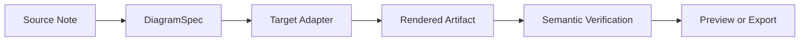
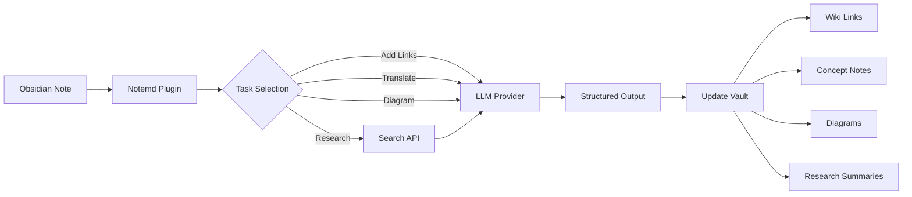

import TLDR from '@site/src/components/TLDR';

# Introducere în Notemd

<TLDR>
**Notemd** (Note + EMD — Documente Markdown îmbunătățite) este un plugin open-source pentru Obsidian care transformă lecturile realizate cu LLM în cunoștințe persistente. Spre deosebire de IA bazată pe chat, unde informațiile dispar după sesiune, Notemd scrie rezultatele **direct în vault-ul dumneavoastră** sub formă de linkuri wiki, note conceptuale, rezumate de cercetare, traduceri, fluxuri de lucru și diagrame. Este conceput pentru cercetători, studenți și profesioniști care doresc ca lecturile, cercetările și explicațiile vizuale să se acumuleze într-o grafică a cunoștințelor structurată și în evoluție.
</TLDR>

## Ce este Notemd?

Notemd integrează **peste 30 de modele mari de limbaj** (OpenAI, Anthropic, Google, DeepSeek, Qwen, Ollama și altele) în fluxul de lucru Obsidian al dumneavoastră pentru a automatiza extragerea cunoștințelor, organizarea lor, traducerea, cercetarea și generarea diagramelor.

### Diferența cheie: Cunoștințe efemere vs. persistente

| Aspect | IA bazată pe chat (ChatGPT etc.) | Notemd |
|--------|-------------------------------|--------|
| **Unde ajung rezultatele** | Istoricul de chat (dispare) | Vault-ul dumneavoastră Obsidian (rămâne) |
| **Format** | Răspunsuri în text simplu | Fișiere structurate: `[[wiki-links]]`, note conceptuale, diagrame |
| **Valoarea pe termen lung** | Trebuie întrebat din nou de fiecare dată | Se acumulează într-un graf de cunoștințe |
| **Acces offline** | Necesită internet | Funcționează complet offline cu Ollama |

## Capacități de bază

### 1. **Legături automatice la Wiki**
- LLM identifică conceptele cheie din notele tale
- Inserează `[[wiki-links]]` la fiecare apariție
- Opțional creează note conceptuale legate
- Suprimarea sinonimelor pentru a evita duplicatele

### 2. **Generarea Notei de Concept**
- Extrage conceptele esențiale din lucrări, articole, note
- Generează fișiere dedicate cu linkuri inverse
- Căi de ieșire și șabloane personalizabile

### 3. **Integrare cu Cercetarea Web**
- Cauta Tavily sau DuckDuckGo din interiorul Obsidian
- LLM rezumă rezultatele cu citate din surse
- Adaugă descoperirile de cercetare la nota curentă

### 4. **Traducere Multilingvă**
- Traduce selecții sau întregi note
- Sprijină peste 21 limbă UI
- Configurație independentă a limbii de ieșire
- Suport pentru traducere în loturi

### 5. **Generare de diagrame**
- **Mermaid**: Diagrame de flux, secvențe, clase, stări, ER, Gantt
- **JSON Canvas**: Layout-uri native Obsidian
- **Vega-Lite**: Grafice de date, serii temporale, grafice de dispersie
- **HTML / HTML editabil/SVG**: Artefacte de figură autonome cu anotații semantice
- **Draw.io / limitele artefactului Drawnix**: Căi de export destinate administratorilor din același model semantic de figură
- **Planul de dezvoltare pentru diagramele de circuite**: Suportul circuitikz/TikZJax este proiectat pe baza referințelor goldene, prompturilor restrânse, feedback-ului de renderizare și validării topologiei/layoutului, în loc de TikZ neconstrâns și brut
- **Diagnosticuri de previsualizare**: Artefactele de renderizare pot afișa diagnosticuri privind compilarea/renderizarea, iar sursele non-inline pot fi inspectate fără a fi necesar un runtime LaTeX pe partea plugin-ului
- Corectare automată a sintaxei pentru erorile Mermaid

### 6. **Fluxuri de lucru cu un clic**
- Conectează mai multe acțiuni în butoane de bara laterală
- Definiție a fluxului de lucru pe baza DSL
- Exemplu: `add-links > extract-concepts > research > diagram`

## Cine ar trebui să folosească Notemd?

✅ **Cercetătorii** care citesc articole și creează recenzii literare
✅ **Studenții** care organizează notele de studiu și creează hărți conceptuale
✅ **Lucrătorii cu cunoștințe** care doresc ca informațiile de lectură să rămână persistente
✅ **Profesioniștii bilingvi** care au nevoie de traducere + linkuri wiki
✅ **Utilizatorii preocupați de confidențialitate** care doresc suport local LLM (Ollama)
✅ **Utilizatorii avansați** care personalizează prompturile și fluxurile de lucru

## De ce Notemd + Obsidian?

**Obsidian** este o bază de cunoștințe local-first, pe baza markdown. **Notemd** adaugă superputeri AI:
- Datele dumneavoastră rămân în seiful dumneavoastră (nu într-un serviciu cloud)
- Funcționează offline cu modele locale
- Gratuit și cu cod sursă deschis (licența MIT)
- Se integrează cu pluginurile Obsidian existente
- Se scală până la zeci de mii de note

## Introducere

1. **Instalare**: Setări → Pluginuri comunitare → Cautare → "Notemd"
2. **Configurare**: Adăugați cheia providerului LLM API dumneavoastră (sau folosiți Ollama local)
3. **Testare**: Deschideți o notă → Click dreapta → "Process file (add links)"
4. **Explorare**: Verificați bara laterală pentru fluxuri de lucru cu un clic

👉 [Ghid de instalare](./getting-started/installation) | [Tutorial rapid de începere](./getting-started/quick-start)

## Capacitatea de diagrame, direcția dezvoltării

Lucrul cu diagramele Notemd se îndreaptă departe de metodologia de a cere modelului să scrie o singură șir de sintaxă și spre un pipeline stratificat:

Implementarea actuală suportă deja Mermaid, JSON Canvas, Vega-Lite, fallback-ul HTML, HTML/SVG editabile, artefactele Draw.io XML, un subset minim al Drawnix JSON, diagnosticuri de previsualizare/fallback doar cu sursă, și un prototip offline `CircuitSpec -> circuitikz` pentru șabloanele goldene comune și a invertorilor CMOS. Diagramele de circuite reprezintă o categorie mai dificilă: circuitikz poate exprima topologia electrică precisă, dar ieșirea necontrolată a LLM produce adesea trasee nerecitabile sau LaTeX care nu se afișează. Direcția următoare este să menținem circuitikz restricționat cu șabloane de referință goldene, reguli de layout cu rețea de noduri, diagnosticuri de afișare și bucle de feedback prin captură de ecran.

Citiți detalii în [Diagrams](./features/diagrams).

## Arhitectură

## Notemd comparativ cu alte pluginuri AI Obsidian

Majoritatea pluginurilor AI Obsidian sunt orientate pe conversație (vă întrebați, IA răspunde, informațiile rămân în chat). Notemd este **orientat pe scriere**: IA procesează notele dumneavoastră și scrie rezultate structurate direct în vault-ul dumneavoastră.

| Capacități | Notemd | Copilot | Smart Connections | Text Generator |
|-----------|--------|---------|-------------------|-----------------|
| Inserare automată a linkurilor wiki | Da | Nu | Nu | Nu |
| Generare a notițelor conceptuale | Da (cu backlink-uri + eliminare a duplicatelor) | Nu | Nu | Nu |
| Generare de diagrame | Da (Mermaid, Canvas, Vega-Lite, HTML, artefacte editabile) | Nu | Nu | Nu |
| Integrare cu cercetarea web | Da (Tavily + DuckDuckGo) | Nu | Nu | Nu |
| Procesare a folderelor în lot | Da | Limitat | Nu | Limitat |
| Ruteare a modelului pe sarcină | Da (7 sarcini, modele independente) | Nu | Nu | Nu |
| Lanțuri de flux de lucru cu un clic | Da (DSL) | Nu | Nu | Nu |
| Traducere (în lot) | Da | Nu | Nu | Nu |
| Conversație cu vault | Nu | Da | Nu | Nu |
| Căutare prin similaritate semantică | Nu | Nu | Da | Nu |
| Generare pe baza de șabloane | Nu | Nu | Nu | Da |
| furnizori LLM | 36 (cloud + gateway + local) | 3-5 | 2-3 | 3-5 |
| Complet offline | Da (Ollama) | Parțial | Parțial | Parțial |

**Când alegeți Notemd**: Doriți ca IA să creeze un graf de cunoștințe persistent — nu doar să discute despre notele dumneavoastră.

**Când alegeți Copilot**: Doriți un asistent AI conversațional în interiorul Obsidian.

**Când alegeți Smart Connections**: Doriți să descoperiți relațiile existente între note prin căutare semantică.

## Filozofie

**Notemd consideră că IA ar trebui să completeze munca umană de cunoaștere, nu să o înlocuiască.** Pluginul:
- Te menține sub control (revizuire înainte de aplicare a modificărilor)
- Păstrează contextul (toate rezultatele fac referire la sursă)
- Respectează confidențialitatea (sprijin local LLM, fără telemetrie)
- Rămâne extensibil (API deschise APIs, fluxuri de lucru personalizate)

<!-- notemd-acknowledgments -->
## Mulțumiri și proiecte de referință

Notemd este întreținut independent. Mulțumim proiectelor și comunităților open source care au informat decizii de proiectare documentate sau oferă baze pentru integrări. Includerea recunoaște numai influența sau interoperabilitatea; nu implică susținere, afiliere, cod inclus sau o afirmație de reutilizare a codului.

- **Proiecte de referință:** [cloudy-tech-diagrams-skill](https://github.com/cloudy-liu/cloudy-tech-diagrams-skill), [Drawnix](https://github.com/plait-board/drawnix), [diagrams.net / draw.io](https://www.diagrams.net/), [repo-saga](https://github.com/teee32/repo-saga).
- **Fundamente open source:** [Mermaid](https://github.com/mermaid-js/mermaid), [Vega-Lite](https://vega.github.io/vega-lite/), [Slidev](https://github.com/slidevjs/slidev), [CircuitikZ](https://github.com/circuitikz/circuitikz), [Tectonic](https://github.com/tectonic-typesetting/tectonic), [Docusaurus](https://docusaurus.io).
- Fiecare proiect își păstrează propria licență și propriile condiții; Notemd este disponibil sub [licența MIT](https://github.com/Jacobinwwey/obsidian-NotEMD/blob/main/LICENSE).

## Open Source

- **Licență**: MIT
- **Sursă**: [github.com/Jacobinwwey/obsidian-NotEMD](https://github.com/Jacobinwwey/obsidian-NotEMD)
- **Comunitate**: [Discord](https://discord.gg/qnGgsQ9W) | [GitHub Discussions](https://github.com/Jacobinwwey/obsidian-NotEMD/discussions)
- **Contribuiește**: Sunt binevenite PR-uri, consultați [CONTRIBUTING.md](https://github.com/Jacobinwwey/obsidian-NotEMD/blob/main/CONTRIBUTING.md)

---

**Următor**: [Installation →](./getting-started/installation)
