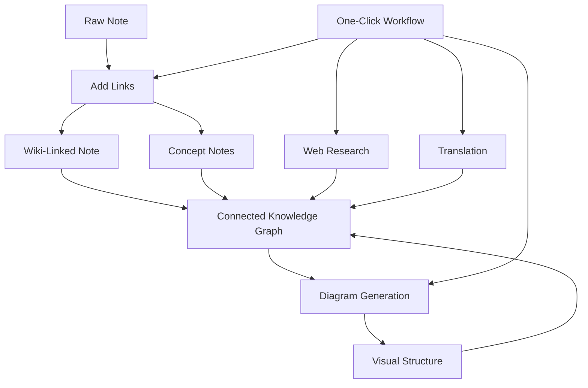

import TLDR from '@site/src/components/TLDR';

# Obsidian Ghid de management al cunoștințelor cu AI

<TLDR>
**Notemd transformă citirea alimentată de LLM în cunoștințe persistente: legături wiki conectează conceptele, notele conceptuale creează un grafic recuperabil, cercetarea aduce web-ul în depozitul dumneavoastră, traducerea dărâmă barierele lingvistice, diagramele fac structura vizibilă, iar fluxurile de lucru le leagă toate cu un singur clic.** Acest ghid acoperă întregul proces — de la notele brute până la o bază de cunoștințe conectată, vizuală și multilingvă.
</TLDR>

## De ce managementul cunoștințelor cu AI?

Notele tradiționale generează fișiere plane. Chiar și cu legături wiki manuale, majoritatea notelor rămân dezconectate. Notemd folosește LLM pentru a automatiza stratul de conectare:

- **LLMs citesc conținutul dumneavoastră** și identifică ce este important — termeni, metode, persoane, teorii
- **Legăturile sunt inserate automat** la fiecare apariție a unui concept, nu ascunse în „vezi și“
- **Notele conceptuale sunt generate** ca fișiere independente recuperabile
- **Cercetarea îmbogățește notele** cu context din web
- **Diagramele fac structura vizibilă** — hărți mentale, fluxare, grafice de date din același conținut

Rezultatul: un grafic de cunoștințe care crește cu fiecare notă pe care o procesați, nu doar atunci când vă amintiți să adăugați legături.

## Pipelineul complet



Fiecare pas este independent. Se poate folosi unul sau toți. Secvența ce are cel mai mare impact: **Adăugare de linkuri → Note conceptuale → Diagrame**.

---

## 1. Linkuri wiki: Crearea de conexiuni explicite

Linkurile wiki reprezintă spatele unui graf de cunoștințe. Notemd folosește un LLM pentru a:

1. Citi conținutul notei (împărțit în bucăți pentru documentele lungi)
2. Identifica conceptele esențiale — priorizând termeni tehnici specifice față de nume generice
3. Inserează `[[wiki-links]]` la fiecare apariție
4. Suprimă sinonimele astfel încât „ML“ și „Machine Learning“ nu să creeze noduri separate

### Când se folosește

- **Fiecare notă cu peste 100 de cuvinte** — notele mai scurte oferă puține concepte
- **Articole de cercetare, documente tehnice, note de ședință** — bogate în termeni specifice domeniuului
- **După ce conținutul este stabil** — nu procesați în mod repetat drafturile

### Setări cheie

| Setare | Recomandat | De ce |
|---------|-----------|-----|
| `addLinksProvider` | DeepSeek sau GPT-4o-mini | Precizie bună la un cost scăzut |
| Suprimarea sinonimilor | Activ | Previnde nodurile duplicate |
| Fenestra de context | Paragraf | Echilibrul între precizie și cost |

→ [Wiki-Links deep dive](/docs/features/wiki-links)

---

## 2. Note conceptuale: Noduri de cunoaștere recuperabile

Legăturile Wikipedia conectează idei în linie, însă notele de concept fac ca fiecare idee să poată fi recuperată independent. Fiecare concept primește propriul său fișier `.md`:

```markdown
# Machine Learning

## Linked From
- [[My Research Notes]]
- [[Neural Networks Explained]]
```

### Procesul de extracție

Promptul LLM este foarte structurat:
- Normalizați la formă singulară
- Preferați concepte cu mai multe cuvinte în loc de cuvinte singure ("Dielectric Relaxation" nu "Relaxation")
- Ignorați secțiunile de referințe/bibliografie
- Outputați ca linii `CONCEPT:` pentru o analiză deterministică

Conceptele sunt deduplicate între bucăți prin `Set<string>`. Erorile LLM din fiecare bucată nu opresc operația.

### Backlinks

Când este activat, fiecare notă de concept urmărește care note sursă o menționează. Panoul nativ de backlinks al Obsidian arată și conexiunile inverse.

### Deduplare

Motorul de deduplicare în 4 pași al Notemd detectează:
1. **Coincidențe exacte** — comparație fără a se lua în considerare majusculele și minusculele numelui fișier
2. **Forme plurielle** — "Models.md" vs "Model.md"
3. **Normalizare a simbolurilor** — "A-B.md" vs "A B.md"
4. **Conținut într-un singur cuvânt** — "ML.md" este marcat atunci când există "Machine Learning.md"

### Setări cheie

| Setare | Recomandat | De ce |
|---------|-----------|-----|
| `conceptNoteFolder` | `concepts/` sau `🧠 concepts/` | Păstrează vault-ul organizat |
| `extractConceptsAddBacklink` | Activ | Permite căutare inversă |
| `extractConceptsMinimalTemplate` | Inactiv | Model complet cu Linked From |
| Model pe sarcină | DeepSeek | Extracția de concepte nu necesită modele costisitoare |
| Suprimarea sinonimilor | Activ | Aceeași setare afectează atât linkarea cât și extracția |

→ [Concept Notes deep dive](/docs/features/concept-notes)

---

## 3. Cercetare: Integrarea Web-ului

Notemd integrează căutarea pe Web în fluxul dumneavoastră de lucru de note-tare:

1. **Construcția interogării** — titlul sau selecția notei devine o interogare de căutare
2. **Căutarea pe Web** — Tavily (recomandat, cheie API necesară) sau DuckDuckGo (gratuit, fără cheie)
3. **Sumarizarea LLM** — rezultatele căutării sunt condenseate într-un rezumat relevant
4. **Adăugare în nota** — rezumatul este adăugat la poziția cursorului sau ca o secțiune nouă

### Când să fi se folosit

- Înainte de a procesa un subiect nou — obțineți mai întâi contextul web
- Când o notă conceptuală necesită îmbogățire — cercetați apoi adăugați linkuri
- Pentru revizuii literare — efectuați cercetări în lot pe un folder de note

### Setări cheie

| Setare | Recomandate | De ce |
|---------|-----------|-----|
| `researchProvider` | GPT-4o sau Claude | Cercetările necesită o rezumare de calitate mai ridicată |
| Serviciu de căutare | Tavily | Relevanță mai bună, adâncime configurabilă |
| `maxResearchContentTokens` | 4000 | Echilibru între adâncime și cost |

→ [Research deep dive](/docs/features/research)

---

## 4. Traducere: Înfrângerea barierelor lingvistice

Notemd traduce notele folosind LLM configurat de tine — nu este o soluție de traducere dedicată API. Acest lucru înseamnă:

- **Traduceri conștiente de context** — LLM înțelege întregul document, nu doar propoziția câte propoziție
- **Gestionarea termenilor tehnici** — „gradient descent“ rămâne „梯度下降“, nu „坡度向下"
- **Suport pentru loturi** — tradu un întreg folder de note într-o singură operație
- **Model specific pentru fiecare sarcină** — folosește Gemini Flash pentru traducere (rapid, ieftin, multilingvist)

### Suport lingvistic

Notemd însuși suportă 21 de limbaje UI. Limba țintă a traduceriilor poate fi configurată pentru fiecare sarcină. Perechi comune: EN↔ZH, EN↔JA, EN↔KO, EN↔DE, EN↔FR, EN↔ES.

→ [Analiză detaliată a traducerii](/docs/features/translation)

---

## 5. Diagrame: Făcând structura vizibilă

Pipeline-ul de diagrame al Notemd este bazat pe specificații: LLM generează un `DiagramSpec` JSON structurat, apoi adapterii îl traduc în formatul țintă. Acest lucru oferă rezultate mai fiabile decât a solicita de la LLM sintaxa brută Mermaid.

### Detectarea intenției

Notemd inferă cel mai bun tip de diagramă din conținut:

- **Tabele cu numere** → grafic de date (Vega-Lite)
- **Vocabularul client/server** → diagramă de secvență (Mermaid)
- **Entitate/cheie principală** → diagramă ER (Mermaid)
- **Pas/flux de proces** → fluxogramă (Mermaid)
- **Cuvinte cheie ale hărții conceptuale** → JSON Canvas (Obsidian nativ)
- **Valoare implicită** → hartă mentală (Mermaid)

### Lanțul de renderizare

Țintă principală → fallback → fallback → HTML. Dacă sintaxa Mermaid eșuează, se încerce din nou o dată cu contextul erorii către LLM, apoi se recurge la o diagramă minimală.

### Setări cheie

| Setare | Recomandat | De ce |
|---------|-----------|-----|
| `enableExperimentalDiagramPipeline` | Activ | Calitate mai bună prin specificații în primul rând |
| `experimentalDiagramCompatibilityMode` | `best-fit` | Țintă nativă pentru fiecare intenție |
| `summarizeToMermaidProvider` | GPT-4o sau Claude | Specificațiile diagramelor necesită raționament spațial |
| `autoMermaidFixAfterGenerate` | Activat | Prinde automat erorile de sintaxă LLM |
| Amplificare a cunoștințelor locale | Activat pentru domenii specifice | Îmbunătățește precizia cu contextul vault |

→ [Diagrams deep dive](/docs/features/diagrams)

---

## 6. Fluxuri de lucru: Automatizare cu un clic

Fluxurile de lucru leagă mai multe sarcini într-un singur buton din bara laterală. Formatul DSL este:

```
task1 | task2 | task3
```

Exemplu: `addLinks | extractConcepts | generateDiagram` — procesează o notă din text brut într-un nod de cunoaștere vizual, complet conectat, cu doar un clic.

### Fluxuri de lucru recomandate

| Flux de lucru | Lanț | Caz de utilizare |
|----------|-------|----------|
| Procesul complet | `addLinks \| extractConcepts \| generateDiagram` | Note noi |
| Cercetare întâi | `research \| addLinks` | Subiecte necunoscute |
| Polyglot | `translate \| addLinks` | Note multilingve |
| Doar diagramă | `generateDiagram` | Vizualizare rapidă |

→ [Analiză aflușată a fluxurilor de lucru](/docs/features/workflows)

---

## 7. LLM Furnizori: 36 opțiuni, de la cloud la local

Notemd suportă 36 de furnizori în 4 tipuri de transport. Grupuri de chei:

- **Cloud internațional**: OpenAI, Anthropic, Google, Mistral, xAI
- **Cloud China**: DeepSeek, Qwen, Doubao, Moonshot, GLM, Baidu, SiliconFlow
- **Gateways**: OpenRouter, GitHub Models, Hugging Face, Vercel
- **Local**: Ollama, LMStudio, OVMS — fără cheie API, nu există date care părăsesc mașina dumneavoastră

### Strategia modelului pe sarcină

Cea mai eficientă configurare folosește modele ieftine pentru sarcini simple și modele puternice pentru cele complexe:

```
extractConcepts  → DeepSeek (fast, cheap, accurate enough)
addLinks          → DeepSeek or GPT-4o-mini
research          → GPT-4o or Claude (needs quality)
generateDiagram   → GPT-4o or Claude (needs spatial reasoning)
translate         → Gemini Flash (fast, multilingual)
```

→ [LLM Prezentare generală a furnizorilor](/docs/providers/overview)

---

## Lista de verificare pentru începere

1. **Instalați Notemd** — [Community Plugins](/docs/getting-started/installation) (recomandat) sau manual
2. **Configurați un furnizor** — DeepSeek (cel mai ușor), OpenAI, sau Ollama (gratuit)
3. **Procesați prima nota** — clic dreapta → „Process file (add links)“
4. **Setează folderul concept** — Setări → Notemd → Rezultat → Folderul Concept
5. **Extrage concepte** — rulează „Extract concepts” pe aceeași notă
6. **Generează un diagram** — rulează „Generate diagram” pentru a vizualiza conexiunile
7. **Creează un flux de lucru** — conectează cele de mai sus într-un buton cu un clic

## Configurații recomandate

### Student (Budget)

```
Provider: DeepSeek (free tier available)
Concept extraction: DeepSeek
Research: DuckDuckGo (free) + DeepSeek
Diagrams: Off (or legacy Mermaid)
Workflows: addLinks | extractConcepts
```

### Researcher (Quality)

```
Provider: GPT-4o (primary)
Concept extraction: DeepSeek (cost savings)
Research: GPT-4o + Tavily
Diagrams: best-fit mode, GPT-4o
Workflows: research | addLinks | extractConcepts | generateDiagram
```

### Privacy-First (Local Only)

```
Provider: Ollama (llama3 or qwen2.5:7b)
All tasks: Ollama
Research: DuckDuckGo (free, no API key)
Diagrams: legacy Mermaid mode
```

### Bilingual (ZH + EN)

```
Primary: DeepSeek (Chinese queries)
Translation: Google Gemini Flash
Research: Tavily + DeepSeek (Chinese search context)
Language output: per-task (extractConceptsLanguage: zh-CN)
```

---

## Patternuri comune

### Pattern: Procesarea unei lucrări de cercetare

1. Importează conținutul PDF (sau lipiți-l)
2. **Cercetare** — obține contextul web despre subiect
3. **Adăugare de linkuri** — identificare și legare a conceptelor cheie
4. **Extragere de concepte** — creare de note independente
5. **Generare diagramă** — vizualizare a structurii lucrării

### Model: Îmbogățire zilnică a notei

1. Scrie nota zilnică
2. **Adăugare de linkuri** — conectează ideile de astăzi cu conceptele existente
3. Notele de concept se actualizează automat cu backlink-uri

### Model: Revizuire literară

1. Creează un folder cu lucrări/noti
2. **Adăugare în lot a linkurilor** — procesare a întregului folder
3. **Deduplare a conceptelor** — curățare a notele aproape duplicate
4. **Generare diagramă** — hartă mentală a întregii literaturi

---

*Notemd este cu sursă deschisă (MIT) și funcționează cu Obsidian 0.15.0+ pe toate platformele. [Instala acum](/docs/getting-started/installation) sau [vizualizează pe GitHub](https://github.com/Jacobinwwey/obsidian-NotEMD).*
