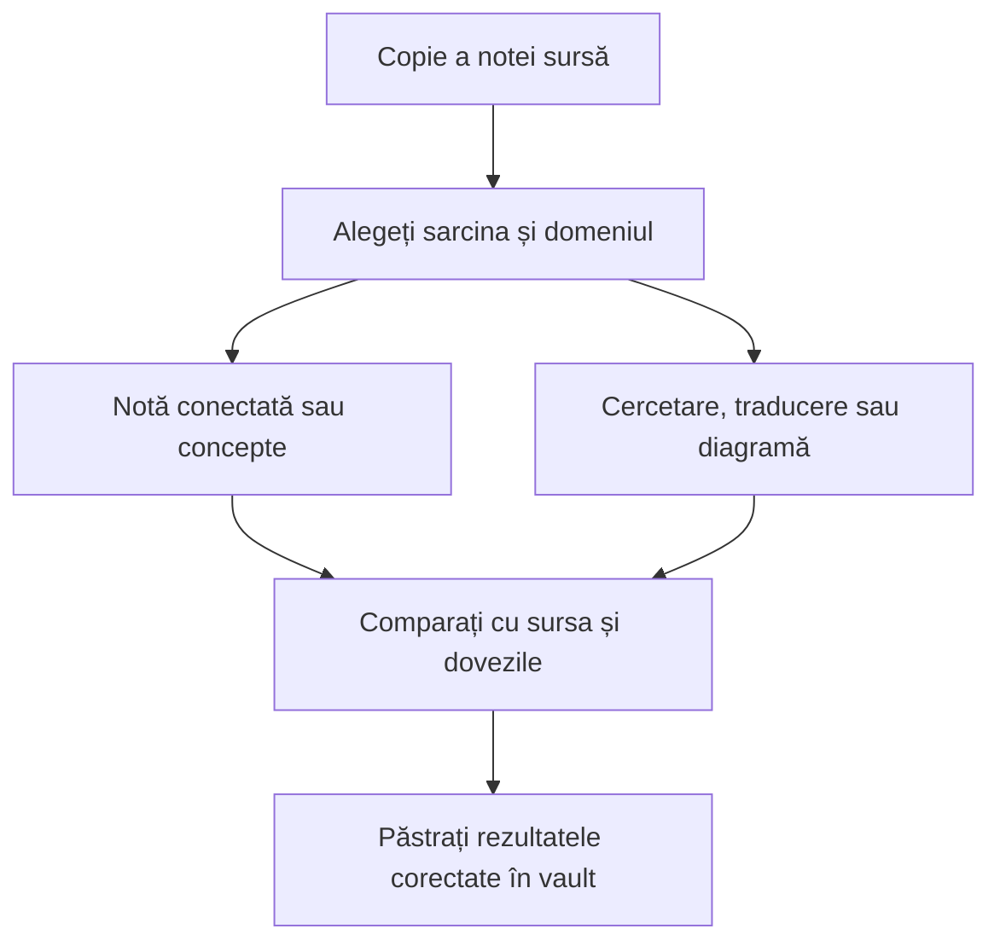

import TLDR from '@site/src/components/TLDR';

# Gestionarea cunoștințelor cu AI în Obsidian

<TLDR>Un flux util distinge sursele, rezultatele modelului și corecturile dvs. Notemd oferă linkuri, extragere, cercetare, traducere și diagrame în fișiere verificabile. Începeți cu o sursă, verificați rezultatul și automatizați apoi un folder limitat.</TLDR>

## Definiți rezultatul

Alegeți o notă de lectură conectată, concepte, un rezumat documentat, o traducere sau o diagramă. Mai multe fișiere și linkuri nu îmbunătățesc automat înțelegerea ori găsirea informației. Decideți cum verificați corectitudinea și regăsiți materialul.

## Fluxul complet


```mermaid
flowchart TD
    A[Copie a notei sursă] --> B[Alegeți sarcina și domeniul]
    B --> C[Notă conectată sau concepte]
    B --> D[Cercetare, traducere sau diagramă]
    C --> E[Comparați cu sursa și dovezile]
    D --> E
    E --> F[Păstrați rezultatele corectate în vault]
```

Acestea sunt sarcini disponibile, nu toți pașii unui buton implicit. Păstrați sursa și verificați destinația fiecărei sarcini înainte de compunere.

## 1. Linkuri wiki: conexiuni explicite

Rulați **Process file (add links)** pe o notă de test. Verificați `_processed.md` alăturat, utilitatea termenilor și fidelitatea citatelor, codului și ecuațiilor.

Domeniul focalizat și suprimarea sinonimelor ghidează modelul fără a impune echivalențe exacte sau prag numeric de similaritate. Pentru legături reproductibile cu nume existente, preferați potrivirea deterministă a titlurilor.

[Linkuri wiki](./features/wiki-links)

## 2. Concepte: separați termenul de explicație

Alegeți folderul înainte de extragere. Extragerea independentă creează doar titluri și păstrează sursa. Pentru `Linked From` în note noi independente, activați backlinkuri și opriți șablonul minim.

Extragerea și generarea explicațiilor sunt operații separate. **Batch generate from titles** poate completa note eligibile deja existente în folder. Testați separat și examinați mutările complete raportate. Euristicile duplicatelor se bazează pe nume; termeni similari pot reprezenta concepte tehnice diferite.

[Note de concepte](./features/concept-notes)

## 3. Cercetare: păstrați dovezile

Selectați tema sau titlul, configurați Tavily/DuckDuckGo și rulați **Research & summarize**. Cheia Tavily absentă nu schimbă serviciul. Deschideți sursele și verificați afirmațiile principale din rezumatul adăugat.

Căutarea locală opțională contribuie cu fragmente delimitate. Indexul este lexical, iar textul selectat merge la LLM-ul sarcinii. Indexarea locală nu înseamnă că întreaga cercetare este offline ori limitată la dispozitiv.

[Cercetare](./features/research)

## 4. Traducere: sens și structură

Alegeți limba rezultatului și traduceți fișierul. Sufixul implicit este `_<language>.md`; o țintă existentă poate fi suprascrisă. Copiați un pasaj într-o notă temporară pentru a traduce doar acel pasaj.

Comparați termeni, numere, cod, linkuri și notație matematică. Fragmentarea notelor lungi poate pierde context. Cele 21 de limbi UI și 34 de rute web nu dovedesc calitatea unei perechi de limbi.

[Traducere](./features/translation)

## 5. Diagrame: artefact editabil

Selectează mai multe tipuri de diagramă într-o execuție și mai multe formate independente pentru fiecare tip. Debifarea păstrează formatele tipului; fără selecții, conținutul este analizat automat. Caseta include tipul. Apasă pe nume pentru a-l selecta și a-i modifica formatele. Trecerea cursorului sau focalizarea din tastatură schimbă previzualizarea fără salvarea setărilor. Escape închide meniul și restabilește focalizarea.

Folosiți catalogul suportat. CircuitikZ este limitat și compilarea nativă are verificare proprie. Săgețile statice Drawnix dintre ramuri nu garantează atașare după rearanjare. Corecturile tabelelor PowerPoint nu elimină fallbackul de imagine pentru Mermaid/SVG.

[Diagrame](./features/diagrams)

## 6. Fluxuri: automatizați o secvență verificată

Sintaxa conține nume, `::` și ID-uri separate prin `>`. Implicit:

```text
One-Click Extract::process-current-add-links>batch-generate-from-titles>batch-mermaid-fix
```

Execută linkuri, generare după titlurile folderului și reparare Mermaid. Nu adaugă cercetare generală sau generare de diagrame. Fiecare acțiune își păstrează condițiile și rezultatul; nu este o conductă arbitrară de text.

Politica implicită oprește la o eroare raportată. Continuați doar dacă pașii următori pot folosi intrările rămase. Anularea păstrează rezultatele complete, nu face rollback.

[Fluxuri](./features/workflows)

## 7. Furnizori: protocol și sarcină

Cele 36 de profiluri acoperă cinci familii de protocoale. Alegeți endpoint-ul, accesul modelului și politica datelor pe baza nevoii și rezultatelor măsurate. Comparați viteza/costul pe aceeași sursă și același prompt.

Rutarea per sarcină este implicit oprită. Activați-o deliberat și verificați fiecare rută înainte să considerați un flux local.

[Furnizori](./providers/overview)

## Listă de pornire

1. Instalați și salvați sursele.
2. Configurați și testați exact profilul/modelul.
3. Alegeți folderul de concepte și ținte distincte.
4. Rulați o sarcină pe o copie.
5. Comparați și păstrați corecturile.
6. Testați un folder mic și finalizarea parțială înainte de un flux lung.

## Modele de lucru

### Articol de cercetare

Convertiți în Markdown cu un instrument extern și verificați întâi formulele, figurile și tabelele. Extrageți concepte sau pasaje originale, cercetați întrebări selectate și creați diagrame pentru relații verificabile. Păstrați linkul articolului și corecturile.

### Colecție de concepte

Folosiți un folder dedicat, verificați terminologia și generați explicații pentru un subset ales. Faceți backup înainte de eliminarea duplicatelor. Mai multe concepte nu înlocuiesc definiții corecte și navigare utilă.

### Material privat

Pregătiți serverul, modelele și dependențele locale, controlați rutarea per sarcină și evitați cercetarea de rețea dacă aveți nevoie de offline. Verificați diagnosticele înainte de partajare. Un endpoint loopback implicit nu împiedică configurarea ulterioară a unui server remote.

### Lot întrerupt

Așteptați încheierea anulării/erorii. Citiți raportul, verificați fișierele complete, recuperările și conflictele și reluați doar lucrul dorit. Starea anulată nu înseamnă rezultat gol. Nu ștergeți fișiere însoțitoare fără să verificați referințele.

## În continuare

- [Primii pași](./getting-started/quick-start).
- [Loturi](./advanced/batch-processing).
- [Dezvoltatori](./developers/overview).
- [Agent](./agents/overview).
