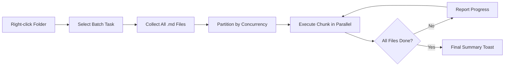

import TLDR from '@site/src/components/TLDR';

# Пакетная обработка

<TLDR>
**Notemd выполняет обработку всих папок за один шаг с возможностью настройки параллельности и контроля за перезаписью.** Щелкните правой кнопкой мыши по папке, чтобы пакетно добавить ссылки на wiki, извлечь концепции, провести исследование или перевести все записи внутри неё. Ограничения параллельности предотвращают ошибки ограничения скорости API. Прогресс отображается по каждому файлу. Поведение при перезаписи настраивается: пропустить существующие данные, добавить их или заменить. Ошибки при обработке файлов записываются без прерывания пакетной обработки.

Это часть [Obsidian Руководства по управлению знаниями с ИИ](/docs/pillar-ai-knowledge).
</TLDR>

## Обзор

Пакетная обработка превращает папку с записями в одну операцию. Вместо того чтобы открывать каждую запись и выполнять команды отдельно, достаточно щелкнуть правой кнопкой мыши по папке и выбрать задачу. Notemd проходит по каждому `.md` файлу, применяет выбранную операцию и отображает прогресс в реальном времени.

Эта функция крайне важна для извлечения знаний из всего хранилища. Например, после импорта десятков PDF сначала выполняется пакетное добавление ссылок, а затем пакетное извлечение концепций, что позволяет создать граф знаний за несколько минут, а не часов.

## Как это работает

### Модель пакетной выполнения

1. **Сбор файлов** -- Notemd рекурсивно сканирует целевую папку (или только верхний уровень в зависимости от настроек) и собирает все `.md` файлы.
2. **Разделение на параллельные группы** -- Файлы делятся на группы в соответствии с настройками `batchConcurrency`. Каждая группа обрабатывается параллельно; группы могут обрабатываться последовательно.
3. **Выполнение** -- Каждый файл обрабатывается с использованием той же логики, что и команда для одного файла. Соблюдаются настройки поставщика и модели для каждой задачи.
4. **Отчёт о прогрессе** -- После завершения обработки каждого файла появляется уведомление, показывающее прогресс `N / Total`.
5. **Обработка ошибок** -- Если файл обрабатывается с ошибкой (API ошибка, тайм-аут сети и т.д.), ошибка записывается, а пакетная обработка продолжается. В итоговом отчёте указываются все необработанные файлы.
6. **Завершение** -- Уведомление с итогами сообщает общее количество обработанных файлов, количестве успешных и неудачных операций.

### Поведение перезаписи

При обработке файла, который уже содержит wiki-ссылки, концептуальные заметки или переводы, поведение Notemd зависит от настройки перезаписи:

| Режим | Поведение |
|------|----------|
| **Пропустить** | Существующий контент остается нетронутым. Обрабатываются только неизменённые файлы. |
| **Добавить в конец** (по умолчанию) | Новый контент добавляется в конец. Существующие wiki-ссылки, концепции или переводы сохраняются. |
| **Заменить** | Файл полностью перерабатывается. Все предыдущие изменения Notemd перезаписываются. |

Что касается wiki-ссылок в частности: если заметка уже содержит `[[wiki-links]]`, режим **Пропустить** оставляет её без изменений, тогда как режим **Заменить** пересылает всю заметку в LLM для вставки новых ссылок. Используйте **Пропустить** для поэтапной обработки и **Заменить** для повторной обработки после обновления модели.

### Контроль параллельности

Настройка `batchConcurrency` ограничивает количество одновременных API вызовов. Это предотвращает ошибки ограничения скорости (HTTP 429) при обработке больших папок у провайдеров с строгими лимитами.

| Параллельность | Рекомендуется для | Типичное влияние на ограничение скорости |
|-------------|----------------|---------------------------|
| `1` | Бесплатные тарифы, строгие поставщики | Нет (серийный номер) |
| `3` (по умолчанию) | Большинство облачных поставщиков | Низкий |
| `5` | Ollama (локально), щедрые тарифы | Нет / Низкий |
| `10` | Локальные модели с быстрым выводом | Нет |

Если при пакетной обработке возникают ошибки 429, уменьшите одновременность до 1 или 2.

## Конфигурация

| Параметр | По умолчанию | Эффект |
|---------|---------|--------|
| `batchConcurrency` | `3` | Максимальное количество параллельных API вызовов во время операций с папками |
| `batchOverwriteExisting` | `false` | Записать существующий контент Notemd заново. `false` означает режим дополнения. |
| `batchSkipProcessed` | `false` | Пропустить файлы, которые уже содержат маркеры Notemd (например, ссылки на wiki) |
| `batchRecursive` | `true` | Включать подкаталоги при сканировании папки |
| `enableStableApiCall` | `false` | Включить логику повторных попыток (до 4 попыток) для каждого файла в рамках пакетной обработки |

### Модели для отдельных задач в пакетной обработке

Каждая операция пакета использует соответствующую модель для конкретной задачи. batch-add-links использует `addLinksProvider`, batch-research использует `researchProvider` и так далее. Это позволяет использовать дешёвые модели для операций с большим объёмом данных и сохранять дорогие модели для задач, требующих высокого качества.

## Пример

У вас есть папка `papers/`, в которой находится 40 импортированных заметок по исследованиям. Вы хотите добавить ссылки на wiki и извлечь концепции из всех них:

1. Нажмите правой кнопкой мыши на папку `papers/`
2. Выберите **"Notemd: Обработка папки (добавление ссылок)"**
3. Notemd сканирует папку, находит 40 файлов `.md` и обрабатывает по 3 файла за раз (стандартная конкурентность)
4. Появляется подсказка с прогрессом: `12/40 files processed...`
5. Через примерно 3 минуты появляется подсказка с итогами: `39 succeeded, 1 failed (API timeout on paper-37.md)`
6. Повторите действие с **"Notemd: Обработка папки (извлечение концепций)"** чтобы создать записи концепций для всех 40 файлов

Файл, обработка которого не удалась, записывается в лог. Позже можно перезапустить обработку только этого файла.

## Советы

- **Начните с низкой конкурентности** -- Если вы не уверены в лимитах скорости вашего провайдера, начните с `1` и постепенно увеличивайте значение.
- **Используйте режим пропуска для поэтапных обновлений** -- После первой полной партии переключитесь на `batchSkipProcessed: true`, чтобы при последующих запусках обрабатывались только новые записи.
- **Включите стабильные вызовы API** -- `enableStableApiCall: true` добавляет логику повторных попыток, позволяющую восстанавливаться после временных сетевых сбоев при длительных обработках.
- **Перезапустите после обновления модели** -- Если вы перейдете на более совершенную модель, установите `batchOverwriteExisting: true` и запустите процесс заново, чтобы получить улучшенные ссылки и концепции.

---

## Следующие шаги

- [Рабочие процессы](/docs/features/workflows) -- Связывайте задачи пакетной обработки в однокликные кнопки на боковой панели
- [Персонализированные промпты](/docs/advanced/custom-prompts) -- Настройте промпты для пакетного извлечения
- [Устранение неполадок](/docs/advanced/troubleshooting) -- Устраняйте ошибки лимитов скорости и сбои подключения во время пакетных запусков
- [LLM Провайдеры](/docs/providers/overview) -- Справочник конфигурации модели по задаче
