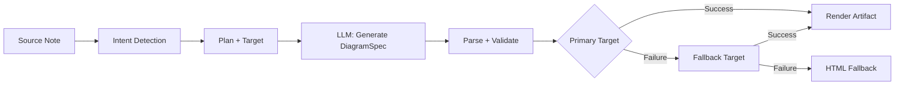
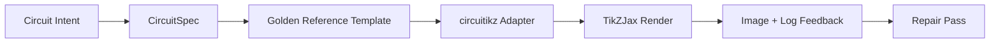

import TLDR from '@site/src/components/TLDR';

# Диаграммы

<TLDR>
**Notemd генерирует диаграммы из ваших заметок посредством конвейера, ориентированного на спецификации.** Язык больших моделей создает JSON-файл `DiagramSpec`, не зависящий от конкретного рендерера, после чего специальные адаптеры преобразуют его в форматы Mermaid, JSON Canvas, Vega-Lite, HTML, редактируемый HTML/SVG, Draw.io, Drawnix или ограниченные диаграммы circuitikz. Поддерживается 9 типов намерений, автоматические цепочки фолбэка, прямой просмотр с возможностью экспорта в форматах SVG/PNG/PDF, семантическая проверка и генерация с усилением локальных знаний.
</TLDR>

Это часть [Obsidian Руководства по управлению знаниями с ИИ](/docs/pillar-ai-knowledge).

## Архитектура: конвейер, ориентированный на спецификации

Notemd никогда не просит LLM генерировать синтаксис Mermaid/Vega/Canvas напрямую. Вместо этого:



**Почему ориентация на спецификации?** LLM часто создают недействительный синтаксис рендерера (особенно Mermaid). Структурированный `DiagramSpec` можно проверить перед отрисовкой, а та же спецификация может использоваться для нескольких рендереров в качестве фолбэка.

## Поддерживаемые типы диаграмм

| Намерение | Основной рендерер | Фолбэки | Сценарий применения |
|--------|-----------------|-----------|----------|
| `mindmap` | Mermaid | HTML | Иерархическое разделение тем |
| `flowchart` | Mermaid | HTML | Потоки процессов, деревья принятия решений |
| `sequence` | Mermaid | HTML | Взаимодействие клиент-сервер, протоколы |
| `classDiagram` | Mermaid | HTML | Отношения классов OOP |
| `erDiagram` | Mermaid | HTML | Схемы баз данных, отношения между сущностями |
| `stateDiagram` | Mermaid | HTML | Машины состояний, модели жизненного цикла |
| `canvasMap` | JSON Canvas | Mermaid → HTML | Карты концептов, графы знаний |
| `dataChart` | Vega-Lite | Mermaid → HTML | Столбчатые, линейные, площадные, разбросные, круговые диаграммы, таблицы |
| `circuit` | circuitikz | none | Ограниченные диаграммы цепей на основе проверенных данных `CircuitSpec` |

## Обнаружение намерений

Notemd определяет наилучший тип диаграммы на основе содержимого вашей записи с использованием оценки ключевых слов:

| Намерение | Триггеры | Уровень уверенности |
|--------|----------|------------|
| `dataChart` | Таблицы, числовые ячейки, ключевые слова, связанные с метриками и тенденциями, проценты | 0.88 |
| `sequence` | Лексика запросов/ответов (4+ совпадения) или маркеры `->`/`=>` | 0.82 |
| `erDiagram` | Первичный ключ, внешний ключ, сущность, схема (2+ совпадения) | 0.80 |
| `stateDiagram` | Состояние, переход, в ожидании, выполняется, не удалось (3+ совпадения) | 0.76 |
| `flowchart` | Нумерованные шаги (2+) или лексика if/then/else/workflow | 0.74 |
| `canvasMap` | Карта концептов, граф знаний, пространственные данные, кластеры | 0.72 |
| `circuit` | circuitikz, TikZJax, circuit, schematic, CMOS, NMOS, PMOS, MOSFET, VDD/GND, `vin`/`vout` | 0.78 |
| `mindmap` | Значение по умолчанию | 0.55 |

Переопределите его с помощью настройки **Тип диаграммы по умолчанию**, выбора в боковой панели или явного опция палитры команд.

## Выбор цели отрисовки

Экспериментальный подход, основанный на спецификации, теперь имеет два независимых контроллера:

| Контроллер | Параметр | Эффект |
|---------|---------|--------|
| Тип диаграммы по умолчанию | `preferredDiagramIntent` | Определяет семантическую форму генерируемого `DiagramSpec` |
| Цель отрисовки по умолчанию | `preferredDiagramRenderTarget` | Выбирает инструмент отрисовки для операций **Сгенерировать диаграмму** и **Предварительный просмотр диаграммы** |

Установите **Preferred render target** в значение **Auto**, чтобы использовать стандартное поведение планировщика, или явно выберите Mermaid, JSON Canvas, Vega-Lite, HTML, Editable HTML/SVG, Draw.io, Drawnix или Circuitikz. Это изменение применяется только к командам создания файлов и просмотра. Стандартная команда **Summarise as Mermaid diagram** по-прежнему генерирует вывод, совместимый с Mermaid, чтобы существующие рабочие процессы в Markdown не меняли формат без вашего ведома.

Такое разделение имеет важное значение, поскольку намерение `flowchart` теперь может отображаться в виде Mermaid для заметок в Markdown, в виде HTML для надежного фолбэка, в виде редактируемого HTML/SVG для дальнейшей правки или в виде исходных файлов Draw.io/Drawnix с сопутствующими изображениями SVG для проверки. Намерение `circuit` направляет работу на Circuitikz и требует проверенного файла `CircuitSpec`; это не запрос на произвольный текст в формате TikZ.
## Использование

### Сгенерировать диаграмму

1. Открыть заметку
2. Выполните команду **"Notemd: Сгенерировать диаграмму"** из палитры команд
3. Notemd определяет намерение, генерирует спецификацию, отрисовывает результат и сохраняет артефакт

**Файлы вывода по цели:**

| Цель | Расширение | Шаблон имени файла |
|--------|-----------|------------------|
| Mermaid | `.md` | `{note}_summ.md` |
| JSON Canvas | `.canvas` | `{note}_diagram.canvas` |
| Vega-Lite | `.json` | `{note}_diagram.json` |
| HTML | `.html` | `{note}_diagram.html` |
| Редактируемо HTML/SVG | `.html` | `{note}_diagram.html` |
| Draw.io | `.drawio` + `.drawio.svg` + `.drawio.md` | `{note}_diagram.drawio` вместе с сопутствующими файлами для проверки |
| Drawnix | `.drawnix` + `.drawnix.svg` + `.drawnix.md` | `{note}_diagram.drawnix` вместе с сопутствующими файлами для проверки |
| Circuitikz | `.tex` + `.tex.svg` + `.tex.md` | `{note}_diagram.tex` вместе с сопутствующими файлами для проверки |

### Просмотр диаграммы

1. Запустить **"Notemd: Просмотр диаграммы"**
2. Открывается модальное окно с отрендеренной диаграммой
3. Экспортируйте файлы в форматах SVG, PNG или PDF с помощью кнопок на панели инструментов

Опция **Автозапуск просмотра** доступна в настройках — после генерации модальное окно просмотра открывается автоматически.

При экспорте просмотра в форматах PNG и PDF используется настроенное значение PPI для просмотра. По умолчанию оно равно 300 PPI, а значения выше 600 PPI ограничиваются значением 600. Формат SVG сохраняет векторную структуру. Исходные файлы, такие как `.drawio`, `.drawnix` и `.tex`, могут содержать сопутствующий файл `previewSvg`, что позволяет Obsidian отображать и экспортировать изображения для проверки без встраивания ресурсов из circuitikz.net, Drawnix, LaTeX или TikZJax во время работы плагина.

В модальном окне предварительного просмотра также имеется панель диагностики ошибок. Инструменты генерации изображений и тесты на корректность могут добавлять данные `RenderArtifact.diagnostics`; в этом окне отображается краткое резюме диагностики с количеством ошибок, предупреждений и сообщений о статусе, а затем — уровень серьезности, тип диагноза, само сообщение и рекомендации по устранению проблемы рядом с изображением предварительного просмотра. То же самое резюме отображается и в записях истории, поддерживающих диагностику, поэтому можно сравнивать несколько попыток выполнения тестов circuitikz без необходимости открывать каждую запись отдельно. Для объектов, у которых имеется исходный текст, но которые невозможно отобразить встроенно или через путь HTML iframe, теперь модальное окно использует предварительный просмотр только с исходным текстом вместо попытки использовать пустой iframe. Это обеспечивает видимый интерфейс для тестов компиляции/генерации circuitikz, проверок текстовых токенов SVG, проверок пустого скриншота в формате PNG, отчетов о перекрытии глифов, основанных только на путях, а также будущих отчетов об перекрытии, не делая TikZJax или LaTeX обязательной зависимостью во время выполнения плагина и не притворяясь, что исходный текст уже является проверенным визуальным изображением.

### Режим устаревшего Mermaid

Когда `enableExperimentalDiagramPipeline` выключен, Notemd отправляет прямой запрос Mermaid в LLM. Это полностью обходит стандартную цепочку обработки. Если экспериментальная цепочка обработки сбивается, система переходит в этот режим.

## Фреймворки рендеринга

### Mermaid

6 адаптеров (ментальная карта, диаграмма потоков, последовательность, ER, класс, состояние) преобразуют `DiagramSpec` в синтаксис Mermaid. После генерации `mermaid.parse()` проверяет результат. Если проверка не проходит:

1. **Попытка LLM повторно** — одна попытка с сообщением об ошибке Mermaid в качестве контекста
2. **Минимальный вариант обхода** — простая диаграмма Mermaid, составленная на основе идентификаторов узлов спецификации

**Legacy Mermaid Fixer** автоматически исправляет распространённые синтаксические ошибки LLM: нормализацию директивы note, экранирование обозначений pipe-label, перенос точек с запятой, умные кавычки, стрелки с двойными тире, несоответствия форм и многое другое.

### JSON Canvas

Генерирует формат Obsidian JSON Canvas с пространственной компоновкой:
- Узлы располагаются по глубине (x = глубина × 420) и индексу (y = индекс × 170)
- Ширина определяется по длине метки
- Рёбра с `fromSide: 'right'`, `toSide: 'left'`, `toEnd: 'arrow'`

### Vega-Lite

Создаёт полные спецификации Vega-Lite v5 JSON с автоматической кодировкой:
- **Картезианские диаграммы** (столбчатая/линейная/площадная/точечная/рассеянная): каналы x + y плюс цвет для нескольких серий
- **Круговая диаграмма**: theta = y (количественное), цвет = x (номинальное)
- **Таблица**: строка = x, текст = y плюс столбец = серия

Патчи тёмной и светлой темы глубоко сливаются перед компиляцией.

### HTML

Универсальный запасной вариант. Самодостаточный документ HTML с:
- Мета-заголовками CSP
- Режим светлый/тёмный через `prefers-color-scheme`
- Локализованные метки UI для 20 языковых регионов
- Разделы: главная, структура (дерево узлов), взаимосвязи, примечания, таблицы данных серий

### Редактируемый HTML/SVG

Явная цель для рабочих процессов экспорта с возможностью редактирования. Она преобразует `DiagramSpec` в детерминированный `SemanticFigureModel`, затем генерирует самодостаточный документ HTML с встроенными группами SVG, содержащими аннотации в стиле Draw.io:

- `data-drawio-type`, `data-drawio-id` и `data-drawio-role` на семантических узлах
- `data-drawio-source` и `data-drawio-target` на семантических ребрах
- стабильные идентификаторы узлов/ребер после нормализации пробелов и обработки коллизий
- без скриптов, без внешних шрифтов и без удалённых ресурсов

Эта цель намеренно пока не является стандартным маршрутом планировщика. Она доступна как явная цель отрисовки до тех пор, пока путь продукта не подтвердит поведение редактирования в реальных инструментах.

### Границы экспорта Draw.io и Drawnix

Текущая реализация сохраняет поддержку сторонних редакторов на границе результатов обработки, в то же время предоставляя явные цели отрисовки:

| Цель | Контракт | Зависимость во время выполнения |
|--------|----------|--------------------|
| Draw.io | детерминированный распакованный XML-файл формата `mxfile`, полученный из `SemanticFigureModel`, плюс файлы для просмотра в форматах SVG/PNG/PDF | ничего во время работы плагина или в процессе CI |
| Drawnix | минимальный набор JSON-данных в формате `.drawnix`, использующий элементы `geometry` и `arrow-line`, плюс файлы для просмотра в форматах SVG/PNG/PDF | ничего во время работы плагина или в процессе CI |

Этот компромисс сделан намеренно: Notemd может проверять видимые метки, стабильные ID и поддерживаемую охватность примитивов, не встраивая Diagrams.net Desktop, Drawnix, Plait или состояние редактора только для браузера в плагин.

### circuitikz / TikZJax Направление

Схемы цепей — это не то же самое, что общие диаграммы потоков. Правильным синтаксическим форматом для электрических схем обычно является **circuitikz**, который отображается в Obsidian с помощью плагинов, таких как TikZJax. TikZJax может загружать пакеты, такие как `circuitikz`, `pgfplots`, `tikz-cd` и `chemfig`, что делает его подходящим для записей по физике, электронике, химии и математике.

Риск заключается в том, что необработанный TikZ, сгенерированный LLM, крайне чувствителен к изменениям:

- сложная топология цепи может быть электрически корректной, но визуально нечитаемой;
- перекрывающиеся провода и метки могут сделать корректный список компонентов непригодным для использования в учебных записях;
- отсутствие вступительных частей пакетов, неверные анкеры или некорректные имена компонентов могут помешать отображению;
- обратная связь от генератора обычно представлена на уровне изображения, тогда как LLM генерирует геометрию на уровне текста.

Лучшей архитектурой является рассмотрение circuitikz как ограниченной цели для диаграммы, а не как свободного запроса:



Модель первого класса должна описывать топологию и разметку цепи отдельно:

| Слой | Обязанности | Пример |
|-------|----------------|---------|
| Топология | электрические узлы и соединения компонентов | `VDD -> RD -> drain(M1)`, `source(M1) -> GND` |
| Разметка | размещение в сетке, ориентация, маршрутизация линий | `M1 at (3,2.2)`, вход слева, выход справа |
| Стиль | пакет, конвенция напряжений, метки, якоря | `\begin{circuitikz}[american voltages]` |
| Проверка корректности | лог компиляции, отсутствующие якоря, проверки на перекрытие/скриншот | TikZJax/Диагностика LaTeX плюс визуальный анализ |

### Текущий прототип circuitikz

Notemd теперь включает первый ограниченный прототип репозитория для этого направления. Он намеренно находится в автономном режиме и связан с шаблоном:

```bash
npm run diagram:export-circuitikz -- --input cmos-inverter.json --output cmos-inverter.tex
```

Прототип добавляет ограниченные границы типа `CircuitSpec` и детерминированный экспортер для шести стандартных семейств схем:

В экспериментальной системе обработки диаграмм это теперь также доступно через параметр `intent: "circuit"` и цель отрисовки `circuitikz`. Генерируемый файл `DiagramSpec` может включать объект `circuitSpec` только при намерении создания схемы. `CircuitikzRenderer` записывает тот же детерминированный исходный код в формате `.tex` и добавляет файл превью в формате SVG, полученный на основе проверенной топологии схемы, что позволяет использовать превью в Obsidian, а также экспортировать изображения в форматах SVG/PNG/PDF. Этот файл превью не является результатом компиляции на LaTeX/TikZJax; реальные данные от рендерера по-прежнему содержатся в указанных ниже специальных командах проверки.

Для поддерживаемых стандартных шаблонов параметры `layoutHints.inputSide` и `layoutHints.outputSide` остаются контроллерами, предназначенными исключительно для отображения. Они могут изменять местоположение входных/выходных портов на детерминированной основе, но не влияют на сигнатуру топологии и не позволяют выполнять операцию коррекции для переподключения элементов схемы.

| Тип схемы | Золотой эталон | Гарантия тока |
|--------------|------------------|-------------------|
| `common-source-amplifier` | `common-source-nmos-v1` | проверяет `VDD -> R_D -> M1.D`, `vin -> M1.G`, `M1.S -> GND` и `M1.D -> vout` перед записью в LaTeX |
| `cmos-inverter` | `cmos-inverter-v1` | проверяет топологию PMOS-over-NMOS, общий вход на воротах, общий выход на дренаже, `VDD -> MP.S` и `MN.S -> GND` перед записью в LaTeX |
| `cmos-buffer` | `cmos-buffer-v1` | проверяет два каскадированных инверторных уровня, промежуточный узел `vmid`, восстановленный `vout` и общие линии VDD/GND перед записью в LaTeX |
| `cmos-transmission-gate` | `cmos-transmission-gate-v1` | проверяет параллельные устройства PMOS/NMOS между `vin` и `vout` с дополнительным управлением `phib` / `phi` перед записью в LaTeX |
| `cmos-nand2` | `cmos-nand2-v1` | проверяет параллельный подъемный PMOS, последовательный опускающий NMOS, двойные входы `va` / `vb` и `vout` перед записью LaTeX |
| `cmos-nor2` | `cmos-nor2-v1` | проверяет последовательный подъемный PMOS, параллельный опускающий NMOS, двойные входы `va` / `vb` и `vout` перед записью LaTeX |

Это не универсальный генератор кода TikZ. Он не принимает произвольные файлы TikZ, не компилирует LaTeX, не вызывает TikZJax, не анализирует скриншоты во время работы плагина и не выполняет автоматическую коррекцию изображений на основе обратной связи. Все эти функции реализуются на более поздних этапах.

Команда Preview diagram может снова открыть сохраненные исходные файлы circuitikz напрямую, если их расширение — `.tex` или `.tikz`, а в коде присутствуют `\usepackage{circuitikz}` или `\begin{circuitikz}`. Этот режим — предварительный просмотр только исходного кода: модальное окно показывает код, диагностику, контроллеры копирования/сохранения и метаданные истории, но не компилирует LaTeX и не вызывает TikZJax во время работы плагина.

Теперь тот же режим предварительного просмотра только исходного кода охватывает сохраненные файлы Draw.io и Drawnix. Файлы `.drawio` принимаются, если они выглядят как Draw.io XML (`mxfile` или `mxGraphModel`), а файлы `.drawnix` — если они представлены в формате Drawnix JSON с `type: "drawnix"` и массивом `elements`. Плагин по‑прежнему не встраивает diagrams.net и хост белой доски Drawnix; эти превью показывают исходный код, диагностику и историю файлов без использования встроенного визуального редактора.

Для восстановления структуры передавайте спецификацию до восстановления в качестве ссылки перед принятием исправленного варианта:

```bash
npm run diagram:export-circuitikz -- --input repaired-cmos-inverter.json --topology-reference cmos-inverter.json --output cmos-inverter.tex
```

Защитный механизм использует `createCircuitTopologySignature` и `assertCircuitTopologyUnchanged` для сравнения `circuitKind`, `goldenReferenceId`, сетей, идентификаторов/типов/терминалов компонентов и концов неразрешенных соединений перед выводом. Метки, текст заголовка, подсказки по разметке, порядок соединений и метки соединений намеренно игнорируются. Кандидат, добавляющий короткую линию или переподключающий терминал, получает ошибку `Circuit topology drift detected` до записи файла `.tex`.

Теперь CLI может парсить существующий журнал компиляции LaTeX/TikZJax без запуска компилятора:

```bash
npm run diagram:export-circuitikz -- --input cmos-inverter.json --output cmos-inverter.tex --compile-log cmos-inverter.log --diagnostics-output cmos-inverter.diagnostics.json
```

Этот диагностический путь сообщает о отсутствующих пакетах, таких как `circuitikz.sty`, неизвестных ключах TikZ/circuitikz, синтаксических ошибках в пути TikZ, например отсутствии точек с запятой, чрезмерном количестве аргументов из неравномерных скобок или незакрытых меток, неопределенных контрольных последовательностях, общих ошибках LaTeX, аварийных остановках и предупреждениях о переполнении `\hbox`. Это по‑прежнему основано на журнале: локальная компиляция LaTeX/TikZJax и механизмы качества скриншотов остаются отдельными задачами будущего.

Для проверки работоспособности разработчика тот же CLI может по желанию запустить явно настроенный рендерер без парсинга команд оболочки:

```bash
npm run diagram:export-circuitikz -- --input cmos-inverter.json --output cmos-inverter.tex --compile-executable pdflatex --compile-arg -interaction=nonstopmode --compile-arg -halt-on-error --compile-arg -output-directory={outputDir} --compile-arg {tex} --expected-artifact {outputDir}/{jobName}.pdf
```

Запускающий процесс использует `shell: false`, заменяет местоимения `{tex}`, `{outputDir}` и `{jobName}` на значения массива аргументов, читает сгенерированный файл `{jobName}.log` и возвращает `compileExecution` вместе с `compileDiagnostics` в формате CLI JSON. `--compile-executable` — это только путь к бинарнику рендерера или обертке; флаги рендерера указываются в повторяющихся значениях `--compile-arg`. Пустые исполняемые файлы считаются ошибкой `compile-executable-invalid`, отсутствующие бинарники — `compile-executable-not-found`, а строки исполняемых файлов в формате команды оболочки получают рекомендацию разделить аргументы, чтобы Windows, Linux и macOS соблюдали одинаковый протокол прямого запуска. С помощью `--expected-artifact` также сообщается о `compileExecution.renderSmoke`, и проверка CLI проваливается, если рендерер не создает непустой файл. Плагин по‑прежнему не встраивает LaTeX, не делает TikZJax зависимостью времени выполнения плагина и не выполняет визуальную коррекцию на уровне скриншотов.

Если ожидаемый результат — файл `.svg`, проверка углубляется еще на один уровень:

```bash
npm run diagram:export-circuitikz -- --input cmos-inverter.json --output cmos-inverter.tex --compile-executable dvisvgm --compile-arg ... --expected-artifact {outputDir}/{jobName}.svg --expected-svg-text v_{in} --expected-svg-text v_{out}
```

Проверка SVG убеждается в существовании корня `<svg>`, положительных размерах или `viewBox`, наличии хотя бы одного видимого элемента рисунка после исключения скрытых/прозрачных элементов, наличии любых запрошенных токенов текста, заметных элементов вне `viewBox`, заметных перекрывающихся позиционированных меток `<text>` / `<tspan>` и заметных текстовых меток, перекрывающих элементы рисунка через `render-svg-label-overlap`. Ожидаемый текст ищется в видимом тексте и декодируются метаданные доступности, такие как `aria-label`, `<title>` и `<desc>`, поэтому рендереры, сохраняющие семантические метки вне видимого `<text>`, все равно могут удовлетворить проверку токенов текста без использования OCR. Проверка геометрии теперь учитывает преобразования для распространенных атрибутов групп и элементов `transform`, так что преобразованные, масштабированные, повернутые, искаженные или преобразованные матрицей коробки SVG проверяются после комбинирования преобразований. Она охватывает точные границы дуг для крайних точек дуги A/a, точные границы кривых Bezier для крайних точек кривых C/S/Q/T, границы SVG с учетом толщины линии и проверки перекрытия меток, геометрию рисования `polyline` / `polygon`, а также разрешает размещение глифов только по пути из `<use href="#...">`, так что метки, преобразованные в повторно используемые пути глифов, могут все равно провалить проверку ограниченной рамки, если геометрия размещенного глифа выходит за пределы `viewBox`. Несколько позиционированных меток `tspan` под одним родителем `<text>` сравниваются как отдельные коробки меток, что позволяет обнаружить вывод в стиле LaTeX SVG, который иначе объединил бы разные метки в один текстовый узел. Позиционированные коробки SVG `text` и `tspan` соблюдают значения `start`, `middle` и `end`, поэтому центрированные и выравниваемые по правому краю метки могут вызывать диагностику перекрытия текста/меток и рисунка без необходимости использования браузерного форматирования текста. Глифовые пути, существующие только в определении, внутри `<defs>`, не считаются видимыми элементами рисунка, но их собственные локальные атрибуты `transform` применяются перед размещением `<use>`, чтобы масштабированные или отраженные определения глифов не учитывались недостаточно. Проверка меток и рисунка использует небольшую толерантность крошечных коробок рисунка и объявленные `stroke-width`, поэтому тонкие провода, толстые провода и контуры многоугольных компонентов могут считаться потенциальными причинами плохой читаемости меток, если их видимая линия достигает метки. Глифовые метки, определенные только по пути из `<use href="#...">`, также сравниваются с коробками рисунка и проваливаются с ошибкой `render-svg-path-glyph-overlap`, если повторно используемая геометрия глифа перекрывает провода или компоненты. Если рендерер преобразует метки в повторно используемые пути глифов вместо поисковых `<text>` и не сохраняет метаданные доступности, отчет о проверке записывает `pathOnlyGlyphUseCount` и проваливает запрошенный токен текста через `render-svg-text-path-only`, вместо того чтобы считать метку просто отсутствующей. Другие ошибки сообщаются через `render-svg-invalid`, `render-svg-dimension-missing`, `render-svg-no-visible-elements`, `render-svg-text-missing`, `render-svg-out-of-bounds`, `render-svg-text-overlap`, `render-svg-label-overlap` или `render-svg-path-glyph-overlap`. Проверки токенов текста и перекрытия следует рассматривать только как структурные проверки для рендереров, сохраняющих метки в виде поискового SVG текста или метаданных доступности; вывод только по пути SVG все еще требует последующей проверки скриншота/OCR для подтверждения читаемости визуальных меток, и эта проверка по‑прежнему не обеспечивает полного покрытия SVG путей.

Скрытые группы и элементы SVG систематически пропускаются во время подсчета видимых элементов и сбора геометрии. Атрибуты или стили inline `display:none`, `visibility:hidden`, `visibility:collapse` и общий стиль `opacity:0` не могут сделать иначе пустой результат рендеринга проходящим проверку видимого вывода.

Определения глифов только по пути могут быть прямыми путями или группированными/символьными контейнерами внутри `<defs>`. Проверка разрешает геометрию дочерних путей из `<g id="...">` и `<symbol id="...">` перед размещением `<use>`, поэтому вывод обернутых глифов все равно поступает в `pathOnlyGlyphUseCount`, проверки ограниченной рамки и `render-svg-path-glyph-overlap`.

Парсер путей также отслеживает начало подпутей и сбрасывает текущую точку на `Z/z`, так что относительные команды после закрытого подпути продолжаются с правильной точки SVG вместо того, чтобы создавать ложные диагнозы `render-svg-out-of-bounds`.

Тот же пасс геометрии следует грамматике SVG для десятичных чисел с ведущей точкой и явных знаков плюса, поэтому компактные координаты dvisvgm, такие как `.5`, `-.5` или `+.5`, остаются дробными во время проверки границ, вместо того чтобы приводить к ложному считыванию геометрии за пределами границ или их игнорированию.

Если рендерер генерирует `.png`, то тот же путь ожидаемого артефакта превращается в первый скриншот для проверки: Notemd декодирует файлы PNG с индексированным цветом 1/2/4/8 бит без интерлейса, файлы PNG в сером цвете 1/2/4/8/16 бит, а также файлы PNG в сером цвете с альфа-каналом/RGB/RGBA 8/16 бит. Изображения с индексированным цветом и подбайтовым серым цветом поддерживают упакованные образцы; изображения с индексированным цветом также поддерживают PLTE и необязательные данные tRNS; изображения в сером/RGB цвете поддерживают прозрачные образцы tRNS. 16-битные прямые образцы нормализуются в тот же пространство сравнения 8-битного RGBA, которое используется при проверках. Проверка убеждается в наличии положительных размеров, записывает границы фонового слоя как `foregroundBounds`, записывает плотность фонового слоя внутри этой области как `foregroundDensity`, считается неудачной при `render-png-blank`, когда каждый видимый пиксель совпадает с цветом верхнего левого угла фона, считается неудачной при `render-png-content-clipped`, когда содержимое фонового слоя касается границы изображения, считается неудачной при `render-png-foreground-too-small`, когда у большого скриншота меньше четырех пикселей фонового слоя, и считается неудачной при `render-png-foreground-dense`, когда пиксели фонового слоя чрезмерно плотны внутри непростой области границ. Не поддерживаемые форматы PNG приводят к ошибке `render-png-unsupported`, а также предоставляются рекомендации по конкретным форматам для интерлейсированных PNG Adam7 или не поддерживаемых глубин цвета с индексированием. Это позволяет обнаружить пустые скриншоты, очевидное обрезание холста, недостаточно отрендеренные следы фонового слоя, первые ошибки перегрузки на уровне пикселей и неправильные настройки экспорта PNG рендерером, без необходимости добавления зависимостей от конкретной платформы. Это еще не распознавание меток на уровне OCR, точное обнаружение перекрытия текста или восстановление изображения с сохранением топологии.

Когда диагностика показывает неудачную компиляцию или выполнение проверки render-smoke, CLI также может создать краткое описание для восстановления с сохранением топологии:

```bash
npm run diagram:export-circuitikz -- --input cmos-inverter.json --topology-reference cmos-inverter.json --output cmos-inverter.tex --compile-log cmos-inverter.log --repair-brief-output cmos-inverter.repair-brief.json
```

Это описание использует схему `notemd.circuitikz.repair-brief.v1` и содержит исходный код `CircuitSpec`, подпись топологии, диагностику компиляции/рендеринга, разрешенные изменения, запрещенные изменения топологии, следующие шаги проверки и структурированный `repairPrompt`. Роль промпта — `topology-preserving-circuitikz-repair`; его список `diagnosticFocus` формируется на основе диагностики компиляции/рендеринга, а его требования `acceptanceCriteria` включают проверку кандидата, а также новую компиляцию и проверку render-smoke. Это формат передачи данных для последующего цикла восстановления, а не утверждение о том, что Notemd уже выполняет автономное визуальное восстановление.

После создания кандидата на восстановление тот же CLI может проверить его по сравнению с описанием перед записью результата:

```bash
npm run diagram:export-circuitikz -- --input repaired-cmos-inverter.json --repair-brief cmos-inverter.repair-brief.json --output repaired-cmos-inverter.tex
```

`--repair-brief` проверяет подпись топологии кандидата из описания, и эта проверка является взаимоисключающей с `--topology-reference`. Прохождение этого этапа подтверждает только сохранение топологии; кандидат все еще требует диагностики компиляции и проверки render-smoke.

Результат работы `--repair-brief` также включает доказательства `repairAcceptance` с использованием схемы `notemd.circuitikz.repair-acceptance.v1`. Он сообщает о прохождении этапов `topology-signature`, `compile-diagnostics` и `render-smoke` как `passed`, `failed` или `missing`; раскрывает информацию `remainingChecks`; и сохраняет значение `readyForVisualAcceptance` как ложное до тех пор, пока кандидат не будет содержать все необходимые доказательства.

Используйте `--repair-acceptance-output` вместе с `--repair-brief`, когда для доказательств CI или релиза требуется надежный файл JSON:

```bash
npm run diagram:export-circuitikz -- --input repaired-cmos-inverter.json --repair-brief cmos-inverter.repair-brief.json --output repaired-cmos-inverter.tex --repair-acceptance-output repaired-cmos-inverter.repair-acceptance.json
```

Для доказательств релиза или обслуживания запустите каждую поддерживаемую золотую семью через инструмент агрегации фикстур:

```bash
npm run diagram:smoke-circuitikz -- --output-dir docs/export/circuitikz-smoke --compile-executable pdflatex --compile-arg -interaction=nonstopmode --compile-arg -halt-on-error --compile-arg -output-directory={outputDir} --compile-arg {tex} --expected-artifact {outputDir}/{jobName}.pdf
```

Этот инструмент использует `docs/maintainer/fixtures/circuitikz/common-source-nmos-v1.json`, `docs/maintainer/fixtures/circuitikz/cmos-inverter-v1.json`, `docs/maintainer/fixtures/circuitikz/cmos-buffer-v1.json`, `docs/maintainer/fixtures/circuitikz/cmos-transmission-gate-v1.json`, `docs/maintainer/fixtures/circuitikz/cmos-nand2-v1.json` и `docs/maintainer/fixtures/circuitikz/cmos-nor2-v1.json`, вызывает тот же путь экспортера без использования оболочки для каждой фикстуры и возвращает агрегированный отчет JSON с данными `compileExecution` и `compileDiagnostics` для каждой фикстуры. Это по-прежнему команда для обслуживающего персонала, а не зависимость времени выполнения плагина.

Когда у машины обслуживающего персонала еще нет настроенного рендерера, запустите ту же команду фикстуры без `--compile-executable` и явно сохраните информацию о состоянии среды:

```bash
npm run diagram:smoke-circuitikz -- --output-dir docs/export/circuitikz-smoke --report-output docs/export/circuitikz-smoke/renderer-availability.json
```

Этот путь все равно создает детерминированные артефакты фикстуры `.tex`, но возвращает `ok: false` с `rendererAvailability.status` установленным в значение `missing-configuration` и диагностикой `compile-executable-invalid`. Считайте это только доказательством наличия рендерера; это не является доказательством компиляции, проверки render-smoke или визуального принятия.

### Форма золотого эталонного промпта

Для краткосрочного использования предоставьте отрендеримый золотой эталон перед запросом варианта схемы. Ограниченный промпт должен сохранять вступление, масштаб координат, стиль анкоров и правила маршрутизации:

```latex
\usepackage{circuitikz}
\begin{document}
\begin{circuitikz}[american voltages]
\draw
  (3,5) node[vcc]{$V_{DD}$}
  to [R, l=$R_D$] (3,3)
  to [short, *-o] (5,3) node[right]{$v_{out}$}
  (3,3) to [short] (3,2.2)
  node[nmos, anchor=D] (M1) {$M_1$}
  (M1.S) to [short] (3,0.5)
  node[ground]{}
  (M1.G) to [short, -o] (0.8,2.2)
  node[left]{$v_{in}$};
\draw
  (3,0.5) node[below right]{$S$};
\end{circuitikz}
\end{document}
```

Для инвертора CMOS промпт должен содержать явные требования к топологии и ограничениям размещения, а не просто «нарисуйте инвертор CMOS»:

- должно быть `VDD` сверху, `GND` снизу, вход слева, выход справа;
- используйте `pmos` выше `nmos` с общими воротами и общими дренажами;
- оставьте выходной узел на стыке дренажей и отметьте его `*-o`;
- используйте именованные якоря (`PM1.G`, `NM1.G`, `PM1.D`, `NM1.D`) вместо координат, определяемых визуально;
- избегайте диагональных или пересекающихся проводов, если это не требуется электрически.

### Текущий прогресс и следующие этапы

| Площадь | Текущее состояние | Следующий шаг |
|------|----------------|-----------|
| Общие схемы | Реализована схема работы, ориентированная на спецификации, для Mermaid, JSON Canvas, Vega-Lite, HTML | Продолжаем расширять охват семантической проверки |
| Редактируемые графики | Реализованы границы объектов `editable-html-svg`, Draw.io XML и Drawnix JSON | Добавляйте более сложные примитивы только после того, как тесты подтвердят возможность редактирования |
| Поддержка CLI | Команда `npm run diagram:export-artifact` экспортирует редактируемые файлы HTML/SVG, а также данные из Draw.io, Drawnix, Circuitikz и форматов SVG/PNG/PDF в качестве доказательств для проверки, при этом используется один верифицированный файл `DiagramSpec` | При выпуске новых целей добавляются специфичные тесты на корректность работы |
| circuitikz | `DiagramSpec(intent: "circuit", circuitSpec) -> CircuitikzRenderer -> circuitikz` экспортирует золотые шаблоны для схем с общим источником питания, инверторов CMOS, компонентов `cmos-buffer` / `cmos-buffer-v1`, `cmos-transmission-gate` / `cmos-transmission-gate-v1`, `cmos-nand2` / `cmos-nand2-v1` и `cmos-nor2` / `cmos-nor2-v1`; предоставляет опции для указания намерения интерфейса и цели отрисовки; генерирует файлы на языке TeX вместе с превью-версиями в форматах SVG/PNG/PDF; проверяет топологию перед выводом; анализирует логи компиляции; позволяет запускать специфические локальные рендереры с использованием флага `--expected-artifact`; обеспечивает работу в режиме только исходного кода в качестве запасного варианта, а также отображение диагностической информации превью через объект `RenderArtifact.diagnostics` и модальное окно превью | Добавление функции распознавания меток на уровне OCR для текста, отображаемого только в виде линий, более точных проверок перекрытия на уровне пикселей, расширенной поддержки SVG-линий там, где это необходимо, автоматической установки/обнаружения рендереров только в том случае, если они могут оставаться факультативными, а также автоматизированной коррекции структуры схемы с сохранением её первоначального вида |
| Интеграция TikZJax | Кандидат на хост рендеринга для отображения с стороны Obsidian | Сохранить его как факультативный; не делать TikZJax обязательной зависимостью времени выполнения плагина |

## Конфигурация

| Параметр | По умолчанию | Эффект |
|---------|---------|--------|
| `enableExperimentalDiagramPipeline` | `false` | Переключение между подходом, основанным на спецификации, и устаревшим вариантом Mermaid |
| `experimentalDiagramCompatibilityMode` | `'legacy-mermaid'` | `'legacy-mermaid'` = Mermaid только; `'best-fit'` = нативные цели + резервы |
| `preferredDiagramIntent` | `undefined` (автоматически) | Переопределение автоматического обнаружения намерения |
| `preferredDiagramRenderTarget` | `undefined` (автоматически) | Замена рендерера артефактов, включая Draw.io, Drawnix и Circuitikz |
| `summarizeToMermaidLanguage` | `'en'` | Язык цели для меток диаграмм |
| `summarizeToMermaidProvider` / `Model` | DeepSeek | LLM на каждой задаче для генерации диаграмм |
| `autoMermaidFixAfterGenerate` | (из констант) | Автоматический запуск устаревшего исправителя на выводе Mermaid |
| `enableLocalKnowledgeForDiagramGeneration` | `false` | Дополнение исходного кода знаниями локального хранилища |

### Усиление локальных знаний

При включении Notemd извлекает соответствующие фрагменты контекста из локальной базы знаний вашего хранилища (на основе MiniSearch) и добавляет их в начало исходного markdown. В промпте для дополнения указано: "только вспомогательная ссылка; сохраняйте первоначальную структуру верной исходной записи."

### Режимы совместимости

- **`legacy-mermaid`**: Все интенты направляются к Mermaid. Интенты, не являющиеся Mermaid (canvasMap, dataChart), принудительно перенаправляются в `flowchart` или `mindmap`. Нет цепочки резервных вариантов.
- **`best-fit`**: Каждый интент направляется к своей нативной цели. Если основная цель не сработала, происходит переход по цепочке резервных вариантов (например, Vega-Lite → Mermaid → HTML).

## Предварительный просмотр и экспорт

| Действие | Метод |
|--------|--------|
| Экспорт SVG | Создатель `mermaid.render()` / `vega.View.toSVG()` / SVG для Canvas |
| Экспорт в PNG | SVG → Изображение → Canvas / растровый рендерер с заданным количеством точек на дюйм → массив байтов PNG |
| Экспорт в PDF | SVG → растровое изображение с заданным количеством точек на дюйм → одностраничный PDF |
| Сохранение исходника | Контент сырого артефакта сохраняется с расширением, специфичным для цели |
| Предварительный просмотр только исходника | Нелинейные артефакты с содержимым исходника отображаются в виде кода вместе с диагностикой, без отрисовки iframe |
| Семантический аудит | Проверка Mermaid, JSON Canvas, Vega-Lite, редактируемого HTML/SVG, Draw.io, Drawnix и ограниченного использования Circuitikz с помощью файла `scripts/diagram-semantic-verification.js` вместе с тестами рендерера и CLI |

**Кэширование**: RenderCache использует детерминированный ключ JSON от `{spec, target, theme}`. Удаление дубликатов во время обработки предотвращает повторные генерации.

## Советы

- **Начните с режима `best-fit`** — он обеспечивает наилучший визуальный результат для каждого типа намерения
- **Используйте мощные модели для сложных диаграмм** — диаграммы потоков и ER-диаграммы получают преимущества от GPT-4o или Claude
- **Включите локальные знания** для диаграмм специфических областей — соответствующий контекст хранилища повышает точность
- **Установите `autoMermaidFixAfterGenerate`** — без него часто возникают синтаксические ошибки Mermaid
- **Утилита для устаревших случаев очень полная** — если предварительный просмотр Mermaid не работает, ручное выполнение команды фиксатора часто решает проблему

---

## Следующие шаги

- 🔗 [Wiki-Links](./wiki-links) — Как связывать концепции внутри текста
- 📝 [Concept Notes](./concept-notes) — Извлекать концепции для исходного материала диаграмм
- 🔍 [Research](./research) — Дополнять диаграммы данными из интернета
