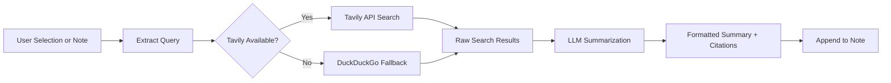

import TLDR from '@site/src/components/TLDR';

# Исследования и поиск в Интернете

<TLDR>
**Notemd выполняет поиск в сети и вставляет LLM-кратко подведенные итоги непосредственно в ваши заметки.** Tavily API является основным движком поиска; DuckDuckGo служит резервным вариантом без настройки. Результаты подводятся кратко с указанием источников и добавляются под заголовком `## Research`. Поддерживается исследование в одной заметке, пакетное исследование папок и выбор модели для шага подведения итогов для каждой задачи.

Это часть [Obsidian Руководства по управлению знаниями с ИИ](/docs/pillar-ai-knowledge).
</TLDR>

## Обзор

Исследования — одна из самых мощных интеграций Notemd: она создает замкнутый цикл между чтением, поиском и записью. Вместо того чтобы переходить в браузер, чтобы найти незнакомый термин, вы выделяете его, и Notemd выполняет поиск, подводит итоги и добавляет результаты — все это прямо в вашем хранилище.

Процесс полностью настраиваем. Вы можете выбрать поставщика поиска, LLM, который будет писать краткое содержание, и определить, будут ли результаты добавляться в активную заметку или сохраняться в отдельные файлы. Режим пакетной обработки позволяет провести исследование всех заметок в папке одним кликом.

## Как это работает

### Пайплайн «Поиск, затем подведение итогов»



1. **Извлечение запроса** — Notemd извлекает термины поиска из выбранного элемента или названия заметки.
2. **Поиск в Интернете** — сначала пробуется использовать Tavily. Если не настроен ключ API, автоматически используется DuckDuckGo (ключ не требуется).
3. **LLM подведение итогов** — сырые результаты поиска отправляются в настроенный LLM, который генерирует краткое содержание с встроенными ссылками на источники.
4. **Добавление** — отформатированное краткое содержание добавляется под заголовком `## Research` в активную заметку.

### Tavily против DuckDuckGo

| Аспект | Tavily | DuckDuckGo |
|--------|--------|------------|
| Ключ API | Требуется (доступна бесплатная версия) | Не требуется |
| Качество результата | Высокое (специально разработано для ИИ) | Достаточное для обычных запросов |
| Ограничения по скорости | Щедрый бесплатный тариф | Подвержено ограничению скорости |
| Конфигурация | `tavilyApiKey` в настройках | Нулевая конфигурация — автоматический переход на запасной вариант |

### Исследование папки пакетами

Щелкните правой кнопкой по папке и выберите **"Notemd: Папка для исследования"**. Каждый файл `.md` в папке обрабатывается последовательно (или параллельно до заданной конкурентности). Каждая заметка получает свой собственный краткий отчет.

## Конфигурация

| Параметр | По умолчанию | Эффект |
|---------|---------|--------|
| `tavilyApiKey` | `''` | Ключ Tavily API. Если он пуст, используется исключительно DuckDuckGo. |
| `researchProvider` / `researchModel` | DeepSeek | LLM на задачу для подведения итогов поисковых результатов |
| `maxResearchContentTokens` | `4000` | Бюджет токенов для контента, отправляемого в LLM. Избыточный объем обрезается. |
| `researchAppendToNote` | `true` | Добавить краткий отчет к исходной заметке. Если значение false, создается отдельный файл. |
| `researchLanguage` | `'en'` | Язык вывода для краткого отчета о результатах исследования |

### Рекомендация модели для каждой задачи

Исследования получают преимущества от модели, способной обрабатывать многоязычный контент и генерировать хорошо структурированный текст. Рассмотрим следующее:

- **DeepSeek** -- стандартный вариант, доступный по цене и высокого качества
- **GPT-4o** -- более качественное резюмирование, но более высокая стоимость
- **Gemini Flash** -- быстрый и недорогой инструмент, подходящий для простых запросов

## Пример

Вы читаете статью о *механизмах внимания transformer* и сталкиваетесь с незнакомым термином: *относительная позиционная кодировка*. Вместо того чтобы оставить Obsidian:

1. Выделите **"относительная позиционная кодировка"**
2. Кликните правой кнопкой мыши --> **"Notemd: Исследование и резюмирование"**
3. Notemd ищет в интернете, резюмирует лучшие результаты и добавляет:

```markdown
## Research

### Relative Positional Encoding

Relative positional encoding is a method used in transformer models
where positional information is expressed as relative distances between
tokens rather than absolute positions. Introduced by Shaw et al. (2018),
it improves generalization to unseen sequence lengths compared to
absolute encodings (Vaswani et al., 2017).

Sources:
- [Shaw et al., Self-Attention with Relative Position Representations (2018)](https://arxiv.org/abs/1803.02155)
- [Transformer Positional Encoding Overview](https://example.com/transformer-pos-enc)
```

Теперь резюме является частью вашего архива, его можно искать, создавать ссылки на него и использовать в автономном режиме.

## Советы

- **Установите ключ Tavily для лучших результатов** -- даже бесплатный тариф обеспечивает более точные результаты, чем простое DuckDuckGo.
- **Используйте мощную модель резюмирования** -- дешевые модели могут упрощать сложный технический контент.
- **Проводите пакетные исследования** после первого прочтения, чтобы одновременно заполнить пробелы во многих заметках.
- **Проверьте добавленные резюме** -- LLM могут выдумывать детали источников. Проверяйте ключевые утверждения.

---

## Следующие шаги

- [Concept Notes](./concept-notes) -- Извлекайте и сохраняйте ключевые термины из результатов исследований
- [Wiki-Links](./wiki-links) -- Соединяйте концепции, полученные в ходе исследований, внутри вашего архива
- [Translation](./translation) -- Переводите резюме исследований на другой язык
- [LLM Провайдеры](/docs/providers/overview) -- Настроить модель, используемую для краткого изложения
