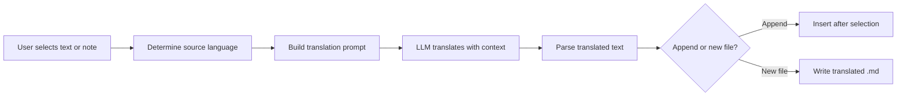

import TLDR from '@site/src/components/TLDR';

# Перевод

<TLDR>
**Notemd переводит текст между 21+ языками с использованием технологий LLM.** Поддерживается перевод отдельно выделенных фрагментов, полных заметок и папок целиком. Для каждой задачи можно указать отдельного поставщика и модель через настройки задачи. Язык вывода можно настроить отдельно от языка UI. Результаты могут быть добавлены под оригинал или сохранены в новом файле в зависимости от ваших предпочтений.

Это часть [Obsidian Руководства по управлению знаниями с ИИ](/docs/pillar-ai-knowledge).
</TLDR>

## Обзор

Перевод в Notemd — это не просто поиск в словаре, а перевод с учетом контекста с использованием технологий LLM. Модель рассматривает полный абзац или заметку, сохраняя тон, специфическую терминологию и структуру предложений. Это обеспечивает более качественные результаты по сравнению с сервисами перевода по фразам, особенно для технического, академического и художественного текста.

Функция поддерживает три уровня обработки: выделенный фрагмент, активная заметка и вся папка. В сочетании с возможностью выбора модели для каждой задачи можно использовать быструю модель (Gemini Flash) для повседневных переводов и мощную модель (Claude Sonnet) для контента, требующего точного восприятия нюансов — без необходимости менять глобального поставщика.

## Как это работает

### Команда Translate



1. **Обнаружение исходного языка** — LLM определяет исходный язык на основе содержимого. Вам не нужно указывать его вручную.
2. **Создание промпта** — Notemd формирует промпт, включающий целевой язык, опциональные указания по домену и текст для перевода.
3. **Перевод LLM** — настроенные компоненты `translateProvider` / `translateModel` обрабатывают запрос. Модель сохраняет форматирование Markdown, ссылки вики и блоки кода.
4. **Вывод** — переведенный текст либо добавляется под оригинал, либо сохраняется в новом файле в хранилище.

### Пары языков

Notemd поддерживает любые пары языков, которые поддерживаются основными технологиями LLM. Среди распространенных пар:

| Исходный язык | Цель | Типичное качество |
|--------|--------|----------------|
| Английский | Китайский (упрощенный) | Отличное |
| Китайский | Английский | Отлично |
| Английский | Японский | Очень хорошо |
| Английский | Немецкий / Французский / Испанский | Очень хорошо |
| Любой поддерживаемый | Любой поддерживаемый | Зависит от модели |

Параметр `translateLanguage` управляет **языком вывода**. Язык исходного текста определяется автоматически.

### Выбор модели для каждой задачи

Качество перевода сильно различается в зависимости от модели. Notemd позволяет назначить специальную модель исключительно для перевода:

| Модель | Скорость | Качество | Стоимость | Для кого |
|-------|-------|--------|------|----------|
| `gemini-2.0-flash-exp` | Быстро | Хорошо | Низкий | Для неформального использования с большим объемом данных |
| `gpt-4o-mini` | Быстро | Хорошо | Низкий | Быстрые поиски |
| `deepseek-chat` | Средне | Хорошо | Очень низкая | Бюджетный мультиязычный вариант |
| `claude-3-5-sonnet` | Средне | Отлично | Средне | Технический/академический |
| `gpt-4o` | Средний | Отличный | Средний | Проза, чувствительная к нюансам |

### Перевод папки пакетом

Щелкните правой кнопкой мыши по папке и выберите **"Notemd: Translate folder"**, чтобы перевести все заметки в этой папке. Каждый файл обрабатывается независимо. Параметр параллельности определяет, сколько файлов обрабатываются одновременно.

## Конфигурация

| Параметр | По умолчанию | Эффект |
|---------|---------|--------|
| `translateProvider` / `translateModel` | DeepSeek | Специализированный провайдер для задач перевода |
| `translateLanguage` | `'en'` | Целевой язык вывода |
| `translationAppendToNote` | `true` | Добавьте переведённый текст под оригинальным. Если значение false, создаётся новый файл. |
| `batchConcurrency` | `3` | Количество файлов, обрабатываемых параллельно во время пакетного перевода |

## Пример

Вы читаете китайскую научную заметку и хотите её английскую версию:

1. Откройте заметку
2. Щелкните правой кнопкой мыши --> **"Notemd: Translate current file"**
3. Notemd распознаёт китайский язык, переводит его на настроенный целевой язык (английский) и добавляет:

```markdown
## Translation (English)

The experimental results show that the proposed method achieves
a 12% improvement in F1 score compared to the baseline, primarily
due to the enhanced feature extraction module described in Section 3.
```

Оригинальный китайский текст остаётся нетронутым выше перевода. Заголовок `## Translation` сохраняет обе версии в одном файле для удобства справки.

## Советы

- **Используйте Gemini Flash для больших объёмов** — это самый быстрый и дешёвый вариант для пакетного перевода крупных папок.
- **Сохранять ссылки на вики** -- инструкция Notemd предписывает LLM оставлять `[[wiki-links]]` нетронутым при переводе. Проверьте результат после перевода, так как некоторые модели иногда разбирают их.
- **Явно указать язык вывода** -- автоматическое обнаружение работает для исходного текста, но всегда настраивайте `translateLanguage`, чтобы избежать неоднозначности относительно целевого языка.
- **Пакетный перевод концептуальных заметок** -- если папка с концепциями написана на одном языке, а вам нужен другой, перевод на уровне папки решает эту задачу за один шаг.

---

## Следующие шаги

- [Исследования](./research) -- Поиск и краткое изложение на любом языке, затем перевод результатов
- [Рабочие процессы](./workflows) -- Последовательный перевод с использованием ссылок на вики или извлечения концепций
- [Пакетная обработка](/docs/advanced/batch-processing) -- Конкурентность и поведение при перезаписи при операциях с папками
- [LLM Провайдеры](/docs/providers/overview) -- Выберите лучшую модель для вашей пары языков
