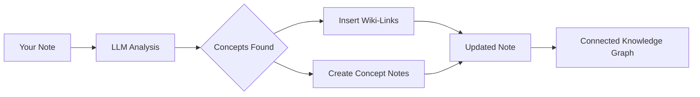

import TLDR from '@site/src/components/TLDR';

# Wiki-Links

<TLDR>
**Notemd автоматически добавляет `[[wiki-links]]` к ключевым понятиям в ваших заметках.** LLM читает ваш контент, находит важные термины в контексте и вставляет wiki-ссылки в стиле Obsidian при каждом их появлении. По желанию создаются файлы концепт-заметок с обратными ссылками. Поддерживается подавление синонимов, сохранение целостности ссылок при переименовании/удалении и режим чистой выгрузки (без изменения файлов). В отличие от Auto Link, который соответствует только существующим заголовкам заметок, Notemd использует ИИ для выявления новых понятий и создания соответствующих заметок. Это часть [Obsidian Руководства по управлению знаниями с использованием ИИ](/docs/pillar-ai-knowledge).
</TLDR>

## Обзор

Создание wiki-ссылок — это основная функция Notemd. Она преобразует обычный текст в связанную графу знаний путем:

1. **Анализа вашей заметки** с помощью LLM
2. **Выявления ключевых понятий** (терминов, людей, методов, теорий)
3. **Вставки `[[wiki-links]]`** при каждом их появлении
4. **Создания концепт-заметок** (по желанию) с обратными ссылками

## Как это работает

### Процесс



### Пример

**До:**
```markdown
Machine learning models use neural networks to learn patterns from data.
The transformer architecture revolutionized natural language processing.
```

**После:**
```markdown
[[Machine learning]] models use [[neural networks]] to learn patterns from data.
The [[transformer architecture]] revolutionized [[natural language processing]].
```

## Использование

### Базовый вариант: Добавление ссылок в текущую заметку

1. Открыть заметку
2. Клик правой кнопкой в редакторе → **"Обработать файл (добавить ссылки)"**
3. Ждите несколько секунд
4. Теперь понятия связаны между собой!

### Пакетная обработка: обработка нескольких заметок

1. Щелкните правой кнопкой мыши по папке в File Explorer
2. Выберите **"Notemd: Обработка папки (добавление ссылок)"**
3. Настройки:
   - Многозадачность (сколько файлов одновременно)
   - Записать существующие ссылки (да/нет)
4. Нажмите **Обработать**

### Избирательная обработка: ссылка на конкретный текст

1. Выделите текст для обработки
2. Щелкните правой кнопкой → **"Обработать выделенное (добавить ссылки)"**
3. Анализируется только выделенная часть

## Notemd против Автоматической ссылки

Obsidian предлагает два способа автоматического создания wiki-ссылок:

| | **Автоматическая ссылка** | **Notemd** |
|--|---------------|-------------|
| Источник ссылки | Названия существующих заметок в хранилище | Концепции, идентифицированные LLM в содержимом |
| Можно создавать ссылки на новые концепции | Нет — заголовок уже должен существовать | Да — ИИ идентифицирует концепции и создает заметки |
| Обработка синонимов | Нет | Да — подавление синонимов |
| Создание заметки о концепции | Нет | Да — с обратными ссылками и удалением дубликатов |
| Пакетная обработка | Нет (один файл) | Да (на уровне папки) |
| Маршрутизация модели по задачам | Нет | Да |

**Auto Link** основан на совпадении заголовков: если существует заметка с названием "Machine Learning", она оборачивает встречающиеся элементы в `[[Machine Learning]]`. Если такой заметки нет, ничего не происходит.

**Notemd** работает с помощью ИИ: LLM анализирует ваш контент, понимает контекст, выявляет концепции, которые *должны* быть связаны — даже если заметки ещё нет — и создаёт как ссылку, так и заметку о концепции.

## Функции

### Подавление синонимов

**Проблема:** "transformer", "transformers", "Transformer architecture" → 3 отдельные концепции

**Решение:** Notemd обнаруживает почти дубликаты и использует каноническую форму.

**Конфигурация:**
```
Settings → Advanced → Synonym Suppression
Threshold: 0.8 (0 = off, 1 = aggressive)
```

### Целостность ссылок

**При переименовании концепт-заметки:**
- Все вики-ссылки автоматически обновляются (Obsidian основная функция)
- Обратные ссылки остаются нетронутыми

**При удалении концепт-заметки:**
- Ссылки сохраняются, но отображаются как "несвязанные упоминания"
- Вы можете воссоздать её из любого вхождения

### Режим чистой выгрузки

**Выгружайте концепты без изменения оригинала:**

1. Клик правой кнопкой → **"Выгрузить концепты (без связей)"**
2. Создаются концепт-заметки
3. Оригинальный файл остаётся нетронутым

Сценарий применения: обработка только для чтения контента или окончательных черновиков.

## Генерация концепт-заметок

### Автоматическое создание

**При включении (по умолчанию), Notemd создает:**

```markdown
---
tags: [concept, auto-generated]
created: 2026-06-13
source: [[Original Note Name]]
---

# Machine Learning

A branch of artificial intelligence that enables computers
to learn from data without explicit programming.

## Occurrences in Your Vault

- [[Original Note Name#Section]]
- [[Another Note#Header]]

## Related Concepts

- [[Neural Networks]]
- [[Deep Learning]]
- [[Supervised Learning]]
```

### Конфигурация

**Папка вывода:**
```
Settings → Output → Concept Folder
Default: concepts/
```

**Иерархическая структура:**
```
Settings → Output → Use Hierarchical Folders
If enabled:
  papers/my-paper.md → papers/concepts/Concept.md
If disabled:
  → concepts/Concept.md
```

**Шаблон:**
```
Settings → Output → Concept Template
Customize with variables:
  {{concept}} — Concept name
  {{description}} — LLM-generated description
  {{backlinks}} — List of source notes
  {{date}} — Creation date
```

## Расширенные параметры

### Окно контекста

**Количество окружающего текста для отправки:**

```
Settings → Linking → Context Window
Options: Sentence | Paragraph | Full Note
Default: Paragraph
```

Чем больше — тем выше точность, но и стоимость.

### Минимальное количество вхождений

**Связывать только те понятия, которые встречаются несколько раз:**

```
Settings → Linking → Min Occurrences
Default: 1 (link all)
```

Установите значение 2 или 3, чтобы сосредоточиться на повторяющихся темах.

### Исключить шаблоны

**Пропустить определённые слова:**

```
Settings → Linking → Exclude List
Example: note, idea, example, thing
```

Это предотвращает чрезмерное связывание общих терминов.

### Пользовательские промпты

**Переопределить стандартные инструкции LLM:**

```
Settings → Advanced → Custom Linking Prompt
Default:
  "Identify key concepts, theories, methods, and technical
   terms in the following text. Return as a list..."
```

Измените их для специфических потребностей домена (например, «Сосредоточьтесь на медицинской терминологии»).

## Советы и лучшие практики

### ✅ ДЕЛАТЬ

- **Обрабатывайте заметки длиной более 100 слов** — Короткие заметки содержат мало концепций
- **Используйте мощные модели** для лучшего выявления концепций (GPT-4o, Claude)
- **Проверяйте перед принятием** — Убедитесь, что предложенные ссылки имеют смысл
- **Разрабатывайте поэтапно** — Обработайте 5-10 заметок, проверьте структуру, скорректируйте настройки

### ❌ НЕ ДЕЛАТЬ

- **Чрезмерное использование ссылок** — Не каждому существительному нужна ссылка
- **Повторная обработка черновиков** — Концепции могут измениться, подождите до стабильности
- **Игнорирование синонимов** — Включите функцию подавления, чтобы избежать различий между "ML" и "Machine Learning"

## Производительность

### Скорость

| Размер заметки | GPT-4o-mini | Claude Sonnet | Ollama (локально) |
|-----------|-------------|---------------|----------------|
| 500 слов | 2-3 секунды | 3-5 секунд | 5-10 секунд |
| 2000 слов | 5-8 секунд | 10-15 секунд | 20-40 секунд |
| 5000+ слов | По частям (несколько вызовов) | Разбито на чанки | Разбито на чанки |

### Оценка стоимости

**Пример: заметка из 1000 слов с GPT-4o-mini**
- Вход: ~1500 токенов
- Вывод: ~200 токенов
- Стоимость: ~

**Пакетная обработка 100 заметок:** ~

## Устранение неполадок

### Ссылки не добавлены

**Проверка:**
1. LLM вызов выполнен с успехом (Настройки → Диагностика)
2. В записке достаточно содержимого (>50 слов).
3. Концепции являются техническими/специфическими (а не просто местоимениями).

**Попробуйте:**
- Используйте более мощную модель
- Увеличить окно контекста
- Проверить действительность ключа API

### Слишком много ссылок

**Решения:**
1. Увеличьте минимальное количество вхождений (2 или 3)
2. Добавить распространённые слова в список исключений
3. Используйте менее агрессивную модель

### Связаны неверные концепции

**Исправления:**
1. Использовать пользовательский промпт для уточнения домена
2. Включить подавление синонимов
3. Вручную проверить и развязать связи

### Ссылки ломаются после переименования

**Это нормальное Obsidian поведение.**

Чтобы обновить все ссылки:
1. Переименовать концепт-заметку
2. Obsidian автоматически обновляет `[[old]]` → `[[new]]`

---

## Следующие шаги

- 📖 [Концепт-заметки](./concept-notes) — подробный обзор создания концепт-заметок
- 🔍 [Интеграция исследований](./research) — объединение ссылок с веб-исследованиями
- 🎨 [Диаграммы](./diagrams) — визуализация вашей графа знаний
