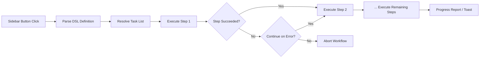

import TLDR from '@site/src/components/TLDR';

# Рабочие процессы

<TLDR>
**Notemd Рабочие процессы объединяют несколько задач в одно действие одним кликом.** Порядок выполнения задач можно определить с помощью `add-links > extract-concepts > research > diagram` с использованием простого DSL. Рабочие процессы отображаются как кнопки в боковой панели, которые запускают всю цепочку действий в текущей записи или папке. Приложение поставляется с заранее определенными рабочими процессами; пользователи могут создавать собственные в настройках. Каждый шаг использует свою собственную конфигурацию модели для данной задачи.

Это часть [Obsidian Руководства по управлению знаниями с ИИ](/docs/pillar-ai-knowledge).
</TLDR>

## Обзор

Рабочий процесс устраняет неудобства, связанные с выполнением задач по отдельности. Вместо того чтобы четыре раза щелкнуть правой кнопкой мыши для добавления ссылок, извлечения концепций, поиска незнакомых терминов и создания диаграммы, достаточно нажать одну кнопку в боковой панели, и вся цепочка действий будет выполнена. Notemd обрабатывает порядок выполнения, передачу ошибок и отчетность о прогрессе.

Рабочие процессы определяются с помощью легкого DSL (языка, специфичного для данной области). Они хранятся в настройках, отображаются как кликабельные кнопки в боковой панели Obsidian и могут применяться к текущей записи или к всей папке.

## Как это работает

### Пайплайн выполнения рабочих процессов



1. **Анализ** -- Строка DSL разбивается по `>` (или `>`) на упорядоченный список идентификаторов задач.
2. **Преобразование** -- Каждый идентификатор соответствует внутреннему команде (add-links, extract-concepts, research, translate, diagram и т.д.).
3. **Выполнение** -- Шаги выполняются последовательно. Каждый шаг использует настроенного поставщика и модель для данной задачи.
4. **Обработка ошибок** -- Если какой-либо шаг завершается с ошибкой, рабочий процесс либо прерывается, либо продолжает выполнение следующего шага в зависимости от настроенной политики обработки ошибок.
5. **Завершение** -- Уведомление в формате toast сообщает о успехе или перечисляет все неудачные шаги.

### Формат DSL

Рабочие процессы определяются как последовательность идентификаторов задач, разделенных `>`:

```
process-current-add-links>extract-concepts-current>research-and-summarize
```

**Доступные идентификаторы задач:**

| Идентификатор | Действие |
|------------|--------|
| `process-current-add-links` | Добавить ссылки на Вики в активную запись |
| `extract-concepts-current` | Извлечь концепции из активной записи |
| `research-and-summarize` | Исследовать выбранный текст или заголовок записи |
| `process-current-translate` | Перевести активную запись |
| `summarize-to-mermaid` | Сгенерировать диаграмму на основе активной записи |
| `generate-from-title` | Сгенерировать контент по заголовку записи |
| `extract-original-text` | Извлечь исходный текст (для OCR/сканированного контента) |

**Варианты на уровне папки** — замените `current` на `folder` в имени идентификатора.

### Заданные заранее и пользовательские рабочие процессы

Notemd поставляется с готовыми рабочими процессами для распространённых сценариев:

| Рабочий процесс | Цепочка | Сценарий применения |
|----------|-------|----------|
| **Извлечение одним кликом** | add-links > extract-concepts > research | Обработать научную статью за один проход |
| **Полная цепочка обработки** | add-links > extract-concepts > research > diagram | Полное извлечение знаний с визуализацией |
| **Перевести + Ссылка** | translate > add-links | Перевести, а затем создать ссылки на концепции на целевом языке |

**Персонализированные рабочие процессы** создаются в настройках:

1. Открыть **Настройки** --> **Notemd** --> **Рабочие процессы**
2. Нажать **"Добавить рабочий процесс"**
3. Ввести цепочку DSL (например, `process-current-add-links>extract-concepts-current`)
4. Указать имя для отображения (например, "Быстрая ссылка + извлечение")
5. Новая кнопка появляется в боковой панели сразу же

## Конфигурация

| Параметр | По умолчанию | Эффект |
|---------|---------|--------|
| `workflows` | Заранее определённый набор | Массив определений рабочих процессов (имя + DSL) |
| `workflowContinueOnError` | `true` | Продолжить к следующему шагу, если текущий не удался |
| `workflowShowProgress` | `true` | Показать уведомление о прогрессе после завершения каждого шага |

### Модели для отдельных задач в рабочих процессах

Каждый шаг в рабочем процессе использует **свою** конфигурацию модели для отдельной задачи. Вам не нужно указывать модели непосредственно в DSL. Порядок разрешения следующий:

1. Провайдер/модель для конкретной задачи, если `useMultiModelSettings` указан
2. Глобальный `activeProvider` в противном случае

Это означает, что `add-links` может работать на DeepSeek, в то время как `research` работает на GPT-4o — всё это в рамках одного и того же рабочего процесса.

## Пример

Вы только что импортировали PDF статьи по машинному обучению в свой хранилище и хотите полное извлечение знаний:

1. Откройте импортированную запись
2. Нажмите кнопку в боковой панели **"Полный поток работ"**
3. Notemd выполняет следующее:
   - **Шаг 1**: Добавление ссылок на wiki — `[[attention mechanism]]`, `[[transformer]]` и т.д.
   - **Шаг 2**: Извлечение концепций — создание записей о концепциях в вашей папке с концепциями
   - **Шаг 3**: Исследование — краткое изложение источников в интернете по ключевым терминам
   - **Шаг 4**: Диаграмма — генерация Mermaid ментальной карты структуры статьи
4. Через примерно 30 секунд у вас будут ссылки, записи о концепциях, результаты исследования и сохранённый файл диаграммы

Всё это — одним кликом.

## Советы

- **Начните с заранее определённых рабочих процессов** — они охватывают наиболее распространённые схемы. Настройте их только тогда, когда вам нужна другая последовательность.
- **Включите `workflowContinueOnError`** — сбой на шаге создания диаграммы не должен прерывать весь поток работ.
- **Используйте рабочие процессы папок** для массовой обработки — щелкните правой кнопкой по папке, выберите рабочий процесс, и каждая заметка будет обработана.
- **Давайте понятные названия рабочих процессов** — место в боковой панели ограничено. Используйте короткие, ориентированные на действие названия вроде «Быстрый извлечение» или «Перевести + Ссылка».

---

## Следующие шаги

- [Исследование](./research) — Понять, что делает шаг исследования, прежде чем добавлять его в рабочие процессы
- [Ссылки на Вики](./wiki-links) — Основная функция создания ссылок, используемая в большинстве рабочих процессов
- [Заметки концепций](./concept-notes) — Извлечение концепций как шаг рабочего процесса
- [Пакетная обработка](/docs/advanced/batch-processing) — Многозадачность и отчеты о прогрессе для рабочих процессов папок
