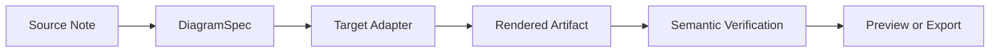
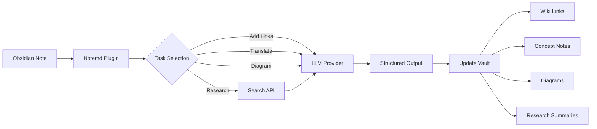

import TLDR from '@site/src/components/TLDR';

# Введение в Notemd

<TLDR>
**Notemd** (Note + EMD — улучшенные Markdown-документы) — это open-source плагин для Obsidian, который преобразует чтение с использованием LLM в постоянно сохраняемые знания. В отличие от чат‑базированных ИИ, где вывод исчезает после сессии, Notemd записывает результаты **непосредственно в ваш хранилище** в виде wiki‑ссылок, заметок о концепциях, кратких обзоров исследований, переводов, рабочих процессов и диаграмм. Он предназначен для исследователей, студентов и специалистов, которые хотят, чтобы чтение, исследования и визуальные объяснения накапливались в структурированной, развивающейся графе знаний.
</TLDR>

## Что такое Notemd?

Notemd интегрирует **более 30 крупных языковых моделей** (OpenAI, Anthropic, Google, DeepSeek, Qwen, Ollama и др.) в ваш рабочий процесс Obsidian для автоматизации извлечения знаний, их организации, перевода, исследования и генерации диаграмм.

### Ключевое отличие: временные vs. постоянные знания

| Аспект | Чат‑базированные ИИ (ChatGPT и т.д.) | Notemd |
|--------|-------------------------------|--------|
| **Куда уходят результаты** | История чата (исчезает) | Ваше хранилище Obsidian (сохраняется) |
| **Формат** | Ответы в простом тексте | Структурированные файлы: `[[wiki-links]]`, заметки о концепциях, диаграммы |
| **Долгосрочная ценность** | Необходимо задавать вопрос заново каждый раз | Накапливается в графе знаний |
| **Офлайн-режим** | Требуется интернет | Работает полностью офлайн с Ollama |

## Основные функции

### 1. **Автоматическое создание ссылок на Вики**
- LLM выявляет ключевые понятия в ваших заметках
- Вставляет `[[wiki-links]]` при каждом вхождении
- По желанию создает связанные заметки с понятиями
- Супрессия синонимов для избежания дубликатов

### 2. **Генерация заметок о понятиях**
- Извлекает основные понятия из статей, документов и заметок
- Создаёт специальные файлы с понятиями с обратными ссылками
- Возможность настройки путей вывода и шаблонов

### 3. **Интеграция с веб-исследованиями**
- Поиск Tavily или DuckDuckGo прямо внутри Obsidian
- LLM подводит итоги результатов с указанием источников
- Добавляет результаты исследований в текущую запись

### 4. **Многоязычный перевод**
- Переводить отдельные фрагменты или всю запись
- Поддержка более 21 UI языка
- Независимая настройка языка вывода
- Поддержка пакетного перевода

### 5. **Генерация диаграмм**
- **Mermaid**: диаграммы потоков, последовательности, классов, состояний, ER, Ганта
- **JSON Canvas**: нативные макеты Obsidian
- **Vega-Lite**: графики данных, временные ряды, диаграммы разброса
- **HTML / Редактируемые HTML/SVG**: самодостаточные графические объекты с семантическими аннотациями
- **Draw.io / Границы объектов Drawnix**: пути экспорта для администраторов, основанные на том же семантическом моделировании графиков
- **План развития схем цепей**: поддержка circuitikz/TikZJax разрабатывается с учетом золотых стандартов, ограниченных запросов, обратной связи по рендерингу и проверки топологии/макета, а не с использованием неограниченного формата LLM TikZ
- **Диагностика предварительного просмотра**: генерируемые объекты могут показывать информацию о проблемах компиляции/рендеринга, а источники, не встроенные в текст, можно проверять без необходимости использования LaTeX на стороне плагина
- Автоматическая коррекция синтаксиса для ошибок Mermaid

### 6. **Рабочие процессы одним кликом**
- Связывание нескольких действий в кнопки боковой панели
- Определение рабочего процесса на основе DSL
- Пример: `add-links > extract-concepts > research > diagram`

## Кто должен использовать Notemd?

✅ **Исследователи**, читающие статьи и составляющие обзоры литературы
✅ **Студенты**, организующие учебные заметки и создающие карты концепций
✅ **Специалисты, работающие с знаниями**, которые хотят сохранять выводы из чтения
✅ **Билингвальные профессионалы**, нуждающиеся в переводе + ссылках на вики
✅ **Пользователи, заботящиеся о конфиденциальности**, желающие локальной поддержки LLM (Ollama)
✅ **Эксперты**, настраивающие промпты и рабочие процессы

## Почему Notemd + Obsidian?

**Obsidian** — это база знаний, ориентированная на локальное хранение и основанная на Markdown. **Notemd** добавляет ИИ‑способности:
- Ваши данные остаются в вашем хранилище (а не в облачном сервисе)
- Работает офлайн с локальными моделями
- Бесплатно и с открытым исходным кодом (лицензия MIT)
- Интегрируется с существующими плагинами Obsidian
- Масштабируется до десятков тысяч заметок

## Начало работы

1. **Установка**: Настройки → Плагины сообщества → Просмотр → "Notemd"
2. **Настройка**: Добавьте ключ вашего провайдера LLM API (или используйте локальный Ollama)
3. **Попробуйте**: Откройте заметку → Клик правой кнопкой → "Обработать файл (добавить ссылки)"
4. **Исследование**: Посмотрите в боковой панели однокликовые рабочие процессы

👉 [Руководство по установке](./getting-started/installation) | [Учебное руководство для быстрого старта](./getting-started/quick-start)

## Направление развития диаграмм

Работа с диаграммами в Notemd переходит от подхода "запросить у модели написать одну строку синтаксиса" к слоистой системе обработки:

Текущая реализация уже поддерживает Mermaid, JSON Canvas, Vega-Lite, резервный вариант HTML, редактируемые HTML/SVG, артефакты Draw.io XML, минимальный набор Drawnix JSON, диагностику предварительного просмотра/резервный вариант только исходника, а также офлайн-прототип `CircuitSpec -> circuitikz` для стандартных схем и золотых шаблонов инверторов CMOS. Схемы представляют собой более сложную категорию: circuitikz может отображать точную электрическую топологию, но без ограничений LLM часто приводит к неразборчивым маршрутам или к LaTeX, который не отрисовывается. Следующим шагом является сохранение ограничений circuitikz с помощью золотых шаблонов ссылок, правил разметки в виде сетки узлов, диагностики отрисовки и циклов обратной связи в виде скриншотов.

Подробнее читайте в разделе [Диаграммы](./features/diagrams).

## Архитектура

## Notemd против других плагинов ИИ Obsidian

Большинство плагинов ИИ Obsidian ориентированы на общение (вы задаете вопрос, ИИ отвечает, вывод остается в чате). Notemd работает по принципу «сначала написать»: ИИ обрабатывает ваши заметки и записывает структурированные результаты непосредственно в ваш хранилище.

| Функциональность | Notemd | Copilot | Smart Connections | Text Generator |
|-----------|--------|---------|-------------------|-----------------|
| Вставка автоматических ссылок на вики | Да | Нет | Нет | Нет |
| Создание концептуальной записки | Да (с обратными ссылками + удалением дубликатов) | Нет | Нет | Нет |
| Генерация диаграмм | Да (Mermaid, Canvas, Vega-Lite, HTML, редактируемые артефакты) | Нет | Нет | Нет |
| Интеграция с веб-исследованиями | Да (Tavily + DuckDuckGo) | Нет | Нет | Нет |
| Обработка папок пакетами | Да | Ограничено | Нет | Ограничено |
| Маршрутизация модели по задачам | Да (7 задач, независимые модели) | Нет | Нет | Нет |
| Цепочки рабочих процессов одним кликом | Да (DSL) | Нет | Нет | Нет |
| Перевод пакетами | Да | Нет | Нет | Нет |
| Чат с хранилищем | Нет | Да | Нет | Нет |
| Поиск по семантическому сходству | Нет | Нет | Да | Нет |
| Генерация на основе шаблонов | Нет | Нет | Нет | Да |
| провайдеры LLM | 36 (облако + шлюз + локальный) | 3-5 | 2-3 | 3-5 |
| Полностью офлайн | Да (Ollama) | Частичный | Частичный | Частичный |

**Когда выбирать Notemd**: если вы хотите, чтобы ИИ создавал постоянную графу знаний, а не просто обсуждал ваши заметки.

**Когда выбирать Copilot**: если вам нужен помощник-ИИ для общения внутри Obsidian.

**Когда выбирать Smart Connections**: если вы хотите выявить существующие связи между заметками с помощью семантического поиска.

## Философия

**Notemd считает, что ИИ должен дополнять работу людей, связанную с получением знаний, а не заменять её.** Плагин:
- Позволяет сохранять контроль (просмотр перед применением изменений)
- Сохраняется контекст (все результаты ведут обратно к исходному источнику)
- Соблюдает конфиденциальность (локальная поддержка LLM, отсутствие телеметрии)
- Остаётся расширяемым (открытые APIs, пользовательские рабочие процессы)

<!-- notemd-acknowledgments -->
## Благодарности и справочные проекты

Notemd поддерживается независимо. Мы благодарим проекты и сообщества с открытым исходным кодом, которые повлияли на документированные проектные решения или предоставляют основу для интеграций. Упоминание признаёт только влияние или совместимость; оно не означает одобрения, аффилированности, включённого кода или заявления о повторном использовании кода.

- **Справочные проекты:** [cloudy-tech-diagrams-skill](https://github.com/cloudy-liu/cloudy-tech-diagrams-skill), [Drawnix](https://github.com/plait-board/drawnix), [diagrams.net / draw.io](https://www.diagrams.net/), [repo-saga](https://github.com/teee32/repo-saga).
- **Основы с открытым исходным кодом:** [Mermaid](https://github.com/mermaid-js/mermaid), [Vega-Lite](https://vega.github.io/vega-lite/), [Slidev](https://github.com/slidevjs/slidev), [CircuitikZ](https://github.com/circuitikz/circuitikz), [Tectonic](https://github.com/tectonic-typesetting/tectonic), [Docusaurus](https://docusaurus.io).
- Каждый проект сохраняет собственную лицензию и условия; Notemd доступен по [лицензии MIT](https://github.com/Jacobinwwey/obsidian-NotEMD/blob/main/LICENSE).

## Открытый исходный код

- **Лицензия**: MIT
- **Источник**: [github.com/Jacobinwwey/obsidian-NotEMD](https://github.com/Jacobinwwey/obsidian-NotEMD)
- **Сообщество**: [Discord](https://discord.gg/qnGgsQ9W) | [GitHub Discussions](https://github.com/Jacobinwwey/obsidian-NotEMD/discussions)
- **Внесите вклад**: приветствуются PR, см. [CONTRIBUTING.md](https://github.com/Jacobinwwey/obsidian-NotEMD/blob/main/CONTRIBUTING.md)

---

**Далее**: [Installation →](./getting-started/installation)
