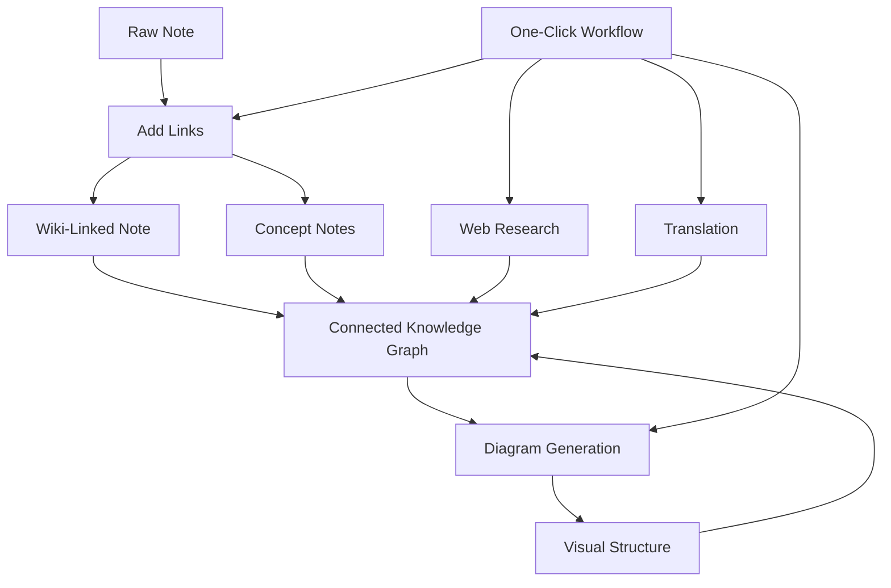

import TLDR from '@site/src/components/TLDR';

# Obsidian Руководство по управлению знаниями с ИИ

<TLDR>
**Notemd превращает чтение с использованием LLM в постоянные знания: вики-ссылки связывают концепции, заметки о концепциях создают доступную для поиска графику, исследования вносят контекст из интернета, перевод устраняет языковые барьеры, диаграммы делают структуру видимой, а рабочие процессы объединяют всё это одним кликом.** Это руководство охватывает весь процесс — от сырых заметок до связанной, визуальной, многоязычной базы знаний.
</TLDR>

## Почему управление знаниями с ИИ?

Традиционное ведение заметок создаёт плоские файлы. Даже при ручном добавлении вики-ссылок большинство заметок остаются разрозненными. Notemd использует LLM для автоматизации слоя связей:

- **LLM читает ваш контент** и определяет то, что важно — термины, методы, люди, теории
- **Ссылки вставляются автоматически** при каждом упоминании концепции, а не скрыты в разделе «см. также»
- **Заметки о концепциях генерируются** как отдельные файлы для поиска
- **Исследования обогащают заметки** контекстом из интернета
- **Диаграммы делают структуру видимой** — карты мышления, диаграммы потоков, графики данных на основе того же контента

Результат: граф знаний, который растёт с каждой обработанной заметкой, а не только тогда, когда вы вспомните добавить ссылки.

## Полный процесс



Каждый шаг является независимым. Можно использовать один или все. Наиболее эффективная последовательность: **Добавление ссылок → Заметки о концепциях → Диаграммы**.

---

## 1. Вики-ссылки: явное создание связей

Вики-ссылки являются основой графа знаний. Notemd использует LLM для:

1. Читайте содержимое своей заметки (разбивайте на части для длинных документов)
2. Определяйте ключевые концепции — отдавайте приоритет конкретным техническим терминам перед общими существительными
3. Вставляйте `[[wiki-links]]` в каждом месте появления
4. Подавляйте синонимы, чтобы «ML» и «Machine Learning» не создавали отдельных узлов

### Когда использовать

- **Каждая заметка длиной более 100 слов** — короткие заметки содержат мало концепций
- **Научные статьи, техническая документация, записи совещаний** — богатые специфическими для области терминами
- **После того, как содержимое стабилизировалось** — не обрабатывайте черновики повторно

### Основные настройки

| Параметр | Рекомендуемые | Почему |
|---------|-----------|-----|
| `addLinksProvider` | DeepSeek или GPT-4o-mini | Хорошая точность при низкой стоимости |
| Подавление синонимов | Включено | Предотвращает создание дублирующихся узлов |
| Окно контекста | Параграф | Баланс между точностью и стоимостью |

→ [Углублённый обзор Wiki-ссылок](/docs/features/wiki-links)

---

## 2. Заметки о концепциях: узлы знаний, доступные для извлечения

Wiki-ссылки соединяют идеи внутри текста, но заметки о концепциях позволяют извлекать каждую идею отдельно. Каждая концепция имеет свой `.md` файл:

```markdown
# Machine Learning

## Linked From
- [[My Research Notes]]
- [[Neural Networks Explained]]
```

### Процесс извлечения

Просьба к LLM имеет высокую структурированность:
- Привести к единственному числу
- В первую очередь использовать многословные концепции вместо однословных («Dielectric Relaxation», а не «Relaxation»)
- Игнорировать разделы с ссылками и библиографией
- Вывести результат в виде `CONCEPT:` строк для однозначной обработки

Концепции удаляются дубликаты между блоками с помощью `Set<string>`. Ошибки LLM в отдельных блоках не прерывают работу.

### Обратные ссылки

При включении каждая заметка о концепции отслеживает, какие источниковые заметки на неё ссылаются. Встроенная панель обратных ссылок Obsidian также показывает обратные связи.

### Удаление дубликатов

4-этапный двойниковый двигатель Notemd выявляет:
1. **Полные совпадения** — сравнение имен файлов без учёта регистра
2. **Множественные формы** — "Models.md" против "Model.md"
3. **Нормализация символов** — "A-B.md" против "A B.md"
4. **Содержание одного слова** — "ML.md" отмечается, если существует "Machine Learning.md"

### Настройки ключей

| Параметр | Рекомендуемый | Почему |
|---------|-----------|-----|
| `conceptNoteFolder` | `concepts/` или `🧠 concepts/` | Поддерживает организованность хранилища |
| `extractConceptsAddBacklink` | Вкл | Включает обратный поиск |
| `extractConceptsMinimalTemplate` | Выкл | Полная шаблон с ссылками |
| Модель для каждой задачи | DeepSeek | Для извлечения концепций не требуются дорогие модели |
| Подавление синонимов | Вкл | Одна и та же настройка влияет как на ссылки, так и на извлечение |

→ [Подробный обзор концептуальных заметок](/docs/features/concept-notes)

---

## 3. Исследование: интеграция веба

Notemd объединяет поиск в интернете с процессом ведения заметок:

1. **Создание запроса** — название заметки или выбранный фрагмент превращается в запрос к поиску
2. **Поиск в интернете** — Tavily (рекомендуется, требуется ключ API) или DuckDuckGo (бесплатно, без ключа)
3. **LLM подведение итогов** — результаты поиска сжимаются в релевантное резюме
4. **Добавление в заметку** — резюме вставляется в позицию курсора или как новый раздел

### Когда использовать

- Перед обработкой новой темы — сначала получите контекст из интернета
- Когда концептуальной заметке требуется дополнение — сначала проведите исследование, затем добавьте ссылки
- Для обзоров литературы — проведите пакетное исследование папки с заметками

### Основные настройки

| Параметр | Рекомендуемые | Почему |
|---------|-----------|-----|
| `researchProvider` | GPT-4o или Claude | Для исследований требуется более качественное подведение итогов |
| Служба поиска | Tavily | Лучшая релевантность, настраиваемая глубина |
| `maxResearchContentTokens` | 4000 | Баланс между глубиной и стоимостью |

→ [Исследование подробно](/docs/features/research)

---

## 4. Перевод: преодоление языковых барьеров

Notemd переводит заметки с использованием настроенного LLM — а не специализированного переводчика API. Это означает:

- **Перевод с учетом контекста** — LLM понимает весь документ, а не по предложениям
- **Обработка технических терминов** — «gradient descent» остается как «梯度下降», а не «坡度向下」
- **Поддержка пакетного перевода** — можно перевести целую папку заметок за одну операцию
- **Модель для каждой задачи** — используется Gemini Flash для перевода (быстро, дешево, многоязычно)

### Поддержка языков

Сам Notemd поддерживает 21 UI язык. Целевой язык перевода можно настраивать для каждой задачи. Распространенные пары: EN↔ZH, EN↔JA, EN↔KO, EN↔DE, EN↔FR, EN↔ES.

→ [Подробное рассмотрение перевода](/docs/features/translation)

---

## 5. Диаграммы: визуализация структуры

Пайплайн диаграмм Notemd основан на спецификации: LLM генерирует структурированный `DiagramSpec` JSON, после чего адаптеры преобразуют его в целевой формат. Это даёт более надёжный результат, чем запрос к LLM на необработанный Mermaid синтаксис.

### Обнаружение намерений

Notemd определяет наилучший тип диаграммы на основе содержимого:

- **Таблицы с числами** → график данных (Vega-Lite)
- **Словарь клиента/сервера** → диаграмма последовательности (Mermaid)
- **Энтитет/ключ первичности** → диаграмма ER (Mermaid)
- **Шаг/поток процесса** → диаграмма потока (Mermaid)
- **Ключевые слова карты концепций** → JSON Canvas (Obsidian native)
- **По умолчанию** → диаграмма ментальной карты (Mermaid)

### Цепочка отрисовки

Основная цель → резервный вариант → резервный вариант → HTML. Если синтаксис Mermaid не сработает, система попытается ещё раз с контекстом ошибки для LLM, затем перейдёт к минимальной диаграмме.

### Основные настройки

| Параметр | Рекомендуемое | Почему |
|---------|-----------|-----|
| `enableExperimentalDiagramPipeline` | Вкл. | Лучшее качество за счёт спецификации в первую очередь |
| `experimentalDiagramCompatibilityMode` | `best-fit` | Нативная цель в зависимости от намерения |
| `summarizeToMermaidProvider` | GPT-4o или Claude | Спецификации диаграмм требуют пространственного мышления |
| `autoMermaidFixAfterGenerate` | Вкл. | Автоматически обнаруживает синтаксические ошибки LLM |
| Усиление локальных знаний | Включено для доменно-специфичных случаев | Повышает точность с учётом контекста хранилища |

→ [Подробный обзор диаграмм](/docs/features/diagrams)

---

## 6. Рабочие процессы: автоматизация одним кликом

Рабочие процессы объединяют несколько задач в одну кнопку на панели боковой области. Формат DSL следующий:

```
task1 | task2 | task3
```

Пример: `addLinks | extractConcepts | generateDiagram` — преобразовать заметку из сырого текста в полностью связанный визуальный узел знаний одним кликом.

### Рекомендуемые рабочие процессы

| Рабочий процесс | Цепочка | Сценарий применения |
|----------|-------|----------|
| Полный процесс | `addLinks \| extractConcepts \| generateDiagram` | Новые заметки |
| Исследование сначала | `research \| addLinks` | Неизвестные темы |
| Полиглот | `translate \| addLinks` | Многоязычные заметки |
| Только диаграмма | `generateDiagram` | Быстрая визуализация |

→ [Подробный обзор рабочих процессов](/docs/features/workflows)

---

## 7. LLM Провайдеры: 36 вариантов от облачных до локальных

Notemd поддерживает 36 провайдеров в 4 типах транспортировки. Основные группы:

- **Международные облака**: OpenAI, Anthropic, Google, Mistral, xAI
- **Китайские облака**: DeepSeek, Qwen, Doubao, Moonshot, GLM, Baidu, SiliconFlow
- **Шлюзы**: OpenRouter, GitHub Models, Hugging Face, Vercel
- **Локальные**: Ollama, LMStudio, OVMS — нет ключа API, данные не покидают ваш компьютер

### Стратегия моделей по задачам

Наиболее экономичная конфигурация использует дешевые модели для простых задач и мощные модели для сложных:

```
extractConcepts  → DeepSeek (fast, cheap, accurate enough)
addLinks          → DeepSeek or GPT-4o-mini
research          → GPT-4o or Claude (needs quality)
generateDiagram   → GPT-4o or Claude (needs spatial reasoning)
translate         → Gemini Flash (fast, multilingual)
```

→ [Обзор LLM Провайдеров](/docs/providers/overview)

---

## Чек-лист для начала работы

1. **Установите Notemd** — [Community Plugins](/docs/getting-started/installation) (рекомендуется) или вручную
2. **Настройте провайдера** — DeepSeek (самый простой способ), OpenAI или Ollama (бесплатно)
3. **Обработайте первую запись** — щелкните правой кнопкой → "Обработать файл (добавить ссылки)"
4. **Установка папки концепций** — Настройки → Notemd → Результаты → Папка концепций
5. **Извлечение концепций** — запустить команду "Извлечение концепций" для той же записи
6. **Создание диаграммы** — запустить команду "Создать диаграмму", чтобы визуализировать связи
7. **Создание рабочего процесса** — объединить вышеуказанные шаги в одну кнопку нажатия

## Рекомендуемые конфигурации

### Студент (бюджетный)

```
Provider: DeepSeek (free tier available)
Concept extraction: DeepSeek
Research: DuckDuckGo (free) + DeepSeek
Diagrams: Off (or legacy Mermaid)
Workflows: addLinks | extractConcepts
```

### Исследователь (качество)

```
Provider: GPT-4o (primary)
Concept extraction: DeepSeek (cost savings)
Research: GPT-4o + Tavily
Diagrams: best-fit mode, GPT-4o
Workflows: research | addLinks | extractConcepts | generateDiagram
```

### Приватность превыше всего (только локально)

```
Provider: Ollama (llama3 or qwen2.5:7b)
All tasks: Ollama
Research: DuckDuckGo (free, no API key)
Diagrams: legacy Mermaid mode
```

### Двуязычный (ZH + EN)

```
Primary: DeepSeek (Chinese queries)
Translation: Google Gemini Flash
Research: Tavily + DeepSeek (Chinese search context)
Language output: per-task (extractConceptsLanguage: zh-CN)
```

---

## Общие шаблоны

### Шаблон: обработка научной статьи

1. Импорт контента PDF (или вставка)
2. **Исследование** — получение информации из Интернета по теме
3. **Добавление ссылок** — выявление и привязка ключевых концепций
4. **Извлечение концепций** — создание отдельных записей
5. **Создание диаграммы** — визуализация структуры статьи

### Шаблон: обогащение ежедневной записи

1. Записать ежедневную заметку
2. **Добавить ссылки** — связывает сегодняшние идеи с существующими концепциями
3. Заметки о концепциях автоматически обновляются с обратными ссылками

### Шаблон: Обзор литературы

1. Создать папку для статей/заметок
2. **Пакетное добавление ссылок** — обработка всей папки
3. **Удаление дублирующихся концепций** — очистка почти одинаковых заметок
4. **Создание диаграммы** — ментальная карта всей литературы

---

*Notemd является программным обеспечением с открытым исходным кодом (MIT) и работает с Obsidian 0.15.0+ на всех платформах. [Установить сейчас](/docs/getting-started/installation) или [посмотреть на GitHub](https://github.com/Jacobinwwey/obsidian-NotEMD).*
