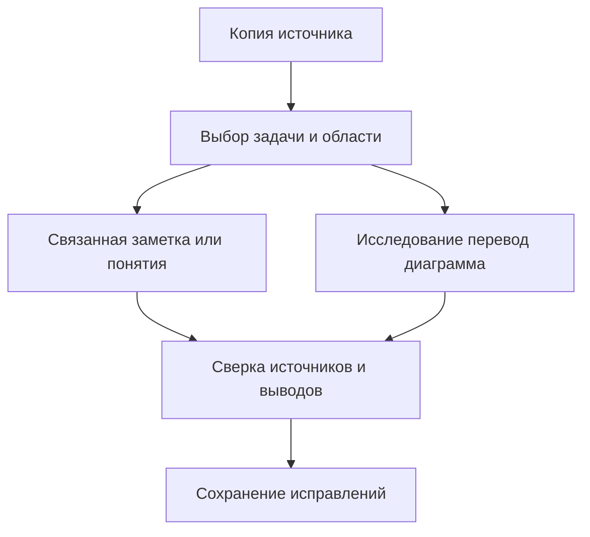

import TLDR from '@site/src/components/TLDR';

# Управление знаниями с ИИ в Obsidian

<TLDR>Полезный процесс различает источник, ответ модели и собственные исправления. Notemd создаёт проверяемые ссылки, понятия, исследования, переводы и диаграммы. Начните с одной заметки, оцените результат, затем автоматизируйте ограниченную папку.</TLDR>

## Определите результат

Выберите связанную заметку, понятия, сводку с источниками, перевод или диаграмму. Рост числа файлов/ссылок не гарантирует понимания и поиска. Определите, как проверять и находить материал.

## Полный маршрут


```mermaid
flowchart TD
    A[Копия источника] --> B[Выбор задачи и области]
    B --> C[Связанная заметка или понятия]
    B --> D[Исследование перевод диаграмма]
    C --> E[Сверка источников и выводов]
    D --> E
    E --> F[Сохранение исправлений]
```

Это доступные задачи, а не все этапы стандартной кнопки. До связывания сохраните оригинал и проверьте назначения.

## 1. Ссылки: явные отношения

После **Обработать файл (добавить ссылки)** проверьте `_processed.md`, полезность терминов, цитаты, код и формулы. Домен и подавление синонимов не обеспечивают тождество или числовой порог. Для воспроизводимых существующих заголовков рассмотрите детерминированное сопоставление. [Ссылки](./features/wiki-links).

## 2. Понятия: термин и объяснение

Задайте папку. Отдельное извлечение сохраняет источник и создаёт только заголовки. Для `Linked From` новой заметки включите backlinks и отключите минимальную форму. **Пакетная генерация по заголовкам** — отдельный шаг, который может обработать старые подходящие файлы. Проверяйте complete и неоднозначные имена перед удалением. [Понятия](./features/concept-notes).

## 3. Исследование: сохранить основания

Выберите тему/заголовок, Tavily либо DuckDuckGo и выполните **Исследовать и суммировать**. Пустой ключ не переключает поиск. Откройте источники. Локальный лексический поиск передаёт выдержки выбранной модели; локальный индекс не доказывает автономность обработки. [Исследование](./features/research).

## 4. Перевод: смысл и структура

Выберите язык и переведите файл. Начальное имя `_<language>.md` может перезаписать существующий вывод. Для отрывка создайте временную заметку. Сверяйте термины, числа, код, ссылки и математику, учитывая потерю межфрагментного контекста. Числа локалей UI/сайта не доказывают качество пары. [Перевод](./features/translation).

## 5. Диаграммы: редактируемый источник

Выберите несколько типов диаграмм за один запуск и несколько форматов для каждого типа отдельно. Снятие отметки сохраняет форматы типа; без выбранных типов содержимое анализируется автоматически. Флажок включает тип. Нажмите название, чтобы выбрать его и настроить форматы. Наведение указателя или фокус клавиатуры меняет предпросмотр без сохранения настроек. Escape закрывает меню и возвращает фокус.

## 6. Сценарии: проверенная последовательность

Имя, `::` и действия через `>` задают цепочку:

```text
One-Click Extract::process-current-add-links>batch-generate-from-titles>batch-mermaid-fix
```

Здесь ссылки, заголовки и ремонт Mermaid, без общего исследования/диаграмм. Каждая задача сохраняет свои требования. По умолчанию первая сообщённая ошибка останавливает цепь. Продолжайте только если следующие шаги допускают оставшиеся входы. Отмена не откатывает готовые записи. [Сценарии](./features/workflows).

## 7. Провайдеры: протокол и задача

36 профилей покрывают пять семейств. Выбирайте по адресам, правам, правилам данных и измеренным результатам. Сравнивайте время/цену на одинаковых источнике и prompt. Индивидуальные маршруты выключены изначально; проверьте все перед утверждением о локальной работе. [Провайдеры](./providers/overview).

## Первые проверки

1. Установите и сохраните копии источников.
2. Проверьте точную модель.
3. Задайте папку понятий и отдельные назначения.
4. Испытайте копию.
5. Сверьте и сохраните исправления.
6. Расширьте до маленькой папки и проверьте частичные результаты до длинных цепочек.

## Типовые случаи

### Статья

Внешним инструментом преобразуйте в Markdown и проверьте таблицы, формулы, рисунки. Извлекайте понятия/цитаты, исследуйте конкретные вопросы и рисуйте подтверждаемые отношения. Сохраняйте оригинал и правки.

### Поддержка понятий

Используйте отдельную папку, проверяйте термины и генерируйте объяснения для выбранного поднабора. Перед очисткой делайте backup. Количество не заменяет точность и удобную навигацию.

### Частный материал

Подготовьте локальный сервер, модель и зависимости. Проверьте маршруты, при необходимости исключите сетевой поиск. Просмотрите диагностику до передачи. Начальный loopback не препятствует настройке удалённого адреса.

### Продолжение пакета

Дождитесь завершения отмены/ошибки, проверьте отчёт, выходы и восстановление. Сопоставьте конфликты и повторяйте нужное. Отмена не означает пустой результат; проверяйте ссылки перед удалением companions.

## Далее

- [Быстрый старт](./getting-started/quick-start).
- [Пакеты](./advanced/batch-processing).
- [Разработчикам](./developers/overview).
- [Agent](./agents/overview).
