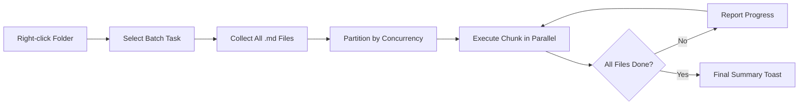

import TLDR from '@site/src/components/TLDR';

# Batchbearbetning

<TLDR>
**Notemd bearbetar hela mappar i en enda åtgärd med konfigurerbar samtidighet och kontroll över överskrivning.** Klicka med höger mus på en mapp för att batch-lägga till wiki-länkar, extrahera koncept, utföra forskning eller översätta alla anteckningar därin. Samtidighetsgränser förhindrar API-rate-limit-fel. Framsteg rapporteras för varje fil. Överskrivningsbeteendet är konfigurerbart: skippa befintliga, lägg till eller ersätt. Misslyckade filer loggas utan att batchen avbruts.

Detta ingår i [Obsidian AI Knowledge Management Guide](/docs/pillar-ai-knowledge).
</TLDR>

## Översikt

Batchbearbetning omvandlar en mapp med anteckningar till en enda operation. Istället för att öppna varje anteckning och köra kommandon separat klickar du med höger mus på mappen och väljer uppgiften. Notemd itererar genom varje `.md`-fil, tillämpar den valda åtgärden och rapporterar framsteg i realtid.

Denna funktion är avgörande för kunskapsextraktion i hela vaulten. Efter att ha importerat dussintals PDF, till exempel, kan batch-lägg-till-länkar följt av batch-extrahera-koncept bygga din kunskapsgraph på minuter istället för timmar.

## Så här fungerar det

### Batchexekveringsmodell

1. **Filinsamling** -- Notemd skannar målmappen rekursivt (eller endast på toppnivå, beroende på inställningarna) och samlar in alla `.md`-filer.
2. **Samtidighetsindelning** -- Filerna delas in i chunkar baserat på `batchConcurrency`-inställningen. Varje chunk körs parallellt; chunkar körs sekventiellt.
3. **Exekvering** -- Varje fil bearbetas med samma logik som kommandot för en enskild fil. Inställningar för leverantör och modell per uppgift respekteras.
4. **Framstegsrapportering** -- En toast-notifikation uppdateras efter varje fil är klar och visar `N / Total`-framstegen.
5. **Felhantering** -- Om en fil misslyckas (API-fel, nätverkstidout etc.) loggas felet och batchen fortsätter. Den slutgiltiga sammanfattningen listar alla misslyckade filer.
6. **Slut** -- En sammanfattande toast-rapport ger information om totalt bearbetat, framgångar och misslyckanden.

### Överskriva beteende

När en fil som redan innehåller wiki-länkar, konceptanteckningar eller översättningar bearbetas, beror Notemds beteende på inställningen för överskrivning:

| Modus | Beteende |
|------|----------|
| **Undvik** | Det befintliga innehållet lämnas orört. Endast oändrade filer bearbetas. |
| **Lägg till** (standard) | Nytt innehåll läggs till. De befintliga wiki-länkarna, koncepten eller översättningarna bevaras. |
| **Ersetta** | Filen bearbetas helt om. Alla tidigare Notemd-ändringar överskrivs. |

Specifikt för wiki-länkar: om en anteckning redan innehåller `[[wiki-links]]` lämnar **Undvik**-modusen den orörd, medan **Ersetta** skickar hela anteckningen till LLM för ny länkinsertion. Använd **Undvik** för inkrementell bearbetning och **Ersetta** för ombearbetning efter en modellupgradering.

### Konkurrenskontroll

Inställningen `batchConcurrency` begränsar parallella API-anrop. Detta förhindrar rate-limit-fel (HTTP 429) vid bearbetning av stora mappar hos leverantörer med strikta kvoter.

| Konkurrens | Rekommenderat för | Typiskt rate-limit-inverkan |
|-------------|----------------|---------------------------|
| `1` | Gratis nivåer, strikta leverantörer | Ingen (seriell) |
| `3` (standard) | De flesta molnleverantörer | Låg |
| `5` | Ollama (lokal), generösa nivåer | Ingen / Låg |
| `10` | Lokala modeller med snabb inferens | Ingen |

Om du stöter på 429-fel under batchbearbetning, sänk samtidigheten till 1 eller 2.

## Konfiguration

| Inställning | Standard | Effekt |
|---------|---------|--------|
| `batchConcurrency` | `3` | Maximal antal parallella API-anrop under mappoperationer |
| `batchOverwriteExisting` | `false` | Överskriva den befintliga Notemd-innehållet. `false` = lägg till-läge. |
| `batchSkipProcessed` | `false` | Undvik filer som redan innehåller Notemd-markörer (t.ex. wiki-länkar) |
| `batchRecursive` | `true` | inkludera undermappar vid skanning av mappen |
| `enableStableApiCall` | `false` | Aktivera återförsökslogik (upp till 4 försök) per fil under batchprocessen |

### Per-uppgiftsmodeller i batch

Varje batchoperation använder den motsvarande per-uppgiftsmodellen. Batch-add-links använder `addLinksProvider`, batch-research använder `researchProvider`, osv. Detta innebär att du kan tilldela billiga modeller för stora volymer av operationer och reservera dyra modeller för uppgifter där kvaliteten är viktig.

## Exempel

Du har en mapp `papers/` som innehåller 40 importerade forskningsanteckningar. Du vill lägga till wiki-länkar och extrahera koncept från dem alla:

1. Klicka höger på mappen `papers/`
2. Välj **"Notemd: Processa mapp (lägg till länkar)"**
3. Notemd skannar mappen, hittar 40 `.md`-filer och bearbetar 3 i taget (standardkonkurrens)
4. En framstegsnotis visar: `12/40 files processed...`
5. Efter cirka 3 minuter ger en sammanfattningsnotis information om: `39 succeeded, 1 failed (API timeout on paper-37.md)`
6. Upprepa med **"Notemd: Processa mapp (extrahera koncept)"** för att skapa konceptnotiser för alla 40

Den enda misslyckade filen registreras. Du kan köra om endast den filen senare.

## Tips

- **Börja med låg konkurrens** -- Om du är osäker på din leverantörs hastighetsgränser, börja med `1` och öka gradvis.
- **Använd avbrytningsläge för inkrementella uppdateringar** -- Efter den första fulla batchen byt till `batchSkipProcessed: true` så att endast nya notiser bearbetas vid efterföljande körningar.
- **Aktivera stabila API-anrop** -- `enableStableApiCall: true` lägger till återförsökslogik som återhämtar sig från tillfälliga nätverksfel under långa batchar.
- **Kör om efter modellupgraderingar** -- Om du byter till en bättre modell, ställ in `batchOverwriteExisting: true` och kör om för att få förbättrade länkar och koncept.

---

## Nästa steg

- [Workflows](/docs/features/workflows) -- Kedja samman batchuppgifter till enkla sidofältsknappar
- [Custom Prompts](/docs/advanced/custom-prompts) -- Anpassa prompter för batchextraktion
- [Troubleshooting](/docs/advanced/troubleshooting) -- Läsa till på hastighetsgränsfel och anslutningsfel under batchkörningar
- [LLM Tjänsteleverantörer](/docs/providers/overview) -- Referens för modellkonfiguration per uppgift
