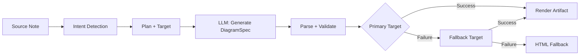
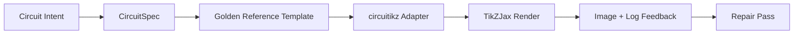

import TLDR from '@site/src/components/TLDR';

# Diagram

<TLDR>
**Notemd genererar diagram från dina anteckningar genom en spec-first-pipeline.** LLM skapar en renderer-agnostic `DiagramSpec` JSON, vilket sedan översätts till Mermaid, JSON Canvas, Vega-Lite, HTML eller redigerbar HTML/SVG-utdata av specialiserade adapter. Stöder 8 typ av avsikter, automatiserade fallback-kedjor, live-preview med export till SVG/PNG, semantisk verifiering samt generering förbättrad med lokalt kunskap.
</TLDR>

Detta ingår i [Obsidian AI Knowledge Management Guide](/docs/pillar-ai-knowledge).

## Arkitektur: Spec-First Pipeline

Notemd ber aldrig LLM att skapa Mermaid/Vega/Canvas-syntax direkt. Istället:



**Varför specifikationen först?** LLM-filer producerar ofta ogiltig renderer-syntax (särskilt Mermaid). En strukturierad `DiagramSpec` kan valideras innan rendering, och samma specifikation kan användas av flera renderare som fallback.

## Stödda diagramtyper

| Avsikt | Huvudrenderare | Fallback-mekanismer | Användningsfall |
|--------|-----------------|-----------|----------|
| `mindmap` | Mermaid | HTML | Hierarkisk delning av ämnen |
| `flowchart` | Mermaid | HTML | Processflöden, beslutsträd |
| `sequence` | Mermaid | HTML | Klient-server-interaktioner, protokoll |
| `classDiagram` | Mermaid | HTML | OOP-klassrelationer |
| `erDiagram` | Mermaid | HTML | Databassschema, entitetsrelationer |
| `stateDiagram` | Mermaid | HTML | Statemaskiner, livscykelmodeller |
| `canvasMap` | JSON Canvas | Mermaid → HTML | Konceptkartor, kunskapsgrapher |
| `dataChart` | Vega-Lite | Mermaid → HTML | Stavar, linjer, areor, spridning, pizza, tabeller |

## Avsiktsdetektering

Notemd införder den bästa diagramtypen utifrån innehållet i din anteckning med hjälp av nyckelordbedömning:

| Avsikt | Utlösare | Säkerhet |
|--------|----------|------------|
| `dataChart` | Tabeller, numeriska celler, nyckelord för mätvärden/trender, procenttal | 0.88 |
| `sequence` | Förfrågan/svarsvokabulär (4+ matchningar) eller `->`/`=>`-märkare | 0.82 |
| `erDiagram` | Primäryckel, främmande yckel, entitet, schema (2+ matchningar) | 0.80 |
| `stateDiagram` | Stadium, övergång, väntande, i kö, misslyckat (3+ matchningar) | 0.76 |
| `flowchart` | Numrerade steg (2+) eller if/then/else/workflow-vokabulär | 0.74 |
| `canvasMap` | Konceptkarta, kunskapsgraph, rumslig, kluster | 0.72 |
| `mindmap` | Standardåtergång | 0.55 |

Överskriv med inställningen **Förväntad diagramtyp**, sidofältsselaren eller en explicit kommandopanelval.

## Utval av rendermål

Den experimentella spec-first-pipelinesystemet har nu två oberoende kontroller:

| Kontroll | Inställning | Effekt |
|---------|---------|--------|
| Förväntad diagramtyp | `preferredDiagramIntent` | Styr den semantiska formen av den genererade `DiagramSpec` |
| Förväntat rendermål | `preferredDiagramRenderTarget` | Väljer artefaktrenderaren för **Generera diagram** och **Förhandsvisning av diagram** |

Ställ **Förväntat rendermål** in på **Auto** som standard för planeraren, eller välj explicit Mermaid, JSON Canvas, Vega-Lite, HTML eller Editable HTML/SVG. Överskrivningen gäller endast artefakt- och förhandsvisningskommandon. Standardkommandot **Sammanfatta som Mermaid diagram** förblir fäst vid Mermaid-kompatibelt utdata så att befintliga Markdown-arbetsflöden inte tyst byter format.

Denna separation är viktig eftersom en `flowchart`-intention nu kan renderas som Mermaid för Markdown-noter, HTML som robust återgång, eller Editable HTML/SVG för efterföljande redigering. Draw.io och Drawnix förblir CLI-artefaktexporterare istället för rendermål inom pluginet.

## Användning

### Generera ett diagram

1. Öppna en anteckning
2. Kör **"Notemd: Generera diagram"** från kommandopanelen
3. Notemd upptäcker intentionen, genererar specifikationen, renderar och sparar artefakten

**Utdatafiler efter mål:**

| Mål | Utökning | Filnamnsmönster |
|--------|-----------|------------------|
| Mermaid | `.md` | `{note}_summ.md` |
| JSON Canvas | `.canvas` | `{note}_diagram.canvas` |
| Vega-Lite | `.json` | `{note}_diagram.json` |
| HTML | `.html` | `{note}_diagram.html` |
| Redigerbar HTML/SVG | `.html` | `{note}_diagram.html` |

### Visa förhandsvisning av en diagram

1. Kör **"Notemd: Preview diagram"**
2. En modalruta öppnas med den renderade diagrammet
3. Exportera som SVG eller PNG med hjälp av verktygsfältets knappar

**Auto-open preview** finns tillgängligt i inställningarna – efter generering öppnas förhandsvisningsfönstret automatiskt.

Förhandsvisningsmodalen har också en panel för diagnostik av artefakter. Renderare och röktest kan ansluta `RenderArtifact.diagnostics`; modalen visar en sammanfattning av diagnostiken med antal fel/varningar/informationer, därefter allvarlighetsgrad, typ av diagnostik, meddelande och reparationstips bredvid förhandsvisningen. Samma sammanfattning visas i posterna i förhandsvisningshistoriken, så att upprepadra circuitikz röktest kan jämföras utan att behöva öppna varje post. För artefakter som har källinnehåll men inte kan renderas inline eller via HTML iframe-sväret faller modalen nu tillbaka till en förhandsvisning endast med källkoden istället för att tvinga en tom iframe. Detta ger circuitikz kompilerings-/renderingsröktest, SVG texttokenkontroller, PNG-blankskärmbildskontroller samt framtida överskridningsrapporter en synlig UI yta utan att göra TikZJax eller LaTeX till en strikt plugin-körningsskicklighet eller låtsas att källtexten är en verifierad visuell rendering.

### Legacy Mermaid-läge

När `enableExperimentalDiagramPipeline` är av skickar Notemd en direkt Mermaid-fråga till LLM. Detta kringgår hela spec-pipelinen. Om den experimentella pipelinen misslyckas faller det tillbaka till denna modus.

## Rendering-backender

### Mermaid

6 adapter (mindmap, flödesschema, sekvens, ER, klass, tillstånd) översätter `DiagramSpec` till Mermaid-syntax. Efter generering validerar `mermaid.parse()` utdata. Om valideringen misslyckas:

1. **LLM försök igen** — ett försök med Mermaid-felmeddelandet som kontext
2. **Minimal fallback** — ett enkelt Mermaid-diagram från spec-nod-ID:er

**Legacy Mermaid Fixer** reparerar automatiskt vanliga LLM syntaxfel: normalisering av note-directiv, undkomst av pipe-label, omplacering av semikolon, smart quotes, dubbelstrich-pilar, formmismatchningar och mer.

### JSON Canvas

Genererar Obsidian JSON Canvas-format med rumslig layout:
- Noder placeras enligt djup (x = djup × 420) och index (y = index × 170)
- Bredden uppskattas utifrån etikettlängden
- Kanter med `fromSide: 'right'`, `toSide: 'left'`, `toEnd: 'arrow'`

### Vega-Lite

Skapar kompletta Vega-Lite v5 JSON-specifikationer med automatisk kodning:
- **Cartesiska diagram** (stavar/linjer/yta/punkt/späck): x + y-kanaler + färg för flera serier
- **Paj**: theta = y (kvantitativt), färg = x (nominalt)
- **Tabell**: rad = x, text = y + kolumn = serie

Mörka och ljusa teman slås samman före kompilering.

### HTML

Universell fallback. Självständig HTML-dokument med:
- CSP-meta-huvudraden
- Ljus/mörkt läge via `prefers-color-scheme`
- Lokaliserade UI-etiketter för 20 språk
- Sektioner: hero, struktur (nodträd), relationer, anmärkningar, tabeller för dataserier

### Redigerbar HTML/SVG

Explicit figurmål för redigerbara exportarbetsflöden. Det projicerar `DiagramSpec` till en deterministisk `SemanticFigureModel`, och renderar därefter en självständig HTML-dokument med inbyggda SVG-grupper som innehåller Draw.io-stil annoteringar:

- `data-drawio-type`, `data-drawio-id` och `data-drawio-role` på semantiska noder
- `data-drawio-source` och `data-drawio-target` på semantiska kantor
- stabila nod/kantidentifierare efter normalisering av mellanrum och hantering av kollisioner
- inga skript, inga externa teckenföringar och inga fjärrresurser

Detta mål är avsiktligt inte standardplaneringsvägen än. Det finns tillgängligt som ett explicit rendermål tills produktvägen bevisat redigeringsbeteende i verkliga verktyg.

### Draw.io och Drawnix Exportgränser

Den nuvarande implementationen håller stöd för tredjepartsredigerare vid artefaktsgränsen:

| Mål | Kontrakt | Körningssberoendighet |
|--------|----------|--------------------|
| Draw.io | deterministisk, okomprimerad `mxfile` XML från `SemanticFigureModel` | ingen i pluginkörningen eller CI |
| Drawnix | minimal `.drawnix` JSON-undermängd med `geometry` och `arrow-line`-element | ingen i pluginkörningen eller CI |

Avvägningen är avsiktlig: Notemd kan verifiera synliga etiketter, stabila ID:er och stödd primitiv täckning utan att inkludera diagrams.net Desktop, Drawnix, Plait eller endast webbläsarbaserad redigeringsstatus i pluginet.

### circuitikz / TikZJax riktning

Kretsdiagram är inte samma problem som generiska flödesscheman. Den korrekta syntaxmålet för elektriska kretsar är vanligtvis **circuitikz**, renderad i Obsidian med hjälp av plugin som TikZJax. TikZJax kan ladda paket som `circuitikz`, `pgfplots`, `tikz-cd` och `chemfig`, vilket gör det attraktivt för anteckningar inom fysik, kretsar, kemi och matematik.

Risken är att rått LLM-genererat TikZ är bräckligt:

- komplex kretstopologi kan vara elektriskt korrekt men visuellt oläsbar;
- överlappande ledningar och etiketter kan göra en korrekt netlist ofunktionell för studieanteckningar;
- bristande paketpreambuler, felankor eller ogiltiga komponentnamn kan förhindra rendering;
- återkopplingen från renderaren är vanligtvis på bildnivå, medan LLM genererar textnivås geometri.

Den bättre arkitekturen är att behandla circuitikz som ett begränsat diagrammål, inte som en friformig prompt:



Modellen av första klassen bör beskriva kretstopologi och layout separat:

| Lager | Ansvar | Exempel |
|-------|----------------|---------|
| Topologi | elektriska noder och komponentanslutningar | `VDD -> RD -> drain(M1)`, `source(M1) -> GND` |
| Layout | gridplacering, orientering, routningsbanor | `M1 at (3,2.2)`, inmatning vänster, utmatning höger |
| Stil | paket, spänningskonvention, etiketter, ankare | `\begin{circuitikz}[american voltages]` |
| Validering | kompilationslogg, saknade ankare, överskridnings-/skärmbildsgranskningar | TikZJax/LaTeX-diagnostik plus visuell granskning |

### Nuvarande circuitikz-prototyp

Notemd inkluderar nu den första begränsade repository-prototypen för denna riktning. Den är avsiktligt offline och bunden till mallar:

```bash
npm run diagram:export-circuitikz -- --input cmos-inverter.json --output cmos-inverter.tex
```

Prototypen lägger till en separat `CircuitSpec`-gräns samt en deterministisk exporter för sex gyllene referensfamiljer:

| Kretstyp | Gyllen referens | Strömkompensation |
|--------------|------------------|-------------------|
| `common-source-amplifier` | `common-source-nmos-v1` | validerar `VDD -> R_D -> M1.D`, `vin -> M1.G`, `M1.S -> GND` och `M1.D -> vout` innan skrivning till LaTeX |
| `cmos-inverter` | `cmos-inverter-v1` | validerar PMOS-over-NMOS-topologi, delad gatteinmatning, delad drainutmatning, `VDD -> MP.S` och `MN.S -> GND` innan skrivning till LaTeX |
| `cmos-buffer` | `cmos-buffer-v1` | validerar två kaskerade inverterskikt, mellanliggande nod `vmid`, återställd `vout` samt delade VDD/GND-ledd innan skrivning till LaTeX |
| `cmos-transmission-gate` | `cmos-transmission-gate-v1` | validerar parallella PMOS/NMOS-passenheter mellan `vin` och `vout` med komplementära `phib` / `phi`-kontroller innan skrivning till LaTeX |
| `cmos-nand2` | `cmos-nand2-v1` | Validerar parallell PMOS pull-up, seriell NMOS pull-down, dubbel inmatning `va` / `vb` och `vout` innan LaTeX skrivs |
| `cmos-nor2` | `cmos-nor2-v1` | Validerar seriell PMOS pull-up, parallell NMOS pull-down, dubbel inmatning `va` / `vb` och `vout` innan LaTeX skrivs |

Detta är ännu inte en allmän TikZ-generator. Den kompilerar inte LaTeX, anropar inte TikZJax, undersöker inte skärmdumpar eller kör inte automatiserad bild-feedback-reparation. Detta är fortfarande framtida funktioner.

Kommandot Preview diagram kan öppna direkt sparade circuitikz-källartefakter när filändelsen är `.tex` eller `.tikz` och källan innehåller `\usepackage{circuitikz}` eller `\begin{circuitikz}`. Denna metod är en circuitikz-källa-endast-preview: fönstret visar källan, diagnostik, kopierings/sparningskontroller och historiksmetadata, men den kompilerar inte LaTeX eller anropar inte TikZJax under plugins körning.

Samma källa-endast-preview-grenser omfattar nu sparade Draw.io- och Drawnix-artefakter. `.drawio`-filer accepteras när de ser ut som Draw.io XML (`mxfile` eller `mxGraphModel`), och `.drawnix`-filer accepteras när de är Drawnix JSON med `type: "drawnix"` och en `elements`-array. Pluginen inkluderar fortfarande inte diagrams.net eller Drawnix-whiteboard-värd; dessa previewer visar källan, diagnostik och artefaktshistorik utan att ha en in-plugin-visuell redigerare.

För topologiförvarande reparering skickas den förreparationsspecifikationen som referens innan en reparerad kandidat accepteras:

```bash
npm run diagram:export-circuitikz -- --input repaired-cmos-inverter.json --topology-reference cmos-inverter.json --output cmos-inverter.tex
```

Reparationsväktaren använder `createCircuitTopologySignature` och `assertCircuitTopologyUnchanged` för att jämföra `circuitKind`, `goldenReferenceId`, nätverk, komponentids/typer/terminaler samt oriktade anslutningsändpunkter innan utdata. Etiketter, titeltext, layouttips, anslutningsordning och anslutningsetiketter ignoreras avsiktligt. En kandidat som lägger till en kort eller omkopplar en terminal misslyckas med `Circuit topology drift detected` innan `.tex`-filen skrivs.

Den CLI kan nu analysera en befintlig LaTeX/TikZJax-kompilationslogg utan att köra en kompilerare:

```bash
npm run diagram:export-circuitikz -- --input cmos-inverter.json --output cmos-inverter.tex --compile-log cmos-inverter.log --diagnostics-output cmos-inverter.diagnostics.json
```

Denna diagnostikväg rapporterar saknade paket som `circuitikz.sty`, okända TikZ/circuitikz-nycklar, TikZ-syntaxfel som saknade semikoloner, otillräckliga argument från obalanserade parenteser eller oavslutade etiketter, odefinierade kontrollsekvenser, allmänna LaTeX-fel, nödstopp och varningsmeddelanden om överfull `\hbox`. Det förblir logbaserat: lokalt LaTeX/TikZJax-körning och skärmdumpkvalitetskontroller är fortfarande separat framtida arbete.

För underhållars rökprövningar kan samma CLI valfritt köra en explicit konfigurerad renderer utan att analysera shellkommandon:

```bash
npm run diagram:export-circuitikz -- --input cmos-inverter.json --output cmos-inverter.tex --compile-executable pdflatex --compile-arg -interaction=nonstopmode --compile-arg -halt-on-error --compile-arg -output-directory={outputDir} --compile-arg {tex} --expected-artifact {outputDir}/{jobName}.pdf
```

Kompilationsköraren använder `shell: false`, expanderar `{tex}`, `{outputDir}` och `{jobName}`-placemarker till argumentarrayvärden, läser den genererade `{jobName}.log` och returnerar `compileExecution` plus `compileDiagnostics` i CLI JSON-utdata. `--compile-executable` är endast rendererbinärfilen eller väggen; rendererflaggor tillhör upprepadna `--compile-arg`-värden. Tomma exekverbara filer misslyckas som `compile-executable-invalid`, saknade binärfiler misslyckas som `compile-executable-not-found`, och exekverbara strängar i shell-kommandoform attar rekommendationer om att dela argument så att Windows, Linux och macOS följer samma direktkörningskontrakt. Med `--expected-artifact` rapporteras även `compileExecution.renderSmoke` och det misslyckas med CLI om rendereren inte skapar ett icke-tomt artefakt. Den inkluderar fortfarande inte LaTeX, gör inte TikZJax till en plugins körningsberoende eller utför skärmdumpnivåvis visuell reparering.

Om det förväntade artefakten är `.svg` går rökprövningen en lag djupare:

```bash
npm run diagram:export-circuitikz -- --input cmos-inverter.json --output cmos-inverter.tex --compile-executable dvisvgm --compile-arg ... --expected-artifact {outputDir}/{jobName}.svg --expected-svg-text v_{in} --expected-svg-text v_{out}
```

SVG-rökprövningen verifierar `<svg>`-rotten, positiva dimensioner eller `viewBox`, åtminstone ett synligt teckningselement efter uteslutning av dolda/transparenta element, alla begärda texttokener, uppenbara element utanför `viewBox`, uppenbara överskridande placerade `<text>` / `<tspan>`-etiketter samt uppenbara textetiketter som överskrider teckningselement genom `render-svg-label-overlap`. Förväntad text söks i synlig text och avkodas tillgänglighetsmetadata som `aria-label`, `<title>` och `<desc>`, så att rendererar som bevarar semantiska etiketter utanför synliga `<text>` fortfarande kan uppfylla texttoken-rökprövningen utan att behöva OCR. Geometrin passar nu för transformerad geometri för vanliga grupp- och element `transform`-attribut, så översatt, skalade, roterade, snedvridna eller matristransformerade SVG-rutor kontrolleras efter transformationskomposition. Det täcker exakta båggränser för A/a-bågextrema, exakta Bezier-kurvgränser för C/S/Q/T-kurvextrema, SVG-gränser med hänsyn till strökkontur och etiketteröverskridningskontroller, `polyline` / `polygon`-teckningsgeometri samt löser även path-endast-glyfplacering från `<use href="#...">`-referenser så att etiketter som konverterats till återanvändbara glyfpathar fortfarande kan misslyckas med begränsad-kanvas-kontroller när placerade glyfgeometrin slipper `viewBox`. Flera placerade `tspan`-etiketter under en `<text>`-förälder jämförs som separata etiketterutor, vilket upptäcker LaTeX-stil SVG-utdata som annars skulle sammanfoga olika etiketter till en enda textnod. Placerade SVG `text`- och `tspan`-rutor respekterar `text-anchor`-värdena `start`, `middle` och `end`, så centrerade och högerjusterade etiketter kan utlösa text/text- och etikett-mot-teckning-rödkontroller utan att kräva browsergradig textlayout. Definition-endast-glyfpathar inom `<defs>` räknas inte som synliga teckningselement, men deras egna definition-lokalna `transform`-attribut tillämpas innan `<use>`-placering så att skalade eller speglade glyfdefinitioner inte underskattas. Etikett-mot-teckning-kontrollen använder en liten tolerans för teckningsrutor och de deklarerade `stroke-width`, så tunna trådar, tjocka trådar och polygonala komponentkonturer kan alla betraktas som potentiella etiketterläsbarhetsfel när deras synliga strök når en etikett. Path-endast-glyfetiketter som lösts från `<use href="#...">` jämförs också med teckningsrutor och misslyckas med `render-svg-path-glyph-overlap` när återanvändbara glyfgeometrier överskrider trådar eller komponenter. Om en renderer konverterar etiketter till återanvändbara path-glyfer istället för sökbara `<text>` och inte bevarar tillgänglighetsmetadata registreras `pathOnlyGlyphUseCount` i rökrapporten och den efterfrågade texttokenen misslyckas genom `render-svg-text-path-only` istället för att låtsas att etiketten helt saknas. Andra fel rapporteras genom `render-svg-invalid`, `render-svg-dimension-missing`, `render-svg-no-visible-elements`, `render-svg-text-missing`, `render-svg-out-of-bounds`, `render-svg-text-overlap`, `render-svg-label-overlap` eller `render-svg-path-glyph-overlap`. Texttoken- och överskridningskontroller bör endast betraktas som strukturell rök för rendererar som bevarar etiketter som sökbart SVG-text eller tillgänglighetsmetadata; path-endast SVG-utdata behöver fortfarande den senare skärmdump/OCR-gatan för att bevisa visuell etiketterläsbarhet, och denna rökpass gör fortfarande inte anspråk på fullständig SVG-path-översikt.

Dolda SVG-grupper och element hoppas konsekvent bort under räkning av synliga element och geometrikinsamling. Attribut eller inline-stil `display:none`, `visibility:hidden`, `visibility:collapse` samt det övergripande `opacity:0` kan inte få en annars tom renderartefakt att klara synlig-utdata-rökprövningen.

Path-endast-glyfdefinitioner kan vara direkta pathar eller grupperade/symbolcontainer inom `<defs>`. Rökpassen löser barnpathgeometri från `<g id="...">` och `<symbol id="...">` innan `<use>`-placering, så inlindade glyfutdata bidrar fortfarande till `pathOnlyGlyphUseCount`, begränsad-kanvas-kontroller och `render-svg-path-glyph-overlap`.

Path-parsern spårar också subpath-startpunkter och sätter om den aktuella punkten på `Z/z`, så relativkommandon efter en stängd subpath fortsätter från den korrekta SVG-punkten istället för att skapa falska `render-svg-out-of-bounds`-diagnostiker.

Samma geometriprocess följer SVG-nummerska grammatik för decimaltal med ledande punkter och uttryckliga plusstecken, så kompakta dvisvgm-koordinater som `.5`, `-.5` eller `+.5` förblir bråkta under gränskontroller istället för att bli falska utanför-gräns geometri eller skippas.

Om renderaren avger `.png` blir samma förväntade-artefaktspåg att en första skärmbildsmoke: Notemd decodar icke-interlacerade 1/2/4/8-bit indexerade färg-PNG-filer, 1/2/4/8/16-bit gråskala PNG-filer samt 8/16-bit gråskala-alpha/RGB/RGBA PNG-filer. Indexerade färg- och sub-byte gråskalbildar stöder packade prover; indexerade färgbildar stöder även PLTE och valfri tRNS-data; gråskala/RGB-bildar stöder tRNS-transparenta prover. 16-bit direkta prover normaliseras till samma 8-bit RGBA-jämförelsesrum som används av smoke-checkerna. Smoke-checken verifierar positiva dimensioner, registrerar förgrundsgränserna som `foregroundBounds`, registrerar förgrunds täthet inuti den boxen som `foregroundDensity`, misslyckas med `render-png-blank` när varje synlig pixel matchar den övre vänstra bakgrundsfärgen, misslyckas med `render-png-content-clipped` när förgrundsinnehållet rör sig mot bildens gränser, misslyckas med `render-png-foreground-too-small` när en stor skärmbild har färre än fyra förgrundspixeler, och misslyckas med `render-png-foreground-dense` när förgrundspixelerna är ovanligt täta inuti en icke-trivial gränsbox. Ostödda PNG-format misslyckas med `render-png-unsupported` samt formatspecifik vägledning för Adam7 interlacerade PNG:er eller ostödda indexerade färgbitdjup. Detta upptäcker tomma skärmbilder, uppenbar canvas-klippering, underrenderad förgrundsavtryck, första pixellnivås trängningsfel samt felaktiga renderer-PNG-exportinställningar utan att lägga till plattformspecifika shell-beroenden. Det är ännu inte OCR-nivås etikettering, exakt textöverlappningsskanning eller topologibehållande bildreparation.

När diagnostiken visar ett misslyckat kompilering eller render-smoke-kör kan CLI även skriva en topologibehållande reparationsförteckning:

```bash
npm run diagram:export-circuitikz -- --input cmos-inverter.json --topology-reference cmos-inverter.json --output cmos-inverter.tex --compile-log cmos-inverter.log --repair-brief-output cmos-inverter.repair-brief.json
```

Reparationsförteckningen använder schema `notemd.circuitikz.repair-brief.v1` och innehåller källkoden `CircuitSpec`, topologisignatur, kompilering/render-diagnostik, tillåtna ändringar, förbjudna topologiändringar, nästa verifieringssteg samt en strukturierad `repairPrompt`. Prompt-rollen är `topology-preserving-circuitikz-repair`; dess `diagnosticFocus`-lista härrör från kompilering/render-diagnostiken, och dess `acceptanceCriteria` kräver kandidatvalidering samt nya kompilering- och render-smoke-checker. Det är överföringsformatet för en senare reparationscykel, inte en påstående om att Notemd redan kör autonom visuell reparation.

Efter att en reparationskandidat har producerats kan samma CLI validera den mot förteckningen innan utdata skrivs:

```bash
npm run diagram:export-circuitikz -- --input repaired-cmos-inverter.json --repair-brief cmos-inverter.repair-brief.json --output repaired-cmos-inverter.tex
```

`--repair-brief` kontrollerar kandidatens topologisignatur från förteckningen och är exklusivt med `--topology-reference`. Att klara denna gräns bevisar endast topologibehållande; kandidaten behöver fortfarande kompilationsdiagnostik och render-smoke-checker.

Resultatet från `--repair-brief` inkluderar även `repairAcceptance`-bevis med schema `notemd.circuitikz.repair-acceptance.v1`. Det rapporterar `topology-signature`, `compile-diagnostics` och `render-smoke`-gränser som `passed`, `failed` eller `missing`; exponerar `remainingChecks`; och håller `readyForVisualAcceptance` falskt tills kandidatkörningen innehåller allt nödvändigt bevis.

Använd `--repair-acceptance-output` tillsammans med `--repair-brief` när CI eller releasebekräftelser behöver en varaktig JSON-fil:

```bash
npm run diagram:export-circuitikz -- --input repaired-cmos-inverter.json --repair-brief cmos-inverter.repair-brief.json --output repaired-cmos-inverter.tex --repair-acceptance-output repaired-cmos-inverter.repair-acceptance.json
```

För releas- eller underhållsbekräftelser kör alla stödda guldfamiljer genom den sammanställda fixture-köraren:

```bash
npm run diagram:smoke-circuitikz -- --output-dir docs/export/circuitikz-smoke --compile-executable pdflatex --compile-arg -interaction=nonstopmode --compile-arg -halt-on-error --compile-arg -output-directory={outputDir} --compile-arg {tex} --expected-artifact {outputDir}/{jobName}.pdf
```

Köraren använder `docs/maintainer/fixtures/circuitikz/common-source-nmos-v1.json`, `docs/maintainer/fixtures/circuitikz/cmos-inverter-v1.json`, `docs/maintainer/fixtures/circuitikz/cmos-buffer-v1.json`, `docs/maintainer/fixtures/circuitikz/cmos-transmission-gate-v1.json`, `docs/maintainer/fixtures/circuitikz/cmos-nand2-v1.json` och `docs/maintainer/fixtures/circuitikz/cmos-nor2-v1.json`, anropar samma shell-fri exporteringsväg för varje fixture och returnerar en sammanställd JSON-rapport med per-fixture `compileExecution` och `compileDiagnostics`. Det är fortfarande en underhållarkommando, inte en plugin-runtidsberoende.

När en underhållsmaskin ännu inte har konfigurerat en renderer, kör samma fixture-kommando utan `--compile-executable` och bevar gränsskärmen explicit:

```bash
npm run diagram:smoke-circuitikz -- --output-dir docs/export/circuitikz-smoke --report-output docs/export/circuitikz-smoke/renderer-availability.json
```

Den vägen skriver fortfarande den deterministiska fixture-`.tex`-artefakterna, men returnerar `ok: false` med `rendererAvailability.status` satt till `missing-configuration` och en `compile-executable-invalid`-diagnostik. Betrakta det endast som bevis på renderer-tillgänglighet; det är inte kompilering, render-smoke eller visuell godkännande.

### Guldreferenspromptform

För nära framtida användning, ange en renderbar guldreferens innan du ber om en kretsvariant. En begränsad prompt bör bevara inledningen, koordinatskalan, ankurstilen och routningskonventionerna:

```latex
\usepackage{circuitikz}
\begin{document}
\begin{circuitikz}[american voltages]
\draw
  (3,5) node[vcc]{$V_{DD}$}
  to [R, l=$R_D$] (3,3)
  to [short, *-o] (5,3) node[right]{$v_{out}$}
  (3,3) to [short] (3,2.2)
  node[nmos, anchor=D] (M1) {$M_1$}
  (M1.S) to [short] (3,0.5)
  node[ground]{}
  (M1.G) to [short, -o] (0.8,2.2)
  node[left]{$v_{in}$};
\draw
  (3,0.5) node[below right]{$S$};
\end{circuitikz}
\end{document}
```

För en CMOS-inverter bör prompten begära en explicit topologi samt layoutrestriktioner, inte bara “rita en CMOS-inverter”:

- Håll `VDD` längst upp, `GND` längst ner, ingång på vänster, utgång på höger;
- Använd `pmos` ovanför `nmos`, med delade gatter och delade drainar;
- Håll utdatanoden vid drainanslutningen och märk den med `*-o`;
- Använd namngivna ankare (`PM1.G`, `NM1.G`, `PM1.D`, `NM1.D`) istället för visuellt införda koordinater;
- Undvik diagonala eller korsande ledningar om det inte krävs elektriskt.

### Nuvarande framsteg och kommande faser

| Yta | Nuvarande status | Nästa steg |
|------|----------------|-----------|
| Allmänna diagram | Spec-first-pipeline implementerad för Mermaid, JSON Canvas, Vega-Lite, HTML | fortsätt utöka semantisk verifieringsomfattning |
| Redigerbara figurer | `editable-html-svg`, Draw.io XML, och Drawnix JSON-artefaktgränser implementerade | Lägg till mer avancerade primitiver endast efter att tester har bevisat redigerbarhet |
| CLI-stöd | `npm run diagram:export-artifact` exporterar redigerbara HTML/SVG, Draw.io, och Drawnix från ett `DiagramSpec` | Lägg till målspecifika rökinställningar när nya mål levereras |
| circuitikz | `CircuitSpec -> circuitikz` prototypexporterar gemensamma källor, CMOS-inverter, `cmos-buffer` / `cmos-buffer-v1`, `cmos-transmission-gate` / `cmos-transmission-gate-v1`, `cmos-nand2` / `cmos-nand2-v1`, samt `cmos-nor2` / `cmos-nor2-v1` gyllene mallar, projekt `layoutHints.inputSide` och `layoutHints.outputSide` till deterministisk placering av in-/utgångsportar utan att förändra topologin, avvisar topologiförändringar genom `--topology-reference`, skickar ut topologiförvarande reparationsförslag via `--repair-brief-output` och schema `notemd.circuitikz.repair-brief.v1`, inkluderar strukturerad `repairPrompt` överlämningsinnehåll med `diagnosticFocus`, `acceptanceCriteria` och roll `topology-preserving-circuitikz-repair`, validerar reparationskandidater genom `--repair-brief`, returnerar `repairAcceptance` gränsebevis via schema `notemd.circuitikz.repair-acceptance.v1` med `readyForVisualAcceptance` och `remainingChecks`, sparar dessa bevis genom `--repair-acceptance-output`, parserar kompilationslogggar, kan köra explisita lokala renderare plus `--expected-artifact`, SVG `--expected-svg-text`, kontroller av tillgänglighetsmetadata via `aria-label`, `<title>` och `<desc>`, uteslutning av dolda/transparenta SVG element, `render-svg-text-path-only` / `pathOnlyGlyphUseCount` klassificering för endast vägsbaserade etiketter, kontroller av endast vägsbaserad glyph-placering för `<use href="#...">`, diagnostik för överlappning av endast vägsbaserade glyphar via `render-svg-path-glyph-overlap`, hantering av nulägesström för slutna vägar för `Z/z`, exakta bågargränser för A/a bågextrema, exakta Bezier-kurvigränser för C/S/Q/T kurvextrema, SVG gränser med hänsyn till strykthjuk och kontroller av etiketteröverlappning, `polyline` / `polygon` kontroller av ritgeometri, placerad `tspan` etikettgeometri, `text-anchor`-medveten placerad textgeometri, geometri med hänsyn till transformation för SVG begränsad canvas/textöverlappning och etikett-mot-ritning rökkontroller via `render-svg-label-overlap`, samt PNG-kontroller för icke-tomta/klippta/tätte framtjänster, inklusive indexerad färgpalett alfa, gråskala/RGB tRNS transparenta prover, och formatspecifik `render-png-unsupported` vägledning för Adam7 interlacerade PNG:er och indexerade bitdjupfel, via `foregroundBounds`, `foregroundDensity`, `render-png-content-clipped` och `render-png-foreground-dense` utan shell-parsing, inkluderar sammanställda underhållsinställningar via `npm run diagram:smoke-circuitikz`, registrerar saknade rendererkonfigurationer via `rendererAvailability.status: "missing-configuration"` och `compile-executable-invalid`, samt generiska förhandsvisningsdiagnostik, sammanfattning av diagnostikresultat, diagnostikmedvetna historiepostningar och fallback endast från källkoden via `RenderArtifact.diagnostics` och förhandsvisningsmodalen | Lägg till OCR-nivåsiktbarhet för endast vägsbaserad visuell text, exakta pixelnivåsöverlappningskontroller, bredare SVG väg täckning där det behövs, automatisk installering/hittande av renderer endast om det kan förbli valfritt, samt automatiserad topologiförvarande reparationsutföring |
| TikZJax integration | Kandidatrenderingsvärd för Obsidian-sida visning | Håll det valfritt; gör inte TikZJax till en obligatorisk pluginkörningsberoendighet |

## Konfiguration

| Inställning | Standard | Effekt |
|---------|---------|--------|
| `enableExperimentalDiagramPipeline` | `false` | Växla mellan specifikationstillvägagångssätt och gammaldags Mermaid |
| `experimentalDiagramCompatibilityMode` | `'legacy-mermaid'` | `'legacy-mermaid'` = Mermaid endast; `'best-fit'` = nativa mål + fallbackar |
| `preferredDiagramIntent` | `undefined` (auto) | Överskriva automatisk avsiktsdetektering |
| `summarizeToMermaidLanguage` | `'en'` | Måländning för diagrametiketter |
| `summarizeToMermaidProvider` / `Model` | DeepSeek | Per-uppgift LLM för diagramgenerering |
| `autoMermaidFixAfterGenerate` | (från konstanter) | Kör automatiskt gammaldags fixerare på Mermaid utdata |
| `enableLocalKnowledgeForDiagramGeneration` | `false` | Tillägg till källkoden med lokalt vault-kunskap |

### Lokal kunskapsförstärkning

När det aktiveras hämtar Notemd relevanta kontextsnutdelningar från din vaults lokala kunskapsbas (baserad på MiniSearch) och lägger dem inför i källamarkdorn. Augmenteringsinstruktionen anger: "Endast stödjande referens; håll den primära strukturen trogen källanotat.",

### Kompatibilitetsläge

- **`legacy-mermaid`**: Alla avsikter dirigeras till Mermaid. Icke-Mermaid avsikter (canvasMap, dataChart) tvingas använda `flowchart` eller `mindmap`. Ingen fallbackkedja.
- **`best-fit`**: Varje avsikt dirigeras till sin egna nativa målplats. Om den primära misslyckas, följs fallbackkedjan (t.ex. Vega-Lite → Mermaid → HTML).

## Förhandsvisning & Export

| Aktion | Metod |
|--------|--------|
| SVG export | `mermaid.render()` / `vega.View.toSVG()` / SVG builder för Canvas |
| PNG-export | SVG → Image → Canvas (device pixel ratio 1x-3x) → PNG ArrayBuffer |
| Spara källa | Rå artefaktinnehåll sparas med målspecifik extension |
| Endast källa-förhandsvisning | Icke-inline artefakter med källinnehåll visas som kod tillsammans med diagnostik, utan iframe-rendering |
| Semantisk granskning | Mermaid, JSON Canvas, Vega-Lite, och redigerbar HTML/SVG kontrollerad av `scripts/diagram-semantic-verification.js` |

**Caching**: RenderCache använder en deterministisk JSON-nyckel från `{spec, target, theme}`. In-flight deduplikering förhindrar dubbla renderingar.

## Tips

- **Börja med `best-fit`-läge** — det ger den bästa visuella resultatet för varje typ av intent
- **Använd kraftfulla modeller för komplexa diagram** — flödesscheman och ER-diagram drar nytta av GPT-4o eller Claude
- **Aktivera lokalt kunskap** för domänspecifika diagram — relevant vault-kontext förbättrar noggrannheten
- **Ställ in `autoMermaidFixAfterGenerate`** — Mermaid-syntaxfel är vanliga utan det
- **Den gamla fixern är omfattande** — om Mermaid-preview misslyckas löser det ofta att köra fixeringskommandot manuellt

---

## Nästa steg

- 🔗 [Wiki-Links](./wiki-links) — Hur koncept länkas inlås
- 📝 [Concept Notes](./concept-notes) — Extrahera koncept för diagramkällmaterialet
- 🔍 [Research](./research) — Komplettera diagram med data från webben
