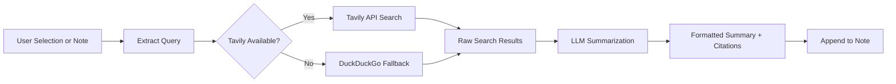

import TLDR from '@site/src/components/TLDR';

# Forskning och webbsökning

<TLDR>
**Notemd söker på webben och inför LLM-sammanfattade resultat direkt i dina anteckningar.** Tavily API är huvudsakliga sökbackenden; DuckDuckGo fungerar som en nollkonfigurerad fallback. Resultaten sammanfattas med källhänvisningar och läggs till under en `## Research`-rubrik. Stöder forskning i enskilda anteckningar, batch-forskning i mappar samt val av modell för sammanfattningsstegen per uppgift.

Detta ingår i [Obsidian AI Knowledge Management Guide](/docs/pillar-ai-knowledge).
</TLDR>

## Översikt

Forskning är en av Notemd’s mest kraftfulla integrationer: den slutar cykeln mellan läsning, sökning och skrivning. Istället för att byta till en webbläsare för att söka efter ett okänt termer markerar du det och låter Notemd söka, sammanfatta och lägga till resultaten – allt inom din säkerhetslåda.

Processen är fullt konfigurerbar. Du väljer sökleverantören, den LLM som skriver sammanfattningen samt om resultaten läggs till i den aktiva anteckningen eller skrivs till separata filer. Batch-läge gör det möjligt att forska i alla anteckningar i en mapp med en enda klick.

## Så här fungerar det

### Pipeline för sökning och sammanfattning



1. **Frågetextraktion** -- Notemd extraherar söktermen från din selection eller anteckningstitel.
2. **Webbsökning** -- Tavily försöks först. Om inget API-nyckel är konfigurerat används DuckDuckGo automatiskt (inget nyckel behövs).
3. **LLM-sammanfattning** -- Råa sökresultaten skickas till den konfigurerade LLM, som producerar en kort sammanfattning med inbyggda källhänvisningar.
4. **Lägg till** -- Den formaterade sammanfattningen läggs till under en `## Research`-rubrik i den aktiva anteckningen.

### Tavily kontra DuckDuckGo

| Aspekt | Tavily | DuckDuckGo |
|--------|--------|------------|
| API-nyckel | Nödvändigt (gratis plan tillgänglig) | Inte nödvändigt |
| Resultkvalitet | Högre (särskilt utformat för AI) | Tillräckligt för allmänna frågor |
| Takträckningar | Generös gratisnivå | Ställs under taktering |
| Konfiguration | `tavilyApiKey` i inställningarna | Ingen konfiguration -- automatisk fallback |

### Batch Folder Research

Klicka med höger på en mapp och välj **"Notemd: Research folder"**. Varje `.md`-fil i mappen bearbetas sekventiellt (eller parallellt upp till den konfigurerade samtidigheten). Varje anteckning får sin egen sammanfattning av undersökningen.

## Konfiguration

| Inställning | Standard | Effekt |
|---------|---------|--------|
| `tavilyApiKey` | `''` | Tavily API-nyckel. När den är tom används endast DuckDuckGo. |
| `researchProvider` / `researchModel` | DeepSeek | Per-uppgift LLM för att sammanfatta sökresultat |
| `maxResearchContentTokens` | `4000` | Tokenbudget för innehåll som skickas till LLM. Överskott skärs av. |
| `researchAppendToNote` | `true` | Lägg till sammanfattning i källanteckningen. Om värdet är falskt skapas en separat fil. |
| `researchLanguage` | `'en'` | Utdata språk för den sammanfattade undersökningen |

### Rekommendationer för modell per uppgift

Forskning drar nytta av en modell som hanterar flerspråkig innehåll och skapar välstrukturerad prosa. Betrakta följande:

- **DeepSeek** -- standard, prisvärt, god kvalitet
- **GPT-4o** -- högre kvalitetssammanfattning, högre kostnad
- **Gemini Flash** -- snabb och billig, bra för enkla frågor

## Exempel

Du läser en artikel om *transformer attention mechanisms* och stöter på ett okänt termer: *relative positional encoding*. Istället för att lämna Obsidian:

1. Highlightera **"relative positional encoding"**
2. Högerklicka --> **"Notemd: Forskning och sammanfattning"**
3. Notemd söker på webben, sammanfattar de bästa resultaten och lägger till:

```markdown
## Research

### Relative Positional Encoding

Relative positional encoding is a method used in transformer models
where positional information is expressed as relative distances between
tokens rather than absolute positions. Introduced by Shaw et al. (2018),
it improves generalization to unseen sequence lengths compared to
absolute encodings (Vaswani et al., 2017).

Sources:
- [Shaw et al., Self-Attention with Relative Position Representations (2018)](https://arxiv.org/abs/1803.02155)
- [Transformer Positional Encoding Overview](https://example.com/transformer-pos-enc)
```

Sammanfattningen är nu en del av din arkiv, sökbart, länkbart och tillgänglig offline.

## Tips

- **Ställ in en Tavily-nyckel för bästa resultat** -- även den gratisnivån ger bättre relevans än ren DuckDuckGo.
- **Använd en kraftig sammanfattningsmodell** -- billiga modeller kan försvaga nyanserade tekniska innehåll.
- **Gör batch-forskning** efter en första genomläsning för att fylla luckor i många anteckningar på en gång.
- **Granska de läggda till sammanfattningarna** -- LLM kan skapa falska källinformationer. Kontrollera viktiga påståenden.

---

## Nästa steg

- [Concept Notes](./concept-notes) -- Extrahera och spara viktiga termer från forskningsresultat
- [Wiki-Links](./wiki-links) -- Länka koncept från forskningen i din arkiv
- [Translation](./translation) -- Översätta forskningssammanfattningar till ett annat språk
- [LLM Tjänsteleverantörer](/docs/providers/overview) -- Konfigurera modellen som används för sammanfattning
